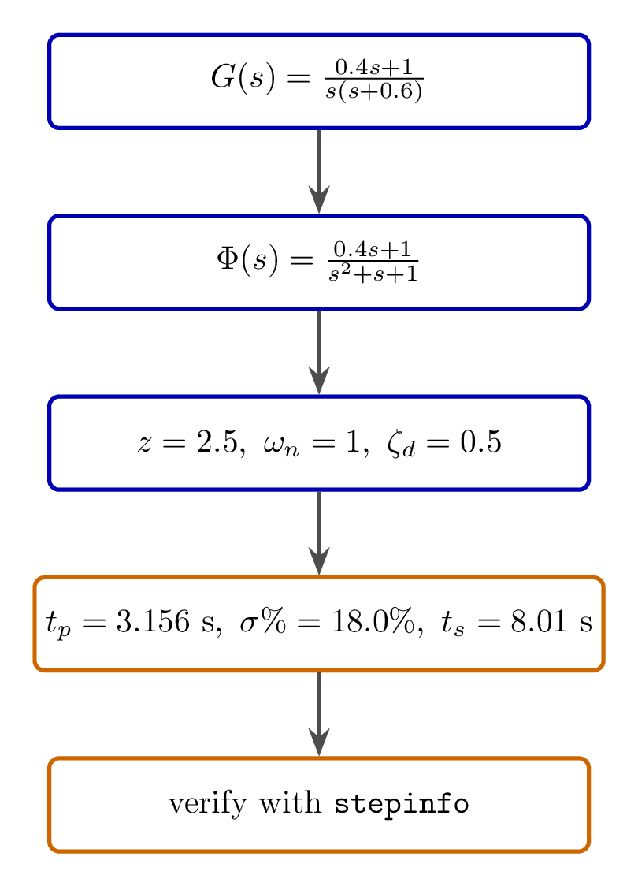
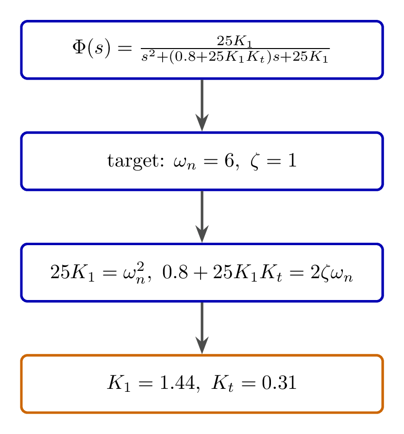
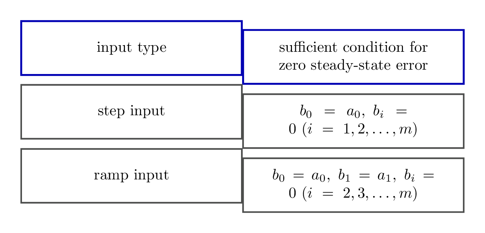
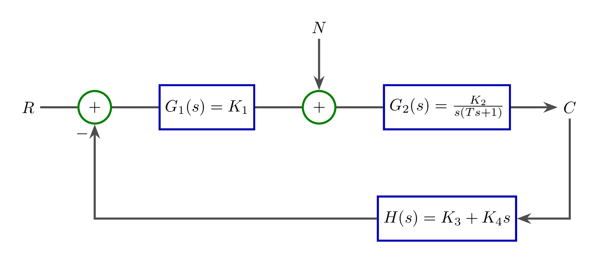
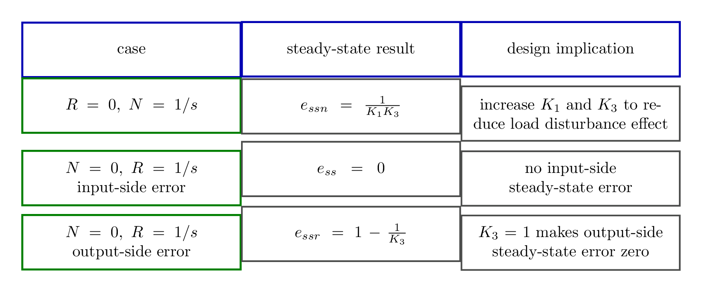

# `13时域分析习题2025` 完整提取

## 1. 页面边界

- 原始文件：`course-content/slides-ref/13时域分析习题2025.pptx`
- 总页数：15
- 正文范围：第 2-15 页
- 排除页面：
  - 第 1 页：封面

## 2. 内容总览

| 原页号 | 主题 |
| --- | --- |
| 2-5 | 动态性能指标题 |
| 6-7 | 二阶系统临界阻尼设计 |
| 8-10 | 稳态误差零值条件证明 |
| 11-15 | 机器人控制案例 |

## 3. 题型一：动态性能指标综合计算（第 2-5 页）

第 2-5 页给出一个单位反馈系统：

$$
G(s)=\frac{0.4s+1}{s(s+0.6)}.
$$

先写出闭环传递函数：

$$
\Phi(s)=\frac{G(s)}{1+G(s)}
=\frac{0.4s+1}{s^2+s+1}
=\frac{0.4s+1}{s^2+s+1}.
$$

课件将其视作“比例-微分控制二阶系统”，并与标准形式比较，得到：

$$
z=2.5,\qquad \omega_n=1,\qquad \zeta_d=0.5.
$$

随后借助中间量 `r`、`\psi`、`\beta_d` 推出动态性能指标：

- 峰值时间：`t_p=3.156 s`
- 超调量：`\sigma\%=18.0\%`
- 调节时间：`t_s=8.01 s`（`Δ=0.02`）

第 5 页又用 `stepinfo` 做软件核验，给出的关键结果是：

- `Overshoot = 17.9894`
- `PeakTime = 3.1315`
- `SettlingTime = 7.7418`

这组数值和手算结果是一致的，说明这题最值得沉淀的是一条固定流程：

1. 先写闭环传函；
2. 与标准二阶或带零点二阶形式比较；
3. 再计算指标；
4. 最后用软件核对。

对应的重建图如下：

- `tikz/01-dynamic-metrics-workflow.tex`
- 预览：`tikz/rendered/01-dynamic-metrics-workflow.png`

## 4. 题型二：二阶系统临界阻尼参数匹配（第 6-7 页）

第 6-7 页把一个飞行控制系统简化为标准二阶匹配问题。

对象层可恢复出其闭环传递函数为

$$
\Phi(s)=\frac{25K_1}{s^2+(0.8+25K_1K_t)s+25K_1}.
$$

目标是让系统满足：

$$
\omega_n=6,\qquad \zeta=1.
$$

与标准二阶系统

$$
\Phi(s)=\frac{\omega_n^2}{s^2+2\zeta\omega_n s+\omega_n^2}
$$

比较，可得：

$$
25K_1=\omega_n^2,\qquad 0.8+25K_1K_t=2\zeta\omega_n.
$$

于是解得：

$$
K_1=1.44,\qquad K_t=0.31.
$$

这道题的核心套路不是飞行器本身，而是：

- 把控制结构化到标准形式；
- 然后做“系数对比”求参数。

对应的重建图如下：

- `tikz/02-critical-damping-match.tex`
- 预览：`tikz/rendered/02-critical-damping-match.png`

## 5. 题型三：稳态误差零值条件证明（第 8-10 页）

第 8-10 页给出一般闭环传递函数

$$
\Phi(s)=\frac{b_m s^m+b_{m-1}s^{m-1}+\cdots+b_1 s+b_0}{s^n+a_{n-1}s^{n-1}+\cdots+a_1s+a_0},
$$

并定义误差：

$$
e(t)=r(t)-c(t).
$$

课件要求证明两个“稳态误差为零的充分条件”。

### 5.1 阶跃输入

当输入为阶跃时，若满足：

$$
b_0=a_0,\qquad b_i=0\quad (i=1,2,\dots,m),
$$

则由终值定理可得稳态误差为零。

### 5.2 斜坡输入

当输入为斜坡时，若满足：

$$
b_0=a_0,\qquad b_1=a_1,\qquad b_i=0\quad (i=2,3,\dots,m),
$$

则稳态误差同样为零。

这组题最有价值的地方在于把“静态误差系数”背后的代数条件显式写出来，让学生看到：

- 零稳态误差并不是玄学；
- 本质上是误差传递函数在 `s\to0` 时低阶项怎样抵消。

对应的重建图如下：

- `tikz/03-zero-steady-state-conditions.tex`
- 预览：`tikz/rendered/03-zero-steady-state-conditions.png`

## 6. 题型四：机器人控制案例（第 11-15 页）

第 11-15 页给出一个更贴近工程的机器人关节控制题。课件关注两个问题：

1. 负载扰动如何影响输出？
2. 参考输入如何影响稳态误差？

第 12 页先设：

$$
G_1(s)=K_1,\qquad G_2(s)=\frac{K_2}{s(Ts+1)}.
$$

并写出闭环传递函数：

$$
\Phi(s)=\frac{K_1K_2}{Ts^2+(1+K_1K_2K_4)s+K_1K_2K_3}.
$$

课件指出，只要 `K_1,K_2,K_3,K_4,T` 都为正，则闭环系统渐近稳定。

### 6.1 负载扰动作用

当 `R(s)=0`、`N(s)=1/s` 时，课件给出输出端稳态误差：

$$
e_{ssn}=\frac{1}{K_1K_3}.
$$

因此：

- 增大前置放大器增益 `K_1`
- 增大关节角位移反馈系数 `K_3`

都能减小阶跃负载扰动的影响。

### 6.2 参考阶跃输入作用

当 `N(s)=0`、`R(s)=1/s` 时：

- 在系统输入端定义误差，可得稳态误差为 `0`；
- 但在系统输出端定义误差，则课件给出：

$$
e_{ssr}=1-\Phi(0)=1-\frac{1}{K_3}.
$$

所以若取：

$$
K_3=1,
$$

则输出端稳态误差可以为零。

这道题非常适合作为“误差定义位置不同，结论也会不同”的案例。

对应的重建图如下：

- `tikz/04-robot-control-structure.tex`
- 预览：`tikz/rendered/04-robot-control-structure.png`

- `tikz/05-robot-control-error-summary.tex`
- 预览：`tikz/rendered/05-robot-control-error-summary.png`

## 7. 本讲可直接复用的题型模板

这份习题集最值得复用的不是某一题本身，而是三条解题模板：

1. 动态指标题：闭环化 -> 对标准型 -> 算指标 -> 软件核验；
2. 参数匹配题：写闭环传函 -> 与目标标准型比较 -> 解参数；
3. 稳态误差题：先定误差定义位置 -> 写误差传函 -> 用终值定理求极限。

这三条模板可以直接作为后续讲义、习题课和自动评阅说明的骨架。
