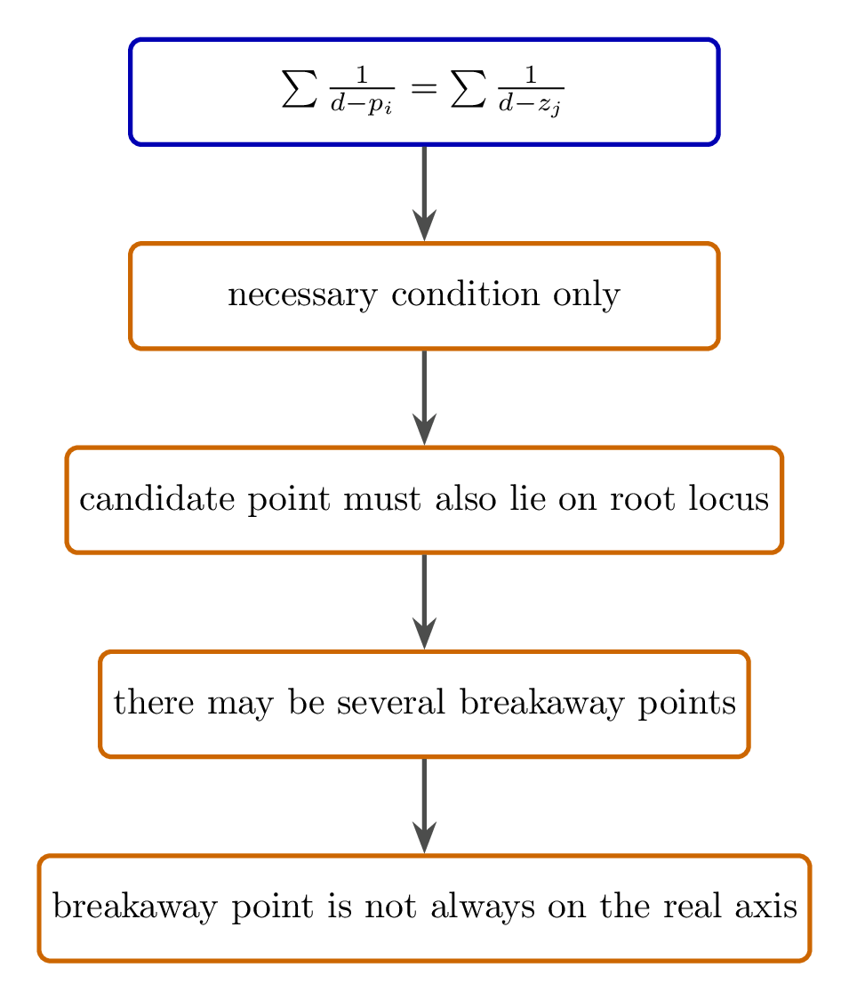
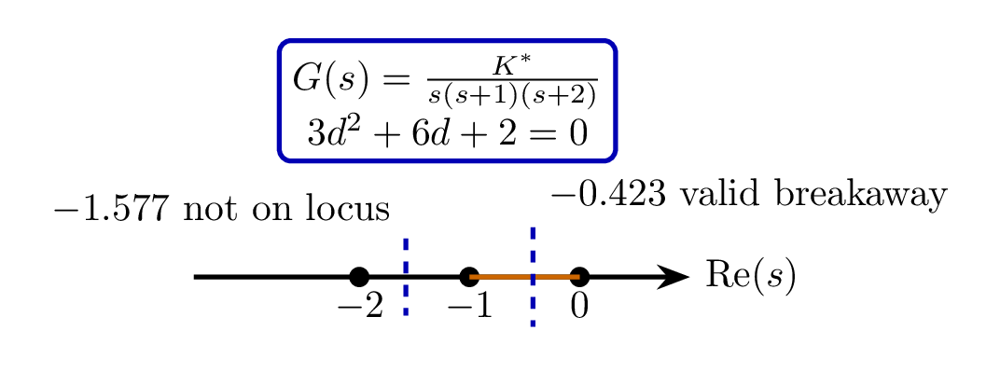
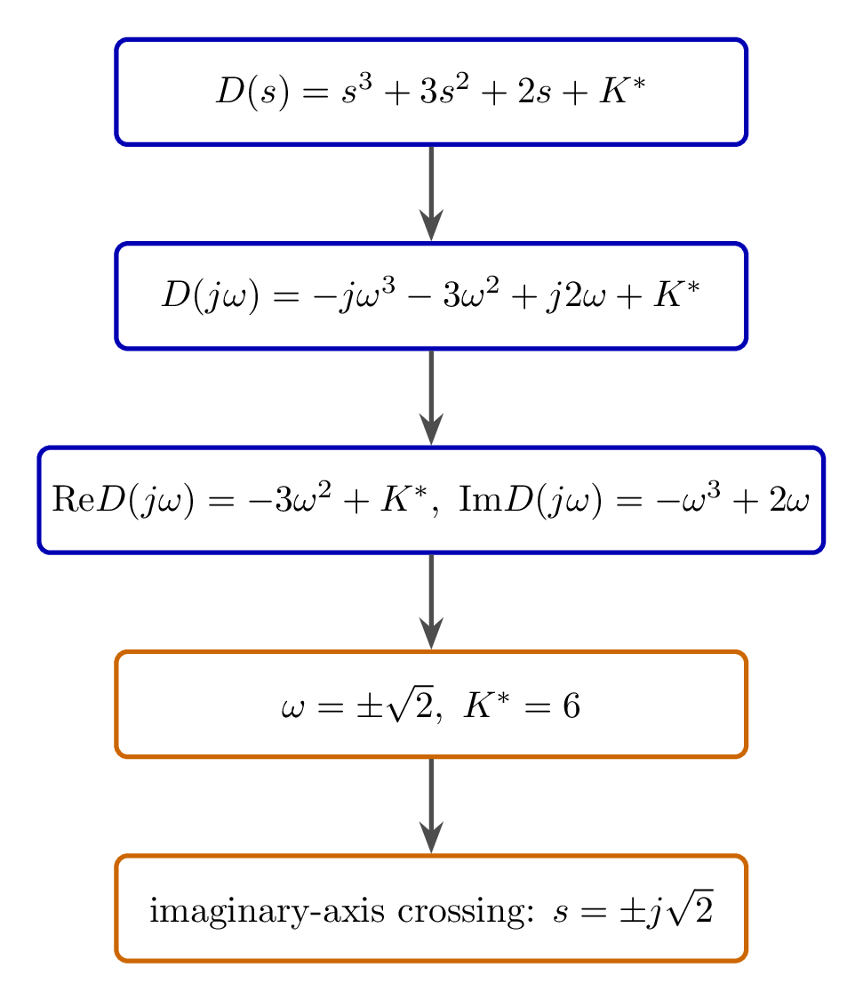
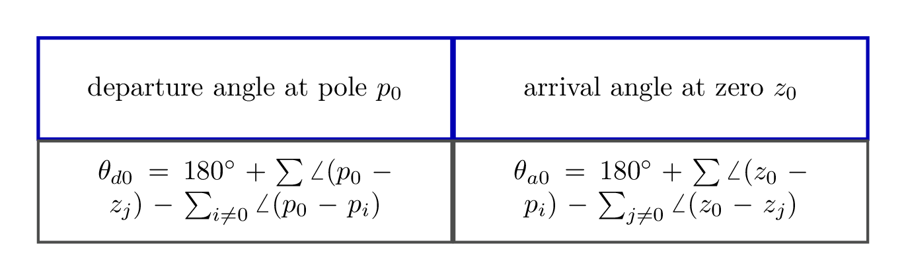
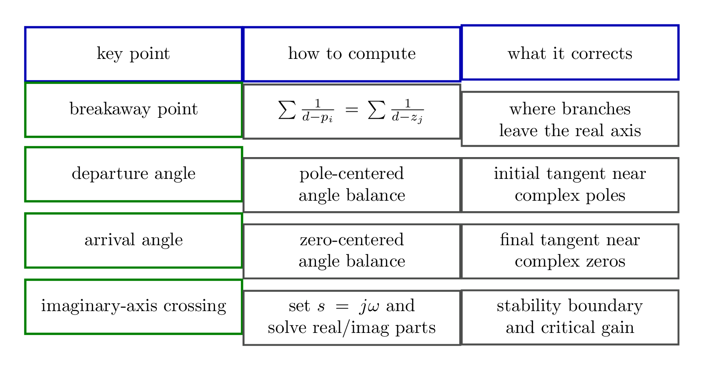

# `13根轨迹_细节修正` 完整提取

## 1. 页面边界

- 原始文件：`course-content/slides-ref/13根轨迹_细节修正.pptx`
- 总页数：20
- 正文范围：第 4-17 页
- 排除页面：
  - 第 1 页：封面
  - 第 2 页：目录
  - 第 3 页：学习目标
  - 第 18-19 页：课外拓展及预习要求
  - 第 20 页：结束页

## 2. 内容总览

| 原页号 | 主题 |
| --- | --- |
| 4-5 | 导入：根轨迹“怎么分离、怎么进出” |
| 6-7 | 分离点与分离角 |
| 8-12 | 例 2：分离点与虚轴交点 |
| 13-15 | 起始角与终止角 |
| 16 | 总结 |
| 17 | 课后思考 |

## 3. 从“全局骨架”走向“关键点修正”（第 4-5 页）

第 4-5 页延续上一讲的问答式导入：

- 根轨迹以开环极点为起点；
- 以开环零点或无穷零点为终点；
- 但根轨迹在实轴上“相遇后怎么分离”、复极点处“怎么出射”、复零点处“怎么入射”，上一讲还没讲。

这说明本讲要补的是“细节修正”，不是重新讲四条基本法则。

## 4. 分离点与分离角（第 6-7 页）

第 6-7 页先引入分离点概念，并给出分离点法则。对象层可稳定恢复出核心公式：

$$
\sum_i \frac{1}{d-p_i} = \sum_j \frac{1}{d-z_j}.
$$

也就是：

- 分离点到各开环极点距离倒数之和；
- 等于分离点到各开环零点距离倒数之和。

课件同时强调了 4 个非常重要的边界：

1. 无零点时，右端为 `0`；
2. 这个方程只是必要条件，必须同时满足“该点属于根轨迹”；
3. 实轴上，相邻两个开环极点之间的根轨迹必有分离点；
4. 分离点不一定只有一个，也不一定在实轴上。

第 7 页还引入了“分离角”概念，即分离点处相邻分支切线的夹角。

对应的重建图如下：

- `tikz/01-breakaway-rule.tex`
- 预览：`tikz/rendered/01-breakaway-rule.png`

## 5. 例 2：`G(s)=K^\ast/[s(s+1)(s+2)]` 的分离点（第 8-9 页）

第 8-9 页把上一讲例 2 继续往下做。对象层给出的系统是：

$$
G(s)=\frac{K^\ast}{s(s+1)(s+2)}.
$$

此前已经知道：

- 实轴上的根轨迹：`(-\infty,-2] \cup [-1,0]`
- 渐近线交点：`-1`
- 渐近线角度：`\pm 60^\circ, 180^\circ`

现在进一步求分离点。代入分离点方程：

$$
\frac{1}{d-0}+\frac{1}{d+1}+\frac{1}{d+2}=0
$$

整理得：

$$
3d^2+6d+2=0.
$$

课件给出两个候选根：

- `d=-0.423`
- `d=-1.577`

但只有同时位于根轨迹实轴区段上的点才是真分离点。由于 `-1.577` 不在实轴根轨迹区间内，所以真正的分离点是：

$$
d=-0.423.
$$

对应的重建图如下：

- `tikz/02-example-two-breakaway.tex`
- 预览：`tikz/rendered/02-example-two-breakaway.png`

## 6. 与虚轴交点：系统何时来到临界稳定边界（第 10-12 页）

第 10-11 页继续处理同一个例子，关注根轨迹与虚轴的交点。

闭环特征方程为

$$
D(s)=s(s+1)(s+2)+K^\ast
=s^3+3s^2+2s+K^\ast.
$$

### 6.1 劳斯判据方法

对象层给出劳斯判据结论：

$$
0<K^\ast<6.
$$

令临界稳定边界成立，即

$$
K^\ast=6,
$$

可得共轭虚根。

### 6.2 令 `s=j\omega` 的方法

第 11 页又给出另一条路线：

把 `s=j\omega` 代入特征方程，

$$
D(j\omega)=-j\omega^3-3\omega^2+j2\omega+K^\ast=0.
$$

于是：

$$
\operatorname{Re} D(j\omega)=-3\omega^2+K^\ast,
\qquad
\operatorname{Im} D(j\omega)=-\omega^3+2\omega.
$$

联立为零可得：

$$
\omega=\pm\sqrt{2},\qquad K^\ast=6.
$$

因此根轨迹与虚轴交点为

$$
s=\pm j\sqrt{2}.
$$

对应的重建图如下：

- `tikz/03-imaginary-axis-crossing.tex`
- 预览：`tikz/rendered/03-imaginary-axis-crossing.png`

## 7. 起始角与终止角（第 13-15 页）

第 13-15 页开始处理复极点、复零点附近的轨迹切线方向。

### 7.1 起始角

若根轨迹始于开环极点 `p_0`，则起点处切线与实轴正方向夹角为起始角 `\theta_{d0}`。课件对象层可恢复出标准公式：

$$
\theta_{d0}
=180^\circ
\sum_j \angle(p_0-z_j)
\;-\!
\sum_{i\ne0}\angle(p_0-p_i).
$$

含义很直接：

- 先看该极点指向所有零点的角度和；
- 再减去它指向其他极点的角度和；
- 最后加上 `180^\circ`。

### 7.2 终止角

若根轨迹终于开环零点 `z_0`，则终点处切线与实轴正方向夹角为终止角 `\theta_{a0}`。对象层给出的公式是：

$$
\theta_{a0}
=180^\circ
\sum_i \angle(z_0-p_i)
\;-\!
\sum_{j\ne0}\angle(z_0-z_j).
$$

也就是说：

- 起始角围绕复极点算；
- 终止角围绕复零点算；
- 两者本质上都来自相角条件。

对应的重建图如下：

- `tikz/04-departure-angle.tex`
- 预览：`tikz/rendered/04-departure-angle.png`

## 8. 本讲的四个关键点（第 16 页）

第 16 页总结把全讲压缩成四类关键点：

- 分离点
- 起始角
- 终止角
- 虚轴交点

并给出对应口诀式表达：

- 分离点：分离点减去极点的倒数和，等于分离点减去零点的倒数和；
- 起始角：`180^\circ +` 极点到零点角度和 `-` 极点到其他极点角度和；
- 终止角：`180^\circ +` 零点到极点角度和 `-` 零点到其他零点角度和；
- 虚轴交点：令 `s=j\omega`，分别令实部、虚部为零。

这页的真正价值在于强调：

- 这些关键点都是为了更准确地描绘闭环特征根轨迹；
- 它们不是孤立公式，而是画轨迹时必须先找出来的锚点。

对应的重建图如下：

- `tikz/05-key-points-summary.tex`
- 预览：`tikz/rendered/05-key-points-summary.png`

## 9. 课后思考（第 17 页）

第 17 页把讨论推向“由图走向性能设计”：

1. 在例 2 中，选择使近似二阶系统阻尼比为 `0.707` 的开环增益；
2. 确定使近似二阶系统超调量在 `17%` 以下的根轨迹范围。

这说明本讲的关键点分析并不是纯图形练习，而是后续把根轨迹和动态性能指标结合起来的桥梁。

## 10. 本讲可直接复用的教学主线

这份课件最值得保留的是下面这条顺序：

1. 先用分离点修正根轨迹离开实轴的位置；
2. 再用虚轴交点判断根轨迹何时碰到稳定边界；
3. 接着用起始角和终止角修正复极点、复零点附近的切线方向；
4. 最后把这些关键点与阻尼比、超调量等性能要求联系起来。

这条主线非常适合后续讲义和习题设计，因为它把“画图”自然引向“设计”。
