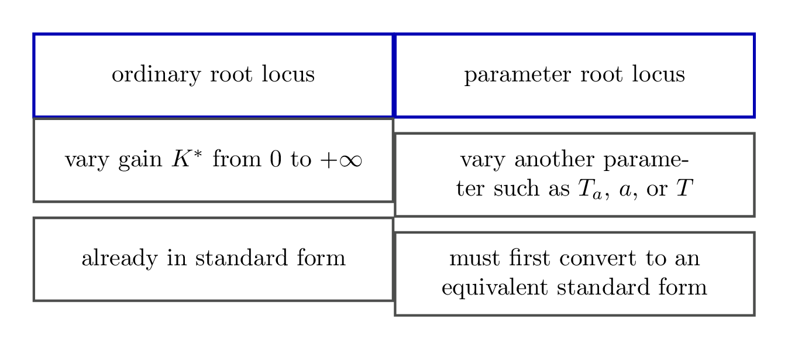
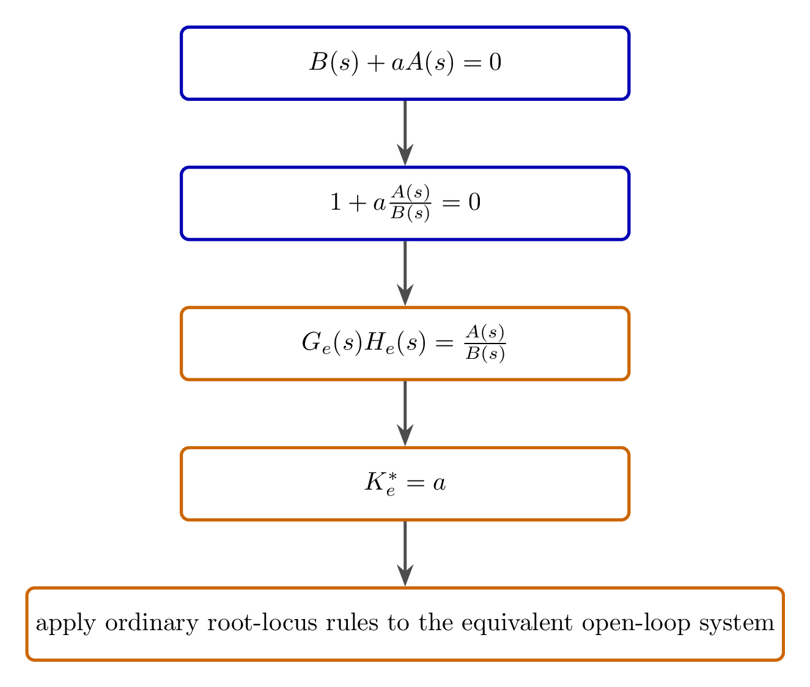
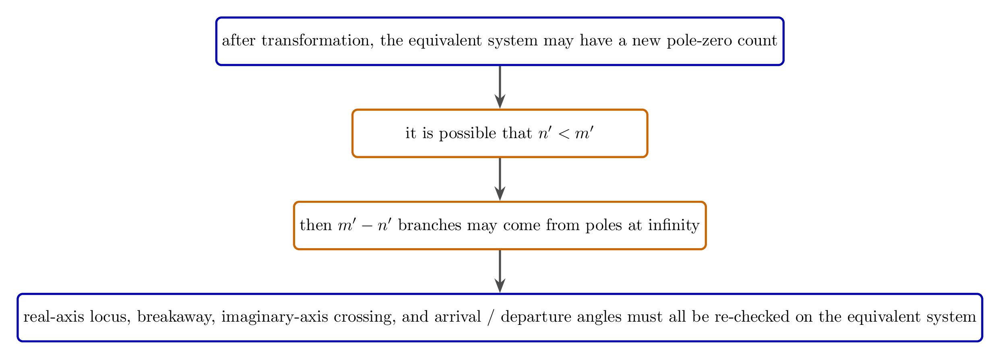
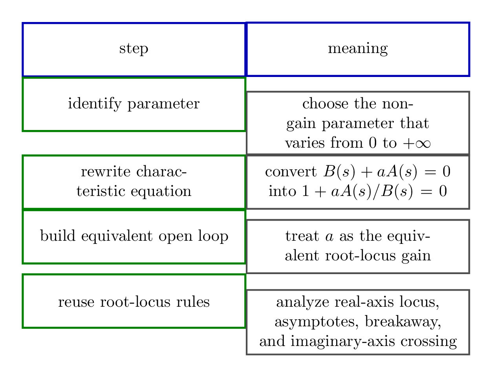

# `14参数根轨迹_广义定义` 完整提取

## 1. 页面边界

- 原始文件：`course-content/slides-ref/14参数根轨迹_广义定义.pptx`
- 总页数：16
- 正文范围：第 4-13 页
- 排除页面：
  - 第 1 页：封面
  - 第 2 页：目录
  - 第 3 页：学习目标
  - 第 14-15 页：课外拓展及预习要求
  - 第 16 页：结束页

## 2. 内容总览

| 原页号 | 主题 |
| --- | --- |
| 4-6 | 从普通根轨迹过渡到参数根轨迹 |
| 7 | 等效开环传函与等效根轨迹增益 |
| 8-11 | 三个参数根轨迹示例 |
| 12 | 总结 |
| 13 | 课后思考 |

## 3. 为什么需要参数根轨迹（第 4-6 页）

第 4-6 页首先回顾普通根轨迹：

- 普通根轨迹研究的是根轨迹增益 `K^\ast` 从 `0` 到 `+\infty` 变化时，闭环特征根的轨迹；
- 但工程中真正变化的参数未必总是“外乘在开环传函前面的那个增益”；
- 还可能是时间常数、反馈系数、结构参数等。

因此本讲的问题被明确地提了出来：

> 如果变化的是 `K^\ast` 之外的其他参数，该如何画根轨迹？

这就是参数根轨迹的起点。

对应的重建图如下：

- `tikz/01-parameter-root-locus-concept.tex`
- 预览：`tikz/rendered/01-parameter-root-locus-concept.png`

## 4. 核心方法：转化成等效开环问题（第 7 页）

第 7 页给出本讲最重要的套路。

假设闭环特征方程中，待研究参数记作 `a`，并可整理为：

$$
B(s)+aA(s)=0.
$$

那么它可以改写为：

$$
1+a\frac{A(s)}{B(s)}=0.
$$

于是可定义：

- 等效开环传函

$$
G_e(s)H_e(s)=\frac{A(s)}{B(s)},
$$

- 等效根轨迹增益

$$
K_e^\ast=a.
$$

也就是说，参数根轨迹并没有脱离普通根轨迹的框架，而是通过代数变形，把“任意参数变化”重新嵌回

$$
1+K_e^\ast G_e(s)H_e(s)=0
$$

这一标准形式。

对应的重建图如下：

- `tikz/02-equivalent-open-loop-transformation.tex`
- 预览：`tikz/rendered/02-equivalent-open-loop-transformation.png`

## 5. 示例 1：以 `T_a` 为参数（第 7-8 页）

课件第一个例子讨论的是时间常数 `T_a` 从 `0` 到 `+\infty` 变化时的参数根轨迹。

对象层可恢复出它被化成：

$$
D(s)=s^2+0.2s+1+T_a s=0,
$$

进一步改写为：

$$
1+T_a\frac{s}{s^2+0.2s+1}=0.
$$

因此其等效开环传函是

$$
G_e(s)H_e(s)=\frac{s}{s^2+0.2s+1},
$$

等效根轨迹增益就是

$$
K_e^\ast=T_a.
$$

第 8 页进一步给出这一等效系统的关键信息：

- 开环零点：`z=0`
- 开环极点：`p_{1,2}=-0.1\pm j0.99`
- 实轴轨迹：`[-\infty,0]`
- 分离点：`d=-1`（另一个候选根 `d=1` 舍去）
- 出射角约为 `185.7^\circ`

这说明参数根轨迹的关键不在于“参数原来长什么样”，而在于变换后能否回到一个普通根轨迹问题。

对应的重建图如下：

- `tikz/03-ta-example.tex`
- 预览：`tikz/rendered/03-ta-example.png`

## 6. 示例 2：以 `a` 为参数（第 9 页）

第 9 页展示了另一个参数根轨迹示例，参数记为 `a`。虽然原始版面较拥挤，但对象层仍能稳定读出其分析框架：

- 先得到等效开环；
- 再求实轴轨迹；
- 再求渐近线；
- 再求分离点；
- 最后求与虚轴交点。

课件给出的代表性结果包括：

- 分离点：`d=-1/6`
- 虚轴交点对应：`\omega=1/2`
- 临界参数：`a=1`

因此这一页承担的是“参数根轨迹同样可以继续做关键点分析”的示范作用。

## 7. 示例 3：以 `T` 为参数（第 10-11 页）

第 10-11 页把参数换成另一个时间常数 `T`，并给出一组高数值量级的结果，例如：

- 分离点：`d=-1190`
- 若干实轴区间：`(-\infty,-587.7]\cup[-27.2,0]`
- 虚轴交点角频率：`\omega=126.45`
- 对应参数：`T=0.0358` 一类结果

本例更重要的不是这些具体数字，而是课件明确指出的一条边界：

> 变换后可能出现 `n' < m'`，从而产生 `m'-n'` 条来自无穷远极点的根轨迹。

这说明参数变换以后，等效系统的“极点-零点个数关系”可能发生变化，所以不能机械照搬对原系统的直觉。

对应的重建图如下：

- `tikz/04-generalized-cautions.tex`
- 预览：`tikz/rendered/04-generalized-cautions.png`

## 8. 总结与课后思考（第 12-13 页）

第 12 页总结把全讲浓缩成 3 个关键词：

- 参数根轨迹
- 等效开环增益
- 等效开环传函

并点出一个很重要的认识路径：

- 从个别到一般；
- 从归纳到演绎。

第 13 页则进一步追问：

1. 例 1 中使系统稳定的参数 `T_a` 取值范围是什么？
2. `T_a` 对系统性能的影响如何？

这表明参数根轨迹的终点仍然不是“画图本身”，而是回到稳定性与性能设计。

对应的重建图如下：

- `tikz/05-summary-matrix.tex`
- 预览：`tikz/rendered/05-summary-matrix.png`

## 9. 本讲可直接复用的教学主线

这份课件最值得保留的是下面这条方法链：

1. 发现变化的不是传统根轨迹增益；
2. 先把闭环特征方程改写成 `1+aG_e(s)H_e(s)=0`；
3. 把待研究参数当作“等效根轨迹增益”；
4. 再把普通根轨迹的起点终点、实轴法则、渐近线、分离点、虚轴交点等规则全部移植过来。

这条逻辑把“广义定义”真正落到了可操作的计算流程上。
