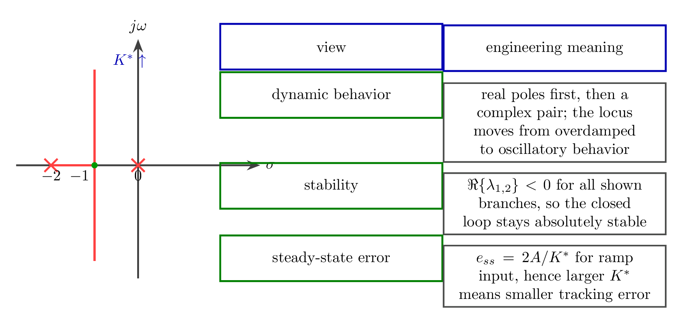
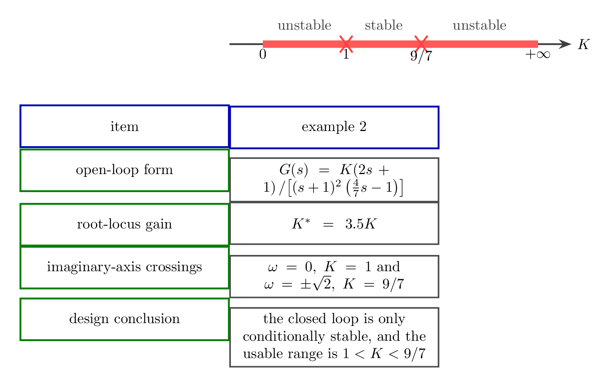
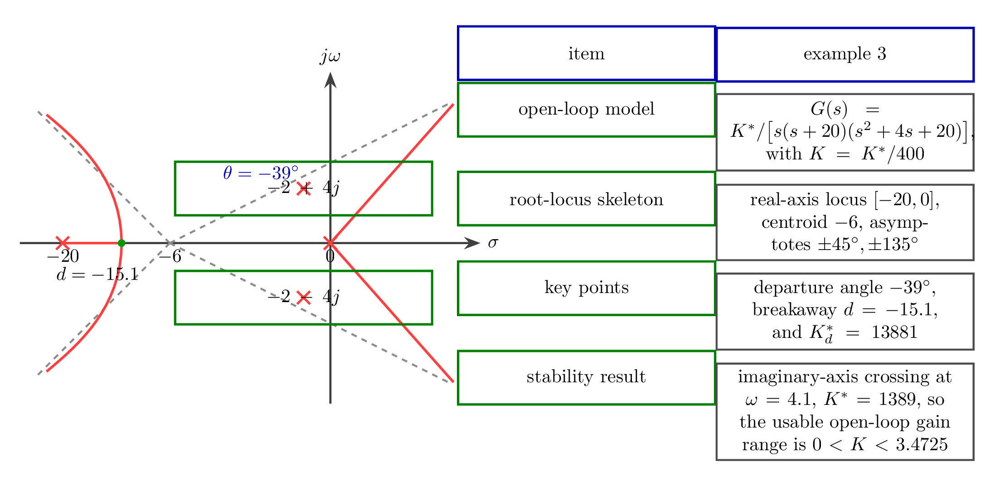
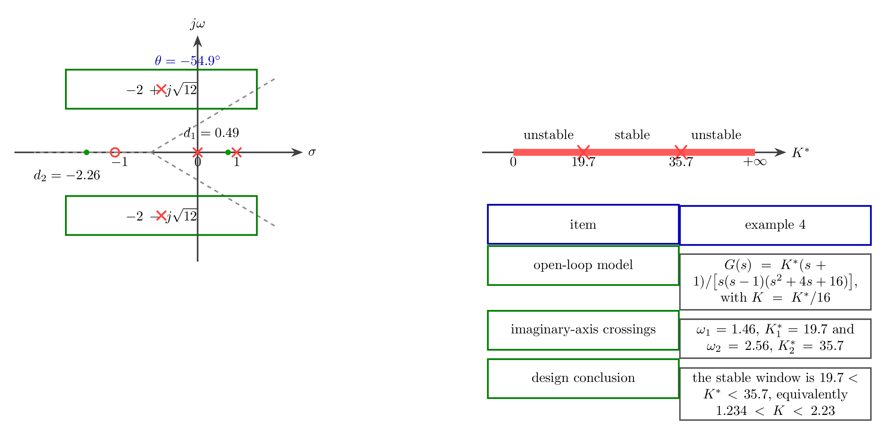
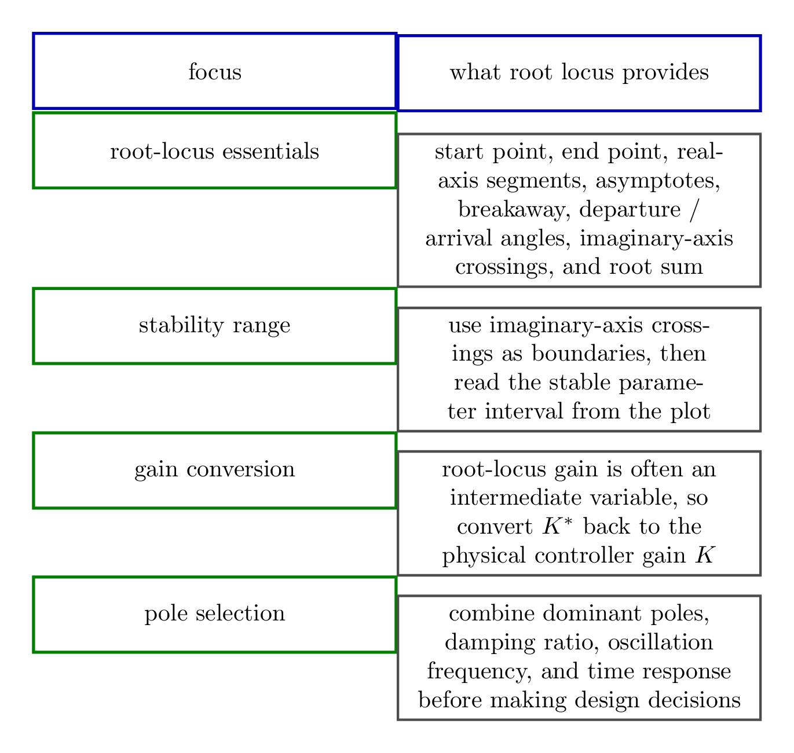

# `15.1根轨迹法_图形化思考` 完整提取

## 1. 页面边界

- 原始文件：`course-content/slides-ref/15.1根轨迹法_图形化思考.pptx`
- 总页数：20
- 正文范围：第 4-17 页
- 排除页面：
  - 第 1 页：封面
  - 第 2 页：目录
  - 第 3 页：学习目标
  - 第 18-19 页：课外拓展及预习要求
  - 第 20 页：结束页

## 2. 内容总览

| 原页号 | 主题 |
| --- | --- |
| 4 | 例 1：二阶根轨迹如何映射动态性能、稳定性和稳态误差 |
| 5-6 | 例 2：条件稳定与根轨迹增益换算 |
| 7-12 | 例 3：高阶系统完整分析、稳定范围与代码验证 |
| 13-15 | 例 4：含右半平面极点时的稳定窗口 |
| 16 | 总结 |
| 17 | 课后思考 |

## 3. 例 1：从最简单的二阶根轨迹读出 3 类性能信息（第 4 页）

第 4 页用一个最基础的对象说明：根轨迹不是单纯画图，而是把“极点位置变化”翻译成系统性能变化。

课件给出的对象可稳定恢复为：

$$
G(s)=\frac{K}{s(0.5s+1)},
\qquad
D(s)=s^2+2s+K^\ast=0,
\qquad
K^\ast=2K.
$$

对应闭环极点：

$$
\lambda_{1,2}=-1\pm\sqrt{1-K^\ast}.
$$

这一页传达了 3 个判断：

1. 当 `K^\ast` 从 `0` 增大时，闭环极点先沿实轴靠近，再转为共轭复根；
2. 由于实部始终在左半平面，系统保持绝对稳定；
3. 对斜坡输入 `r(t)=At`，稳态误差

$$
e_{ss}=\frac{A}{K}=\frac{2A}{K^\ast},
$$

因此 `K^\ast` 越大，稳态误差越小。

也就是说，第一个例子不是为了算复杂公式，而是建立“根轨迹位置变化会同时影响动态性能、稳定性和稳态误差”的总图景。

对应的重建图如下：

- `tikz/01-example-one-root-locus-and-effects.tex`
- 预览：`tikz/rendered/01-example-one-root-locus-and-effects.png`

## 4. 例 2：条件稳定如何通过虚轴交点被读出来（第 5-6 页）

第 5-6 页切入一个更有代表性的情形：根轨迹不再“全程稳定”，而是只在一小段参数区间内稳定。

对象层与版面公式可恢复为：

$$
G(s)=\frac{K(2s+1)}{(s+1)^2\left(\frac{4}{7}s-1\right)}
=\frac{3.5K\left(s+\frac{1}{2}\right)}{(s+1)^2\left(s-\frac{7}{4}\right)}.
$$

于是根轨迹增益与实际开环增益之间满足

$$
K^\ast=3.5K.
$$

课件保留的关键结果有：

- 实轴根轨迹：`[-0.5,1.75]`
- 渐近线交点：`\sigma=1/8`
- 渐近线角度：`\pm 90^\circ`
- 闭环特征方程：

$$
D(s)=4s^3+s^2+(14K-10)s+7(K-1)=0
$$

- 令 `s=j\omega` 后得到两组虚轴交点边界：

$$
\omega=0,\ K=1;
\qquad
\omega=\pm\sqrt{2},\ K=\frac{9}{7}.
$$

因此本例最重要的结论是：

$$
1<K<\frac{9}{7}
$$

时系统稳定，属于典型的条件稳定系统。

这一页真正要学生掌握的是：

- 虚轴交点给出稳定边界；
- 根轨迹图读出来的往往是 `K^\ast`，最后必须换回真实控制器参数 `K`。

对应的重建图如下：

- `tikz/02-example-two-conditional-stability-window.tex`
- 预览：`tikz/rendered/02-example-two-conditional-stability-window.png`

## 5. 例 3：高阶系统的完整根轨迹分析流程（第 7-12 页）

第 7-12 页是本讲的主例题。课件给出一个四阶开环系统：

$$
G(s)=\frac{K^\ast}{s(s+20)(s^2+4s+20)},
\qquad
K=\frac{K^\ast}{400}.
$$

这一组页面几乎把前面讲过的所有根轨迹工具都串起来了。对象层可稳定恢复出的关键结果包括：

- 实轴根轨迹：`[-20,0]`
- 渐近线交点：

$$
\sigma=\frac{0-20-2-2}{4}=-6
$$

- 渐近线角度：`\pm 45^\circ,\ \pm 135^\circ`
- 复极点出射角：`\theta_1=-39^\circ`
- 分离点：`d=-15.1`
- 对应分离点处根轨迹增益：`K_d^\ast=13881`

闭环特征方程为

$$
D(s)=s^4+24s^3+100s^2+400s+K^\ast=0.
$$

令 `s=j\omega` 可得虚轴交点：

$$
\omega=\sqrt{\frac{400}{24}}=4.1,
\qquad
K^\ast=1389.
$$

所以稳定的实际开环增益范围为：

$$
0<K<\frac{1389}{400}=3.4725.
$$

后面 3 页又进一步加入 `zpk`、`rlocus`、`feedback`、`step` 代码，说明课件希望学生看到：

1. 手算读图可以给出稳定范围和候选极点；
2. 数值工具可用于复核根轨迹和闭环响应；
3. “阻尼比看起来较小，但实际超调并不一定很大”，这是因为高阶系统的真实响应还受到非主导极点影响。

对应的重建图如下：

- `tikz/03-example-three-high-order-summary.tex`
- 预览：`tikz/rendered/03-example-three-high-order-summary.png`

## 6. 例 4：含右半平面极点时，稳定可能只在一个窗口内出现（第 13-15 页）

第 13-15 页给出本讲最关键的边界例子。对象层与图中公式可恢复为：

$$
G(s)=\frac{K^\ast(s+1)}{s(s-1)(s^2+4s+16)},
\qquad
K=\frac{K^\ast}{16}.
$$

由于开环本身含有右半平面极点 `s=1`，因此不能再凭直觉认为“增益越大越稳定”。课件明确给出：

- 实轴根轨迹：`(-\infty,-1]\cup[0,1]`
- 渐近线交点：

$$
\sigma=\frac{1-4+1}{3}=-\frac{2}{3}
$$

- 渐近线角度：`\pm 60^\circ,\ 180^\circ`
- 复极点出射角：`\theta_1=-54.9^\circ`
- 两个分离点：

$$
d_1=0.49,\ K_{d_1}^\ast=3.05;
\qquad
d_2=-2.26,\ K_{d_2}^\ast=70.6
$$

闭环特征方程为

$$
D(s)=s^4+3s^3+12s^2+(K^\ast-16)s+K^\ast=0.
$$

令 `s=j\omega` 后，课件给出两组虚轴交点：

$$
\omega_1=1.46,\ K_1^\ast=19.7;
\qquad
\omega_2=2.56,\ K_2^\ast=35.7.
$$

因此稳定窗口不是从 `0` 开始，而是：

$$
19.7<K^\ast<35.7,
\qquad
1.234<K<2.23.
$$

这一例的教学价值非常高，因为它把“根轨迹用于稳定范围分析”的工程含义讲透了：

- 先看开环零极点结构；
- 再用虚轴交点判断边界；
- 最后把根轨迹增益换回实际参数，得到可用的控制器整定区间。

对应的重建图如下：

- `tikz/04-example-four-two-crossings.tex`
- 预览：`tikz/rendered/04-example-four-two-crossings.png`

## 7. 总结与课后思考（第 16-17 页）

第 16 页把整讲收束成 4 个要点：

1. 根轨迹要点：
   起点、终点、实轴根轨迹、分离点、出射角、入射角、渐近线、虚轴交点、根之和；
2. 参数稳定范围：
   以虚轴为边界；
3. 根轨迹增益：
   应用时需化为开环增益；
4. 选择极点：
   应用主导极点选择，综合阻尼与振荡频率。

第 17 页则把问题推回到设计层：

- 例 4 在稳定区间内，性能指标的范围如何变化？
- 若仍不满足要求，应考虑什么校正手段？

这说明本讲的终点不是“把图画出来”，而是：

- 用图形化思考形成参数稳定范围；
- 用工程思维把极点位置转成控制器选型与后续校正决策。

对应的重建图如下：

- `tikz/05-summary-matrix.tex`
- 预览：`tikz/rendered/05-summary-matrix.png`

## 8. 本讲可直接复用的教学主线

这份课件最值得沉淀的是下面这条连续方法链：

1. 先用根轨迹的起点、终点、实轴法则、渐近线、分离点、出射角等画出骨架；
2. 再通过虚轴交点把“图”转成“稳定边界”；
3. 把中间量 `K^\ast` 换回真实控制器参数 `K`；
4. 最后再结合主导极点、阶跃响应和性能指标做工程决策。

这正是“图形化思考”和“工程思维”在本讲里的真正结合方式。
