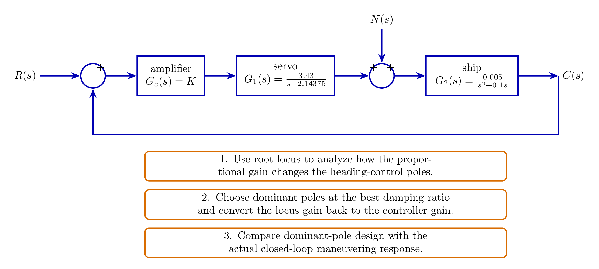
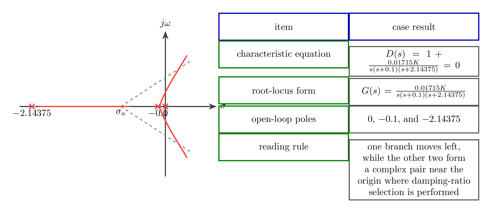
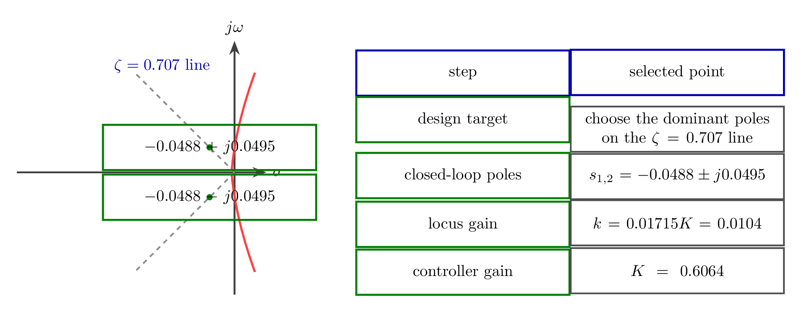
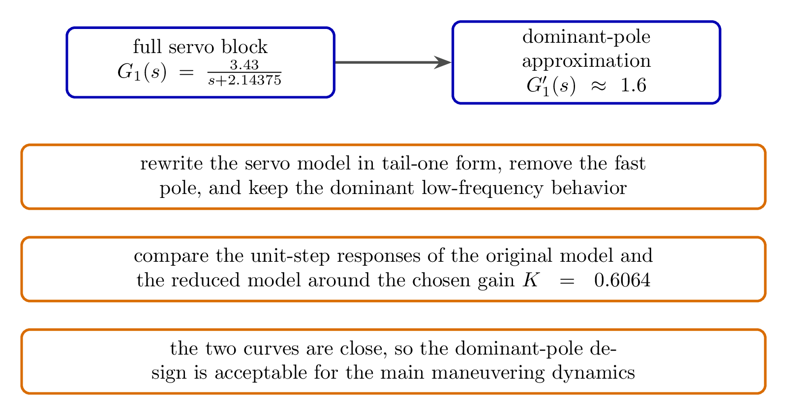
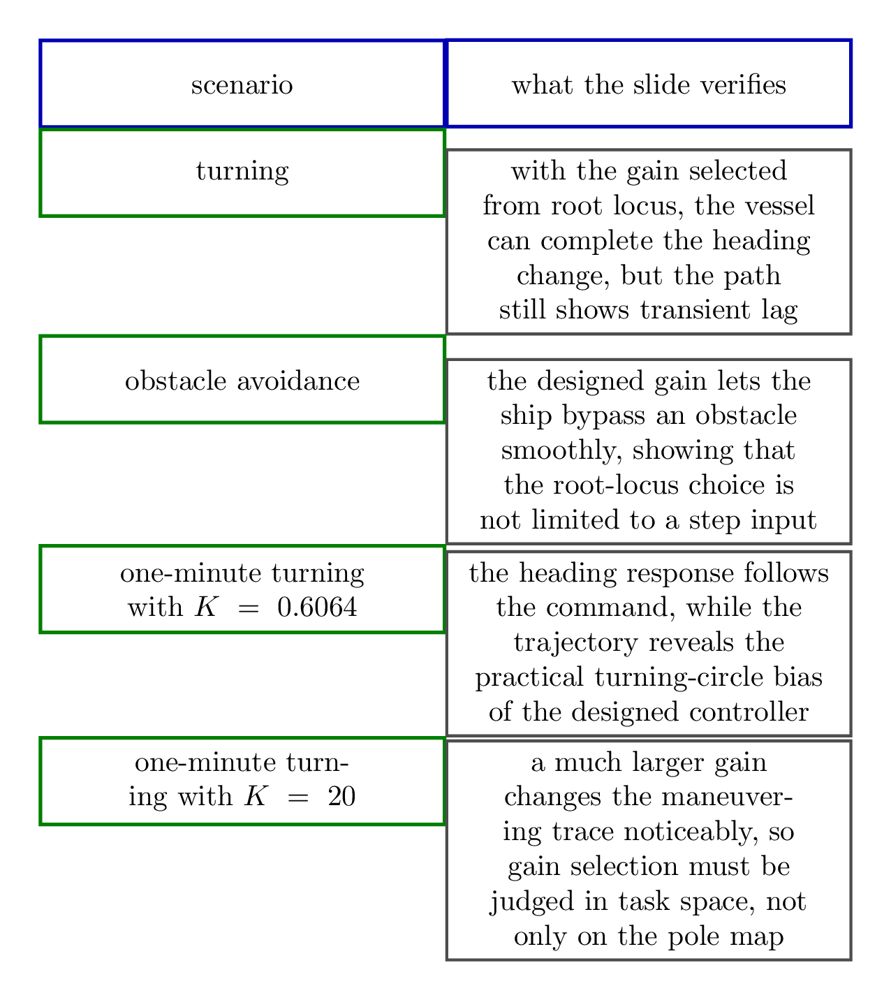

# `15.2根轨迹分析综合` 完整提取

## 1. 页面边界

- 原始文件：`course-content/slides-ref/15.2根轨迹分析综合.pptx`
- 总页数：16
- 正文范围：第 4-13 页
- 排除页面：
  - 第 1 页：封面
  - 第 2 页：目录
  - 第 3 页：学习目标
  - 第 14-15 页：课外拓展及预习要求
  - 第 16 页：结束页

## 2. 内容总览

| 原页号 | 主题 |
| --- | --- |
| 4 | 航向控制系统的简化模型与案例任务 |
| 5 | 根轨迹方程与根轨迹图 |
| 6-7 | 最佳阻尼比下的主导极点选择与近似验证 |
| 8-11 | 转向、避障、1 分钟回转与不同增益对比 |
| 12 | 总结 |
| 13 | 课后思考 |

## 3. 从物理对象走到根轨迹问题（第 4 页）

第 4 页把整讲放在一个具体工程背景里：船舶航向控制。

课件给出的简化模型可以稳定恢复为：

- 放大器：`G_c(s)`，本讲后续把它取成比例控制器 `K`
- 舵伺服系统：

$$
G_1(s)=\frac{3.43}{s+2.14375}
$$

- 舵船对象：

$$
G_2(s)=\frac{0.005}{s^2+0.1s}
$$

系统还包含一个加性外部扰动 `N(s)`，并以航向 `C(s)` 做单位负反馈。

第 4 页给出 3 个非常明确的任务：

1. 分析比例控制器参数变化时航向控制系统的根轨迹；
2. 在最佳阻尼比下选择主导极点并确定控制器参数；
3. 验证主导极点近似和实际系统表现之间的差异。

这说明本讲已经不是“纯算题”，而是标准的工程分析链：建模、设计、验证。

对应的重建图如下：

- `tikz/01-simplified-heading-model.tex`
- 预览：`tikz/rendered/01-simplified-heading-model.png`

## 4. 根轨迹入口公式：把比例控制器直接嵌入开环模型（第 5 页）

把比例控制器 `G_c(s)=K` 代入后，课件给出的闭环特征方程是：

$$
D(s)=1+\frac{0.01715K}{s(s+0.1)(s+2.14375)}=0.
$$

对应的根轨迹方程写成：

$$
G(s)=\frac{0.01715K}{s(s+0.1)(s+2.14375)}.
$$

这一步很关键，因为它把“航向控制器整定”完全变成了前面已经熟悉的根轨迹问题：

- 开环极点在 `0`、`-0.1`、`-2.14375`；
- 无有限零点；
- 比例增益 `K` 直接决定闭环极点位置。

原图中的根轨迹表现出一个典型结构：

- 一条分支沿实轴向左移动；
- 另外两条分支在近原点附近汇合后形成共轭复根；
- 这两条分支靠近虚轴，因此后续的阻尼比选择会在原点附近进行。

对应的重建图如下：

- `tikz/02-root-locus-summary.tex`
- 预览：`tikz/rendered/02-root-locus-summary.png`

## 5. 选择最佳阻尼比对应的主导极点（第 6 页）

第 6 页直接把设计目标落在经典的阻尼比准则上：

$$
\zeta=0.707.
$$

课件给出的选中闭环极点为：

$$
s_{1,2}=-0.0488\pm j0.0495.
$$

与之对应的根轨迹增益写成：

$$
k=0.01715K=0.0104.
$$

因此实际比例增益为：

$$
K=\frac{0.0104}{0.01715}=0.6064.
$$

这一页的工程含义很明确：

- 根轨迹并不是只告诉你“稳定还是不稳定”；
- 它还能通过阻尼比线帮助你挑选满足动态性能要求的闭环极点；
- 最后再把图上读出的中间增益换回真实控制器参数 `K`。

对应的重建图如下：

- `tikz/03-dominant-pole-selection.tex`
- 预览：`tikz/rendered/03-dominant-pole-selection.png`

## 6. 主导极点近似是否可靠：课件给出的验证思路（第 7 页）

第 7 页没有停在极点选择本身，而是进一步追问：

> 主导极点近似能否代表真实系统表现？

课件采用的办法是：

1. 将 `G_1(s)` 化为尾一式后消去较快极点；
2. 得到近似的低阶模型；
3. 比较原系统与近似系统的单位阶跃响应。

页面中给出的近似块图把舵伺服环节改写成一个常数近似：

$$
G_1'(s)\approx 1.6.
$$

图中两条阶跃响应曲线基本重合，说明在当前选取的 `K=0.6064` 附近，主导极点近似对主要动态过程是可接受的。

这一步把“根轨迹选点”真正转成了“模型有效性验证”，是本讲最重要的方法升级。

对应的重建图如下：

- `tikz/04-dominant-pole-check.tex`
- 预览：`tikz/rendered/04-dominant-pole-check.png`

## 7. 场景仿真：把根轨迹整定结果放回实际任务（第 8-11 页）

第 8-11 页把设计好的控制器放回 3 类场景中：

1. 模拟转向；
2. 模拟避障；
3. 模拟 1 分钟回转。

其中最有代表性的对比是第 10-11 页：

- 当 `K=0.6064` 时，系统按根轨迹与主导极点设计得到，能完成回转，但存在明显的响应滞后与航迹偏差；
- 当 `K=20` 时，航向跟踪更激进，回转航迹也发生明显变化。

因此，课件要学生看到的是：

- 根轨迹给出的 `K=0.6064` 是一个按阻尼比准则选出来的“合理设计点”；
- 但不同任务场景对控制器参数的偏好并不完全相同；
- 最终设计不能只看一张根轨迹图，还要回到真实机动任务中做综合判断。

对应的重建图如下：

- `tikz/05-scenario-summary.tex`
- 预览：`tikz/rendered/05-scenario-summary.png`

## 8. 总结与课后思考（第 12-13 页）

第 12 页总结与上一讲保持同一框架，但在本讲语境里有了更强的工程落点：

1. 根轨迹要点：
   起点、终点、实轴根轨迹、分离点、出射角、入射角、渐近线、虚轴交点、根之和；
2. 参数稳定范围：
   以虚轴为边界；
3. 根轨迹增益：
   应用时需化为开环增益；
4. 选择极点：
   应用主导极点选择，综合阻尼和振荡频率。

第 13 页进一步留下两个设计型问题：

- 继续分析该案例在不同指标下的性能边界；
- 若现有参数不满足要求，应考虑哪些校正手段。

这说明本讲的真正作用，是把“根轨迹法”从理论章节推向了工程设计章节。

## 9. 本讲可直接复用的教学主线

这份课件最值得沉淀的是下面这条案例链：

1. 先把物理对象写成开环传函；
2. 用根轨迹分析比例增益 `K` 变化对闭环极点的影响；
3. 用阻尼比线选主导极点，得到候选控制器参数；
4. 用低阶近似与场景仿真检验“图上结论”是否真的可用。

这条链路非常适合作为“根轨迹分析综合”类课程的标准模板。
