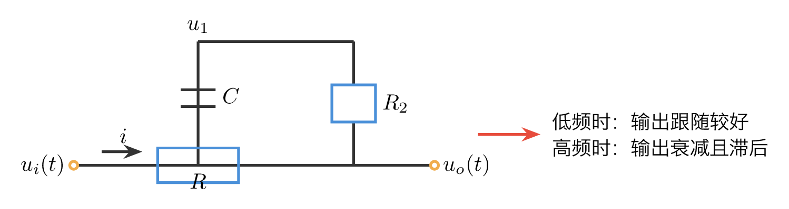
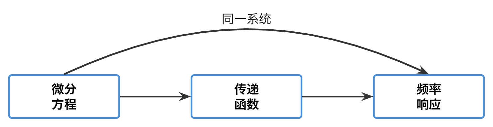
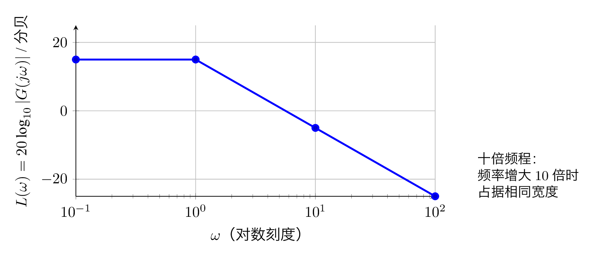
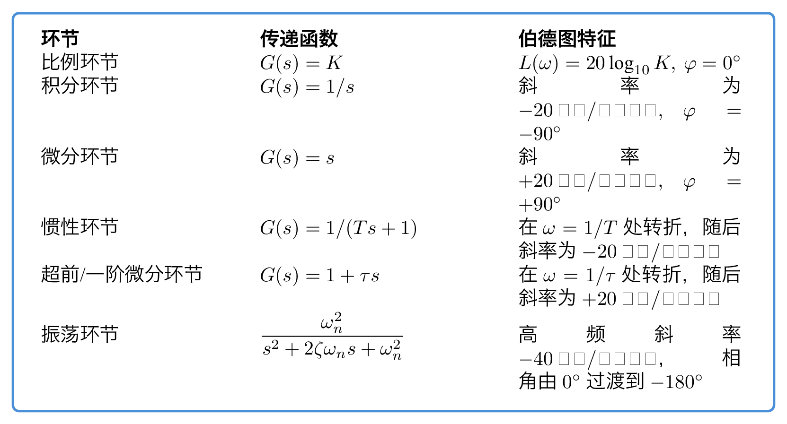

# `16频率特性_换个角度看控制` 完整提取

## 1. 页面边界

- 原始文件：`course-content/slides-ref/16频率特性_换个角度看控制.pptx`
- 总页数：34
- 正文范围：第 4-32 页
- 排除页面：
  - 第 1 页：封面
  - 第 2 页：目录
  - 第 33 页：收束动画页
  - 第 34 页：结束视频页

## 2. 内容总览

| 原页号 | 主题 |
| --- | --- |
| 4-11 | 问题引入与频率响应的物理直觉 |
| 12-18 | 正弦输入下的响应与频率响应定义 |
| 19-23 | 频率特性的图解表示与 伯德图特点 |
| 24-28 | 典型环节的 伯德图 |
| 29-32 | 总结、课后思考、拓展阅读与预习 |

## 3. 为什么要研究频率响应（第 4-11 页）

### 3.1 教学意图

第 4-11 页不是直接堆公式，而是先建立问题意识：

1. 同一个系统面对不同频率的输入，响应能力会显著不同。
2. 低频信号往往能够较好跟随，高频信号则可能被衰减并产生相位滞后。
3. 用单一时域曲线观察这些差异并不高效，因此需要一种“频率为自变量”的统一描述。

这一段课件中混入了视频、动图 和分步揭示页面，本次不逐页复刻，而保留其稳定结论。

### 3.2 RC 环节作为直觉例子

该段用 RC 电路引出“高频难以通过、低频较易通过”的直觉。可整理为如下结构：

- `tikz/01-rc-intuition.tex`
- 预览：`tikz/rendered/01-rc-intuition.png`



## 4. 正弦输入下的响应与频率响应定义（第 12-18 页）

### 4.1 正弦输入

课件这一段讨论的是：当输入为正弦信号时，系统输出会出现什么形式。

标准输入可写为：

$$
r(t)=A\sin(\omega t+\theta)
$$

对稳定线性定常系统，输出一般可分为：

$$
c(t)=c_{\mathrm{tr}}(t)+c_{\mathrm{ss}}(t)
$$

其中：

- $c_{\mathrm{tr}}(t)$ 为暂态分量，随时间衰减；
- $c_{\mathrm{ss}}(t)$ 为稳态分量，仍是同频正弦信号。

### 4.2 稳态正弦响应

当暂态分量衰减后，稳态输出可写成：

$$
c_{\mathrm{ss}}(t)=AM(\omega)\sin\bigl(\omega t+\theta+\varphi(\omega)\bigr)
$$

这里：

- $M(\omega)$ 表示稳态输出与输入的幅值比；
- $\varphi(\omega)$ 表示稳态输出相对输入的相移。

这正是课件第 15 页“定义一、定义二、定义三、幅频特性、相频特性”要表达的核心。

### 4.3 频率响应与频率特性

若系统传递函数为 $G(s)$，则频率响应定义为：

$$
G(j\omega)=G(s)\big|_{s=j\omega}
$$

因此可以定义：

$$
M(\omega)=|G(j\omega)|
$$

$$
\varphi(\omega)=\angle G(j\omega)
$$

从而频率特性可理解为：

- 幅频特性：$M(\omega)$ 随频率变化的规律；
- 相频特性：$\varphi(\omega)$ 随频率变化的规律。

### 4.4 这一段的课程主线

第 12-18 页真正要完成的是下面这条链：

1. 从正弦输入下的时域响应出发；
2. 把暂态项和稳态项分开；
3. 只抓住稳态正弦的“幅值变化”和“相位变化”；
4. 由此引出 $G(j\omega)$、$M(\omega)$、$\varphi(\omega)$。

这条关系可整理为：

- `tikz/02-model-chain.tex`
- 预览：`tikz/rendered/02-model-chain.png`


### 4.5 第 16-18 页：计算机验证

课件第 17 页原始对象层保留了一段 数值软件 代码，作用是通过时域仿真验证正弦稳态响应。原代码骨架为：

```matlab
t = linspace(0,30,1000);
A = 3;
omega = 2;
r = A*sin(omega*t+30/360*2*pi);
G = tf(1,[1,0]);
Phi = feedback(G,1);
[c,t] = lsim(Phi,r,t);
plot(t,[r',c],'LineWidth',2);
```

对于当前课程制作，更适合把这页改造成：

- `python3 + control` 的 `forced_response/lsim` 验证；
- 或 `Octave control` 的原生 `lsim` 验证。

其教学定位不是“学 数值软件 语法”，而是“用仿真回看频率响应的时域结果”。

## 5. 频率特性的图解表示与 伯德图（第 19-23 页）

### 5.1 频率特性的定义性总结

课件第 19 页对象层文本较完整，可整理为：

- 系统的频率特性反映了在正弦信号作用下，系统的稳态响应与输入正弦信号的关系。
- 幅频特性反映系统对不同频率正弦信号的放大或衰减程度。
- 相频特性反映系统对不同频率正弦信号产生的相移。

### 5.2 频率特性的几种图解方式

第 20 页给出了四种表示：

1. 频率特性：幅频 + 相频
2. 幅相特性：奈奎斯特图 / 极坐标图
3. 对数频率特性：伯德图
4. 对数幅相特性：尼科尔斯图

本讲重心是第 3 类，即 伯德图。

### 5.3 系统模型之间的关系

第 21 页用一张关系图把三种模型串起来：

- 微分方程
- 传递函数
- 频率特性

其核心意思是：频率特性不是孤立新模型，而是同一系统在频域下的另一种表达。

可整理为：

- `tikz/03-system-models.tex`
- 预览：`tikz/rendered/03-system-models.png`



### 5.4 伯德图的坐标与特点

第 22-23 页引入 伯德图：

- 横轴：频率取对数刻度，以十倍频程组织；
- 纵轴：幅值用分贝表示，相角仍以角度表示；
- 对数坐标使“乘法变加法”，便于多环节叠加作图。

标准定义为：

$$
L(\omega)=20\log_{10}|G(j\omega)|
$$

对应的相频曲线则直接画 $\varphi(\omega)$ 对 $\log\omega$ 的关系。

第 23 页明确强调的优点有：

1. 幅值相乘可转化为对数相加，便于叠加作图。
2. 可以在大范围内表示频率特性。
3. 可以让不同频段都得到同等重视。
4. 非直线曲线可以用渐近线近似，进一步简化手工绘图。
5. 对最小相位系统，可由对数幅频特性粗粒度反推传递函数结构。

对应坐标图如下：

- `tikz/04-bode-axes.tex`
- 预览：`tikz/rendered/04-bode-axes.png`



## 6. 典型环节的 伯德图（第 24-28 页）

这一段是本讲最核心、也是对当前课程制作最有参考价值的内容。

### 6.1 比例环节（第 24 页）

比例环节：

$$
G(s)=K
$$

其特点：

- 幅频曲线是常数：

$$
L(\omega)=20\log_{10}K
$$

- 相频曲线恒为：

$$
\varphi(\omega)=0^\circ \quad (K>0)
$$

若把“微分环节”一起放在这一页看，则其本质是斜率为正的直线。

### 6.2 积分环节（第 25 页）

积分环节：

$$
G(s)=\frac{1}{s}
$$

其特点：

- 幅频渐近线斜率为 $-20\,\mathrm{分贝/十倍频程}$；
- 相角恒为 $-90^\circ$。

更一般地，若为 $\frac{1}{s^\alpha}$，则斜率为 $-20\alpha\,\mathrm{分贝/十倍频程}$，相角恒为 $-90\alpha^\circ$。

### 6.3 惯性环节（第 26 页）

惯性环节：

$$
G(s)=\frac{1}{Ts+1}
$$

对应频率响应：

$$
G(j\omega)=\frac{1}{1+j\omega T}
$$

其幅频与相频分别为：

$$
|G(j\omega)|=\frac{1}{\sqrt{1+\omega^2T^2}}
$$

$$
\varphi(\omega)=-\arctan(\omega T)
$$

讲义强调的手工近似规则是：

- 低频段近似为 $0$ 分贝；
- 交接频率在 $\omega=\frac{1}{T}$；
- 高频段斜率为 $-20\,\mathrm{分贝/十倍频程}$；
- 误差主要集中在交接频率上下十倍频程附近。

### 6.4 一阶微分环节（第 27 页）

一阶微分/超前型环节：

$$
G(s)=1+\tau s
$$

对应频率响应：

$$
G(j\omega)=1+j\omega\tau
$$

其特点与惯性环节相反：

- 低频段近似为 $0$ 分贝；
- 交接频率在 $\omega=\frac{1}{\tau}$；
- 高频段斜率为 $+20\,\mathrm{分贝/十倍频程}$；
- 相角由 $0^\circ$ 逐渐过渡到 $+90^\circ$。

### 6.5 振荡环节（第 28 页）

标准二阶振荡环节可写为：

$$
G(s)=\frac{\omega_n^2}{s^2+2\zeta\omega_n s+\omega_n^2}
$$

对应频率响应：

$$
G(j\omega)=\frac{\omega_n^2}{\omega_n^2-\omega^2+j2\zeta\omega_n\omega}
$$

其 伯德图特征为：

- 低频段幅值近似为常数；
- 当频率越过固有频率附近后，幅值逐渐转为 $-40\,\mathrm{分贝/十倍频程}$；
- 当阻尼比较小时，会出现明显谐振峰；
- 相角由 $0^\circ$ 逐渐过渡到 $-180^\circ$。

### 6.6 典型环节摘要卡

把第 24-28 页沉淀成当前课程制作最可复用的摘要卡如下：

- `tikz/05-typical-elements-card.tex`
- 预览：`tikz/rendered/05-typical-elements-card.png`



## 7. 总结、思考与拓展（第 29-32 页）

### 7.1 课程总结（第 29 页）

第 29 页对象层文本明确回收了以下关键词：

- 正弦响应的稳态部分
- 频率响应
- 伯德图
- 典型环节
- 十倍频程

因此本讲的最短总结可以写成：

1. 频率响应来自正弦稳态响应。
2. 伯德图是最适合手工叠加分析的表示方式。
3. 典型环节的 伯德图是后续组合对象分析的基础。

### 7.2 课后思考（第 30 页）

课件提出：

> 试分析不稳定系统是否也具有稳定的频率响应，如果没有，分析其具有的形态，并通过仿真验证你的分析。

这道题的价值在于提醒学生：

- “时域稳定”与“形式上代入 $s=j\omega$ 得到表达式”不是同一件事；
- 后续频域稳定判据会进一步解释这类现象。

### 7.3 拓展阅读与预习（第 31-32 页）

课件给出：

- 雷克（1979）：《阶跃响应与频率响应方法》。
- 王等（2020）：《面向大规模电力系统扰动的快速高精度频率响应估计》。
- B 站资源：`频率响应详细数学推导 G(jw)`
- 图书：《控制之美》
- 在线视频：088、089

## 8. 对当前课程制作最有参考价值的可复用单元

1. 从正弦稳态响应引出频率响应的逻辑链。
2. 频率特性与微分方程、传递函数之间的模型关系。
3. 伯德图的坐标定义和“便于叠加”的核心优点。
4. 比例、积分、惯性、一阶微分、振荡环节的典型特征。
5. “交接频率、斜率、相角变化”三位一体的读图框架。
