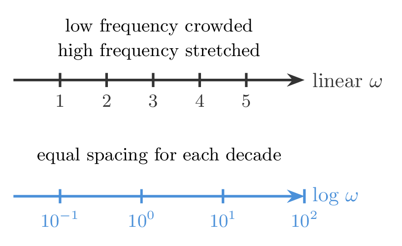
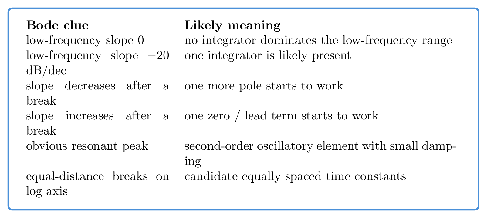
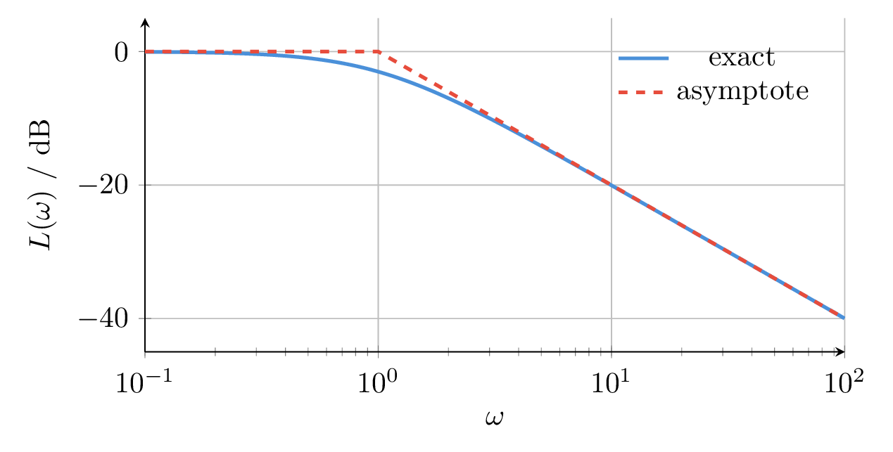

# `17近似叠加_绘制伯德图` 完整提取

## 1. 页面边界

- 原始文件：`course-content/slides-ref/17近似叠加_绘制伯德图.pptx`
- 总页数：28
- 正文范围：第 4-27 页
- 排除页面：
  - 第 1 页：封面
  - 第 2 页：目录
  - 第 28 页：结束页

## 2. 内容总览

| 原页号 | 主题 |
| --- | --- |
| 4-6 | 为什么要用对数频率坐标 |
| 7-11 | 绘制开环系统 Bode 图的步骤 |
| 12-15 | 绘制对数频率特性的例题 |
| 16-22 | 根据 Bode 图确定系统传递函数 |
| 23-27 | 总结、课后思考、拓展阅读与预习 |

## 3. 为什么要用对数频率坐标（第 4-6 页）

这一段的核心不是新公式，而是新视角：

1. 在线性频率坐标下，低频区域过于拥挤，高频区域又拉得过长；
2. 对于跨多个数量级变化的系统频率响应，线性坐标不利于观察结构变化；
3. 采用对数频率坐标后，每个 decade（十倍频程）占据相同视觉宽度，更适合分析“转折频率”和“斜率变化”。

可复用的核心对比如下：

- `tikz/01-linear-vs-log.tex`
- 预览：`tikz/rendered/01-linear-vs-log.png`



## 4. 绘制开环系统 Bode 图的步骤（第 7-11 页）

### 4.1 课件给出的标准流程

第 7-10 页对象层文本很稳定，课件把手工绘图流程压缩成 5 步：

1. 化为尾 1 标准型
2. 顺序列出转折频率
3. 确定低频特性
4. 叠加作图
5. 必要时修正，例如振荡环节

这一流程是本讲最值得直接复用到课程制作中的内容。

### 4.2 流程图整理

- `tikz/02-bode-steps.tex`
- 预览：`tikz/rendered/02-bode-steps.png`


### 4.3 每一步的作用

#### 第 1 步：化为尾 1 标准型

目标是把传递函数整理成典型环节的标准乘积形式，例如：

$$
G(s)=K\cdot s^\alpha \cdot \prod_i(1+T_i s)^{m_i}\cdot \prod_j \frac{1}{(1+T_j s)^{n_j}}\cdot \cdots
$$

这样才能直接识别：

- 比例项
- 积分/微分项
- 一阶惯性项
- 一阶微分/超前项
- 振荡项

#### 第 2 步：列出转折频率

将每个一阶或二阶环节对应的转折频率按从小到大列出：

$$
\omega_b = \frac{1}{T}
$$

这是后续画折线和判断斜率变化的基准。

#### 第 3 步：确定低频特性

在最小转折频率左侧，系统的幅频特性由：

- 常数项
- 积分/微分项
- 最低频段近似

共同决定。

#### 第 4 步：叠加作图

利用 dB 坐标下“乘法变加法”的性质：

$$
20\log_{10}|G_1G_2| = 20\log_{10}|G_1| + 20\log_{10}|G_2|
$$

把每个典型环节的幅频渐近线叠加起来，得到整体近似幅频特性。

#### 第 5 步：必要时修正

振荡环节和部分转折区域附近，真实曲线会偏离折线近似，因此需要在交接频率附近做局部修正。

## 5. 计算机验证（第 11 页）

第 11 页保留了课件原始的 Matlab 验证代码：

```matlab
G = zpk(-0.5,[0,-0.2],40)*tf(1,[1,1,1]);
bode(G,{0.1,100});
grid
```

这页的教学作用是：

1. 手工绘图不等于拒绝工具；
2. 工具的意义是验证手工分析，而不是替代对结构的理解。

对当前课程制作，建议改写为：

- `python3 + control` 的 `bode_plot`；
- 或 `Octave control` 的原生 `bode`。

## 6. 绘制对数频率特性的例题（第 12-15 页）

### 6.1 例 1：惯性环节叠加

第 12 页对象层明确给出“均为惯性环节”。这一例的重点不是复杂代数，而是训练：

1. 识别多个惯性环节；
2. 列出转折频率；
3. 按转折频率顺序叠加斜率。

对于 $n$ 个一阶惯性环节串联：

$$
G(s)=\frac{K}{(1+T_1 s)(1+T_2 s)\cdots(1+T_n s)}
$$

则幅频渐近线的斜率会在每个转折频率之后再下降 $20\,\mathrm{dB/dec}$。

### 6.2 例 2：更综合的叠加作图

第 13-15 页展示了更综合的对象，其本质训练是：

- 比例项决定整体平移；
- 积分项决定低频初始斜率；
- 惯性和一阶微分项决定某些频率点后的斜率变化；
- 多个环节通过加法叠加成整体 Bode 图。

### 6.3 可沉淀出的课堂训练结构

这部分最适合转成当前课程中的“步骤式练习”：

1. 先让学生标出标准型中的典型环节；
2. 再列出所有转折频率；
3. 然后按斜率变化规则画幅频折线；
4. 最后用程序校验。

## 7. 根据 Bode 图确定系统传递函数（第 16-22 页）

### 7.1 课件的核心目标

这一段不是做严格系统辨识，而是训练“粗粒度识别标准对象”：

- 这条线像什么典型环节？
- 哪些转折频率明显存在？
- 低频斜率说明有无积分项？
- 高频斜率说明有几个极点/零点在起作用？
- 是否存在振荡环节和谐振峰？

### 7.2 第 16-20 页：比例、惯性、积分、一阶微分

对象层文本可以稳定读出：

- 比例
- 惯性
- 积分
- 一阶微分
- 等距等比

这说明课件在训练学生通过以下特征识别传递函数骨架：

1. 低频段斜率：
   - $0$ dB/dec：通常无积分环节；
   - $-20$ dB/dec：通常含 1 个积分环节；
   - 更大负斜率：可能含多个积分或低频极点。
2. 转折频率位置：
   - 哪个频率点开始变坡；
   - 多个频率点是否呈等距等比。
3. 高频段斜率：
   - 反映极点与零点总差。

### 7.3 第 21-22 页：振荡环节与谐振峰

第 21-22 页对象层明确出现：

- 震荡环节
- 谐振峰

这意味着课件想让学生学会：

1. 看到谐振峰，优先想到二阶振荡环节；
2. 峰值越明显，通常阻尼越小；
3. 幅频与相频应同时看，不能只靠单一幅频线条判断。

### 7.4 可复用的判读卡片

- `tikz/03-reverse-identification-card.tex`
- 预览：`tikz/rendered/03-reverse-identification-card.png`



## 8. 折线近似与误差（第 24-25 页）

第 24 页直接提出：

> 分析手绘伯德图误差最大的位置；在误差最大位置，近似幅值和实际幅值之间可以相差多大？

这页很重要，因为它提醒学生：

- 近似折线不是“真值”；
- 最大误差通常出现在交接频率附近；
- 误差分析本身就是理解“为什么要修正”的关键。

以一阶惯性环节为例，真实幅频与渐近线的偏差在转折频率附近最大，可用下图表达：

- `tikz/04-break-frequency-error.tex`
- 预览：`tikz/rendered/04-break-frequency-error.png`



## 9. 总结与拓展（第 23、26-27 页）

### 9.1 课程总结（第 23 页）

对象层文本可整理为：

- Bode 图：频率取对数，幅值取分贝，相角线性坐标；
- 绘制步骤：尾一标准型、列转折频率、低频特性、叠加作图；
- 特点：频率范围广、便于叠加、各频段同等重视。

### 9.2 拓展阅读与预习（第 26-27 页）

课件列出：

- Anderson \& Mirheydar (1990)
- Hong et al. (2020)
- B 站视频：一阶系统的频率响应/低通滤波器
- 图书：《控制之美》
- 在线视频：092、093

## 10. 对当前课程制作最有参考价值的可复用单元

1. 手工绘制 Bode 图的五步法。
2. “转折频率 + 低频斜率 + 叠加作图”的组织方式。
3. 按图反求传函时的标准对象识别边界。
4. 交接频率附近误差最大这一修正意识。
5. 手工分析与程序验证配对出现的课程节奏。
