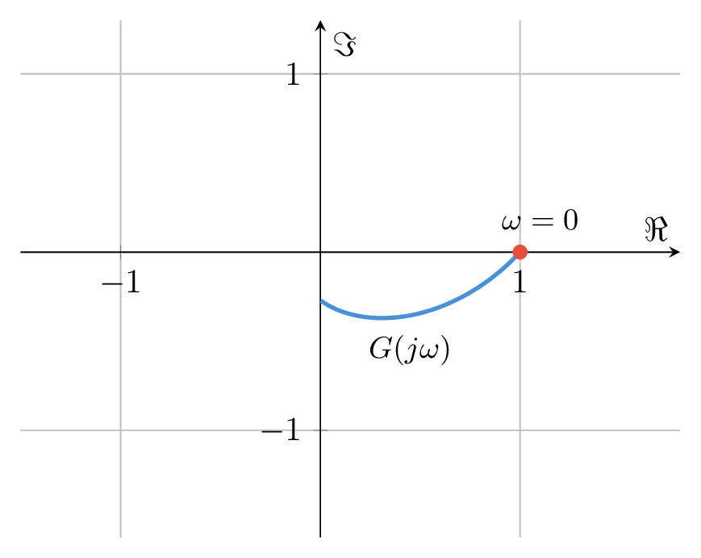
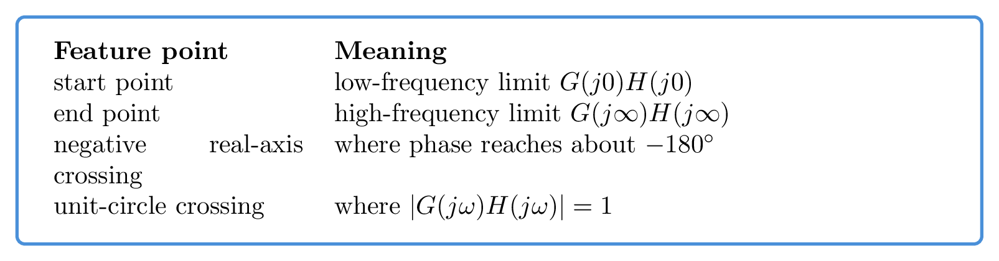
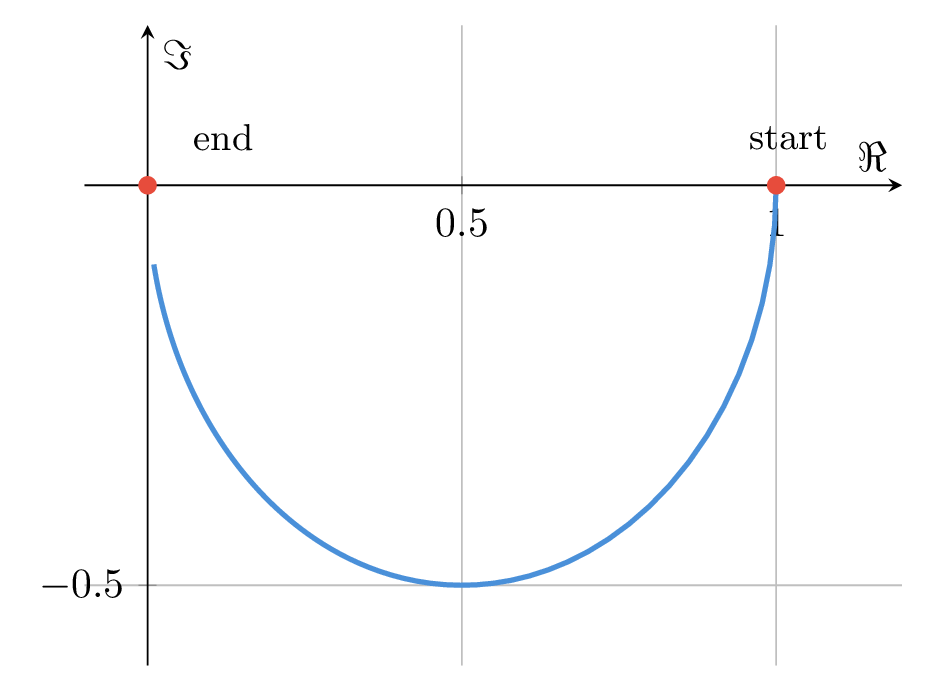

# `18幅相特性_换个角度看频域` 完整提取

## 1. 页面边界

- 原始文件：`course-content/slides-ref/18幅相特性_换个角度看频域.pptx`
- 总页数：21
- 正文范围：第 4-20 页
- 排除页面：
  - 第 1 页：封面
  - 第 2 页：目录
  - 第 21 页：结束页

## 2. 内容总览

| 原页号 | 主题 |
| --- | --- |
| 4-6 | 幅相特性的定义 |
| 7-9 | 起点、终点、负实轴交点等关键特征点 |
| 10 | 概略绘制极坐标图的步骤 |
| 11-15 | 绘制概略极坐标图的例题 |
| 16-18 | 总结、与稳定判据的关系、课后思考 |
| 19-20 | 拓展阅读与预习 |

## 3. 什么是开环幅相特性（第 4-6 页）

课件第 6 页对象层明确给出定义：

> 当输入信号的频率变化时，频率响应的幅值和相角在极坐标系上形成的轨迹。

若开环频率响应为：

$$
G(j\omega)H(j\omega)=M(\omega)e^{j\varphi(\omega)}
$$

则在复平面上可写为：

$$
G(j\omega)H(j\omega)=M(\omega)\cos\varphi(\omega)+jM(\omega)\sin\varphi(\omega)
$$

因此，随着 $\omega$ 从 $0$ 变化到 $\infty$，点

$$
\bigl(\Re[G(j\omega)H(j\omega)],\ \Im[G(j\omega)H(j\omega)]\bigr)
$$

就在复平面上形成一条轨迹。这条轨迹就是开环幅相特性，也就是极坐标图 / Nyquist 图的基础对象。

对应定义图如下：

- `tikz/01-polar-definition.tex`
- 预览：`tikz/rendered/01-polar-definition.png`



## 4. 关键特征点（第 7-9 页）

### 4.1 起点：低频段

课件第 7 页以“起点（低频段）”为主题，强调要先看：

$$
G(j0)H(j0)
$$

也就是低频极限。

这个点通常决定：

- 轨迹从复平面什么位置出发；
- 低频时幅值是否很大；
- 是否因为积分环节而从无穷远方向进入。

### 4.2 终点：高频段

第 8 页强调“终点（高频段）”，也就是看：

$$
G(j\infty)H(j\infty)
$$

它告诉我们：

- 高频时轨迹是收缩到原点，还是沿某个方向逼近；
- 高频相角趋向多少；
- 是否存在实部/虚部的渐近线。

### 4.3 与负实轴交点

第 9 页把重点放在“与负实轴交点”，并明确提到：

- 相角穿越频率
- 幅值穿越频率
- 截止频率
- 在 Bode 图什么位置？

这页最重要的稳定结论是：

1. 当相角穿越到 $-180^\circ$ 附近时，需要特别关注与负实轴的交点；
2. 交点位置和 $|G(j\omega)H(j\omega)|$ 是否大于 1，直接关联后续稳定判据；
3. 这些特征点在 Bode 图上也能找到对应频率点，因此两种图形不是割裂的。

### 4.4 关键特征点摘要

- `tikz/02-key-points-card.tex`
- 预览：`tikz/rendered/02-key-points-card.png`



## 5. 概略绘制极坐标图的步骤（第 10 页）

第 10 页把极坐标图的手工概略绘制压缩成 3 步：

1. 求频率特性
2. 求特征点
3. 概略绘图

并特别提示：

- 起点
- 终点
- 负实轴交点
- 开环频率特性的幅频、相频、实频、虚频信息
- 含零点时可能扭曲
- 不含零点时常呈单调收缩
- 需要关注实部渐近线

这套流程可直接整理为：

- `tikz/03-polar-steps.tex`
- 预览：`tikz/rendered/03-polar-steps.png`


## 6. 典型对象的极坐标图例题（第 11-15 页）

### 6.1 课件组织方式

第 11-15 页并没有让学生盲画曲线，而是反复围绕同一套框架练习：

1. 先写出 $G(j\omega)$；
2. 再看起点与终点；
3. 再找负实轴交点等特征点；
4. 最后再连成轨迹。

### 6.2 例 1：一阶惯性型对象

第 12 页对象层保留了程序验证的对象：

```matlab
s = tf('s');
G = 10/((0.2*s+1)*(s+1));
nyquist(G)
```

这说明至少有一个例题属于“两个一阶惯性环节串联”的对象。对于这类对象：

$$
G(s)=\frac{10}{(0.2s+1)(s+1)}
$$

其频率响应轨迹通常：

- 从正实轴上的某个点出发；
- 随频率增加向第四象限弯曲；
- 最终收缩到原点附近。

### 6.3 一阶惯性环节的标准轨迹

以最基础的一阶惯性环节为例：

$$
G(s)=\frac{1}{1+Ts}
$$

则：

$$
G(j\omega)=\frac{1}{1+j\omega T}
=
\frac{1}{1+\omega^2T^2}
-j\frac{\omega T}{1+\omega^2T^2}
$$

于是轨迹有几个稳定特征：

- 起点：$(1,0)$；
- 终点：$(0,0)$；
- 全程位于第四象限；
- 没有零点时，通常单调收缩向原点。

对应可复用图如下：

- `tikz/04-first-order-polar.tex`
- 预览：`tikz/rendered/04-first-order-polar.png`



### 6.4 例 2-4：更多极点/积分环节/复合对象

第 13-15 页延续同样的训练框架，说明：

- 极点和积分环节会改变起点、终点及相角范围；
- 负实轴交点是概略作图中不可跳过的关键点；
- 若对象不含零点，轨迹形态通常更规整；
- 若含零点，轨迹可能出现明显扭曲。

对当前课程制作而言，这部分最适合沉淀成“例题模板”，而不是逐页照抄原对象碎片。

## 7. 幅相特性与 Bode 图的对应关系（第 9、16-17 页）

课件反复把两个问题绑在一起：

1. 在 Bode 图上看到了什么频率点？
2. 这些频率点在极坐标图上对应什么关键位置？

因此可以把两者的关系整理为：

- `tikz/05-bode-nyquist-link.tex`
- 预览：`tikz/rendered/05-bode-nyquist-link.png`


这一页最适合用于当前课程制作中的“承前启后”：

- 从 Bode 图过渡到 Nyquist 图；
- 不再只看斜率，而是看复平面轨迹；
- 为后续稳定判据打接口。

## 8. 与稳定判据的关系（第 16-17 页）

第 16 页对象层出现了：

- 频域稳定判据
- 开环幅相特性和 `?` 的关系
- 稳定 / 不稳定
- 幅角原理

第 17 页进一步回收：

- 幅相特性
- 起点终点
- 负实轴交点
- 单位圆交点
- 穿越频率、截止频率

这说明课件的边界是：

1. 本讲先把极坐标图看懂；
2. 先认清起点、终点、单位圆交点、负实轴交点这些几何特征；
3. 下一讲再正式把这些几何特征和稳定性联系起来。

因此，在当前课程制作中，这一段只应写成“接口提示”，不应展开完整奈奎斯特判稳证明。

## 9. 课后思考与拓展（第 18-20 页）

### 9.1 课后思考

第 18 页提出：

> 根据下图实验数据分析开环幅相特性和闭环系统稳定性的关系。

这道题的价值在于把“几何图像”重新拉回“稳定性问题”。

### 9.2 拓展阅读与预习

第 19-20 页列出：

- Pejović (2019)
- Fan \& Miao (2020)
- B 站资源：奈奎斯特稳定性判据
- 图书：《控制之美》
- 在线视频：095、096

## 10. 对当前课程制作最有参考价值的可复用单元

1. 幅相特性的极坐标定义。
2. 起点、终点、负实轴交点、单位圆交点四类关键点。
3. 概略绘制极坐标图的三步法。
4. 一阶惯性对象的标准极坐标轨迹。
5. Bode 图与极坐标图之间的频率点对应关系。
