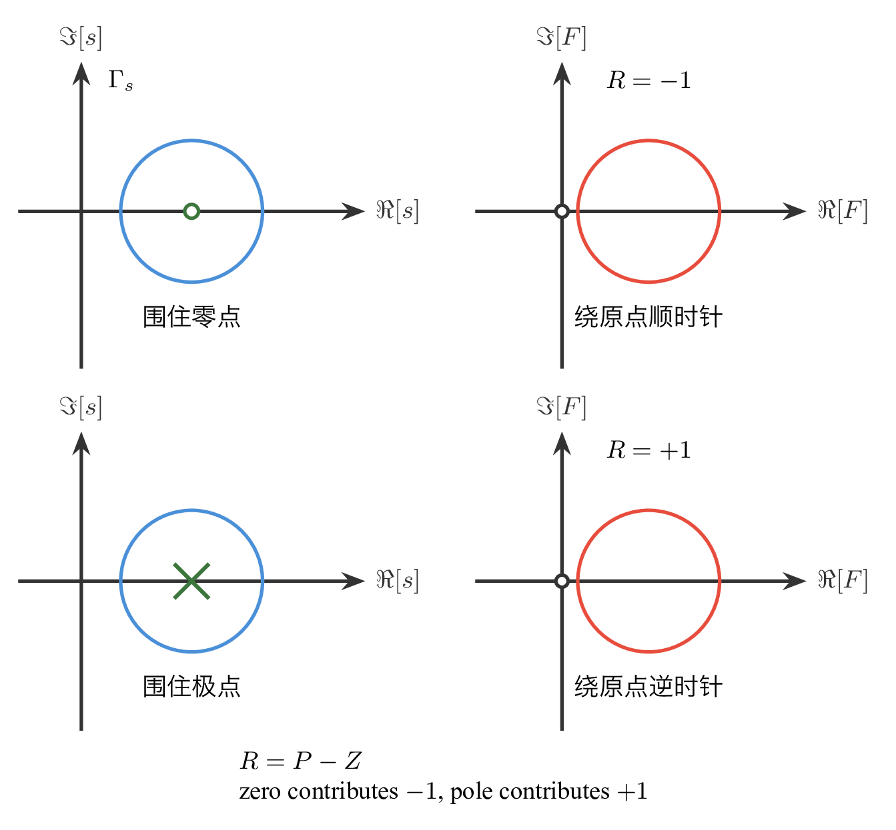
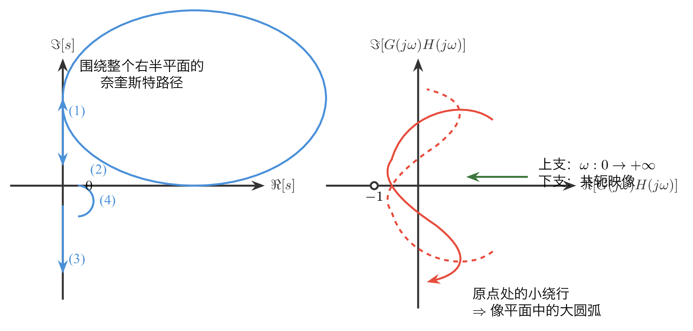
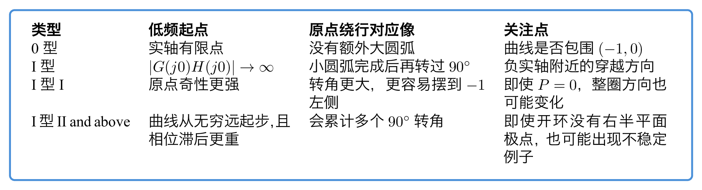
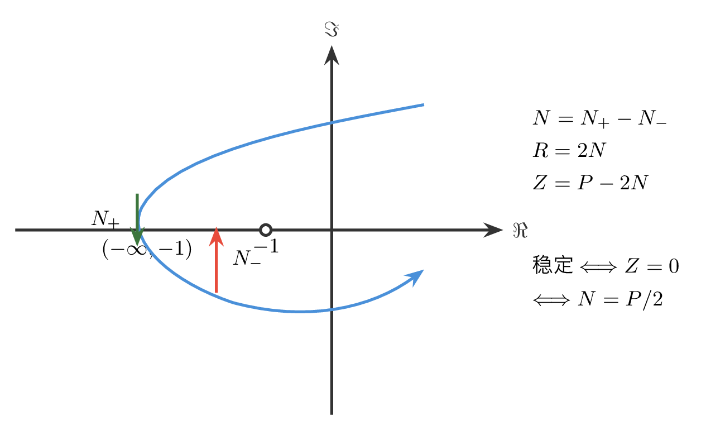
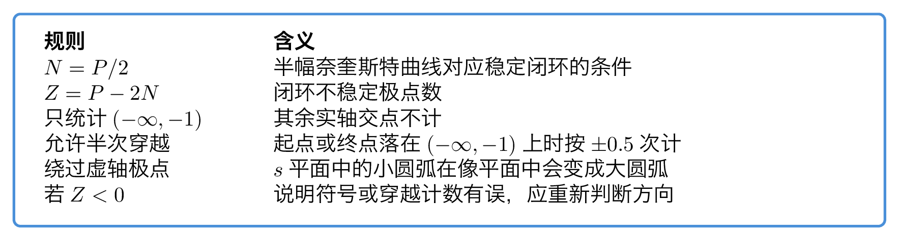
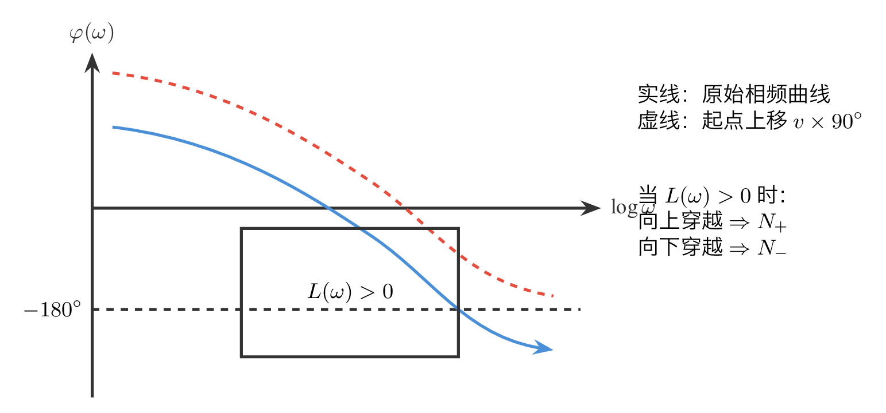

# `19稳定判据_频域的启示` 完整提取

## 1. 页面边界

- 原始文件：`course-content/slides-ref/19稳定判据_频域的启示.pptx`
- 总页数：38
- 正文范围：第 6-34 页
- 排除页面：
  - 第 1 页：封面
  - 第 2 页：全课程目录
  - 第 3 页：学习目标
  - 第 4-5 页：课堂导入对话页
  - 第 35-37 页：课外拓展、预习要求与结束页

## 2. 内容总览

| 原页号 | 主题 |
| --- | --- |
| 6 | 稳定判据比较与频域判据的价值 |
| 7-9 | 幅角原理与零点、极点的几何映射 |
| 10-14 | `F(s)=1+G(s)H(s)`、奈氏路径与完整奈奎斯特曲线 |
| 15-18 | 典型对象的奈奎斯特图与正式稳定判据 |
| 19-25 | 半闭合奈奎斯特曲线、穿越计数与简化判据 |
| 26-29 | 简化判据注意事项与应用题 |
| 30-32 | 对数稳定判据 |
| 33-34 | 总结与课后思考 |

## 3. 本讲首先回答什么问题（第 6 页）

第 6 页先把 3 类稳定判据摆在一起：

- 代数稳定判据：由闭环特征多项式系数直接判断稳定性；
- 频域稳定判据：由开环频率特性直接判断闭环稳定性；
- 对数稳定判据：把频域判据继续翻译到 伯德图上。

课件在这里给出的关键判断不是“谁更高级”，而是“谁更适合设计”：

- 劳斯判据适合回答“稳不稳”；
- 奈奎斯特与对数判据适合回答“参数怎么调、结构怎么改、稳定性会怎样变化”。

因此，本讲从一开始就把任务锁定为：

> 不再直接解闭环特征方程，而是通过开环频率响应的几何结构判断闭环稳定性。

## 4. 幅角原理：把零极点计数变成几何绕行（第 7-9 页）

第 7 页给出本讲的理论起点：幅角原理。

若函数 `F(s)` 在闭合曲线 `\Gamma_s` 上解析且不为零，且 `\Gamma_s` 包围 `Z` 个零点、`P` 个极点，则当动点在 `s` 平面顺时针沿 `\Gamma_s` 绕行一周时，其映射曲线 `\Gamma_F` 围绕原点的圈数满足：

$$
R=P-Z.
$$

课件紧接着用两个最小例子把它“图形化”：

- 当 `\Gamma_s` 包围 `F(s)` 的一个零点时，`F` 平面上的映射曲线顺时针绕原点一周，因此 `R=-1`；
- 当 `\Gamma_s` 包围 `F(s)` 的一个极点时，`F` 平面上的映射曲线逆时针绕原点一周，因此 `R=+1`。

也就是说：

- 零点贡献“顺时针一圈”；
- 极点贡献“逆时针一圈”；
- 总包围圈数就是“极点数减零点数”。

对应的重建图如下：

- `tikz/01-argument-principle-zero-pole.tex`
- 预览：`tikz/rendered/01-argument-principle-zero-pole.png`

## 5. 从闭环稳定转成辅助函数问题（第 10-11 页）

第 10-11 页把幅角原理正式接到控制系统上。

课件选择辅助函数：

$$
F(s)=1+G(s)H(s).
$$

对单位负反馈系统而言，闭环传递函数可写成：

$$
\Phi(s)=\frac{G(s)}{1+G(s)H(s)}.
$$

因此：

- `F(s)` 的零点就是闭环极点；
- `F(s)` 的极点就是开环极点。

这一步把问题完全改写了：

- 我们不再直接问闭环极点在哪；
- 而是问 `F(s)` 在右半平面有几个零点；
- 再由幅角原理把它转成某条映射曲线对原点的包围问题。

由于

$$
F(j\omega)=1+G(j\omega)H(j\omega),
$$

`F` 平面中的曲线可以看成 `G(j\omega)H(j\omega)` 曲线整体向右平移 1 个单位。因此：

> `F` 平面曲线围绕原点的圈数，等价于 `G(j\omega)H(j\omega)` 曲线围绕 `(-1,j0)` 的圈数。

这就是奈奎斯特判据的核心转化。

## 6. 奈氏路径与完整奈奎斯特曲线如何构造（第 12-14 页）

第 12-14 页处理“在 `s` 平面选哪条曲线”。

课件采用包围整个右半平面的奈氏路径 `\Gamma_s`：

- 主路径：`s=j\omega,\ \omega:0\to+\infty`
- 无穷远大半圆：把路径从上半平面绕到下半平面
- 对称路径：`s=j\omega,\ \omega:-\infty\to 0^-`
- 若原点有积分环节，还需在原点右侧补一条无穷小小半圆

在 `G(s)H(s)` 平面中，各段映射分别产生：

- 正频率开环幅相曲线；
- 无穷远大圆弧通常收缩到原点；
- 负频率分支是正频率分支关于实轴的镜像；
- 原点附近的小半圆会映射为半径无穷大的大圆弧，并决定积分型系统在原点附近如何转向。

对应的重建图如下：

- `tikz/02-nyquist-path-overview.tex`
- 预览：`tikz/rendered/02-nyquist-path-overview.png`

## 7. 正式奈奎斯特判据（第 18 页）

第 18 页把上面的构造收拢成正式结论。

若右半平面开环极点数为 `P`，右半平面闭环极点数为 `Z`，完整奈奎斯特曲线对点 `(-1,j0)` 的逆时针包围周数为 `R`，则：

$$
R=P-Z.
$$

对稳定系统而言，右半平面不允许有闭环极点，因此 `Z=0`。于是稳定条件变成：

$$
R=P.
$$

也就是：

> 奈奎斯特曲线不通过 `(-1,j0)`，并且逆时针包围 `(-1,j0)` 的周数等于右半平面开环极点数 `P`，则闭环稳定。

这个结论解释了为什么频域判据天然适合设计：

- 当增益变化时，曲线整体缩放；
- 当补偿器变化时，曲线形状改变；
- 是否包围 `(-1,j0)` 可以直接从开环频率特性上读出。

## 8. 典型对象的读图边界（第 15-17、19-21 页）

课件用几类典型对象反复演示奈奎斯特图的起点、终点和原点附近行为：

- 0 型系统：`G(j0)H(j0)` 有限，曲线从有限实轴点出发并逐渐收缩到原点；
- I 型系统：存在一个积分环节，原点附近要补一个 `90^\circ` 旋转后的大圆弧；
- II 型及更高型系统：原点附近的补弧旋转更强，曲线更容易绕到 `(-1,j0)` 左侧；
- III 型示例给出的结论是：即使右半平面无开环极点，也可能因曲线包围 `(-1,j0)` 方向不对而闭环不稳定。

这里最值得保留的不是每一张示意图，而是“对象类型如何决定原点附近的绕行方式”。

对应的重建图如下：

- `tikz/03-typical-type-summary.tex`
- 预览：`tikz/rendered/03-typical-type-summary.png`

## 9. 半闭合奈奎斯特曲线：把包围计数改成穿越计数（第 22-27 页）

第 22-27 页把完整奈奎斯特曲线进一步简化为“只看一半曲线”的实用版本。

由于正、负频率部分关于实轴对称，完整曲线的包围次数可以改成半闭合曲线穿越负实轴段 `(-\infty,-1)` 的次数来计算。

课件定义：

- `N_+`：从上向下穿越 `(-\infty,-1)` 的次数，对应逆时针包围；
- `N_-`：从下向上穿越 `(-\infty,-1)` 的次数，对应顺时针包围；
- `N=N_+-N_-`：净穿越次数。

于是完整曲线的包围周数满足：

$$
R=2N.
$$

把它代回正式奈奎斯特判据，就得到最常用的简化形式：

$$
Z=P-2N.
$$

稳定时 `Z=0`，所以：

$$
N=\frac{P}{2}.
$$

这就是本讲后半段最重要的工程结论。

对应的重建图如下：

- `tikz/04-half-nyquist-crossing.tex`
- 预览：`tikz/rendered/04-half-nyquist-crossing.png`

## 10. 简化判据的使用边界（第 27 页）

课件专门列出几个非常容易误判的边界条件：

1. 若虚轴上存在开环极点，奈氏路径必须从右侧绕开，该补弧在 `G(j\omega)H(j\omega)` 平面中会变成大圆弧；
2. 只有穿越 `(-\infty,-1)` 这一段才计数，其它实轴交点不算；
3. 穿越次数 `N` 可以以 `0.5` 为最小单位：
   - 起点或终点恰落在 `(-\infty,-1)` 上时，只算半次；
   - 穿越方向决定正负号；
4. `Z>0` 表示闭环不稳定，`Z=0` 表示稳定，若算出 `Z<0` 说明计数或方向判断有误。

对应的重建图如下：

- `tikz/05-simplified-criterion-card.tex`
- 预览：`tikz/rendered/05-simplified-criterion-card.png`

## 11. 应用题告诉我们什么（第 28-29 页）

第 28-29 页的应用题都在训练同一件事：

- 随着参数 `K` 变化，奈奎斯特曲线整体缩放；
- 曲线与 `(-1,j0)` 的相对位置发生改变；
- 因此稳定区间对应某个“临界增益”。

课件给出的典型结论模式是：

- `K` 小时，`N=P/2`，闭环稳定；
- `K` 大到一定程度后，`N` 改变，闭环变不稳定；
- 不稳定根数直接由 `Z=P-2N` 算出。

这说明奈奎斯特判据不仅能“判稳”，还天然能用来找稳定边界和临界参数。

## 12. 对数稳定判据：把穿越规则翻译到 伯德图（第 30-32 页）

第 30-32 页把奈奎斯特曲线上的穿越规则转换为 伯德图上的联合判断。

课件的核心意思是：

- 当 `|G(j\omega)H(j\omega)|>1` 时，奈奎斯特曲线位于单位圆外，更有可能穿越 `(-\infty,-1)`；
- 在 伯德图上，这对应 `L(\omega)=20\log_{10}|G(j\omega)H(j\omega)|>0`；
- 穿越负实轴对应相角达到 `-180^\circ`；
- 若系统含有 `v` 个积分环节，需要先把相频曲线低频起点上抬 `v\times 90^\circ`，再按同样规则判断穿越。

因此，对数稳定判据本质上是在统计：

- 当 `L(\omega)>0` 时，
- 相频曲线是从下向上还是从上向下穿越 `-180^\circ` 线。

这两种穿越分别对应正穿越与负穿越。

对应的重建图如下：

- `tikz/06-bode-criterion-card.tex`
- 预览：`tikz/rendered/06-bode-criterion-card.png`

## 13. 总结与课后思考（第 33-34 页）

第 33 页总结可以浓缩成 4 条：

1. 幅角原理给出 `R=P-Z`；
2. 奈氏路径必须包围整个右半平面，但不穿过虚轴极点；
3. 闭环稳定时，完整奈奎斯特曲线应逆时针包围 `(-1,j0)` 共 `P` 周；
4. 对数判据只是把同一个穿越问题换到 伯德图上表达。

第 34 页留下的思考题是：

> 试证右侧给出的奈奎斯特图总是不稳定。

这个提问本质上是在训练学生反向思考：

- 不必先写传递函数，
- 只凭曲线拓扑结构，也能反推出系统不可能稳定。

## 14. 本讲可直接复用的教学主线

这份课件最值得沉淀的是下面这条频域稳定分析主线：

1. 先用幅角原理建立“零极点数”与“映射包围圈数”的关系；
2. 再选 `F(s)=1+G(s)H(s)`，把闭环稳定问题改写为 `(-1,j0)` 的包围问题；
3. 再利用共轭对称性，把完整曲线包围问题压缩成半闭合曲线对 `(-\infty,-1)` 的穿越计数；
4. 最后把穿越计数继续翻译成 伯德图上的幅值-相位联合判据。

这条链路非常适合作为后续“稳定裕度”“频域校正”两讲的共同前置。
