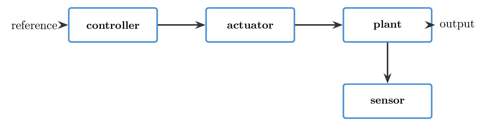
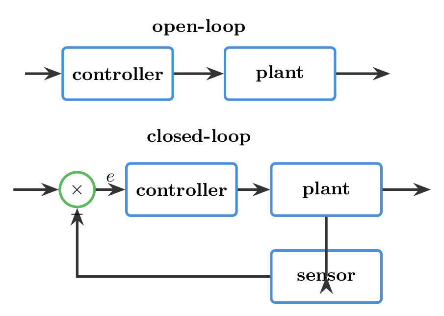
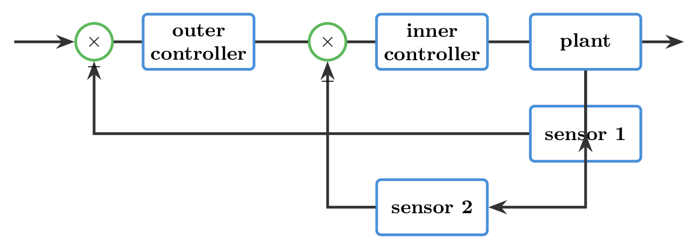
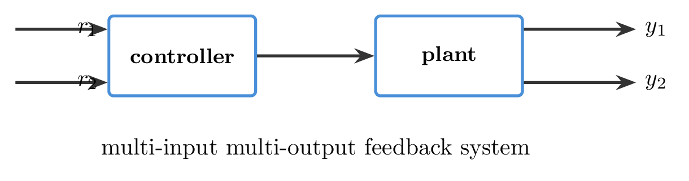

# `1反馈_控制原理的核心思想` 完整提取

## 1. 页面边界

- 原始文件：`course-content/slides-ref/1反馈_控制原理的核心思想.pptx`
- 总页数：37
- 正文范围：第 4-36 页
- 排除页面：
  - 第 1 页：封面
  - 第 2 页：课程标题页
  - 第 3 页：空白过渡页
  - 第 37 页：结束页

## 2. 内容总览

| 原页号 | 主题 |
| --- | --- |
| 4-11 | 课程导学、作业规范、课程目标 |
| 12-22 | 控制系统组成与反馈结构 |
| 23-31 | 典型控制系统案例 |
| 32-34 | 回到生活实例、总结与课后思考 |
| 35-36 | 拓展阅读与预习 |

## 3. 课程导学与组织说明（第 4-11 页）

这一段更多是课程开场，不是后续知识推导主线，但对理解整门课的组织方式有价值。

### 3.1 第 4-5 页：控制理论全景图与结构图

第 4 页是一张“控制理论地图”，第 5 页是一张控制理论结构图。它们的作用不是让学生当场记忆全部内容，而是建立两个直觉：

1. 自动控制原理不是孤立公式堆砌，而是横跨建模、分析、设计、估计、优化等多个子域的系统知识。
2. 本课程只覆盖其中的主干路线：基本概念、数学模型、时域分析、根轨迹、频域分析与校正。

### 3.2 第 6-9 页：作业与课堂规范

第 6 页列出课程评价结构：

- 作业：20%
- 平时：10%
- 实验：10%
- 考试：60%

并强调：

- 作业需规范扫描；
- 代码与仿真结果应同时提交；
- 抄袭和补交有明确扣分规则。

第 7-9 页进一步通过正反例和班群/文档二维码，明确课程运行规则。这部分可作为课程导学信息保留，但不应混入知识正文。

### 3.3 第 10-11 页：章节地图与课程目标

第 10 页给出整门课的章节顺序，第 11 页给出课程目标。稳定可提炼出的课程目标有：

1. 理解闭环控制系统的典型结构与反馈控制的价值。
2. 建立并使用控制系统的数学模型。
3. 运用时域、根轨迹和频域方法分析系统性能。
4. 理解校正设计的作用与参数选择逻辑。
5. 能使用解析方法和计算机方法验证结论。

## 4. 控制系统有哪些组成部分（第 12-15 页）

第 12 页明确列出四个基本组成：

- 对象
- 控制器
- 执行器
- 传感器

课件后续用烧水过程来引导学生把生活过程翻译成控制语言。其核心表达是：

- 对象：被控制的物理过程；
- 控制器：做决策；
- 执行器：落实决策；
- 传感器：获取对象状态信息。

这一页是整门课最早、也最值得反复引用的基础图。

对应整理图如下：

- `tikz/01-basic-components.tex`
- 预览：`tikz/rendered/01-basic-components.png`

## 5. 从控制过程到开环控制（第 15-17 页）

### 5.1 一般控制过程

第 15-16 页从“控制过程”过渡到“期望输出”和“输出响应”，说明控制并不只是让系统动起来，而是让系统按目标输出工作。

这意味着控制系统至少包含：

$$
\text{期望} \rightarrow \text{控制决策} \rightarrow \text{对象} \rightarrow \text{输出}
$$

### 5.2 开环控制

第 17 页对象层明确出现“开环控制”。其基本特征是：

- 系统根据输入或设定值直接作用于对象；
- 不利用输出信息修正控制动作；
- 结构简单，但难以自动抵消扰动和参数变化。

## 6. 反馈与闭环控制（第 18-20 页）

### 6.1 反馈的引入

第 18 页首次明确出现“反馈”二字，并加入传感器和测量输出。其本质是：

$$
\text{输出} \rightarrow \text{传感器测量} \rightarrow \text{反馈回控制器}
$$

### 6.2 闭环控制

第 19 页对象层中稳定出现：

- 闭环反馈系统
- 测量输出
- 误差
- 闭环控制

因此可把闭环控制的核心写成：

$$
e(t)=r(t)-y_m(t)
$$

控制器根据误差而不是仅根据设定值工作。这就是“反馈：控制原理的核心思想”中最关键的一句。

### 6.3 扰动与测量噪声

第 20 页在闭环结构中进一步加入：

- 扰动
- 测量噪声

这页的意义很强：反馈并不是只为“让系统有回路”，而是为了在扰动和噪声存在时仍尽量保持性能。

### 6.4 开环与闭环结构对照

- `tikz/02-open-vs-closed-loop.tex`
- 预览：`tikz/rendered/02-open-vs-closed-loop.png`

## 7. 双闭环与多输入多输出（第 21-22 页）

### 7.1 双闭环控制

第 21 页出现：

- 双闭环控制
- 内环
- 外环
- 控制器 1 / 控制器 2
- 传感器 1 / 传感器 2

这页想说明：

1. 复杂系统常常不是单一反馈回路；
2. 可以先用内环稳定或加快某个局部量，再由外环完成总体目标；
3. 闭环结构可以嵌套。

### 7.2 多输入多输出

第 22 页出现：

- 多输入多输出
- 比较器
- 控制器
- 对象
- 传感器

这说明控制系统并不局限于“一输入一输出”，实际工程中常常需要同时处理多个目标和多个被控量。

### 7.3 复杂结构图示

- `tikz/03-double-loop.tex`
- `tikz/04-mimo-concept.tex`

## 8. 典型控制系统案例（第 23-31 页）

这一组页面的核心不在于每个案例的细节，而在于训练学生用统一的控制语言去描述不同系统。

### 8.1 汽车方向控制（第 23-24 页）

对象层文本可以稳定恢复：

- 期望行驶方向
- 实际行驶方向
- 误差
- 驾驶员
- 转向机
- 汽车

因此可以用控制语言表达为：

- 对象：汽车横向运动
- 控制器：驾驶员
- 执行器：转向机
- 传感器：触觉或视觉感知
- 输出：实际行驶方向
- 目标：期望行驶方向

### 8.2 人工调节系统（第 25 页）

第 25 页以阀门调节流体输入/输出为例，强调“人 + 被控对象 + 阀门”的结构就是控制系统，只是控制器由人承担。

### 8.3 机器人、发电、生物医学、社会经济、无人机、工业控制（第 26-31 页）

这些页面覆盖：

- 机器人
- 火力发电
- 生物医学
- 社会经济政治系统
- 无人机
- 工业控制系统

它们共同证明了一件事：

> 控制思想不是某种单一设备的技巧，而是一种跨学科的系统组织方式。

因此，这一组页面最值得沉淀的不是原图，而是“控制语言模板”：

1. 先找对象；
2. 再找控制器；
3. 再找执行器与传感器；
4. 再明确期望输出、实际输出和扰动。

## 9. 回到生活实例：烧水过程（第 13、32 页）

课件在第 13 页提出：

> 你能用控制的语言描述烧水的过程吗？

第 32 页再回到这个问题，说明这一讲真正要建立的是：

- 见到一个过程，不先想公式；
- 先问：目标是什么、对象是什么、谁在决策、谁在执行、谁在测量；
- 最后再判断这是开环还是闭环。

这可以作为本讲最重要的课堂迁移任务。

## 10. 总结（第 33 页）

第 33 页对象层文本可以稳定整理为：

- 对象
- 控制器
- 执行器
- 传感器
- 反馈的思想
- 系统的思想

这一页对应的最短总结是：

1. 控制系统由对象、控制器、执行器和传感器组成。
2. 反馈让控制器能够利用误差不断修正动作。
3. 控制思想可以应用到物理、化学、农业、生态、社会经济等多领域。

## 11. 课后思考与拓展（第 34-36 页）

### 11.1 课后思考

第 34 页提出两道题：

1. 分析空调制冷系统的控制结构。
2. 选择一个生活中的系统，用控制系统的语言描述其控制过程。

这两道题延续了本讲最重要的训练目标：把现实过程翻译成控制语言。

### 11.2 拓展阅读与预习

第 35 页给出：

- DR_CAN：开环系统和闭环系统
- Otto Mayr, *The Origins of Feedback Control*

第 36 页为附加拓展页，文本较少，可视作延续资源页。

## 12. 对当前课程制作最有参考价值的可复用单元

1. 控制系统四个基本组成部分。
2. 开环控制与闭环控制的差别。
3. 误差、扰动、测量噪声在闭环中的位置。
4. 双闭环与多输入多输出作为复杂系统入口。
5. 用统一控制语言分析现实系统的方法模板。
