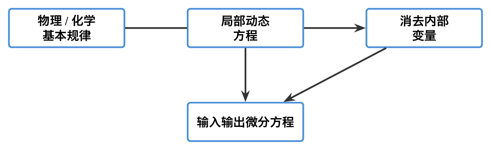
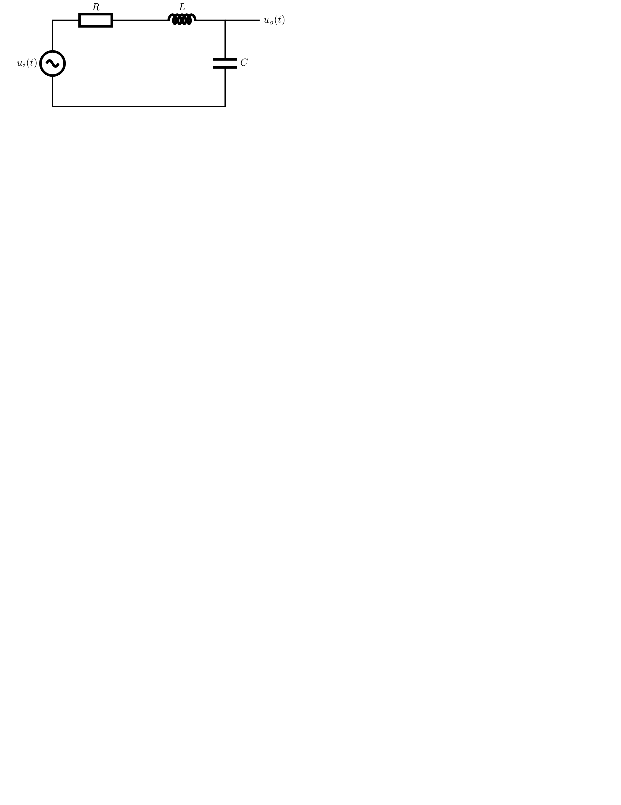
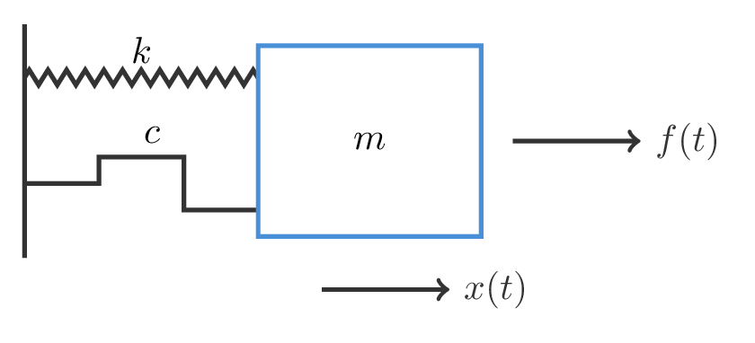
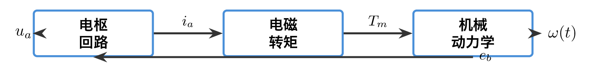
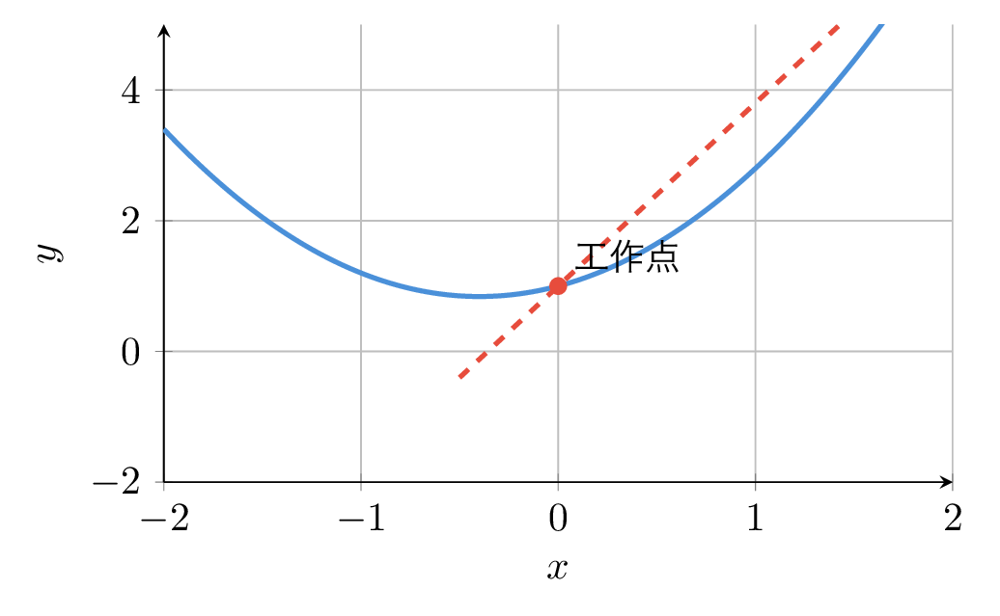
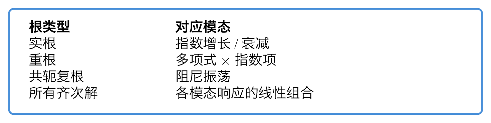

# `2.1微分方程_控制系统基础模型` 完整提取

## 1. 页面边界

- 原始文件：`course-content/slides-ref/2.1微分方程_控制系统基础模型.pptx`
- 总页数：21
- 正文范围：第 3-17 页
- 排除页面：
  - 第 1 页：封面
  - 第 2 页：章节导航与学习目标
  - 第 18-20 页：课后思考与拓展阅读
  - 第 21 页：隐藏结束页

## 2. 内容总览

| 原页号 | 主题 |
| --- | --- |
| 3-6 | 建模方法导入 |
| 7 | 控制理论中的系统模型 |
| 8 | 微分方程建模的一般形式与步骤 |
| 9-12 | 典型对象建模例题 |
| 13-15 | 非线性模型的线性化 |
| 16 | 运动的模态 |
| 17 | 总结 |

## 3. 建模方法导入（第 3-6 页）

### 3.1 分析法：机理建模

第 3-5 页依次列出：

- 电学：基尔霍夫电流定律、基尔霍夫电压定律
- 力学：牛顿定律
- 热力学：热力学定律

因此，这一段要传递的核心观点是：

> 微分方程建模不是拍脑袋写关系式，而是基于已有物理、化学等基本定律，对系统动态逐段分析后写出运动方程。

### 3.2 黑箱建模与系统辨识

第 6 页引入：

- 黑箱建模（实验法）
- 系统辨识
- 神经网络

这里不是要展开辨识方法，而是为了明确本章的边界：

- 本章重点研究分析法；
- 即利用物理/化学定律建立系统模型，而不是只靠输入输出数据拟合。

### 3.3 建模方法的稳定比较

- `tikz/01-modeling-methods.tex`
- 预览：`tikz/rendered/01-modeling-methods.png`

## 4. 控制理论中的系统模型（第 7 页）

课件第 7 页把模型分成三类：

- 时域：微分方程、差分方程、状态方程
- 复数域：传递函数、结构图
- 频率域：频率特性

其稳定结论是：

1. 数学模型的本质是系统内变量之间的关系；
2. 同一个系统可以在不同时域/复数域/频率域中以不同形式表达；
3. 微分方程是最基础的时域模型。

## 5. 微分方程建模的一般形式与步骤（第 8 页）

第 8 页明确给出“建立微分方程的一般步骤”：

1. 确定输入量、输出量和扰动量，并根据需要引进中间变量。
2. 根据物理或化学定律列出方程。
3. 消去中间变量，得到输出量与输入量（包括扰动量）关系的标准形式微分方程。

对线性定常系统，一般形式可写成：

$$
a_n \frac{d^n c(t)}{dt^n} + a_{n-1} \frac{d^{n-1} c(t)}{dt^{n-1}} + \cdots + a_0 c(t)
=
b_m \frac{d^m r(t)}{dt^m} + b_{m-1} \frac{d^{m-1} r(t)}{dt^{m-1}} + \cdots + b_0 r(t)
$$

这里最重要的不是记住每个符号，而是掌握“先分段、后消元”的套路。

## 6. 典型对象建模例题（第 9-12 页）

### 6.1 电阻电感电容串联电路（第 9 页）

课件第 9 页以电阻电感电容串联电路为第一例。稳定的建模逻辑是：

1. 由基尔霍夫电压定律写出输入电压与各元件压降关系；
2. 利用电感、电阻、电容各自的本构关系；
3. 消去中间变量后，得到输入与输出的二阶微分方程。

可用标准电路表示为：

- `tikz/02-rlc-circuit.tex`
- 预览：`tikz/rendered/02-rlc-circuit.png`

### 6.2 含负载效应的电路（第 10 页）

第 10 页表明：当电路不是理想单回路，而是存在负载效应时，建模步骤并没有变，只是中间变量更多、消元更复杂。

这页的稳定教学价值在于提醒学生：

- 微分方程模型并不依赖系统“长得简单”；
- 即使有额外支路和负载，仍然可以通过列方程与消元得到统一的输入输出模型。

### 6.3 机械位移系统（第 11 页）

课件第 11 页出现：

- 胡克定律
- 阻尼器模型
- 牛顿第二定律

说明机械系统建模的核心是“力平衡”而不是“电压平衡”，但思维方式完全相同。标准结构可写为：

$$
m\ddot{x}(t)+c\dot{x}(t)+kx(t)=f(t)
$$

其中：

- $m$：质量
- $c$：阻尼系数
- $k$：弹簧刚度

对应图示如下：

- `tikz/03-mass-spring-damper.tex`
- 预览：`tikz/rendered/03-mass-spring-damper.png`

### 6.4 电动机系统（第 12 页）

第 12 页是本讲最重要的综合例子之一，出现了：

- 电枢回路
- 电枢反电势
- 电磁力矩
- 力矩平衡
- 电机时间常数
- 电机传递系数

这说明电机系统本质上是电学方程与力学方程的耦合：

1. 电枢回路满足基尔霍夫电压定律；
2. 转子运动满足转矩平衡；
3. 反电势和电磁力矩把电气变量与机械变量耦合起来。

其可复用结构如下：

- `tikz/04-motor-model.tex`
- 预览：`tikz/rendered/04-motor-model.png`

### 6.5 这一组例题的共同结论

第 9-12 页最值得沉淀的是：

1. 电路、机械、电机看起来不同，但都能写成输入输出微分方程。
2. 建模时应先依据局部物理定律列方程，再消去中间变量。
3. 不同物理对象常会导向相似的标准形式。

## 7. 非线性模型的线性化（第 13-15 页）

### 7.1 线性化的核心思想

第 13 页对象层明确写出：

- 在给定工作点附近将非线性模型展开为泰勒级数
- 略去 2 次及高阶项，得到线性化方程

这可以写成标准形式：

若

$$
y=f(x)
$$

在工作点 $x_0$ 附近展开，则：

$$
f(x)\approx f(x_0)+f'(x_0)(x-x_0)
$$

这就是一阶线性化。

### 7.2 均衡点与非线性弹簧（第 14 页）

第 14 页的关键词是：

- 均衡点
- 非线性弹簧

这里的教学重点是：

- 线性化不是全局真理，只在工作点附近成立；
- 选不同均衡点，得到的线性近似模型可能不同。

### 7.3 几何/结构型非线性（第 15 页）

第 15 页出现：

- 长度
- 质量

说明除了材料本构非线性，几何关系本身也可能引入非线性。课件想传递的是：

> 只要关系不是严格线性的，都可能需要在某个工作点附近做局部线性化。

这一段可用统一示意图表达：

- `tikz/05-linearization-concept.tex`
- 预览：`tikz/rendered/05-linearization-concept.png`

## 8. 运动的模态（第 16 页）

第 16 页对象层给出：

- 运动的模态、振型
- 无重根模态
- 多重根模态
- 共轭复模态
- 实函数模态
- 齐次微分方程的通解为运动模态的线性组合

这页的稳定结论是：

对于齐次线性微分方程，其通解可视为多个基础模态的线性组合，而这些模态由特征根决定：

- 实根：指数模态
- 共轭复根：衰减振荡模态
- 重根：多重根模态

可整理为：

- `tikz/06-modal-roots.tex`
- 预览：`tikz/rendered/06-modal-roots.png`

## 9. 总结（第 17 页）

第 17 页对象层比较完整，稳定可整理为：

- 机理建模：电学、力学、热力学等
- 微分方程：输入的各阶导数与输出的各阶导数关系
- 建模方法：单独环节描述，消去中间变量
- 线性近似：泰勒展开在均衡点的一阶项
- 关键词：寻找共性，还原论的思想

这可以压缩成一句最短总结：

> 微分方程建模的核心，是用基本定律描述局部动态，再通过消元把不同物理系统还原为统一的输入输出微分方程形式。

## 10. 对当前课程制作最有参考价值的可复用单元

1. 机理建模与黑箱建模的边界。
2. 微分方程建模的三步法：定变量、列方程、消中间变量。
3. 电路、机械、电机三类典型对象的标准建模逻辑。
4. 非线性模型在线性控制中的处理方式：工作点附近线性化。
5. 特征根与运动模态的关系。
