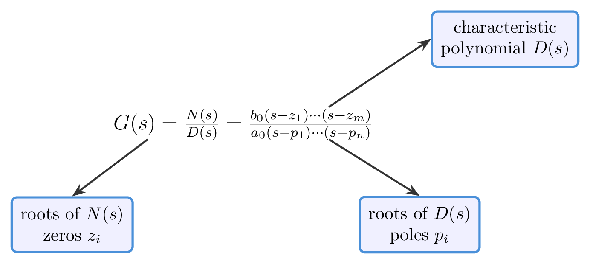
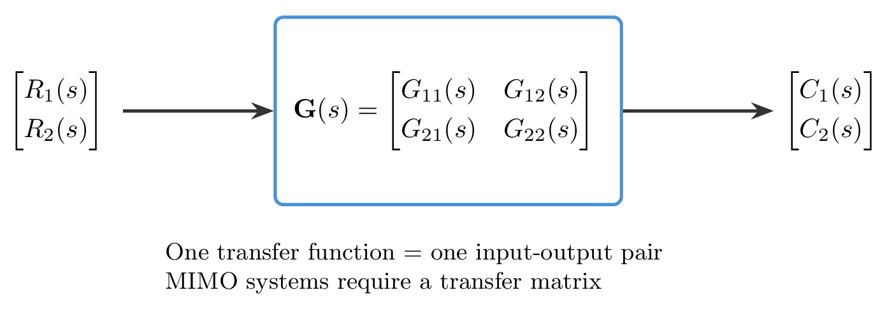
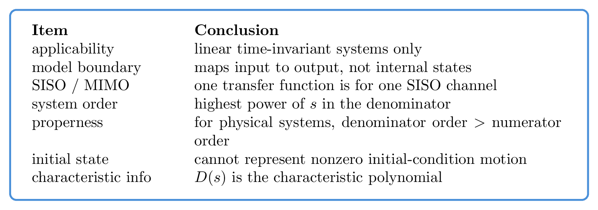
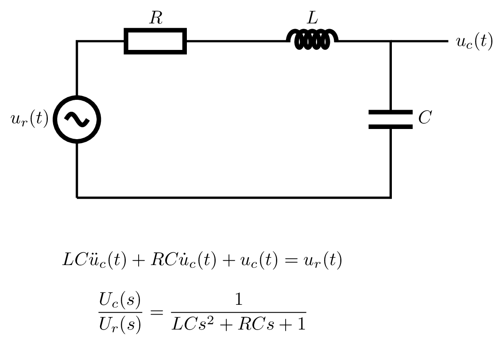
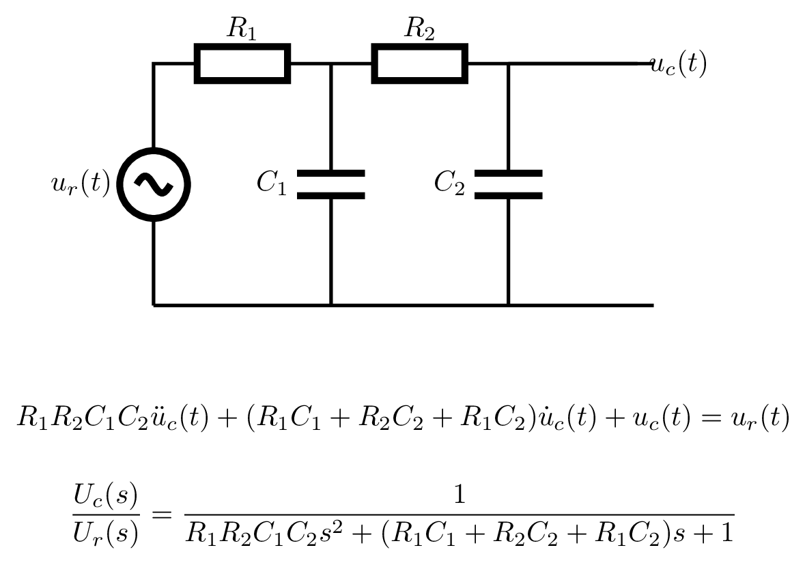
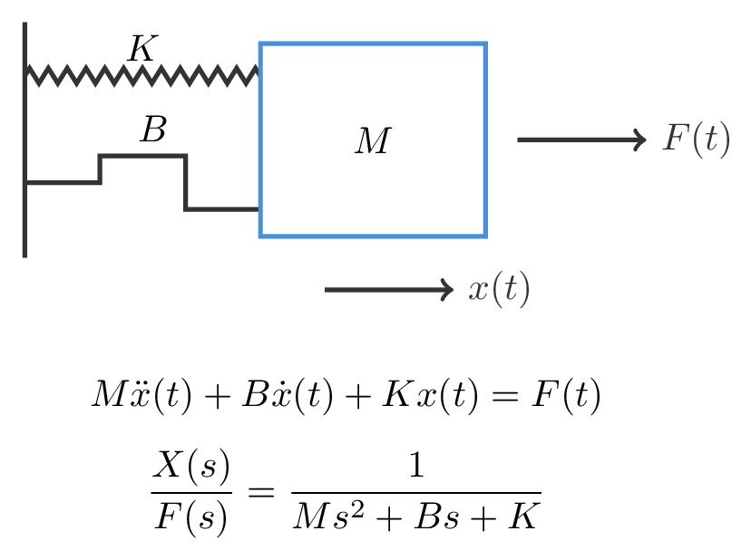
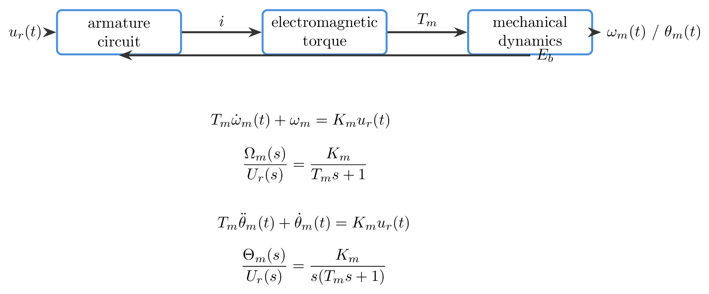
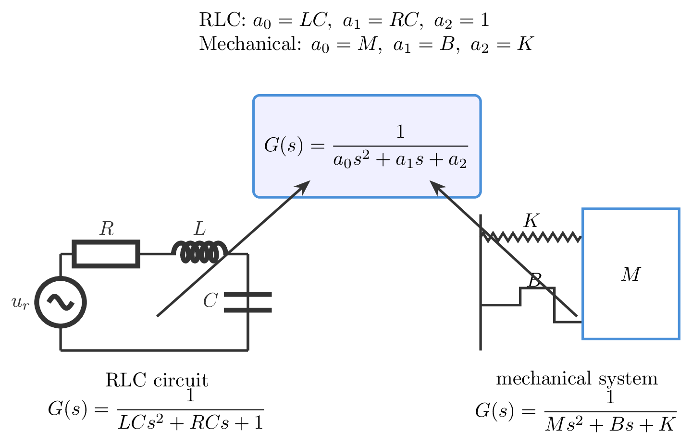

# `2.2传递函数_控制系统数学模型` 完整提取

## 1. 页面边界

- 原始文件：`course-content/slides-ref/2.2传递函数_控制系统数学模型.pptx`
- 总页数：28
- 正文范围：第 4-24 页
- 排除页面：
  - 第 1 页：封面
  - 第 2 页：课程目录
  - 第 3 页：学习目标
  - 第 25 页：课后思考
  - 第 26-27 页：课外拓展与预习
  - 第 28 页：结束页

## 2. 内容总览

| 原页号 | 主题 |
| --- | --- |
| 4-5 | 为什么需要传递函数、前测回顾 |
| 6-9 | 传递函数定义与由微分方程推导 |
| 10-15 | 零极点形式与基本性质 |
| 16-19 | 由微分方程求传递函数举例 |
| 20-21 | 典型环节与结构相似系统 |
| 22-23 | MATLAB 命令页 |
| 24 | 总结 |

## 3. 为什么需要传递函数（第 4-5 页）

第 4 页先给出一个动机判断：

- 时域分析能表征动态性能；
- 但如果每次参数变化都重新列写和求解微分方程，分析和设计都很不方便；
- 因此经典控制需要一种更适合比较结构、讨论参数影响和连接设计方法的模型。

第 5 页用 RLC 电路微分方程做前测，实际作用不是再教一次建模，而是为“从微分方程走向传递函数”做铺垫。

这一段的稳定结论是：

> 传递函数不是替代物理建模，而是把时域微分方程转成更便于分析和设计的复数域模型。

## 4. 传递函数定义与由微分方程推导（第 6-9 页）

### 4.1 定义

第 6 页和第 9 页都在强调同一个定义：

> 零初始条件下，输出的拉氏变换与输入的拉氏变换之比，称为系统的传递函数。

写成标准形式为：

$$
G(s)=\frac{C(s)}{R(s)}
$$

其中：

- $R(s)$：输入信号的拉氏变换；
- $C(s)$：输出信号的拉氏变换；
- 零初始条件是定义成立的前提。

### 4.2 从微分方程到传递函数

第 7-8 页给出的基本套路是：

1. 先写线性定常微分方程的一般形式；
2. 在零初始条件下对两边取拉氏变换；
3. 把输出项整理到一边、输入项整理到另一边；
4. 最后得到 $C(s)/R(s)$ 的代数式。

若系统微分方程为：

$$
a_n c^{(n)}(t)+a_{n-1} c^{(n-1)}(t)+\cdots+a_0 c(t)
=
b_m r^{(m)}(t)+b_{m-1} r^{(m-1)}(t)+\cdots+b_0 r(t)
$$

则在零初始条件下取拉氏变换，可得：

$$
G(s)=\frac{C(s)}{R(s)}
=
\frac{b_m s^m+b_{m-1}s^{m-1}+\cdots+b_0}
{a_n s^n+a_{n-1}s^{n-1}+\cdots+a_0}
$$

这一段最值得保留的不是公式本身，而是“微分方程 $\rightarrow$ 拉氏变换 $\rightarrow$ 代数比值”的方法链。

## 5. 零极点形式与基本性质（第 10-15 页）

### 5.1 零极点形式

第 10 页把传递函数进一步写成零极点形式：

$$
G(s)=\frac{N(s)}{D(s)}
=
\frac{b_0(s-z_1)(s-z_2)\cdots(s-z_m)}
{a_0(s-p_1)(s-p_2)\cdots(s-p_n)}
$$

其中：

- $z_i$：传递函数的零点；
- $p_i$：传递函数的极点；
- $N(s)$、$D(s)$：分别是分子与分母多项式。

- `tikz/02-zero-pole-form.tex`
- 预览：`tikz/rendered/02-zero-pole-form.png`



### 5.2 传递函数与信号无关，但与输入输出位置有关

第 11-12 页反复强调：

- 传递函数与具体信号波形无关；
- 它只取决于系统结构与参数；
- 但同一个物理对象，如果输入点和输出点选取不同，对应的传递函数可以不同。

这页原课件又借多输入多输出系统说明了一个边界：

- 单个传递函数只描述单输入单输出关系；
- 对 MIMO 系统，应使用传递函数矩阵。

- `tikz/01-mimo-transfer-matrix.tex`
- 预览：`tikz/rendered/01-mimo-transfer-matrix.png`



### 5.3 传递函数的几条稳定性质

第 13-15 页可以重组为下面几条稳定结论：

1. 传递函数只反映输入输出关系，不直接反映系统内部状态变量。
2. 传递函数仅适用于线性定常系统。
3. 对通常物理系统，分母阶次大于分子阶次，即 $n>m$。
4. 分母中 $s$ 的最高阶次就是系统阶次。
5. 传递函数不能反映非零初始条件下的自由运动。
6. 分母多项式 $D(s)$ 是特征多项式，对应特征方程 $D(s)=0$，其根为特征根。
7. 传递函数的极点是分母多项式的根，零点是分子多项式的根。

这些性质可以压缩为一张“使用边界速查卡”：

- `tikz/03-transfer-function-properties.tex`
- 预览：`tikz/rendered/03-transfer-function-properties.png`



## 6. 由微分方程求传递函数举例（第 16-19 页）

### 6.1 RLC 电路（第 16 页）

原课件给出的标准式为：

$$
LC\frac{d^2u_c(t)}{dt^2}+RC\frac{du_c(t)}{dt}+u_c(t)=u_r(t)
$$

对应传递函数：

$$
\frac{U_c(s)}{U_r(s)}=\frac{1}{LCs^2+RCs+1}
$$

- `tikz/04-rlc-transfer-example.tex`
- 预览：`tikz/rendered/04-rlc-transfer-example.png`



### 6.2 含负载效应的电路（第 17 页）

第 17 页把简单 RLC 推广到含负载效应的电路，给出的标准式为：

$$
R_1R_2C_1C_2\frac{d^2u_c(t)}{dt^2}
+
(R_1C_1+R_2C_2+R_1C_2)\frac{du_c(t)}{dt}
+
u_c(t)=u_r(t)
$$

对应传递函数：

$$
\frac{U_c(s)}{U_r(s)}
=
\frac{1}
{R_1R_2C_1C_2s^2+(R_1C_1+R_2C_2+R_1C_2)s+1}
$$

这页的教学价值在于：

- 结构一复杂，系数会更长；
- 但“列微分方程 $\rightarrow$ 拉氏变换 $\rightarrow$ 比值整理”的套路不变。

- `tikz/05-loaded-circuit-transfer-example.tex`
- 预览：`tikz/rendered/05-loaded-circuit-transfer-example.png`



### 6.3 质量-阻尼-弹簧系统（第 18 页）

第 18 页给出的微分方程与传递函数分别为：

$$
M\frac{d^2x(t)}{dt^2}+B\frac{dx(t)}{dt}+Kx(t)=F(t)
$$

$$
\frac{X(s)}{F(s)}=\frac{1}{Ms^2+Bs+K}
$$

它和前面的 RLC 电路看起来属于不同学科，但形式完全平行。

- `tikz/06-mass-spring-transfer-example.tex`
- 预览：`tikz/rendered/06-mass-spring-transfer-example.png`



### 6.4 电动机系统（第 19 页）

第 19 页同时给出转速模型与转角模型：

速度模型：

$$
T_m\frac{d\omega_m(t)}{dt}+\omega_m=K_m u_r(t)
$$

$$
\frac{\Omega_m(s)}{U_r(s)}=\frac{K_m}{T_ms+1}
$$

位置模型：

$$
T_m\frac{d^2\theta_m(t)}{dt^2}+\frac{d\theta_m(t)}{dt}=K_m u_r(t)
$$

$$
\frac{\Theta_m(s)}{U_r(s)}=\frac{K_m}{s(T_ms+1)}
$$

这页最重要的教学点是：

- 同一个对象因输出变量不同，会得到不同传递函数；
- 转速输出通常是一阶惯性环节；
- 转角输出则在此基础上多了一个积分因子。

- `tikz/07-motor-transfer-example.tex`
- 预览：`tikz/rendered/07-motor-transfer-example.png`



## 7. 典型环节与结构相似系统（第 20-21 页）

### 7.1 典型环节的含义

第 20 页强调三件事：

1. 任一传递函数都可以看作若干典型环节的组合。
2. 不同的物理元部件可能有相同形式的传递函数。
3. 同一个物理部件因输入输出选取不同，也可能得到不同的传递函数。

因此“环节”这个概念，不是按元件名字分类，而是按传递函数形式分类。

课件第 24 页回顾时点名了五类典型环节：

- 比例环节
- 积分环节
- 微分环节
- 惯性环节
- 振荡环节

### 7.2 结构相似系统

第 21 页是整讲最值得复用的一页。它把 RLC 电路和质量-阻尼-弹簧系统放到同一个模板下：

$$
G(s)=\frac{1}{a_0 s^2 + a_1 s + a_2}
$$

在这一模板中：

- RLC 电路对应 $a_0=LC,\ a_1=RC,\ a_2=1$；
- 机械系统对应 $a_0=M,\ a_1=B,\ a_2=K$。

这页传递的课程思想是：

> 传递函数的价值，不只是把微分方程写短，而是把跨学科对象抽象到统一结构中，便于识别、比较和迁移分析方法。

- `tikz/08-structural-similarity.tex`
- 预览：`tikz/rendered/08-structural-similarity.png`



## 8. MATLAB 命令页（第 22-23 页）

第 22-23 页的内容可压缩为两类常用写法。

### 8.1 `tf` 写法

```matlab
s = tf('s');
G1 = 10;
G2 = 1/s;
G3 = s;
G4 = 1/(s+1);
G5 = 1/(s^2+s+1);
```

或显式写成分子分母系数：

```matlab
G1 = tf(10,1);
G2 = tf(1,[1,0]);
G3 = tf([1,0],1);
G4 = tf(1,[1,1]);
G5 = tf(1,[1,1,1]);
```

### 8.2 `zpk` 写法

```matlab
G1 = zpk([],[],10);
G2 = zpk([],0,1);
G3 = zpk(0,[],1);
G4 = zpk([],-1,1);
G5 = zpk([],[-0.5+0.866i,-0.5-0.866i],1);
```

这一段不是本讲主线，但对后续课件制作和代码验证很有用，因为它把“典型环节”直接映射到可执行对象。

## 9. 总结（第 24 页）

第 24 页可重组为以下结论：

1. 传递函数定义：零初始条件下输出拉氏变换与输入拉氏变换之比。
2. 零点与极点：分别是分子和分母多项式的根。
3. 典型环节：比例、积分、微分、惯性、振荡。
4. 结构相似：不同学科对象可能共享同一种传递函数形式。
5. 课程思想：传递函数表达了系统的某些本质特征，帮助我们寻找共性。

一句话压缩：

> 传递函数把“求解某个具体微分方程”的问题，提升为“识别系统结构、零极点与典型环节”的问题，因此更适合经典控制分析与设计。

## 10. 对当前课程制作最有参考价值的可复用单元

1. 传递函数的定义必须始终带着“零初始条件”。
2. 从微分方程推到传递函数的四步法：写方程、取拉氏、零初值、整理比值。
3. 传递函数只适用于 SISO 关系，MIMO 应改用传递函数矩阵。
4. 系统阶次、特征多项式、特征根、零点、极点之间的对应关系。
5. RLC、带负载电路、机械系统和电机系统的跨领域平行案例。
6. “结构相似系统”页可直接作为后续二阶系统、频域标准对象和模型识别的桥梁。
