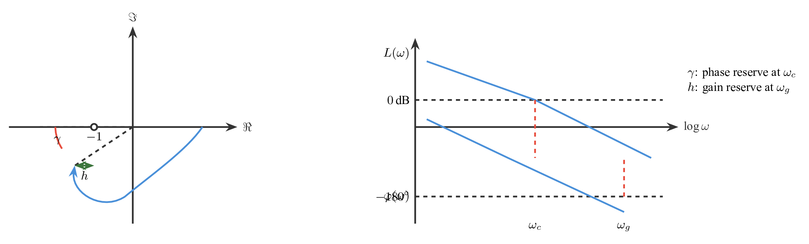
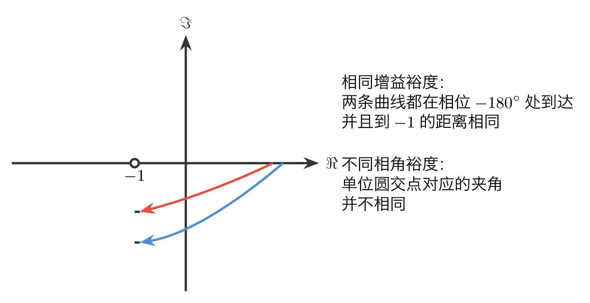
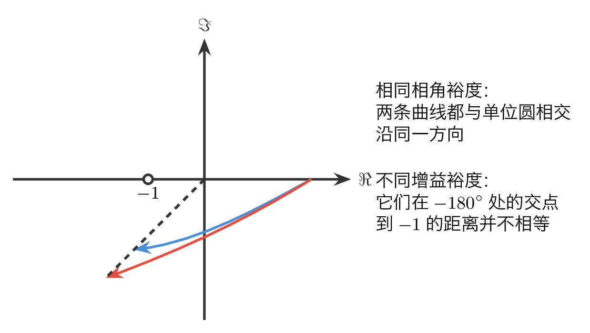
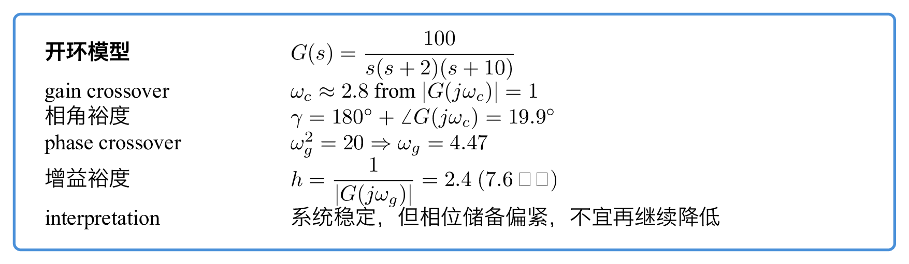
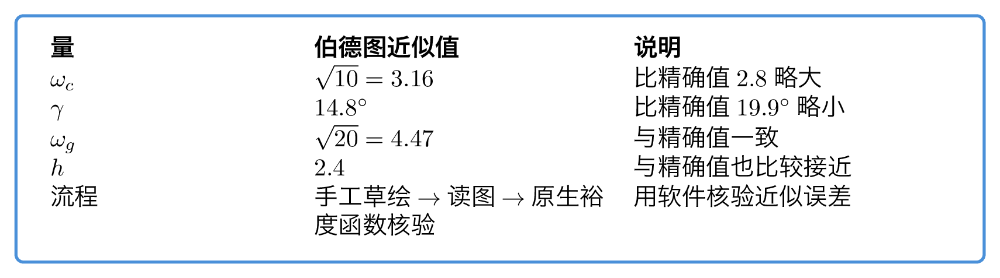

# `20宽备窄用_稳定裕度` 完整提取

## 1. 页面边界

- 原始文件：`course-content/slides-ref/20宽备窄用_稳定裕度.pptx`
- 总页数：25
- 正文范围：第 6-22 页
- 排除页面：
  - 第 1 页：封面
  - 第 2 页：全课程目录
  - 第 3 页：学习目标
  - 第 4-5 页：课堂导入对话页
  - 第 23-24 页：课外拓展及预习要求
  - 第 25 页：结束页

## 2. 内容总览

| 原页号 | 主题 |
| --- | --- |
| 6 | 稳定裕度在频域性能指标中的位置 |
| 7-15 | 相角裕度、幅值裕度及其几何与物理意义 |
| 16-18 | 主算例的解析计算 |
| 19 | 伯德图近似估计 |
| 20 | `margin` 代码验证 |
| 21-22 | 总结与课后思考 |

## 3. 本讲关心的是“离失稳还有多远”（第 6 页）

第 6 页先把“稳定”与“稳定裕度”区分开：

- 在时域里，稳定边界通常看虚轴位置或阻尼比；
- 在频域里，稳定边界对应 `(-1,j0)` 附近的危险程度；
- 因此稳定裕度不是“稳 / 不稳”的二值结论，而是“还有多少稳定储备量”的连续指标。

课件把这个频域性能指标拆成两部分：

- 相角裕度 `\gamma`
- 幅值裕度 `h`

并给出两个关键频率：

- 截止频率（单位增益穿越频率）` \omega_c `，满足 `|G(j\omega_c)|=1`
- 穿越频率（相位穿越频率）` \omega_g `，满足 `\angle G(j\omega_g)=-180^\circ`

对应的重建图如下：

- `tikz/01-margin-definition.tex`
- 预览：`tikz/rendered/01-margin-definition.png`



## 4. 两种裕度到底在看什么（第 7-15 页）

课件在第 7-15 页反复做两组对比，目的不是换图，而是澄清两类裕度的区别。

### 4.1 相同幅值裕度，不代表相同相角裕度

如果两条幅相曲线在相位到达 `-180^\circ` 时幅值相同，那么它们的幅值裕度相同；但若它们穿过单位圆时的相位不同，则相角裕度不同。

换成 伯德图语言就是：

- 当相频曲线到达 `-180^\circ` 时，幅频曲线离 `0\,\mathrm{dB}` 的距离相同，则 `h` 相同；
- 但幅频曲线穿过 `0\,\mathrm{dB}` 时，相频曲线离 `-180^\circ` 的距离可能不同，因此 `\gamma` 不同。

### 4.2 相同相角裕度，不代表相同幅值裕度

反过来，如果两条曲线穿过单位圆时相角相同，那么它们的相角裕度相同；但若它们到达 `-180^\circ` 时的幅值不同，则幅值裕度不同。

这说明：

- 相角裕度回答的是“增益正好到 1 时，相位还剩多少”；
- 幅值裕度回答的是“相位已经到反相时，增益还剩多少”；
- 两者都重要，但它们记录的是不同维度的稳定储备。

对应的重建图如下：

- `tikz/02-same-gm-different-pm.tex`
- 预览：`tikz/rendered/02-same-gm-different-pm.png`



- `tikz/03-same-pm-different-gm.tex`
- 预览：`tikz/rendered/03-same-pm-different-gm.png`



## 5. 主算例：先精确算相角裕度（第 16 页）

课件给出的开环传递函数为：

$$
G(s)=\frac{100}{s(s+2)(s+10)}.
$$

先求截止频率 `\omega_c`，即满足 `|G(j\omega_c)|=1` 的频率。

课件最后给出的结果是：

$$
\omega_c \approx 2.8.
$$

于是相角裕度为：

$$
\gamma=180^\circ+\angle G(j\omega_c).
$$

代入 `\omega_c=2.8` 后：

$$
\gamma
=180^\circ-90^\circ-\arctan \frac{2.8}{2}-\arctan \frac{2.8}{10}
=19.9^\circ.
$$

这说明该系统虽然闭环可稳定，但相角储备并不充足。

## 6. 主算例：再精确算幅值裕度（第 17-18 页）

求幅值裕度时，先找穿越频率 `\omega_g`，即满足

$$
\angle G(j\omega_g)=-180^\circ
$$

的频率。

课件采用两种做法：

1. 由相角条件写成

$$
-90^\circ-\arctan \frac{\omega_g}{2}-\arctan \frac{\omega_g}{10}=-180^\circ,
$$

进而得到

$$
\arctan \frac{\omega_g}{2}+\arctan \frac{\omega_g}{10}=90^\circ
\Rightarrow \omega_g^2=20
\Rightarrow \omega_g=4.47.
$$

2. 或把 `G(j\omega)` 写成实部与虚部，令虚部为零，也能得到同样结果。

随后由

$$
h=\frac{1}{|G(j\omega_g)|}
$$

计算幅值裕度，课件给出的结果是：

$$
h=2.4 \quad (7.6\ \mathrm{dB}).
$$

这说明把开环增益再放大约 `2.4` 倍，系统才会走到稳定边界附近。

对应的重建图如下：

- `tikz/04-example-computation-card.tex`
- 预览：`tikz/rendered/04-example-computation-card.png`



## 7. 伯德图近似：为什么手算会有误差（第 19 页）

第 19 页把同一个例题改用 伯德图近似读取。

课件给出的近似结论是：

- `\omega_c \approx \sqrt{10}=3.16`
- `\omega_g= \sqrt{20}=4.47`
- `h=2.4`
- `\gamma \approx 14.8^\circ`

与精确结果相比：

- 幅值裕度几乎一致；
- 截止频率偏大；
- 相角裕度从 `19.9^\circ` 低估为 `14.8^\circ`。

这说明：

- 伯德 近似在找相位穿越频率、估算幅值裕度时往往更稳；
- 在估计截止频率和相角裕度时，折线近似会引入明显误差；
- 因而稳定裕度的手算很适合先“粗估”，再用软件核验。

对应的重建图如下：

- `tikz/05-bode-estimate-card.tex`
- 预览：`tikz/rendered/05-bode-estimate-card.png`



## 8. 计算机辅助验证（第 20 页）

第 20 页把全部结论压缩成一行 数值软件 命令：

```matlab
G = zpk([], [0, -2, -10], 100);
margin(G)
```

这里要学生形成的习惯很明确：

1. 先会从定义出发手工定位 `\omega_c`、`\omega_g`、`\gamma`、`h`；
2. 再用软件函数一次性验证；
3. 若近似图和软件结果有差异，要能解释差异来自折线近似，而不是把软件当黑箱。

## 9. 总结与课后思考（第 21-22 页）

第 21 页的总结可以浓缩为 4 条：

1. 稳定裕度是系统在幅值和相角两个方向上的稳定储备量；
2. 相角裕度在截止频率处读取，衡量相位离 `-180^\circ` 还有多远；
3. 幅值裕度在穿越频率处读取，衡量幅值离 1 或 `0\,\mathrm{dB}` 还有多远；
4. 极坐标图和 伯德图只是两种不同的读取界面。

第 22 页的两个思考题，本质上都在把“频域几何量”拉回到时间响应：

- 若在单位增益处已经接近反相，时域上会出现怎样的振荡趋势；
- 若相位已经反相而增益又接近 1，输出为什么会极易被放大并逼近失稳。

这说明本讲的频域指标并不是抽象数字，而是时域现象的前兆。

## 10. 本讲可直接复用的教学主线

这份课件最值得沉淀的是下面这条频域读图链：

1. 先在奈奎斯特图或 伯德图上找到两类关键穿越频率；
2. 再用这两个频率分别读取相角裕度与幅值裕度；
3. 再判断“同一裕度不同另一裕度”的边界，防止把两个指标混为一谈；
4. 最后用近似读取加软件验证，形成“手算估计 + 数值复核”的标准流程。

这条链路直接连接后续的稳定裕度设计、三频段分析和频域校正。
