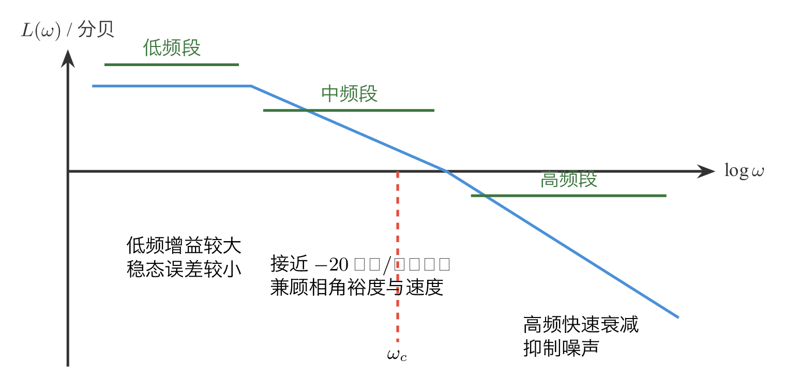
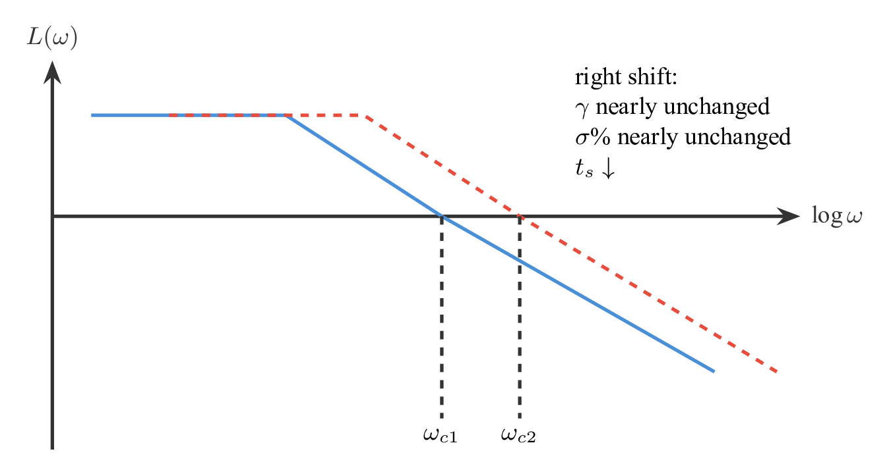
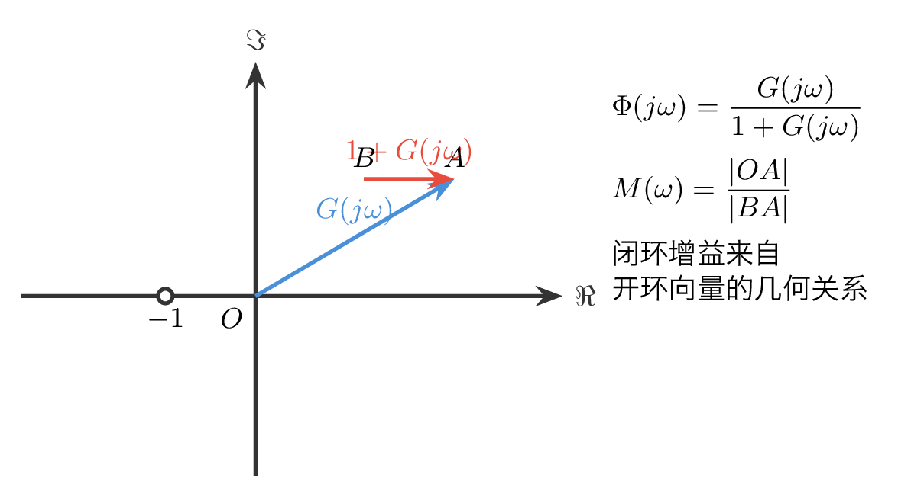

# `21三频段_各司其职` 完整提取

## 1. 页面边界

- 原始文件：`course-content/slides-ref/21三频段_各司其职.pptx`
- 总页数：39
- 正文范围：第 4-36 页
- 排除页面：
  - 第 1 页：封面
  - 第 2 页：全课程目录
  - 第 3 页：学习目标
  - 第 37-38 页：课外拓展及预习要求
  - 第 39 页：结束页

## 2. 内容总览

| 原页号 | 主题 |
| --- | --- |
| 4 | 三频段理论总图 |
| 5-18 | 用开环频率特性分析系统性能 |
| 19-20 | 三频段理论的原则与边界 |
| 21-26 | 闭环频率特性、向量法、`M` 圆与尼克尔斯图 |
| 27-31 | 闭环频率特征量与动态性能估算 |
| 32-36 | 小结、复习桥页与课后思考 |

## 3. 三频段理论到底在分什么工（第 4、19-20 页）

第 4 页先给出全讲总图，把开环对数幅频特性分成 3 段：

- 低频段：通常在最小转折频率之前，主要决定稳态误差；
- 中频段：围绕截止频率 `\omega_c`，主要决定相角裕度和动态性能；
- 高频段：通常在 `10\omega_c` 以上，主要决定抗高频噪声和高频干扰能力。

课件给出的设计直觉是：

- 低频段希望“高且陡”，这样低频增益大、稳态误差小；
- 中频段希望以 `-20\,\mathrm{分贝/十倍频程}` 斜率穿越 `0\,\mathrm{分贝}`，并保持较宽频带，以兼顾较大的相角裕度；
- 高频段希望“尽快压低”，这样闭环对象不容易放大高频噪声。

后面的第 19-20 页又补了 4 个重要边界：

1. 三频段分界线没有绝对标准；
2. 这里的“低中高频”不是无线电中的频段划分；
3. 不能仅凭“是否以 `-20\,\mathrm{分贝/十倍频程}` 过 `0\,\mathrm{分贝}`”机械判稳；
4. 这套经验规则主要适用于单位反馈最小相角系统。

对应的重建图如下：

- `tikz/01-three-band-overview.tex`
- 预览：`tikz/rendered/01-three-band-overview.png`

## 4. 用开环频率特性估计时域性能：二阶入口（第 5-11 页）

第 5-11 页的核心是把二阶系统里的几个熟悉量连起来：

- 截止频率 `\omega_c`
- 相角裕度 `\gamma`
- 阻尼比 `\zeta`
- 超调量 `\sigma\%`
- 调节时间 `t_s`

课件给出的关键逻辑是：

1. 对典型二阶或主导二阶系统，可由开环幅频曲线先读出 `\omega_c`；
2. 在 `\omega_c` 处读取相角裕度 `\gamma`；
3. 再利用 `\gamma \leftrightarrow \zeta \leftrightarrow \sigma\%` 的图表关系，把频域信息映射回时域指标；
4. 若相角裕度基本不变，则截止频率越大，调节时间通常越短。

第 7-11 页用具体例题展示了这一流程：

- 先从 `L(\omega)` 曲线估计 `\omega_c`；
- 再算 `\gamma`；
- 再查图得 `\zeta` 和超调量；
- 最后估计 `t_s`，并与时域精确模型做对照。

这说明三频段理论不是“只看形状”，而是能把开环频域直接连到闭环时间响应。

对应的重建图如下：

- `tikz/02-open-loop-to-time-domain.tex`
- 预览：`tikz/rendered/02-open-loop-to-time-domain.png`

## 5. 高阶系统仍然可以用“中频段”快速判断（第 12-15 页）

第 12-15 页把方法从低阶例子推向高阶系统。

课件保留的核心经验是：

- 对高阶系统，仍然希望中频段以 `-20\,\mathrm{分贝/十倍频程}` 穿越 `0\,\mathrm{分贝}`；
- 保持足够的相角裕度，可以控制超调量；
- 在相角裕度大致固定时，适当提高截止频率可以缩短调节时间。

这部分最重要的不是某一个具体数字，而是方法边界：

- 这里本质上依赖“主导频段”和“主导动态”思想；
- 对高阶系统，这种读图法是估算，不是严格等式；
- 因而课件专门给出软件验证，并追问“为什么仿真的差距这么大”，提醒学生不能把经验图表当成严格公式。

对应的重建图如下：

- `tikz/03-high-order-guideline-card.tex`
- 预览：`tikz/rendered/03-high-order-guideline-card.png`

## 6. 把开环幅频曲线整体右移，会发生什么（第 16-18 页）

第 16-18 页给出一个很有设计意味的问题：

> 如果把 `L(\omega)` 整体向右平移一个十倍频程，系统会怎样变化？

课件给出的结论是：

- 若平移不改变相角裕度，则阻尼比与超调量基本不变；
- 但截止频率增大，因此调节时间减小；
- 也就是说，系统响应会更快，但振荡程度未必明显改变。

这恰好把三频段理论讲活了：

- 中频段的“横向位置”决定快慢；
- 中频段在 `0\,\mathrm{dB}` 附近的“斜率与相位关系”决定阻尼和超调。

对应的重建图如下：

- `tikz/04-shift-right-effect.tex`
- 预览：`tikz/rendered/04-shift-right-effect.png`

## 7. 为什么还要研究闭环频率特性（第 21-26 页）

第 21-26 页给出一个重要转折：

- 开环频率特性适合分析设计趋势；
- 但在工程实验中，闭环频率特性更容易直接测得；
- 而且闭环频率特性的某些特征量，如谐振峰值、带宽频率，在实际系统测试里非常常用。

课件于是引入向量法：

$$
\Phi(j\omega)=\frac{G(j\omega)}{1+G(j\omega)}.
$$

把开环向量 `G(j\omega)` 与 `1+G(j\omega)` 放在复平面里，可以直接得到：

- 闭环幅值 `M(\omega)=|\Phi(j\omega)|`
- 闭环相角 `\phi(\omega)=\angle \Phi(j\omega)`

继续整理后，课件得到“等 `M` 圆”轨迹，并说明把这些等值曲线映射到对数幅相图上，就会得到尼克尔斯图。

这一步意味着：

- 开环曲线不仅能判稳、算裕度；
- 还可以通过几何关系直接估计闭环放大倍数。

对应的重建图如下：

- `tikz/05-closed-loop-vector-method.tex`
- 预览：`tikz/rendered/05-closed-loop-vector-method.png`

## 8. 闭环频率特征量如何反推动态性能（第 27-31 页）

第 27-31 页把视角彻底转向闭环：

- 零频值：反映低频跟随能力；
- 谐振频率 `\omega_r` 与谐振峰值 `M_r`：反映闭环共振倾向；
- 带宽频率：反映系统可有效通过的频率范围。

对二阶欠阻尼系统，课件说明：

- 可以由 `M_r`、带宽频率等特征量反推阻尼比和自然频率；
- 再进一步估算超调量与调节时间；
- 对实验测得的闭环幅频曲线，也能用同样思路判断动态性能。

第 31 页的记录仪例题进一步强调：

- 当题目给出“某频率内振幅误差不超过多少”时，本质上是在给闭环频率特性设置带宽要求；
- 因而闭环频域指标可以直接服务于工程规格设计。

对应的重建图如下：

- `tikz/06-closed-loop-spec-card.tex`
- 预览：`tikz/rendered/06-closed-loop-spec-card.png`

## 9. 本讲结尾在做什么（第 32-36 页）

第 32-33 页起到承前启后的作用：

- 第 32 页回顾了实验测试、闭环频率特征量、奈奎斯特判据、对数判据与稳定裕度，说明这些内容并不是割裂的章节；
- 第 33 页再次用“稳定裕度”做桥接，强调三频段理论本质上是在做频域资源分配。

第 34-36 页的课后思考则把抽象频率观念拉回到具体信号：

- 惯性系统对不同频率成分的响应不同；
- 方波可以看作一组奇次谐波叠加；
- 高频谐波更容易被系统衰减，因此输出波形会被“平滑化”。

这实际上是在帮学生把“高频段抑制噪声”的说法，转成可感知的时域现象。

## 10. 本讲可直接复用的教学主线

这份课件最值得沉淀的是下面这条频域分析链：

1. 先用三频段理论理解开环频率特性的功能分工；
2. 再用截止频率和相角裕度估算闭环时域性能；
3. 再理解横向平移、斜率变化对快慢与阻尼的不同影响；
4. 最后用闭环频率特征量把实验数据重新映射回动态性能和工程指标。

这条链路直接连接后续的频域校正设计和性能指标配置。
