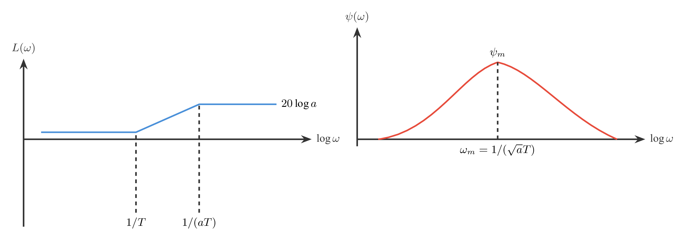
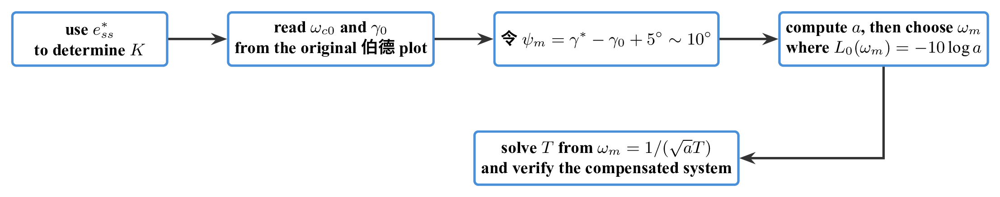
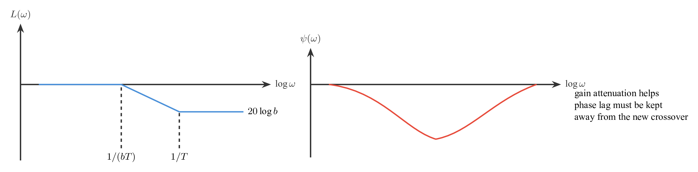
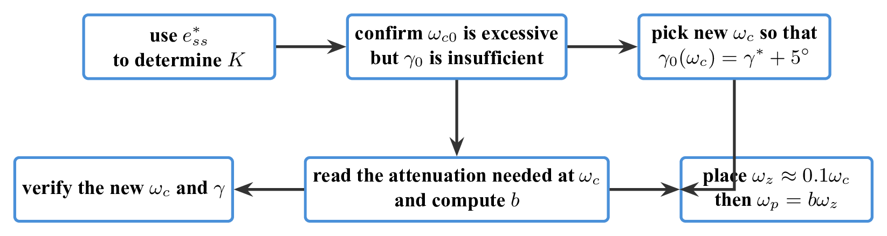
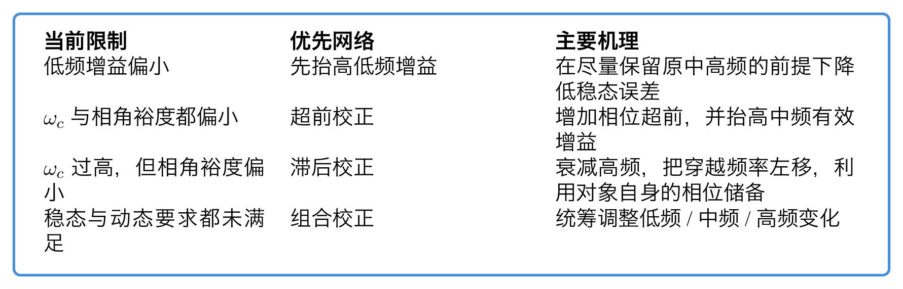

# `22串联校正` 完整提取

## 1. 页面边界

- 原始文件：`course-content/slides-ref/22串联校正.pptx`
- 总页数：30
- 正文范围：第 6-23 页
- 排除页面：
  - 第 1 页：封面
  - 第 2 页：全课程目录
  - 第 3 页：学习目标
  - 第 4-5 页：课堂导入对话页
  - 第 24-27 页：与本讲主题不一致的遗留总结/思考页
  - 第 28-29 页：课外拓展及预习要求
  - 第 30 页：结束页

## 2. 内容总览

| 原页号 | 主题 |
| --- | --- |
| 6-8 | 性能目标与频段改造方向 |
| 9-12 | 超前网络特性 |
| 13-15 | 超前校正步骤与例题 |
| 17-18 | 滞后网络特性 |
| 19-23 | 滞后校正步骤与例题 |

## 3. 为什么要做串联校正（第 6-8 页）

第 6-8 页先不讲网络形式，而是先讲控制目标和频段分工。

课件把性能指标分成两类：

- 时域：超调量、调节时间、稳态误差；
- 频域：截止频率、稳定裕度、谐振峰值、带宽频率。

然后用 3 类系统状态说明为什么必须改频率特性：

1. 暂态响应好，但稳态误差大：
   说明低频增益不够，需要提高低频段；
2. 稳态误差小，但动态性能差：
   说明中高频段配置不理想，需要改变截止频率和相角裕度；
3. 稳态暂态都不满意：
   说明低中高频段都需要重新分配。

这里已经把后面两类校正网络的职责说清楚了：

- 超前校正主要管中高频；
- 滞后校正主要用来利用原有相角储备，通过幅值衰减重置截止频率；
- 若两类问题同时存在，就要做组合校正。

对应的重建图如下：

- `tikz/01-performance-to-frequency-actions.tex`
- 预览：`tikz/rendered/01-performance-to-frequency-actions.png`

## 4. 超前网络在频域里做了什么（第 9-12 页）

课件给出的一级超前网络可以写成：

$$
G_c(s)=\frac{aTs+1}{Ts+1}, \qquad a>1.
$$

其核心频域特征有 3 个：

1. 幅值在中高频抬升，最大抬升量与 `a` 有关；
2. 相位在一段频带内超前，最大超前角出现在

$$
\omega_m=\frac{1}{\sqrt{a}\,T};
$$

3. 最大超前角与 `a` 的关系为

$$
\psi_m=\arcsin \frac{a-1}{a+1},
\qquad
a=\frac{1+\sin\psi_m}{1-\sin\psi_m}.
$$

课件特别强调：

- 超前网络是“相角超前，幅值增加”；
- 一级超前网络最大超前角通常不超过 `60^\circ`；
- 最有效的设计区间常取 `a\in[4,10]`。

也就是说，超前网络不是无限制地“补角”，而是在一个有限频段里用适度的幅值抬升换取相角裕度。

对应的重建图如下：

- `tikz/02-lead-network-bode.tex`
- 预览：`tikz/rendered/02-lead-network-bode.png`

## 5. 超前校正怎么设计（第 13-15 页）

第 13-15 页把超前校正流程标准化了。

课件的设计逻辑是：

1. 由稳态误差指标先确定开环增益 `K`；
2. 用原系统 `G_0(s)` 画 伯德图，读出当前截止频率和相角裕度；
3. 若 `\omega_c` 和 `\gamma` 都不足，则需要超前校正；
4. 设所需最大超前角

$$
\psi_m=\gamma^\ast-\gamma_0+5^\circ\sim 10^\circ;
$$

5. 由 `\psi_m` 算出 `a`，再在原系统幅频曲线上找到 `L_0(\omega_m)=-10\log a` 所对应的频率；
6. 令新的截止频率近似落在 `\omega_m` 附近，反算 `T`，得到控制器。

例 1 中，课件给出的代表性结果是：

- 原系统相角裕度只有约 `7.2^\circ`；
- 目标要求 `\gamma^\ast\ge 45^\circ`；
- 由此得到设计超前角约 `42.8^\circ`；
- 算得 `a=5.24`，并选 `\omega_c \approx \omega_m = 60\,\mathrm{rad/s}`；
- 最终验算得到 `\gamma \approx 47.56^\circ`，满足要求。

对应的重建图如下：

- `tikz/03-lead-design-flow.tex`
- 预览：`tikz/rendered/03-lead-design-flow.png`

## 6. 滞后网络在频域里做了什么（第 17-18 页）

课件后半段转向一级滞后网络，可写成：

$$
G_c(s)=\frac{bTs+1}{Ts+1}, \qquad 0<b<1.
$$

它的频域作用和超前网络恰好相反：

- 高频幅值衰减；
- 截止频率左移变小；
- 由此可能提高系统相角裕度；
- 但同时引入相位滞后，因此这一部分是不利因素，必须控制。

课件给出的适用场景非常清晰：

> 当原系统截止频率有余，但相角裕度不足时，适合用滞后校正。

并特别强调两个经验：

1. 滞后引入的相位损失需要预留 `5^\circ\sim 12^\circ` 的附加角；
2. 应让网络的相位滞后主要发生在较低频段，一般取

$$
\omega_z=\frac{1}{bT}=0.1\sim 0.2\,\omega_c.
$$

对应的重建图如下：

- `tikz/04-lag-network-bode.tex`
- 预览：`tikz/rendered/04-lag-network-bode.png`

## 7. 滞后校正怎么设计（第 19-23 页）

第 19-23 页给出滞后校正的标准流程。

其设计思想与超前校正不同，不是主动加相角，而是：

> 利用滞后网络的幅值衰减特性，挖掘系统自身已有的相角储备。

课件步骤可以整理为：

1. 由稳态误差指标确定 `K`；
2. 画原系统 伯德图，确认当前 `\omega_{c0}` 有余，但 `\gamma_0` 不足；
3. 在原系统相频曲线上找到满足

$$
\gamma_0(\omega_c)=\gamma^\ast+5^\circ
$$

的目标截止频率；
4. 读取此频率处原系统所需降低的幅值，进而确定 `b`；
5. 令滞后网络零点远离新截止频率，一般取 `\omega_z=0.1\,\omega_c`；
6. 由 `\omega_p=b\omega_z` 得到网络参数并验算。

例 2 中的代表性结论是：

- 原系统相角裕度仍只有约 `7.2^\circ`；
- 目标要求 `\gamma^\ast \ge 45^\circ`；
- 由原系统图上找到新的 `\omega_c \approx 4.05\,\mathrm{rad/s}`；
- 所需衰减约 `38\,\mathrm{dB}`，因此 `b\approx 0.0165`；
- 最终验算得到 `\gamma \approx 45.3^\circ`，满足要求。

例 3 和例 4 进一步说明：

- 滞后校正也可以叠加更多约束，例如静差和幅值裕度；
- 当要求同时包含稳态误差、相角裕度和幅值裕度时，单一网络设计会变得更复杂。

对应的重建图如下：

- `tikz/05-lag-design-flow.tex`
- 预览：`tikz/rendered/05-lag-design-flow.png`

## 8. 本讲最值得记住的选型判断

把整讲压缩后，其实就是下面这张判断表：

- 若系统主要是低频增益不足，先想办法提高低频段；
- 若系统主要是截止频率不足、相角裕度也不足，优先考虑超前校正；
- 若系统截止频率偏高而相角裕度不够，可用滞后校正把截止频率左移；
- 若稳态和动态都不满意，通常不能只靠单一网络，需要组合校正。

对应的重建图如下：

- `tikz/06-series-compensation-choice-card.tex`
- 预览：`tikz/rendered/06-series-compensation-choice-card.png`

## 9. 本讲可直接复用的教学主线

这份课件最值得沉淀的是下面这条串联校正主线：

1. 先根据稳态误差、截止频率和相角裕度判断“问题出在哪一段频率”；
2. 再决定该用超前网络还是滞后网络；
3. 用 伯德图把目标频率、目标补角或目标衰减量转换成 `a`、`b`、`T` 等参数；
4. 最后回到补偿后系统上验算 `\omega_c`、`\gamma` 与稳态误差是否满足要求。

这条链路正是后续“滞后-超前组合校正”的直接前置。
