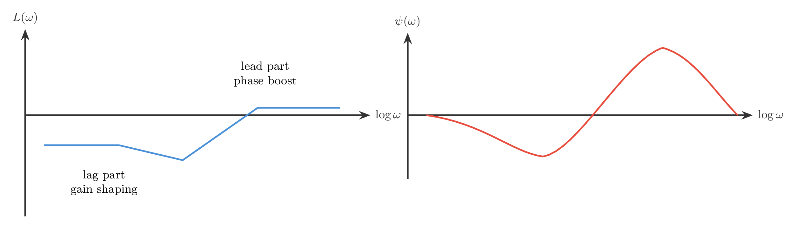
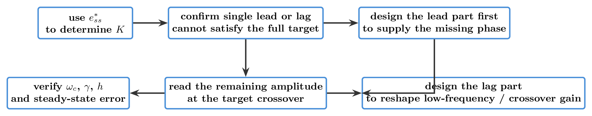
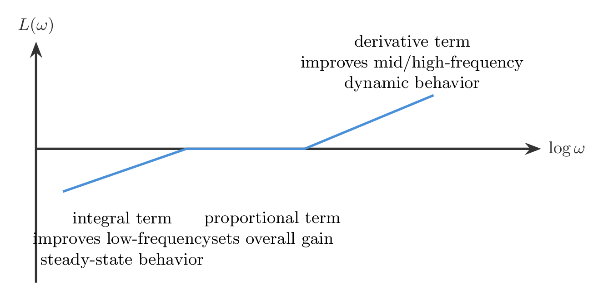
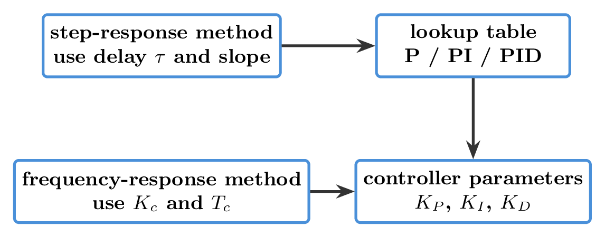
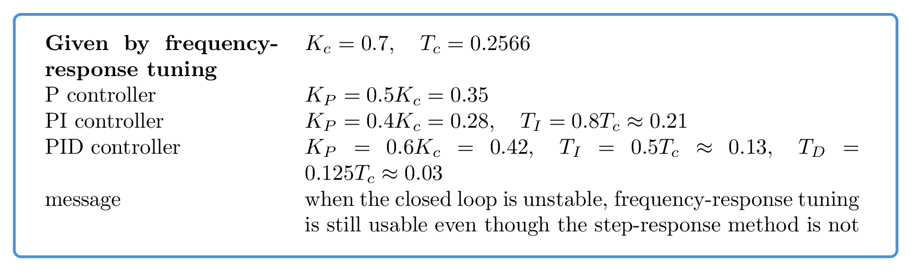

# `23滞后超前` 完整提取

## 1. 页面边界

- 原始文件：`course-content/slides-ref/23滞后超前.pptx`
- 总页数：26
- 正文范围：第 6-19 页
- 排除页面：
  - 第 1 页：封面
  - 第 2 页：全课程目录
  - 第 3 页：学习目标
  - 第 4-5 页：课堂导入对话页
  - 第 20-23 页：与本讲主题不一致的遗留总结/思考页
  - 第 24-25 页：课外拓展及预习要求
  - 第 26 页：结束页

## 2. 内容总览

| 原页号 | 主题 |
| --- | --- |
| 6-10 | 滞后-超前网络特性、步骤与例题 |
| 12-13 | PID 调节器与滞后-超前校正的关系 |
| 14-19 | PID 整定方法与示例参数 |

## 3. 什么时候需要滞后-超前联合校正（第 6-7 页）

第 6-7 页先给出本讲最核心的适用条件：

> 当单独使用超前网络或单独使用滞后网络都无法达成设计目标时，需要采用滞后-超前联合校正。

课件把网络写成“低频滞后段 + 高频超前段”的串联形式，其设计意图是：

- 用滞后部分在低频段或较低交越频段附近做幅值重分配；
- 用超前部分在中频段提供相角超前；
- 最终同时兼顾稳态误差、截止频率、相角裕度甚至幅值裕度。

从频域上看，这个组合网络的特点是：

- 低频部分有衰减或幅值重塑效果；
- 中频到高频部分提供相角超前；
- 整体不是简单“加法”，而是把两个网络的优点叠加在不同频段上。

对应的重建图如下：

- `tikz/01-lead-lag-combined-shape.tex`
- 预览：`tikz/rendered/01-lead-lag-combined-shape.png`

## 4. 滞后-超前联合校正怎么做（第 8-10 页）

第 8-10 页把组合校正步骤标准化了。

课件给出的主线是：

1. 由稳态误差指标确定开环增益 `K`；
2. 对原系统 `G_0(s)` 画 Bode 图，确认单独超前或单独滞后都无效；
3. 由目标相角裕度与当前相角裕度差值确定所需最大超前角 `\psi_m`；
4. 先设计超前部分，确定 `a` 与对应频率位置；
5. 再看“加入超前后”系统在目标交越频率处的幅值是否仍需调整，由此决定滞后部分系数 `b`；
6. 最后把两段网络与原对象相乘，验算新的截止频率、相角裕度和幅值裕度。

也就是说，联合校正不是“先做一个滞后，再做一个超前”的机械串接，而是：

- 先让超前部分解决补角问题；
- 再用滞后部分修正幅值配置和低频性能；
- 两者围绕同一个设计目标联动。

例 1 中，课件给出的代表性结论包括：

- 目标要求同时包含 `K=100`、`\gamma^\ast=50^\circ`、`h^\ast \ge 10\,\mathrm{dB}`、`\omega_c=20`；
- 仅从原系统出发，当前相角裕度甚至为负；
- 由目标补角得到 `a\approx 6.75`；
- 再由超前后的系统在目标频率处的幅值决定 `b\approx 0.18`；
- 最终验算得到 `\gamma \approx 51.36^\circ`，满足要求。

对应的重建图如下：

- `tikz/02-lead-lag-design-flow.tex`
- 预览：`tikz/rendered/02-lead-lag-design-flow.png`

## 5. 为什么 PID 也能看作一种滞后-超前校正器（第 12-13 页）

第 12-13 页把视角从“专门设计的补偿网络”转向工程上更常见的 PID。

课件给出的连续形式是：

$$
u(t)=K_P e(t)+K_I \int_0^t e(\tau)\,d\tau + K_D \frac{de(t)}{dt}.
$$

对应传递函数为：

$$
G_c(s)=K_P+\frac{K_I}{s}+K_D s.
$$

这页真正想强调的不是公式本身，而是频域职责分解：

- 积分项改善低频性能，减小稳态误差；
- 微分项改善中高频动态特性，相当于提供超前作用；
- 比例项在中间起整体增益配置作用。

因此，PID 可以被理解为一种工程上极常用的“滞后-超前思想”的具体实现。

课件还特别提醒：

- 微分会放大高频噪声；
- 因而实际 PID 往往要再引入一个高频极点，而不是理想微分。

对应的重建图如下：

- `tikz/03-pid-as-lead-lag.tex`
- 预览：`tikz/rendered/03-pid-as-lead-lag.png`

## 6. PID 整定讲了哪两类方法（第 14-15 页）

第 14-15 页给出两类典型整定入口：

1. 阶跃响应法：
   - 从 S 形阶跃响应曲线中提取近似延迟时间 `\tau` 与斜率；
   - 再按经验表给出 P、PI、PID 的参数；
2. 频率响应法：
   - 先找到临界振荡增益 `K_c` 与临界振荡周期 `T_c`；
   - 再按经验表给出 P、PI、PID 的参数。

这些表不是为了让学生背参数，而是让学生知道：

- 当没有精确模型时，PID 也可以从实验响应或频率响应出发快速整定；
- 这和前面基于 Bode 图的校正设计一样，都是“先从可观测量入手”的工程思路。

对应的重建图如下：

- `tikz/04-pid-tuning-map.tex`
- 预览：`tikz/rendered/04-pid-tuning-map.png`

## 7. 示例里怎样把频率响应法变成 PID 参数（第 16-19 页）

第 16-19 页给出一个具体对象，并说明：

- 原系统闭环不稳定，因此不能用阶跃响应法整定；
- 于是改用频率响应法，先求临界振荡增益 `K_c` 和临界振荡周期 `T_c`。

课件中给出的代表性数值是：

- `K_c=0.7`
- `T_c=0.2566`

随后按经验表得到：

- P 控制：

$$
K_P=0.5K_c=0.35
$$

- PI 控制：

$$
K_P=0.4K_c=0.28,\qquad T_I=0.8T_c\approx 0.21
$$

- PID 控制：

$$
K_P=0.6K_c=0.42,\qquad T_I=0.5T_c\approx 0.13,\qquad T_D=0.125T_c\approx 0.03
$$

这说明本讲最后已经从“频域校正网络设计”过渡到了“实际控制器参数整定”。

对应的重建图如下：

- `tikz/05-pid-example-card.tex`
- 预览：`tikz/rendered/05-pid-example-card.png`

## 8. 本讲最值得保留的桥梁意义

这一讲的价值，其实不只是再学一种网络，而是把两条原本容易分开的路线接到了一起：

- 一条路线是“基于模型的频域校正设计”；
- 另一条路线是“基于实验特征量的 PID 整定”。

课件要学生看到的是：

- 两者在思想上并不矛盾；
- 都是在用频域结构去服务性能目标；
- 只是一个更偏理论设计，一个更偏工程试整。

对应的重建图如下：

- `tikz/06-design-to-tuning-bridge.tex`
- 预览：`tikz/rendered/06-design-to-tuning-bridge.png`

## 9. 本讲可直接复用的教学主线

这份课件最值得沉淀的是下面这条收束主线：

1. 先说明单独超前或单独滞后均无法满足目标时，需要组合校正；
2. 再用“先补角、后配幅”的思路完成滞后-超前联合设计；
3. 最后告诉学生，PID 在工程上正是一种更易部署的滞后-超前式控制器；
4. 从而把前面所有频域校正内容过渡到后续的工程整定方法。
