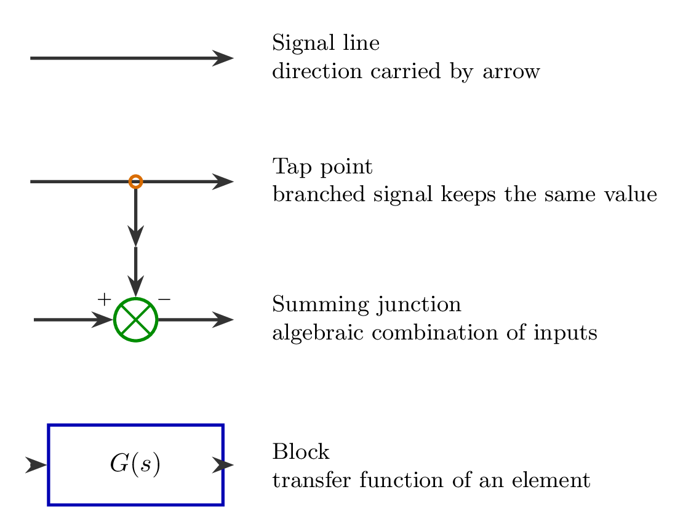
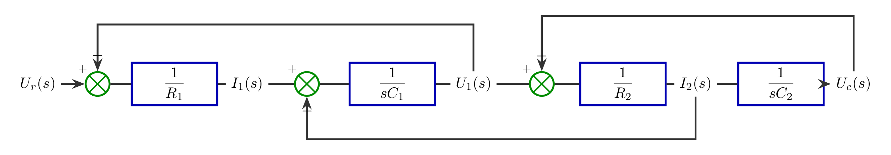
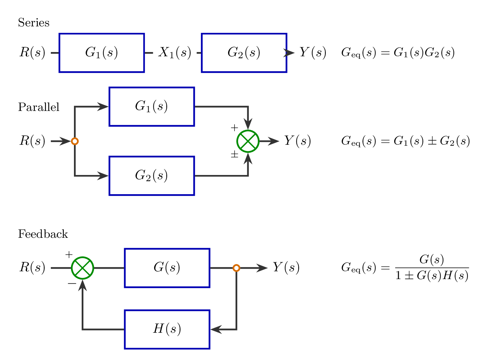
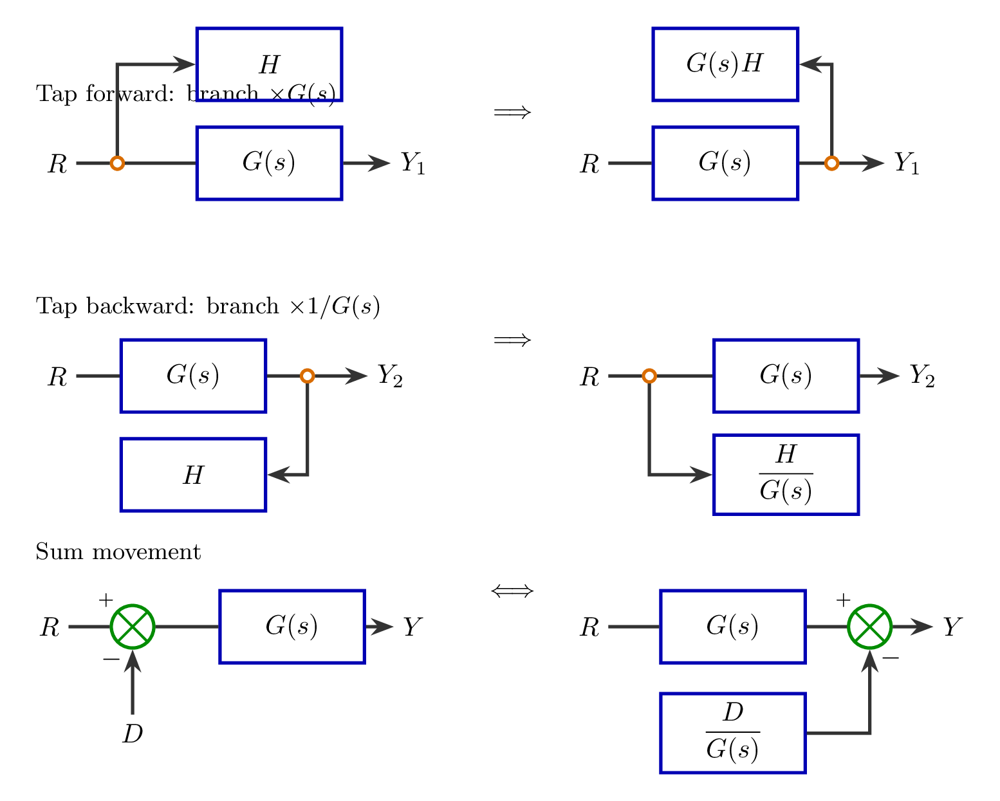
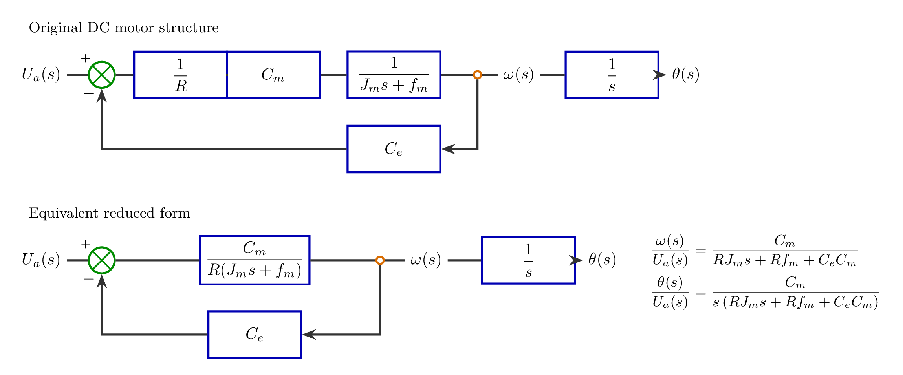
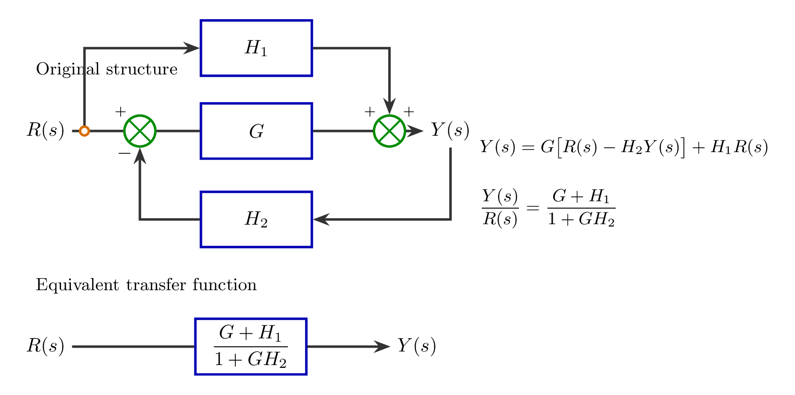

# `3方框图_控制系统结构` 完整提取

## 1. 页面边界

- 原始文件：`course-content/slides-ref/3方框图_控制系统结构.pptx`
- 正文范围：第 4-35 页
- 排除范围：封面、目录、学习目标页、结束页

## 2. 内容总览

| 原页号 | 主题 |
| --- | --- |
| 4-5 | 方框图的基本组成 |
| 6-10 | 由微分方程建立方框图 |
| 11-13 | 典型连接方式及等效变换 |
| 14-16 | 等效移动规则 |
| 17 | 结构图等效变换方法 |
| 18-26 | 电枢控制直流电动机的结构图简化 |
| 27-28 | 引出点移动与综合点移动示例 |
| 29-30 | 例：简化结构图，并求传递函数 |
| 31 | 随堂练习 |
| 32 | 总结 |
| 33 | 课后思考 |
| 34-35 | 拓展阅读与预习要求 |

## 3. 方框图的基本组成（第 4-5 页）

### 3.1 信号线

- 定义：有箭头的直线，箭头表示信号传递方向。
- 含义：信号沿箭头方向在系统中传递。

### 3.2 引出点

- 定义：信号引出或测量的位置。
- 关键性质：从同一信号线上引出的信号，数值和性质完全相同。

### 3.3 综合点

- 定义：对两个或两个以上的信号进行代数运算。
- 记号约定：
  - `+` 表示相加，常可省略。
  - `-` 表示相减。

### 3.4 方框

- 定义：表示典型环节或其组合。
- 书写规则：框内写对应传递函数，两侧连接输入、输出信号线。

### 3.5 对应图示

- 见 `tikz/01-basic-components.tex`
- 预览：`tikz/rendered/01-basic-components.png`

## 4. 例：由微分方程建立方框图（第 6-10 页）

### 4.1 例题的原始关系

从课件内嵌公式可恢复出如下时域与拉普拉斯域关系：

$$
i_1(t)=\frac{u_r(t)-u_1(t)}{R_1}
$$

$$
i_2(t)=\frac{u_1(t)-u_c(t)}{R_2}
$$

$$
u_1(t)=\frac{1}{C_1}\int \bigl(i_1(t)-i_2(t)\bigr)\,dt
$$

$$
u_c(t)=\frac{1}{C_2}\int i_2(t)\,dt
$$

对应拉普拉斯域形式：

$$
\bigl[U_r(s)-U_1(s)\bigr]\frac{1}{R_1}=I_1(s)
$$

$$
\bigl[U_1(s)-U_c(s)\bigr]\frac{1}{R_2}=I_2(s)
$$

$$
\bigl[I_1(s)-I_2(s)\bigr]\frac{1}{sC_1}=U_1(s)
$$

$$
I_2(s)\frac{1}{sC_2}=U_c(s)
$$

### 4.2 讲授意图

- 第 6 页强调：由微分方程得到规范的因果关系。
- 第 7-10 页强调：按照变量的传递顺序，依次连接各元件的结构图。

### 4.3 可整理出的建图规则

1. 先把每个方程改写成“输出 = 环节 × 输入”的因果形式。
2. 对加减关系先设置综合点。
3. 对积分环节直接写成传递函数方框 `1/(sC)`。
4. 按变量流向依次串接，负反馈量回到对应综合点。

### 4.4 可复用的最终结构

依据第 6-10 页内容，可还原为如下动态结构：

$$
U_r \to \bigl(U_r-U_1\bigr)\xrightarrow{\frac{1}{R_1}} I_1
$$

$$
I_1-I_2 \xrightarrow{\frac{1}{sC_1}} U_1
$$

$$
U_1-U_c \xrightarrow{\frac{1}{R_2}} I_2
$$

$$
I_2 \xrightarrow{\frac{1}{sC_2}} U_c
$$

这对应一个三重串接、两处负反馈的结构图。

### 4.5 对应图示

- 见 `tikz/02-construction-example.tex`
- 预览：`tikz/rendered/02-construction-example.png`

## 5. 典型连接方式及等效变换（第 11-13 页）

### 5.1 串联及等效（第 11 页）

信号链：

$$
R(s)\xrightarrow{G_1(s)}X_1(s)\xrightarrow{G_2(s)}Y(s)
$$

关系式：

$$
\frac{X_1(s)}{R(s)}=G_1(s)
$$

$$
\frac{Y(s)}{X_1(s)}=G_2(s)
$$

等效传递函数：

$$
G(s)=\frac{Y(s)}{R(s)}=G_1(s)G_2(s)
$$

### 5.2 并联及等效（第 12 页）

输入 `R(s)` 同时进入两个分支：

$$
Y_1(s)=R(s)G_1(s)
$$

$$
Y_2(s)=R(s)G_2(s)
$$

输出综合：

$$
Y(s)=Y_1(s)\pm Y_2(s)
$$

因此：

$$
Y(s)=R(s)\bigl[G_1(s)\pm G_2(s)\bigr]
$$

$$
G(s)=\frac{Y(s)}{R(s)}=G_1(s)\pm G_2(s)
$$

### 5.3 反馈及等效（第 13 页）

课件中的变量关系为：

$$
E(s)=R(s)\mp B(s)
$$

$$
Y(s)=E(s)G(s)
$$

$$
B(s)=Y(s)H(s)
$$

联立得：

$$
Y(s)=\bigl[R(s)\mp Y(s)H(s)\bigr]G(s)
$$

$$
Y(s)\bigl[1\pm H(s)G(s)\bigr]=R(s)G(s)
$$

故闭环等效为：

$$
G_{\mathrm{eq}}(s)=\frac{Y(s)}{R(s)}=\frac{G(s)}{1\pm G(s)H(s)}
$$

### 5.4 对应图示

- 见 `tikz/03-series-parallel-feedback.tex`
- 预览：`tikz/rendered/03-series-parallel-feedback.png`

## 6. 等效移动规则（第 14-16 页）

### 6.1 引出点移动（第 14 页）

课件给出的规则：

- 前移：在移动支路中串入所越过的传递函数方框。
- 后移：在移动支路中串入所越过的传递函数的倒数方框。

也就是：

- 引出点从方框前移到方框后，支路增益乘 `G(s)`。
- 引出点从方框后移到方框前，支路增益乘 `1/G(s)`。

### 6.2 综合点移动（第 15 页）

课件给出的规则：

- 前移：在移动支路中串入所越过的传递函数的倒数方框。
- 后移：在移动支路中串入所越过的传递函数方框。

也就是：

- 综合点从方框前移到方框后，附加支路增益乘 `1/G(s)`。
- 综合点从方框后移到方框前，附加支路增益乘 `G(s)`。

### 6.3 相邻点移动限制（第 16 页）

- 相邻综合点之间可以随意调换位置。
- 相邻引出点之间可以随意调换位置。
- 注意：相邻引出点和综合点之间不能互换。

### 6.4 对应图示

- 见 `tikz/04-movement-rules.tex`
- 预览：`tikz/rendered/04-movement-rules.png`

## 7. 结构图等效变换方法（第 17 页）

课件明确给出一套化简次序：

1. 直接使用公式化简典型结构：串联、并联或反馈。
2. 若没有三种典型结构，且回路之间有交叉，则必须移位。
3. 比较点只能向相邻比较点方向移位。
4. 引出点只能向相邻引出点方向移位。
5. 移位后再进行合并。
6. 注意：相邻引出点和综合点之间不能互换。

这一页的核心作用是把“典型结构公式”和“局部移位规则”组织成统一的化简策略。

## 8. 结构图简化：电枢控制直流电动机（第 18-26 页）

### 8.1 原始结构（第 18 页）

从课件嵌入图块可恢复的变量与环节包括：

- 输入：`U_a(s)`
- 中间变量：`\omega`、`\theta`
- 环节：`1/R`、`C_m`、`1/(J_m s+f_m)`、`1/s`、`C_e`
- 反馈符号：负反馈

可还原出的标准结构为：

$$
E_a(s)=U_a(s)-C_e\omega(s)
$$

$$
I_a(s)=\frac{1}{R}E_a(s)
$$

$$
T_m(s)=C_m I_a(s)
$$

$$
\omega(s)=\frac{1}{J_m s+f_m}T_m(s)
$$

$$
\theta(s)=\frac{1}{s}\omega(s)
$$

### 8.2 课件强调的化简流程

- 找典型
- 解交叉
- 由内向外

第 18-26 页实际是在不断把直流电动机结构图往典型反馈形式上重写。

### 8.3 可得到的等效结果

将前向通道先合并：

$$
G_\omega(s)=\frac{C_m}{R(J_m s+f_m)}
$$

再与反馈 `C_e` 构成闭环，可得角速度传递函数：

$$
\frac{\omega(s)}{U_a(s)}
=\frac{G_\omega(s)}{1+C_eG_\omega(s)}
=\frac{C_m}{RJ_m s+Rf_m+C_eC_m}
$$

角位移输出再串联一个积分环节：

$$
\frac{\theta(s)}{U_a(s)}
=\frac{1}{s}\frac{\omega(s)}{U_a(s)}
=\frac{C_m}{s\bigl(RJ_m s+Rf_m+C_eC_m\bigr)}
$$

### 8.4 对应图示

- 见 `tikz/05-dc-motor-reduction.tex`
- 预览：`tikz/rendered/05-dc-motor-reduction.png`

## 9. 引出点移动与综合点移动示例（第 27-28 页）

这两页使用了 `G_1,G_2,G_3,G_4,H_1,H_2,H_3` 等占位符，目的不是给出新的结论，而是通过多回路交叉结构说明：

- 引出点移动必须保持“被引出信号不变”。
- 综合点移动必须保持“进入比较点的代数关系不变”。
- 多回路化简时，移位只是为了把结构改写成串联、并联、反馈三种典型形式，而不是改变系统本身。

由于原页主要承载的是“规则示例”，正式资源库中用 `第 14-16 页` 的标准规则图替代逐页摹写更利于复用。

## 10. 例：简化结构图，并求传递函数（第 29-30 页）

### 10.1 可恢复的结构元素

从课件图块可恢复出：

- 输入：`R(s)`
- 输出：`Y(s)`
- 主通道环节：`G`
- 前馈支路环节：`H_1`
- 反馈支路环节：`H_2`
- 中间变换中出现的补偿环节：`1/G`

### 10.2 结构理解

与最终答案一致的原始结构可以整理为：

- 主通道：`R(s)` 经过带 `H_2` 负反馈的 `G`
- 前馈支路：`R(s)` 直接经过 `H_1` 加到输出端

于是输出关系为：

$$
Y(s)=G\bigl[R(s)-H_2Y(s)\bigr]+H_1R(s)
$$

整理得：

$$
Y(s)\bigl(1+GH_2\bigr)=R(s)\bigl(G+H_1\bigr)
$$

故传递函数为：

$$
\frac{Y(s)}{R(s)}=\frac{G+H_1}{1+GH_2}
$$

### 10.3 两种化简思路

- 第 29 页：方法 1，引出点后移
- 第 30 页：方法 2，引出点前移

两种方法虽然局部变换不同，但都服务于同一个目标：把原结构改写成容易直接读出传递函数的标准形式。

### 10.4 对应图示

- 见 `tikz/06-feedforward-feedback-example.tex`
- 预览：`tikz/rendered/06-feedforward-feedback-example.png`

## 11. 随堂练习（第 31 页）

当前对象层仅恢复到标题“随堂练习”，未恢复出具体题面。该页可在后续拿到更高保真导出图后再补。

## 12. 总结（第 32 页）

第 32 页把整讲压缩为四个关键词：

- 建立结构图
- 等效法则
- 信号不变性
- 化简法则

对应的核心句为：

- 微分方程做拉氏变换，依因果顺序连接。
- 串联、并联、反馈。
- 引出点后移除，前移乘；综合点后移乘，前移除。
- 找典型，解交叉，由内向外。

课件还用“图形化模型 / 形式化模型”强调了结构图在建模与计算之间的桥梁作用。

## 13. 课后思考（第 33 页）

- 为什么引出点和综合点不能交换顺序？
- 是否存在不可化简的结构图？

这两个问题分别指向：

- 信号不变性与代数关系保持；
- 结构图化简的适用边界。

## 14. 拓展阅读与预习要求（第 34-35 页）

### 14.1 参考文献

1. Boussahoua, B., & Elmaouhab, A. (2019). Reliability analysis of electrical power system using graph theory and reliability block diagram. In 2019 Algerian Large Electrical Network Conference (CAGRE), 1-6.
2. Lisnianski, A. (2007). Extended block diagram method for a multi-state system reliability assessment. Reliability Engineering & System Safety, 92(12), 1601-1607.

### 14.2 视频与扩展材料

- 一道题搞定方框图的化简求传递函数：
  - `https://www.bilibili.com/video/BV1Uy4y1H7Lf`
- 图书：
  - 《控制之美》，王天威著，清华大学出版社，2022
- 在线视频：
  - 023、024
- 参与在线讨论

## 15. 本次提取沉淀出的可复用知识单元

后续在讲义、大纲重构和互动课中可直接复用的内容包括：

1. 方框图四个基本图元的定义与标准图示。
2. “由方程到结构图”的通用建图流程。
3. 串联、并联、反馈三类典型结构的公式。
4. 引出点与综合点移动规则。
5. 结构图化简的一般策略：找典型、解交叉、由内向外。
6. 直流电动机结构图化简这一完整示例。
7. 含前馈与反馈的综合例题及其结果
   $$
   \frac{Y(s)}{R(s)}=\frac{G+H_1}{1+GH_2}.
   $$
