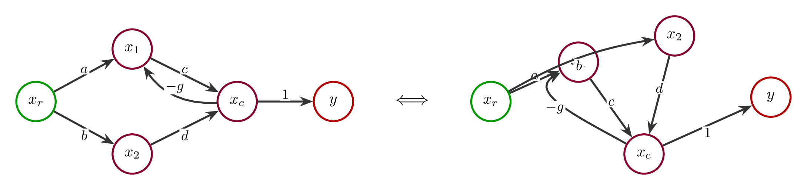
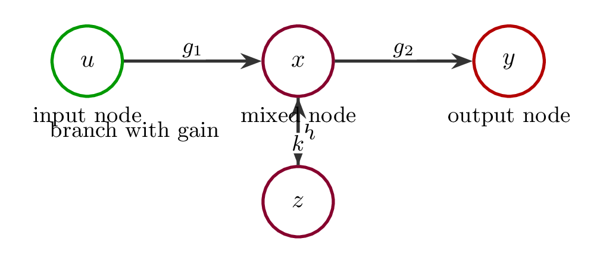
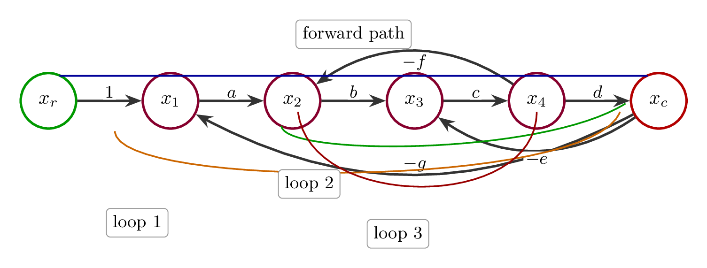
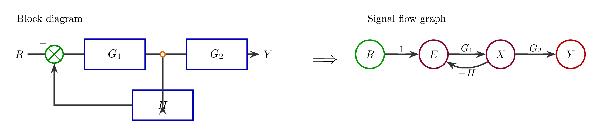
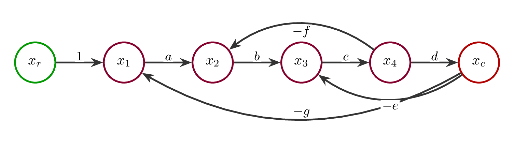
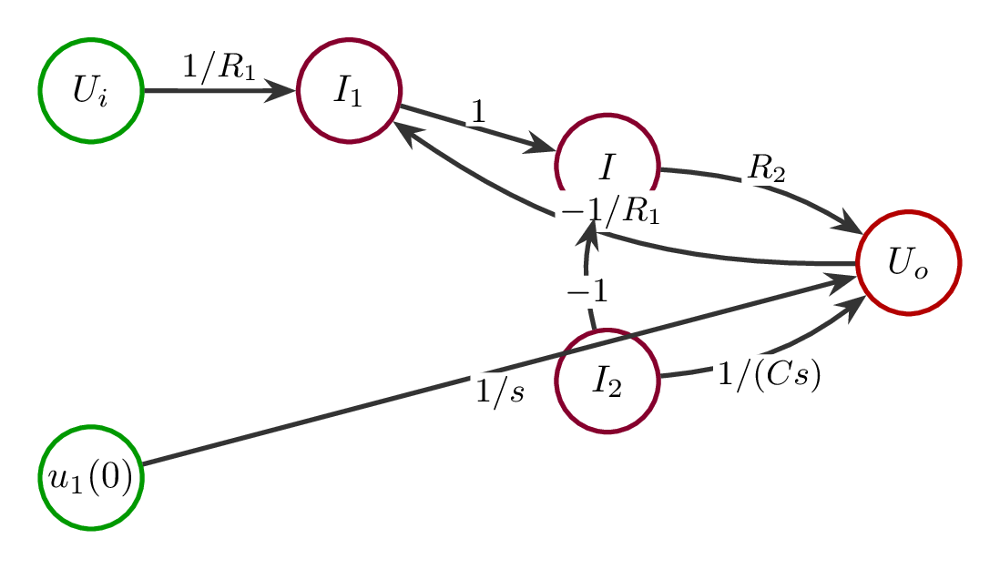

# `4信号流图_控制系统拓扑结构` 完整提取

## 1. 页面边界

- 原始文件：`course-content/slides-ref/4信号流图_控制系统拓扑结构.pptx`
- 总页数：37
- 正文范围：第 5-36 页
- 排除页面：
  - 第 1 页：封面
  - 第 2 页：目录
  - 第 3 页：学习目标
  - 第 4 页：纯图片导入页
  - 第 37 页：结束页

## 2. 内容总览

| 原页号 | 主题 |
| --- | --- |
| 5-13 | 拓扑结构导入与拓扑不变性 |
| 14-15 | 信号流图的概念 |
| 16-24 | 由结构图绘制信号流图 |
| 25-31 | 由方程组绘制信号流图 |
| 32-36 | 思考、总结、拓展 |

## 3. 信号流图导入：拓扑结构与拓扑不变性（第 5-13 页）

### 3.1 讲授意图

这部分先不用控制公式切入，而是用“拓扑”建立直觉：

- 课件第 5 页用三维环结、莫比乌斯带做导入。
- 第 6-11 页强调二维图形在连续变形下可以保持连接关系不变。
- 第 12-13 页把这种“几何可变、连接不变”的思想转到有向图。

### 3.2 本节要表达的核心结论

1. 信号流图首先是一个有向图。
2. 学习信号流图时，最重要的不是图画得像不像，而是节点之间的连接关系和支路方向。
3. 只要节点、方向和支路增益不变，图形的弯曲、拉伸、位置调整都不改变系统拓扑关系。

### 3.3 对应图示

- 见 `tikz/01-topology-invariance.tex`
- 预览：`tikz/rendered/01-topology-invariance.png`

## 4. 信号流图的概念（第 14-15 页）

### 4.1 基本定义（第 14 页）

课件稳定恢复出的定义有：

- 节点：系统中的变量。
- 支路：变量间的传输关系。

并区分了三类节点：

- 输入节点：只出不入。
- 输出节点：只入不出。
- 混合节点：有出有入。

### 4.2 常用术语（第 15 页）

课件列出的五个术语是：

- 通路
- 回路
- 回路增益
- 前向通路
- 不接触回路

这一页的作用是为后续梅森公式做准备，但本课只先建立图形语义。

### 4.3 对应图示

- 节点与支路：`tikz/02-node-branch-types.tex`
- 通路、回路与不接触回路：`tikz/03-sfg-terms.tex`

## 5. 由结构图绘制信号流图（第 16-24 页）

### 5.1 结构图与信号流图的映射（第 16 页）

课件第 16 页把两种图形并列，说明如下对应关系：

- 输入信号 -> 输入节点
- 输出信号 -> 输出节点
- 比较点、引出点 -> 混合节点
- 环节传递函数 -> 支路增益

这说明信号流图的对象不再是“方框”和“综合点”，而是“变量节点”和“带增益的有向支路”。

### 5.2 四步法（第 17-24 页）

课件给出的标准顺序是：

1. 标变量
2. 定出入
3. 列节点
4. 连支路

并给出四个明确操作要点：

1. 标出各变量对应节点名称。
2. 输入信号为输入节点，输出信号为输出节点，必要时可引入单位增益区分。
3. 按因果关系排列节点。
4. 连接支路，注明增益，注意增益符号。

### 5.3 这部分可沉淀出的稳定规则

- 结构图转信号流图时，先找变量，不先找环节。
- 每个节点表示一个信号量，不表示一个物理元件。
- 支路上的增益来自原结构图中环节的传递关系。
- 若原式中存在减法，支路增益直接写成负号增益。
- 为了表达清晰，节点布局应服从因果顺序，而不是原图的几何外观。

### 5.4 对应图示

- 见 `tikz/04-block-to-sfg.tex`
- 预览：`tikz/rendered/04-block-to-sfg.png`

## 6. 由方程组绘制信号流图（第 25-31 页）

### 6.1 无初始条件示例（第 25-26 页）

第 25 页通过一组代数方程说明如何直接从方程组生成信号流图。由媒体图块可以稳定恢复出下面五个关系：

$$
x_1=x_r-gx_c
$$

$$
x_2=ax_1-fx_4
$$

$$
x_3=bx_2-ex_c
$$

$$
x_4=cx_3
$$

$$
x_c=dx_4
$$

据此可直接得到一张信号流图：

- 主通路：`x_r -> x_1 -> x_2 -> x_3 -> x_4 -> x_c`
- 支路增益依次为：`1, a, b, c, d`
- 反馈支路：
  - `x_c -> x_1`，增益 `-g`
  - `x_c -> x_3`，增益 `-e`
  - `x_4 -> x_2`，增益 `-f`

### 6.2 该示例蕴含的建图原则

1. 先把每个方程整理成“某个变量 = 若干输入变量线性组合”的形式。
2. 每个等号左边的变量对应一个节点。
3. 等号右边每一项都转化为一条指向该节点的支路。
4. 系数直接作为支路增益，负号直接写进增益。

### 6.3 对应图示

- 见 `tikz/05-equations-to-sfg.tex`
- 预览：`tikz/rendered/05-equations-to-sfg.png`

### 6.4 含初始条件示例（第 27-31 页）

第 27 页先明确“考虑初始条件”。第 28-31 页的对象层文本被拆得很碎，但结合字符坐标和媒体图块，可以稳定恢复出其教学意图：

- 系统在拉普拉斯变换后，会出现一项额外的初始条件输入。
- 这个初始条件在信号流图中不能消失，而应作为一个新的输入节点进入对应变量。

结合页内变量与系数，能可靠恢复的关系骨架为：

$$
U_i(s)=I_1(s)R_1+U_o(s)
$$

$$
U_o(s)=I(s)R_2
$$

$$
U_o(s)=\frac{1}{Cs}I_2(s)+\frac{u_1(0)}{s}
$$

$$
I_1(s)=I(s)+I_2(s)
$$

等价地，可整理成因果形式：

$$
I_1(s)=\frac{1}{R_1}U_i(s)-\frac{1}{R_1}U_o(s)
$$

$$
I(s)=\frac{1}{R_2}U_o(s)
$$

$$
I_2(s)=Cs\,U_o(s)-C\,u_1(0)
$$

$$
I(s)=I_1(s)-I_2(s)
$$

这里最重要的结论不是某一条具体公式，而是：

- 初始条件 `u_1(0)` 在信号流图里是一个外加输入。
- 它通过自己的支路增益进入系统，而不是被隐含掉。

### 6.5 对应图示

- 见 `tikz/06-initial-condition-input.tex`
- 预览：`tikz/rendered/06-initial-condition-input.png`

## 7. 思考：变与不变（第 32 页）

课件第 32 页提出：

- 什么变了？
- 什么没变？

对应本课的答案应当是：

- 变的是图形的几何外观、节点摆放方式和支路弯曲方式。
- 不变的是变量之间的拓扑连接关系、支路方向和支路增益。

这正好回扣了开头的拓扑不变性导入。

## 8. 总结（第 33 页）

课件第 33 页给出的总结可以整理为：

- 节点为信号，支路为增益。
- 标变量，定出入，列节点，连支路。
- 按因果关系连接。
- 初始条件作为输入信号。
- 与代数方程的等价。

末尾的“矛盾的对立统一”，是用来强调：

- 信号流图看似是图形化模型；
- 但它与代数方程又严格等价。

## 9. 课后思考（第 34 页）

- 尝试由信号流图建立实例的传递函数。
- 思考初始条件对系统输出的影响。

这也自然过渡到下一讲的梅森公式。

## 10. 拓展阅读与预习要求（第 35-36 页）

### 10.1 参考文献

1. Mason, S. J. (1956). Feedback theory: Further properties of signal flow graphs.
2. Sundararajan, D. (2022). Block Diagrams and Signal-Flow Graphs. In *Control Systems* (pp. 99-110). Springer, Cham.

### 10.2 视频与扩展材料

- 梅森公式解决信号流图和系统框图问题讲解：
  - `https://www.bilibili.com/video/BV1Qb4y1k7sV`
- 图书：
  - 《控制之美》，王天威著，清华大学出版社，2022
- 在线视频：
  - 025、026
- 参与在线讨论

## 11. 本次提取沉淀出的可复用知识单元

1. 拓扑不变性的教学引入。
2. 节点、支路、输入节点、输出节点、混合节点的定义。
3. 通路、回路、前向通路和不接触回路的图形语义。
4. 结构图转信号流图的四步法：标变量、定出入、列节点、连支路。
5. 从线性方程组直接绘制信号流图的方法。
6. “初始条件作为额外输入节点”这一关键处理原则。
