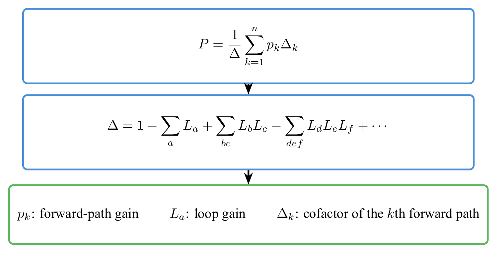
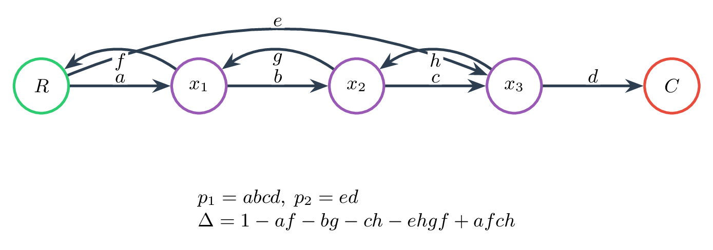
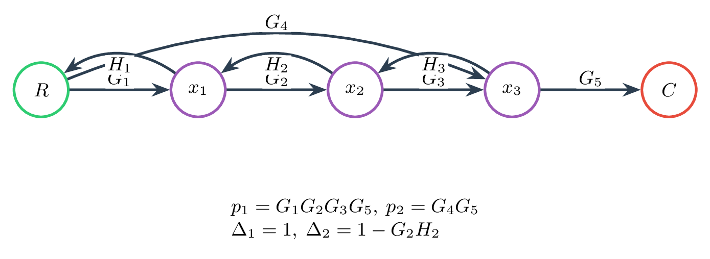
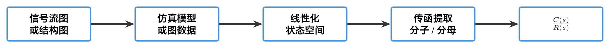
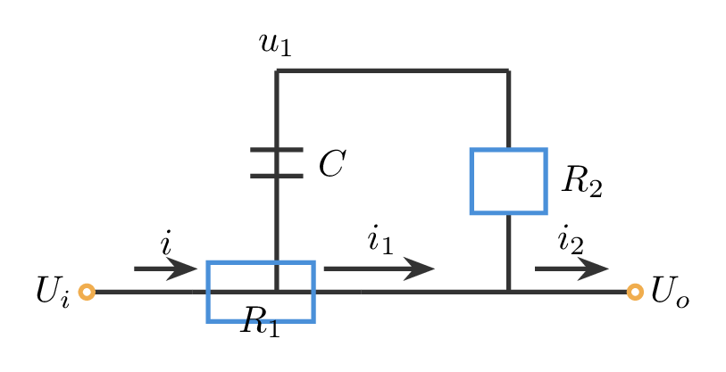

# `5.1梅森公式_数圈圈与消消乐` 完整提取

## 1. 页面边界

- 原始文件：`course-content/slides-ref/5.1梅森公式_数圈圈与消消乐.pptx`
- 总页数：28
- 正文范围：第 4-27 页
- 排除范围：封面、目录、学习目标页、结束页

## 2. 内容总览

| 原页号 | 主题 |
| --- | --- |
| 4-7 | 导入、热身与答题区 |
| 8 | 梅森增益公式与基本术语 |
| 9-11 | 例 1：由信号流图求传递函数 |
| 12-16 | 例 2：由结构图求传递函数 |
| 17-21 | 例 3 与计算机辅助求解扩展 |
| 22-24 | 思考：如何求输出；模型抽象 |
| 25 | 课程小结 |
| 26-27 | 课外拓展与预习要求 |

## 3. 导入与答题区（第 4-7 页）

这几页以课堂热身为主，页面中包含较多答题区、动画化提示和零散媒体碎片，不是本讲理论主线。能稳定判断出的教学作用有两点：

1. 由上一讲“信号流图的概念与画法”过渡到“如何由信号流图直接求传递函数”。
2. 提醒学生复习前向通路、回路和不接触回路等术语，为第 8 页的梅森公式铺垫。

因此，正式资源库中不逐字摹写第 4-7 页，而将其作为“例题前的术语唤醒环节”记录。

## 4. 梅森增益公式与基本术语（第 8 页）

### 4.1 课件可稳定恢复的定义

- 回路：同一节点出发，回到该节点的路径，路径上所有节点仅穿越一次。
- 前向通路：由信号源节点出发到信号阱节点的信号通路。
- 余子式：在特征式中除去与某条前向通路相接触的回路后的剩余特征式，称为该前向通路的余子式。

### 4.2 梅森公式

课件中的公式骨架可以稳定恢复为：

$$
P=\frac{1}{\Delta}\sum_{k=1}^{n} p_k \Delta_k
$$

$$
\Delta
=
1-\sum_a L_a + \sum_{bc} L_b L_c - \sum_{def} L_d L_e L_f + \cdots
$$

其中：

- $p_k$：第 $k$ 条前向通路增益
- $L_a$：各回路增益
- $\Delta_k$：与第 $k$ 条前向通路不接触的回路构成的余子式

### 4.3 对应图示

- 公式整理图：`tikz/01-mason-formula-card.tex`
- 预览：`tikz/rendered/01-mason-formula-card.png`



## 5. 例 1：由信号流图求传递函数（第 9-11 页）

### 5.1 可恢复的图结构

结合媒体碎片中的变量标记与坐标关系，可稳定恢复出本例包含：

- 主前向通路：`R(s) -> a -> b -> c -> d -> C(s)`
- 旁路前向通路：`R(s) -> e -> d -> C(s)`
- 三个局部回路：`af`、`bg`、`ch`
- 一个长回路：`ehgf`
- 一组互不接触回路乘积：`afch`

可复用的结构化整理如下图所示：

- `tikz/02-example1-sfg.tex`
- 预览：`tikz/rendered/02-example1-sfg.png`



### 5.2 回路与特征式

课件第 9-10 页给出的回路增益可整理为：

$$
L_1=af,\quad L_2=bg,\quad L_3=ch,\quad L_4=ehgf
$$

唯一一组两两互不接触回路为：

$$
L_1L_3 = afch
$$

因此特征式为：

$$
\Delta = 1-af-bg-ch-ehgf+afch
$$

### 5.3 前向通路与余子式

由第 10 页碎片可恢复两条前向通路：

$$
p_1=abcd,\qquad p_2=ed
$$

对应余子式为：

$$
\Delta_1 = 1,\qquad \Delta_2 = 1-bg
$$

这一点与页面中显式出现的 `1-bg` 碎片一致，也与信号流图的接触关系一致：第二条旁路通路不与 `bg` 回路接触。

### 5.4 最终传递函数

代入梅森公式，可得：

$$
\frac{C(s)}{R(s)}
=
\frac{p_1\Delta_1+p_2\Delta_2}{\Delta}
=
\frac{abcd+ed(1-bg)}{1-af-bg-ch-ehgf+afch}
$$

第 11 页实际上就是把上式按“先写梅森公式，再代入具体项”的顺序展开。

## 6. 例 2：由结构图求传递函数（第 12-16 页）

### 6.1 可恢复的核心结构

第 12-16 页原始页面是结构图逐步转化过程，但媒体碎片已经足以恢复出等价信号流图的全部关键增益：

- 主前向通路：`G_1G_2G_3G_5`
- 旁路前向通路：`G_4G_5`
- 回路增益项：`G_1H_1`、`G_2H_2`、`G_3H_3`、`G_4H_3H_2H_1`
- 不接触回路积：`G_1H_1G_3H_3`
- 余子式：`\Delta_1 = 1`、`\Delta_2 = 1-G_2H_2`

按这些信息可整理出如下等价信号流图：

- `tikz/03-example2-sfg.tex`
- 预览：`tikz/rendered/03-example2-sfg.png`



### 6.2 特征式与前向通路

课件的整理结果可直接写成：

$$
\Delta
=
1-G_1H_1-G_2H_2-G_3H_3-G_4H_3H_2H_1+G_1H_1G_3H_3
$$

$$
p_1=G_1G_2G_3G_5,\qquad p_2=G_4G_5
$$

$$
\Delta_1=1,\qquad \Delta_2=1-G_2H_2
$$

### 6.3 最终传递函数

因此：

$$
\frac{C(s)}{R(s)}
=
\frac{p_1\Delta_1+p_2\Delta_2}{\Delta}
=
\frac{G_1G_2G_3G_5+G_4G_5(1-G_2H_2)}
{1-G_1H_1-G_2H_2-G_3H_3-G_4H_3H_2H_1+G_1H_1G_3H_3}
$$

课件第 12-16 页的主要教学意图，不是重复结构图化简规则，而是说明：

1. 复杂结构图可以先转成信号流图。
2. 一旦前向通路和回路关系清晰，梅森公式比逐步移位更适合直接求传递函数。

## 7. 例 3：计算机辅助求传递函数（第 17-21 页）

### 7.1 第 17 页：数值软件建模路径

对象层文本可以稳定恢复出如下代码：

```matlab
SYS = linmod('SignalFlowExample');
[n,d] = ss2tf(SYS.a, SYS.b, SYS.c, SYS.d);
tf(n,d)
```

这页表达的思路是：

1. 在仿真环境中建立结构图或信号流图模型。
2. 用线性化函数得到状态空间模型。
3. 再把状态空间模型转成传递函数。

课件中给出的结果碎片可读为：

$$
\frac{C(s)}{R(s)}
=
\frac{s^2+s+1}{s^4+4s^3+s^2}
$$

这与“手工由梅森公式得到结果，再用软件复核”的教学目标一致。

### 7.2 根据第 17-21 页整理出的计算流程

- `tikz/04-computation-workflow.tex`
- 预览：`tikz/rendered/04-computation-workflow.png`



### 7.3 第 18-21 页：工具扩展

这些页面不再展开新例题，而是介绍计算机辅助求解的几类路线：

- 第 18 页：基于图论的方法与参考论文
  - Shyr-Long Jeng 等，2020
  - V. C. Prasad，2010
- 第 19 页：浏览器求解器
  - 浏览器扩展商店中的信号流图扩展
- 第 20 页：第三方 数值软件 函数
  - 数值软件文件共享社区中的自动流图分析工具
- 第 21 页：代码仓库项目
  - `AhmedZahRan7/Signal-Flow-Graph-Solver`

这一组页面想强调的是：手工数回路是必要基础，但在复杂图上可借助图论算法和现成求解器提高效率。

## 8. 思考与模型抽象（第 22-24 页）

### 8.1 课堂提问

第 22-23 页只稳定留下两条主信息：

- 思考：如何求输出
- 答题区

这表明课程在完成梅森公式例题后，又回到“模型只是工具，目标仍然是求输入到输出关系”的统一问题。

### 8.2 第 24 页：模型抽象

从媒体碎片可以稳定看到一个 RC 网络，以及变量：

- $U_i$
- $U_o$
- $I$
- $I_1$
- $I_2$
- $u_1(0)$
- $R_1$
- $R_2$

这说明第 24 页的作用，是把电路、方程、结构图、信号流图四种表述重新收束到同一个“求输出”的问题上。为便于后续复用，可将其整理成如下线框图：

- `tikz/05-model-abstraction-circuit.tex`
- 预览：`tikz/rendered/05-model-abstraction-circuit.png`



这里最值得沉淀的结论是：

1. 同一个系统可以在不同抽象层次下表达。
2. 选择哪种模型，取决于你想保留“机理”“结构”还是“拓扑”。
3. 无论模型外观如何变化，最终都应回到统一的输入输出关系。

## 9. 课程小结（第 25 页）

第 25 页对象层文本比较完整，可直接整理为：

| 模型 | 优点 | 缺点 | 转传递函数方法 | 方法优点 | 方法缺点 |
| --- | --- | --- | --- | --- | --- |
| 微分方程 | 反映机理 | 计算复杂 | 拉普拉斯变换 | 查表可得 | 复杂情况计算麻烦 |
| 结构图 | 反映结构 | 画图繁琐 | 结构图等效 | 计算简便 | 部分回路无法解开 |
| 信号流图 | 反映拓扑 | 高度抽象 | 梅森增益公式 | 计算简便 | 容易漏数回路 |

这一页把本单元最核心的比较关系说得很清楚：

- 微分方程偏机理；
- 结构图偏结构；
- 信号流图偏拓扑；
- 三者不是替代关系，而是同一系统的不同表达层次。

## 10. 课外拓展与预习要求（第 26-27 页）

### 10.1 参考文献

1. Mason, S. J. (1956). Feedback theory: Further properties of signal flow graphs.
2. Sundararajan, D. (2022). Block Diagrams and Signal-Flow Graphs. In *Control Systems* (pp. 99-110). Springer, Cham.

### 10.2 视频与扩展材料

- B 站视频：
  - `https://www.bilibili.com/video/BV1Qb4y1k7sV`
- 图书：
  - 《控制之美》，王天威著，清华大学出版社，2022
- 在线视频：
  - 027、028
- 参与在线讨论

## 11. 本次提取沉淀出的可复用知识单元

1. 梅森增益公式的标准写法与术语定义。
2. 由信号流图直接数出前向通路、回路和不接触回路的流程。
3. 从结构图转成等价信号流图，再用梅森公式直接求传递函数的思路。
4. 手工计算与计算机辅助求解的衔接路径。
5. 微分方程、结构图、信号流图三类模型的定位比较。
