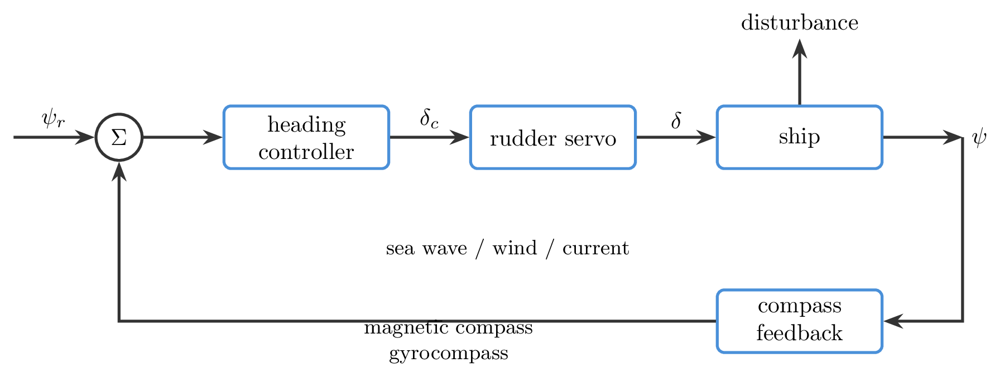
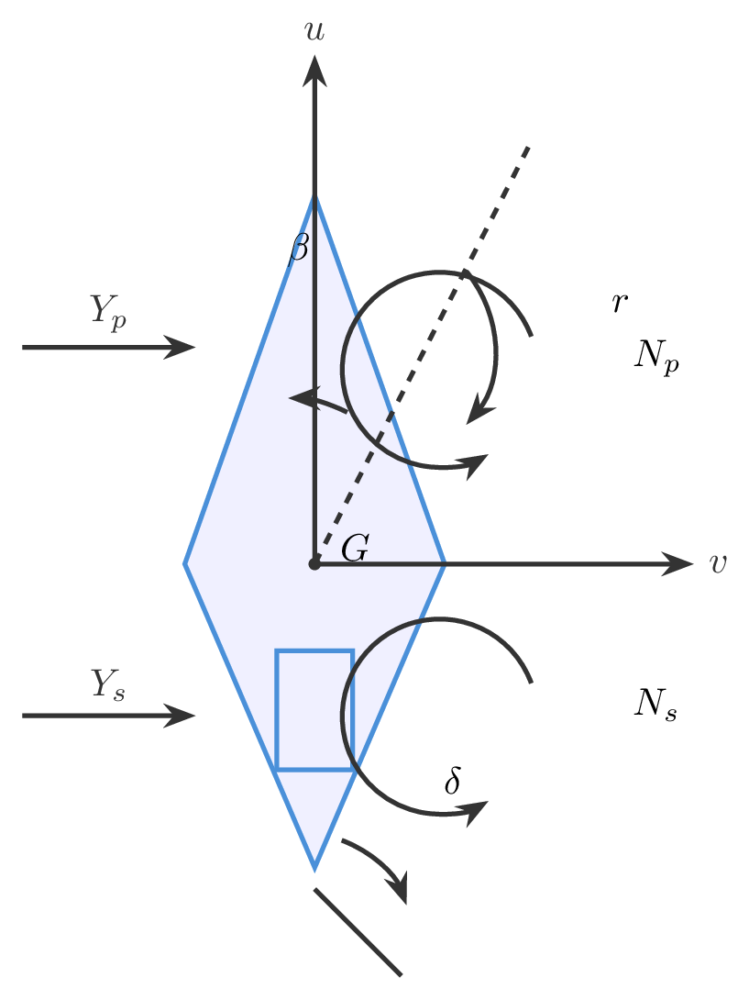
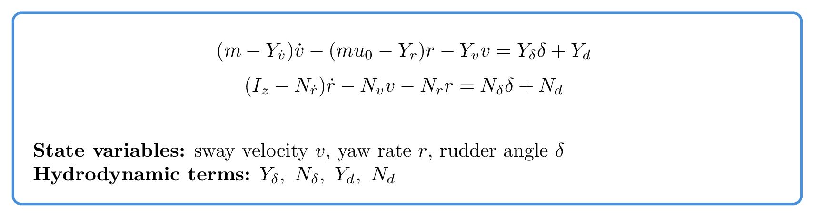
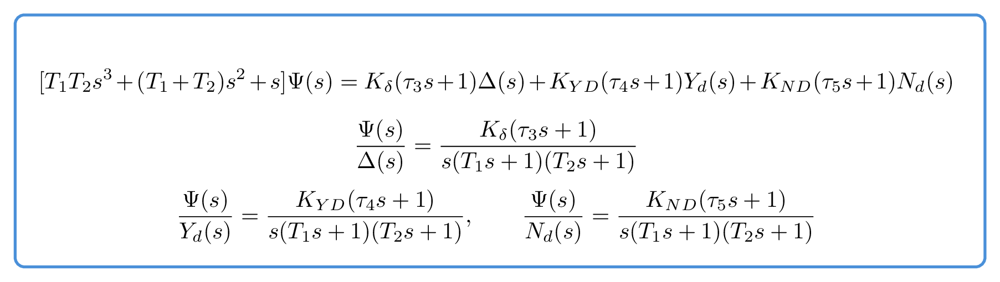
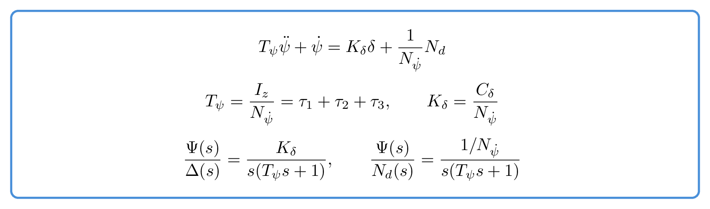
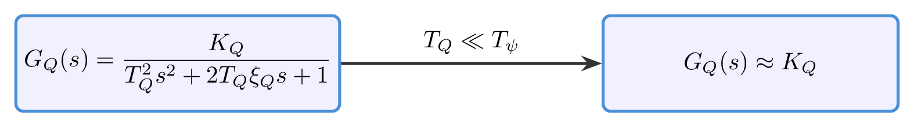
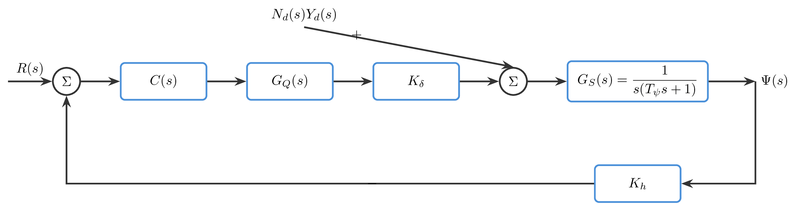

# `5.2系统建模综合` 完整提取

## 1. 页面边界

- 原始文件：`course-content/slides-ref/5.2系统建模综合.pptx`
- 总页数：26
- 正文范围：第 8-23 页
- 排除页面：
  - 第 1 页：封面
  - 第 2 页：课程目录
  - 第 3 页：学习目标
  - 第 4-7 页：答题区
  - 第 24-25 页：课外拓展与预习
  - 第 26 页：结束页

## 2. 内容总览

| 原页号 | 主题 |
| --- | --- |
| 8 | 前置方法回顾：梅森增益公式 |
| 9-10 | 船舶航向控制的工程要求 |
| 11-12 | 船舶航向控制系统原理与水动力学要素 |
| 13 | Davidson-Schiff 线性模型 |
| 14-18 | 野本模型与二阶野本模型 |
| 19-20 | 一阶野本模型 |
| 21 | 舵伺服系统数学模型 |
| 22 | 船舶航向控制系统结构图 |
| 23 | 课程小结与建模方法比较 |

## 3. 前置方法回顾（第 8 页）

第 8 页不是新知识，而是把前面已经学过的信号流图与梅森增益公式快速拉回到当前案例中。它重申了几项必要术语：

- 前向通路
- 回路
- 互不接触回路
- 特征式
- 前向通路余子式

这页的作用很明确：

> `5.2` 不是孤立的新模型课，而是把微分方程、传递函数、结构图和信号流图组织到一个完整工程对象中。

## 4. 船舶航向控制的工程要求（第 9-10 页）

第 9-10 页给出的两个核心要求是：

1. 航向稳定性  
   船舶应能在扰动作用下保持或恢复到期望航向，避免蛇形摆动和额外能耗。
2. 航行机动性  
   船舶在转向、狭窄航道和复杂水域中应能及时响应舵令，避免路径偏差过大。

课件用不同航迹对比说明：

- 稳定性差会导致持续偏差修正，从而增加能量消耗；
- 机动性差会导致转向迟缓，增加碰撞和操纵风险。

因此，本讲并不是抽象地“写模型”，而是为后续控制器设计服务：

> 模型必须既能描述船体动力学，又足够简洁，便于分析闭环稳定性与操纵性能。

## 5. 船舶航向控制系统原理（第 11 页）

第 11 页先搭起总原理：

- 指令航向 $\psi_r$
- 实际航向 $\psi$
- 航向控制器
- 舵伺服系统
- 船舶本体
- 罗经反馈
- 海浪、海风、海流等扰动

这说明船舶航向控制是一个标准反馈系统，只是对象换成了船体-舵-海况耦合系统。

- `tikz/01-ship-heading-principle.tex`
- 预览：`tikz/rendered/01-ship-heading-principle.png`

## 6. 船舶航向水动力原理（第 12 页）

第 12 页把抽象控制框架落回到具体受力对象。媒体碎片显示，这页重点解释的是：

- 漂角 $\beta$
- 舵偏角 $\delta$
- 侧向力 $Y_p,\ Y_s$
- 力矩 $N_p,\ N_s$
- 纵向、横向和偏航相关变量

它表达的课程思想是：

1. 船体不是简单的质点，而是受多个流体力和力矩共同作用；
2. 航向变化的本质，是横向运动与偏航运动耦合的结果；
3. 后续模型简化，都是从这些力学要素出发再做线性化与降阶。

- `tikz/02-hydrodynamic-principle.tex`
- 预览：`tikz/rendered/02-hydrodynamic-principle.png`

## 7. Davidson-Schiff 线性模型（第 13 页）

第 13 页给出的是更完整的线性化操纵模型。按课件碎片和常见写法，可稳定整理为一组横荡-偏航耦合方程：

$$
(m-Y_{\dot v})\dot v-(m u_0-Y_r)r-Y_v v = Y_\delta \delta + Y_d
$$

$$
(I_z-N_{\dot r})\dot r-N_v v-N_r r = N_\delta \delta + N_d
$$

其中：

- $v$：横荡速度
- $r$：艏摇角速度
- $\delta$：舵角
- $Y_\delta,\ N_\delta$：舵角引起的侧向力和力矩系数
- $Y_d,\ N_d$：扰动引起的等效侧向力和力矩

这组方程的教学定位是：

- 它更接近机理层面的完整模型；
- 但参数多、耦合强，不适合直接用于控制器整定；
- 因此后面要进一步化到野本模型。

- `tikz/03-davidson-schiff-model.tex`
- 预览：`tikz/rendered/03-davidson-schiff-model.png`

## 8. 野本模型与二阶野本模型（第 14-18 页）

### 8.1 从全模型到野本模型

第 14-17 页展示的是从更完整的操纵模型推导到野本模型的过程。原课件保留了大量中间代换步骤，但稳定可复用的结论是最终传递关系，而不是每一步代数化简。

课件最终给出的二阶野本族可以整理为：

$$
[T_1T_2 s^3 + (T_1+T_2)s^2 + s]\Psi(s)
=
K_\delta(\tau_3 s + 1)\Delta(s)
+ K_{YD}(\tau_4 s + 1)Y_d(s)
+ K_{ND}(\tau_5 s + 1)N_d(s)
$$

从而得到三条关键通道：

$$
\frac{\Psi(s)}{\Delta(s)}=
\frac{K_\delta(\tau_3 s + 1)}
{s(T_1s+1)(T_2s+1)}
$$

$$
\frac{\Psi(s)}{Y_d(s)}=
\frac{K_{YD}(\tau_4 s + 1)}
{s(T_1s+1)(T_2s+1)}
$$

$$
\frac{\Psi(s)}{N_d(s)}=
\frac{K_{ND}(\tau_5 s + 1)}
{s(T_1s+1)(T_2s+1)}
$$

这说明：

- 舵角、侧向扰动力和扰动力矩都能通过统一的分母进入航向响应；
- 不同输入通道主要区别在增益和零点参数。

### 8.2 稳定性衡准式

第 14-15 页还引入了“船舶操纵性的稳定性衡准式”与稳定性判据。课件意图很明确：

- 某些参数组合会决定船舶是否具有直线稳定性；
- 模型不是只用来算响应，更用来判断航迹保持能力。

在本资源包中，稳定性衡准式保留为概念性结论，不强行重建所有原 PPT 中的几何图和注释。

- `tikz/04-second-order-nomoto.tex`
- 预览：`tikz/rendered/04-second-order-nomoto.png`

## 9. 一阶野本模型（第 19-20 页）

第 19-20 页给出进一步简化的一阶野本模型。课件碎片表明其标准形式为：

$$
I_z\ddot{\psi} + N_{\dot \psi}\dot{\psi} = C_\delta \delta + N_d
$$

写成参数化形式：

$$
T_\psi \ddot{\psi} + \dot{\psi} = K_\delta \delta + \frac{1}{N_{\dot \psi}}N_d
$$

其中：

$$
T_\psi = \frac{I_z}{N_{\dot \psi}} = \tau_1+\tau_2+\tau_3,
\qquad
K_\delta = \frac{C_\delta}{N_{\dot \psi}}
$$

拉氏变换后，课件给出两条最重要的传递关系：

$$
\frac{\Psi(s)}{\Delta(s)}
=
\frac{K_\delta}{s(T_\psi s + 1)}
$$

$$
\frac{\Psi(s)}{N_d(s)}
=
\frac{1/N_{\dot \psi}}{s(T_\psi s + 1)}
$$

这一页的课程价值很高，因为它把复杂船舶模型压缩成了后续控制设计最常用的“积分 + 惯性”对象。

- `tikz/05-first-order-nomoto.tex`
- 预览：`tikz/rendered/05-first-order-nomoto.png`

## 10. 舵伺服系统数学模型（第 21 页）

第 21 页指出：

- 舵伺服系统主要由控制器、功放与驱动装置、舵机组成；
- 其更完整的模型可以写成二阶形式；
- 但在船舶航向控制设计中，通常因为舵伺服响应远快于船体航向响应，所以可近似为比例环节。

课件给出的典型伺服模型为：

$$
G_Q(s)=\frac{K_Q}{T_Q^2 s^2 + 2T_Q\xi_Q s + 1}
$$

并强调：

$$
T_Q \ll T_\psi
$$

因此在主控制模型中，常把伺服系统近似成比例增益 $K_Q$。

- `tikz/06-servo-approximation.tex`
- 预览：`tikz/rendered/06-servo-approximation.png`

## 11. 船舶航向控制系统结构图（第 22 页）

第 22 页把前面的对象、伺服和反馈测量收成完整闭环。根据课件碎片，可整理为：

1. 参考输入 $R(s)$ 进入比较环节；
2. 控制器 $C(s)$ 根据误差输出控制信号；
3. 舵伺服系统可用 $G_Q(s)$ 描述；
4. 船舶航向对象可写为
   $$
   G_S(s)=\frac{1}{s(T_\psi s+1)}
   $$
   再配合舵效应增益 $K_\delta$；
5. 测量反馈常用电罗经，因响应较快，可近似为比例环节 $K_h$；
6. 扰动项 $N_d(s)Y_d(s)$ 进入对象通道。

这是整讲最值得复用的结构页，因为它完成了：

- 物理建模到传递函数的过渡；
- 对象、执行机构和传感器的统一组织；
- 为后续校正与性能分析提供标准闭环骨架。

- `tikz/07-heading-control-structure.tex`
- 预览：`tikz/rendered/07-heading-control-structure.png`

## 12. 课程小结与建模方法比较（第 23 页）

第 23 页把本单元涉及的模型表示法做了横向比较：

| 模型 | 优点 | 缺点 | 转传递函数方法 | 优点 | 缺点 |
| --- | --- | --- | --- | --- | --- |
| 微分方程 | 反映机理 | 计算复杂 | 拉普拉斯变换 | 查表可得 | 复杂情况计算麻烦 |
| 结构图 | 反映结构 | 画图繁琐 | 结构图等效 | 计算简便 | 部分回路无法解开 |
| 信号流图 | 反映拓扑 | 高度抽象 | 梅森增益公式 | 计算简便 | 容易漏数回路 |

这页实际上把前面几讲统一起来了：

- 微分方程讲“机理”
- 传递函数讲“复数域关系”
- 结构图讲“模块连接”
- 信号流图讲“拓扑关系”

而 `5.2` 的意义就是用一个真实工程对象，把这些表示法串成一条连续建模链。

## 13. 对当前课程制作最有参考价值的可复用单元

1. 以工程要求驱动模型选择，而不是先写公式再找用途。
2. 用船舶航向控制案例说明“完整机理模型”和“控制设计模型”之间的差别。
3. 把 Davidson-Schiff 模型作为详细机理模型，把野本模型作为控制友好型简化模型。
4. 通过一阶/二阶野本模型强调“积分 + 惯性 + 扰动通道”这类标准对象。
5. 在总结构图中明确区分控制器、伺服、船体对象、反馈通道和扰动通道。
6. 用方法比较页收束“微分方程、传递函数、结构图、信号流图”之间的转换关系。

