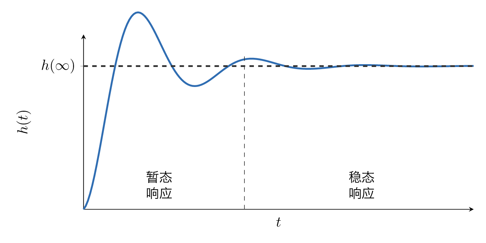
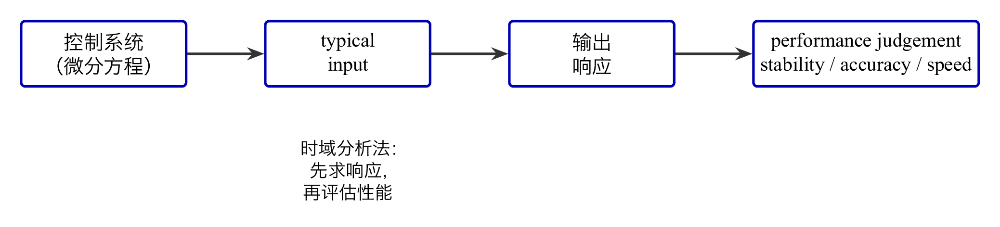
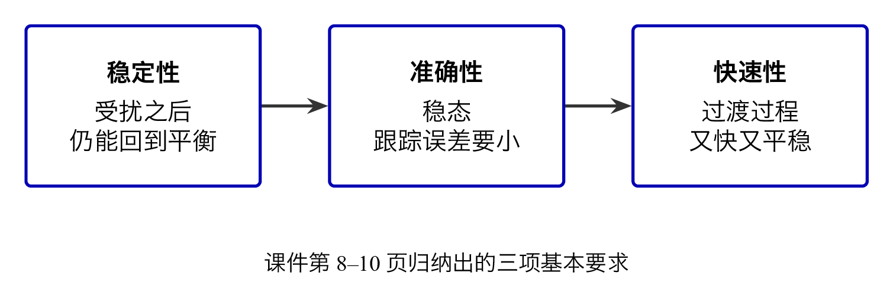
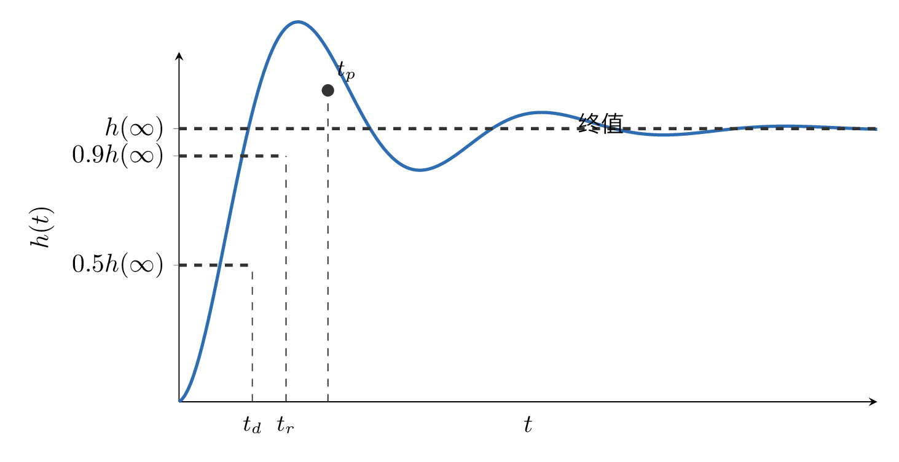
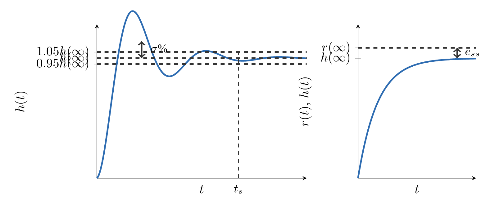

# `6性能指标_控制效果评价` 完整提取

## 1. 页面边界

- 原始文件：`course-content/slides-ref/6性能指标_控制效果评价.pptx`
- 总页数：23
- 正文范围：第 4-20 页
- 排除页面：
  - 第 1 页：封面
  - 第 2 页：目录
  - 第 3 页：学习目标
  - 第 23 页：结束页
- 附加页面：
  - 第 21-22 页：课外拓展及预习要求，保留为资源线索，不作为课堂主链正文

## 2. 内容总览

| 原页号 | 主题 |
| --- | --- |
| 4-6 | 时域分析法概述 |
| 7 | 典型输入信号 |
| 8-10 | 控制系统的要求 |
| 11-16 | 线性系统时域性能指标 |
| 17 | `stepinfo` 与计算机辅助求解 |
| 18 | “性能指标”类比引导 |
| 19 | 课堂总结 |
| 20 | 课后思考 |
| 21-22 | 拓展阅读与预习 |

## 3. 时域分析法概述（第 4-6 页）

课件第 4-6 页围绕“时域分析法概述”展开，核心信息有两层。

第一层是分析对象。课件明确把控制系统看成一个由微分方程描述的动态系统，给定典型输入后，系统会产生对应的输出响应，再通过响应曲线判断系统性能。

第二层是响应分类。第 5 页把时间响应分成两部分：

- 瞬态响应：从初始状态过渡到接近稳态的过程，主要反映过渡过程是否平稳、是否足够快。
- 稳态响应：系统进入长期运行后的响应部分，主要反映最终输出是否接近期望值。

对应的结构示意如下：

- `tikz/01-transient-vs-steady.tex`
- 预览：`tikz/rendered/01-transient-vs-steady.png`



第 6 页进一步给出时域法的主链路：

1. 由控制系统的微分方程出发；
2. 施加典型输入；
3. 求得输出响应；
4. 从响应曲线回收系统性能。

- `tikz/02-time-domain-analysis-chain.tex`
- 预览：`tikz/rendered/02-time-domain-analysis-chain.png`



这页的对象层文字可整理为：

> 根据微分方程，利用拉氏变换直接求出系统的时间响应，然后按照响应曲线来分析系统的性能。

## 4. 时域法常用的典型输入信号（第 7 页）

第 7 页给出了时域分析中最常用的 4 类标准输入。对象层表格的列标题包含“典型输入、原函数、时域关系、象函数、复域关系、举例”，说明这一页的目标是建立“时域输入形式”和“拉氏域表达式”的对照。

可稳定恢复出的标准形式如下：

| 输入类型 | 时域表达 | 拉氏变换 |
| --- | --- | --- |
| 单位脉冲 | $\delta(t)$ | $1$ |
| 单位阶跃 | $1(t)$ | $\dfrac{1}{s}$ |
| 单位斜坡 | $t$ | $\dfrac{1}{s^2}$ |
| 单位加速度 | $\dfrac{t^2}{2}$ | $\dfrac{1}{s^3}$ |

这些输入的教学作用分别是：

- 单位脉冲：看系统对瞬时扰动的敏感程度；
- 单位阶跃：最常用，适合定义绝大多数时域性能指标；
- 单位斜坡：常用于考察跟踪能力；
- 单位加速度：用于更高阶输入跟踪的扩展讨论。

## 5. 控制系统的基本要求（第 8-10 页）

第 8-10 页把时域响应分析与“控制系统到底要达到什么效果”联系起来。对象层反复出现三类要求：

- 稳定性
- 准确性
- 快速性

第 9 页给出的具体解释可整理为：

- 稳定性：系统受脉冲扰动后能回到原来的平衡位置；
- 准确性：稳态输出与理想输出之间的误差要小；
- 快速性：过渡过程要平稳、迅速。

这三项要求之间的关系可重建为一张简明卡片：

- `tikz/03-control-requirements-card.tex`
- 预览：`tikz/rendered/03-control-requirements-card.png`



第 10 页以“神州 12 号机械臂”为引导案例，本质上是告诉学生：复杂系统的好坏不能只靠感觉判断，而要落实为可比较、可度量的性能指标。

## 6. 线性系统时域性能指标（第 11-16 页）

第 11-16 页是本课的主体，围绕单位阶跃响应曲线定义常用时域性能指标。原课件把这些指标拆成多页逐步动画展示，本次按教学语义合并整理。

### 6.1 时间类指标：$t_d$、$t_r$、$t_p$

课件第 11-13 页分别对应：

- 延迟时间，记为 $t_d$
- 上升时间，记为 $t_r$
- 峰值时间，记为 $t_p$

可从对象层和媒体拼图稳定恢复出的定义为：

- 延迟时间 $t_d$：响应曲线第一次达到终值的 $50\%$ 所需时间；
- 上升时间 $t_r$：
  - 非振荡系统常取从 $10\%$ 上升到 $90\%$ 终值所需时间；
  - 对有振荡的系统，也常按“从 $0$ 到第一次达到终值”定义；
- 峰值时间 $t_p$：阶跃响应越过终值并达到第一个峰值所需时间。

对应示意图如下：

- `tikz/04-step-response-time-metrics.tex`
- 预览：`tikz/rendered/04-step-response-time-metrics.png`



### 6.2 品质类指标：$t_s$、$\sigma\%$、$e_{ss}$

课件第 14-16 页继续给出：

- 调节时间，记为 $t_s$
- 超调量，记为 $\sigma\%$
- 稳态误差，记为 $e_{ss}$

对应定义可整理为：

- 调节时间 $t_s$：响应进入规定误差带并保持不再越界所需时间；课件明确使用了 $5\%$ 误差带；
- 超调量 $\sigma\%$：最大峰值超出终值的百分比，课件图上给出的是

$$
\sigma\% = \frac{A}{B} \times 100\%
$$

若写成标准形式，也可表示为

$$
\sigma\% = \frac{h(t_p)-h(\infty)}{h(\infty)} \times 100\%
$$

- 稳态误差 $e_{ss}$：系统进入稳态后输入与输出之间保留的最终偏差，课件第 16 页直接给出

$$
e_{ss} = e(\infty) = r(\infty) - h(\infty)
$$

这三项指标适合分开观察，避免同图拥挤：

- `tikz/05-step-response-quality-metrics.tex`
- 预览：`tikz/rendered/05-step-response-quality-metrics.png`



## 7. 计算机辅助求解性能指标（第 17 页）

第 17 页明确引入了 数值软件 / Octave 的 `stepinfo`。对象层保留了完整示例，说明课件希望学生把“图上读指标”与“软件直接算指标”建立对应。

原页代码可整理为：

```matlab
omega_n = 10;
xi = 0.69;
s = tf('s');
Phi = omega_n^2/(s^2 + 2*xi*omega_n*s + omega_n^2);

stepinfo(Phi, 'SettlingTimeThreshold', 0.05, 'RiseTimeLimits', [0, 1])
step(Phi)
```

原页展示的 `stepinfo` 输出为：

```text
ans =
  包含以下字段的 struct:

     上升时间: 0.3223
瞬态时间: 0.4367
 调节时间: 0.4367
  调节最小值: 0.9975
  调节最大值: 1.0500
    超调量: 5.0044
   下冲量: 0
         峰值: 1.0500
     峰值时间: 0.4338
```

这一页的教学意义很明确：

- 图示让学生理解每个指标“是什么”；
- 软件输出让学生快速得到“是多少”；
- 两者必须能对上，否则学生只会背命令，不会读曲线。

## 8. “性能指标”类比与课堂收束（第 18-20 页）

### 8.1 类比页（第 18 页）

第 18 页通过“航母性能指标”类比说明：任何复杂对象的“好坏”都需要落到可量化指标上。对象层保留的条目包括：

- 长度：316 米左右
- 动力：26-28 万匹马力
- 电磁弹射器：3 条
- 舰载机数量：48 架歼 15

这页不属于控制理论定义本身，但很适合作为课堂导入或总结时的类比材料。

### 8.2 总结页（第 19 页）

第 19 页对象层可恢复出如下收束要点：

- 瞬态过程、稳态过程
- 脉冲、阶跃、斜坡、加速度
- 稳定、准确、快速
- 调节时间、超调量、上升时间、峰值时间
- 系统性能的度量

其中最关键的教学主线可以压缩为：

1. 先理解响应分段；
2. 再明确典型输入；
3. 再把“系统要求”对应到可测的时域指标；
4. 最后用图上读取和软件计算两种方式闭环验证。

### 8.3 课后思考（第 20 页）

第 20 页标题是“课后思考”，但对象层没有稳定提取出题干文本，仅留下图片来源 `www.oerlikon.com`。因此本次只保留页面用途：

- 用于引导学生把“性能指标”迁移到更真实的工程对象；
- 可在后续课程制作时，替换为更明确的开放题或案例讨论题。

## 9. 拓展阅读与预习（第 21-22 页）

第 21 页对象层保留了两条参考文献：

1. Kornuta, T., Zieliński, C., & Winiarski, T. (2020). A universal architectural pattern and specification method for robot control system design. *Bulletin of the Polish Academy of Sciences: Technical Sciences*, 3-29.
2. Hayes, I. J., Jackson, M. A., & Jones, C. B. (2003, September). Determining the specification of a control system from that of its environment. In *International Symposium of Formal Methods Europe* (pp. 154-169). Springer, Berlin, Heidelberg.

第 22 页对象层只保留了标题“课外拓展及预习要求”，没有稳定提取出更多正文。对当前资源库而言，保留第 21 页的两条参考文献已经足够支撑后续检索。
