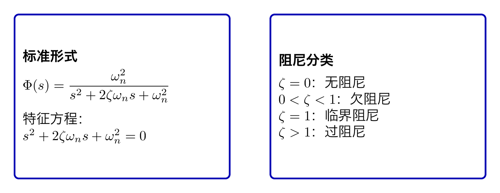
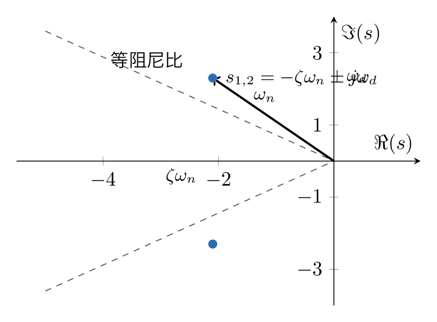
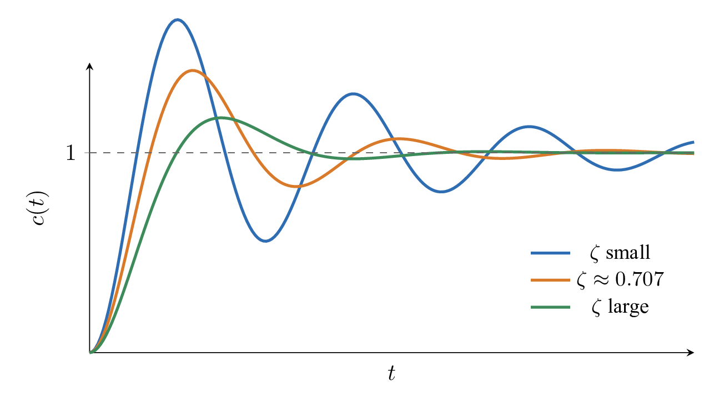
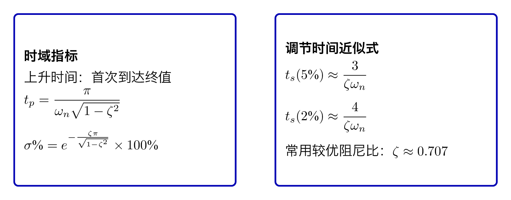
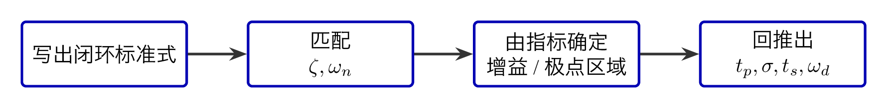

# `7.1衰减振荡_欠阻尼二阶系统` 完整提取

## 1. 页面边界

- 原始文件：`course-content/slides-ref/7.1衰减振荡_欠阻尼二阶系统.pptx`
- 总页数：23
- 正文范围：第 4-20 页
- 排除页面：
  - 第 1 页：封面
  - 第 2 页：目录
  - 第 3 页：学习目标
  - 第 23 页：结束页
- 附加页面：
  - 第 21-22 页：课外拓展及预习要求

## 2. 内容总览

| 原页号 | 主题 |
| --- | --- |
| 4-5 | 二阶系统标准型与阻尼分类 |
| 6 | 闭环极点与阻尼比关系 |
| 7-15 | 欠阻尼二阶系统单位阶跃响应 |
| 16-18 | 增益 / 极点 / 性能指标设计例题 |
| 19 | 总结 |
| 20 | 课后思考 |
| 21-22 | 拓展阅读与预习 |

## 3. 二阶系统标准型与分类（第 4-5 页）

第 4-5 页建立了本讲的统一对象：典型二阶系统。

对象层明确保留了以下关键词：

- 典型形式
- 开环
- 闭环
- 开环增益
- 阻尼比
- 无阻尼自然频率
- 特征方程
- 无阻尼、欠阻尼、临界阻尼、过阻尼

因此，本讲统一使用的闭环标准型可以整理为：

$$
\Phi(s)=\frac{\omega_n^2}{s^2+2\zeta\omega_n s+\omega_n^2}
$$

其中：

- $\zeta$ 为阻尼比；
- $\omega_n$ 为无阻尼自然频率。

对应特征方程为：

$$
s^2+2\zeta\omega_n s+\omega_n^2=0
$$

按阻尼比分类时：

- $\zeta=0$：无阻尼；
- $0<\zeta<1$：欠阻尼；
- $\zeta=1$：临界阻尼；
- $\zeta>1$：过阻尼。

这部分可沉淀为一张标准型卡片：

- `tikz/01-second-order-standard-form.tex`
- 预览：`tikz/rendered/01-second-order-standard-form.png`

## 4. 欠阻尼系统极点与阻尼比（第 6 页）

第 6 页对象层直接给出：

- 直角坐标表示
- 极坐标表示
- 闭环极点坐标与阻尼比的关系
- 等阻尼线

对欠阻尼二阶系统，闭环极点写成：

$$
s_{1,2}=-\zeta\omega_n \pm j\omega_n\sqrt{1-\zeta^2}
$$

因此在复平面上有：

- 极点半径：$\omega_n$；
- 与负实轴夹角：由阻尼比决定；
- 同一条射线上的点具有相同阻尼比，也就是“等阻尼线”。

还可引入阻尼振荡频率：

$$
\omega_d=\omega_n\sqrt{1-\zeta^2}
$$

这页最重要的教学意义是把“阻尼”从抽象参数变成极点几何：

- $\zeta$ 变大，极点更靠近负实轴；
- $\zeta$ 变小，极点更靠近虚轴，振荡性增强。

对应可复用图如下：

- `tikz/02-pole-damping-geometry.tex`
- 预览：`tikz/rendered/02-pole-damping-geometry.png`

## 5. 欠阻尼二阶系统单位阶跃响应（第 7-15 页）

第 7-15 页是整讲核心。课件通过多页逐步揭示，把“振荡衰减响应曲线”和“性能指标公式”对应起来。

### 5.1 响应表达式

对标准二阶欠阻尼系统，在单位阶跃输入下，其响应可写成：

$$
c(t)=1-\frac{e^{-\zeta\omega_n t}}{\sqrt{1-\zeta^2}}
\sin\bigl(\omega_d t+\varphi\bigr)
$$

其中

$$
\omega_d=\omega_n\sqrt{1-\zeta^2},\qquad
\varphi=\arctan\frac{\sqrt{1-\zeta^2}}{\zeta}
$$

这条式子揭示了两个核心因素：

- 指数项 $e^{-\zeta\omega_n t}$ 决定振荡包络线的衰减速度；
- 正弦项决定振荡频率和峰谷周期。

### 5.2 阻尼比对响应形态的影响

第 10 页对象层明确指出：

> 阻尼比越大，超调量越小，响应越平稳。反之，越小，超调量越大，振荡越强。

并进一步指出：

> 当取某一典型值左右时，超调量和调节时间都相对较小，故一般为最佳阻尼比。

结合控制理论标准结论，这个“最佳阻尼比”通常取：

$$
\zeta \approx 0.707
$$

也就是工程上常说的折中值：既不过分振荡，也不过分拖慢响应。

对应响应趋势图如下：

- `tikz/03-underdamped-step-response.tex`
- 预览：`tikz/rendered/03-underdamped-step-response.png`

## 6. 欠阻尼二阶系统性能指标（第 11-15 页）

第 11-15 页围绕 4 个指标展开：

- 上升时间
- 峰值时间
- 超调量
- 调节时间

### 6.1 上升时间

第 11 页对象层保留了：

> 有振荡时，可定义为从 0 到第一次达到终值所需的时间。

因此在欠阻尼情形下，常按“第一次达到终值”的时间定义上升时间。它和阻尼比、自然频率都有关。

### 6.2 峰值时间

第 12 页标题就是“峰值时间”。对欠阻尼二阶系统，其标准公式为：

$$
t_p=\frac{\pi}{\omega_d}
=\frac{\pi}{\omega_n\sqrt{1-\zeta^2}}
$$

### 6.3 超调量

第 13 页对象层指出：

> 超调量的大小完全取决于阻尼比，越小，越大。

标准表达式为：

$$
\sigma\% = e^{-\frac{\zeta\pi}{\sqrt{1-\zeta^2}}}\times 100\%
$$

这说明：

- 超调量和 $\omega_n$ 无关；
- 它完全由 $\zeta$ 决定。

### 6.4 调节时间

第 14-15 页都围绕“调节时间”展开。对象层保留了：

- 当误差带取某一百分比时，对应调节时间；
- 由于正弦函数存在，严格关系并不连续；
- 为简单起见，可做近似计算。

这和标准课程结论一致。常用近似为：

- 对 $5\%$ 误差带：

$$
t_s \approx \frac{3}{\zeta\omega_n}
$$

- 对 $2\%$ 误差带：

$$
t_s \approx \frac{4}{\zeta\omega_n}
$$

这几项指标可以整理成一张速查卡：

- `tikz/04-performance-formulas-card.tex`
- 预览：`tikz/rendered/04-performance-formulas-card.png`

## 7. 设计与分析例题（第 16-18 页）

第 16-18 页转入“按要求设计参数”的典型题。

### 7.1 增益设计（第 16 页）

第 16 页标题是“欠阻尼二阶系统分析：增益”。对象层可恢复：

> 系统结构图如右，试求当某条件满足时系统的动态性能；使系统阻尼比取得某值。

这说明题目方向是：

- 已知结构图；
- 通过调整开环增益，使闭环系统达到指定阻尼比；
- 再由标准型回收动态性能。

这一类题的标准步骤是：

1. 将系统闭环传递函数化成标准二阶形式；
2. 比较分母系数，读出 $\zeta,\omega_n$ 与增益的关系；
3. 令阻尼比达到指定值，反求开环增益；
4. 再计算超调量、峰值时间、调节时间等指标。

### 7.2 极点范围设计（第 17 页）

第 17 页对象层保留：

> 某典型二阶系统，要求……，试确定系统极点的允许范围。

这类题把时域指标转成复平面约束：

- 超调量约束对应阻尼比下界；
- 峰值时间 / 调节时间约束对应 $\omega_n$ 或 $\omega_d$ 的下界；
- 最终交集形成极点允许区域。

### 7.3 性能指标综合设计（第 18 页）

第 18 页对象层保留：

> 试确定极点的位置和某参数，以满足若干性能指标；另确定有阻尼振荡频率和峰值时间。

这说明该页属于综合题：

- 先由性能指标反求阻尼比与自然频率；
- 再确定极点位置；
- 再回收阻尼振荡频率和峰值时间。

为后续课程制作方便，本次把这三类例题压缩为一张“设计路径卡”：

- `tikz/05-design-checklist.tex`
- 预览：`tikz/rendered/05-design-checklist.png`

## 8. 总结与课后思考（第 19-20 页）

### 8.1 总结页

第 19 页对象层保留了整个收束框架：

- 阻尼，自然振荡频率
- 0 阻尼，欠阻尼，临界阻尼，过阻尼
- 上升时间，调节时间，峰值时间，超调量
- 化为标准型
- 反馈的思想
- 量变引起质变

这页很好地概括了本讲的核心：

1. 所有分析都先统一到标准二阶形式；
2. 再从 $\zeta,\omega_n$ 解释响应曲线；
3. 最后把性能要求反推回极点和增益。

### 8.2 课后思考

第 20 页对象层给出了两条问题：

1. 分析二阶系统开环增益和闭环极点分布的关系；
2. 分析阻尼和振荡频率对欠阻尼二阶系统单位阶跃响应的影响。

这两问正好把本讲的两条主线闭合起来：

- 参数如何决定极点；
- 极点如何决定响应。

## 9. 拓展阅读与预习（第 21-22 页）

第 21 页对象层保留了两条参考文献：

1. 雷克（1979）：《阶跃响应与频率响应方法》。
2. 刘、尚、黄（2021）：《利用秩约束优化从低质量阶跃响应数据中高效辨识低阶系统》。

同时还保留了一个视频资源关键词：

- 二阶系统的单位阶跃响应
- `bilibili` 视频链接

第 22 页则补充了：

- 《控制之美》，王天威著，清华大学出版社，2022
- 在线视频 `041`、`042`
- 参与在线讨论

这些内容可作为后续讲义和互动课中的延伸材料来源。
