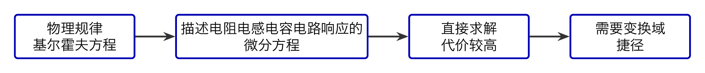
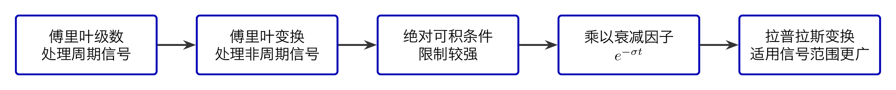
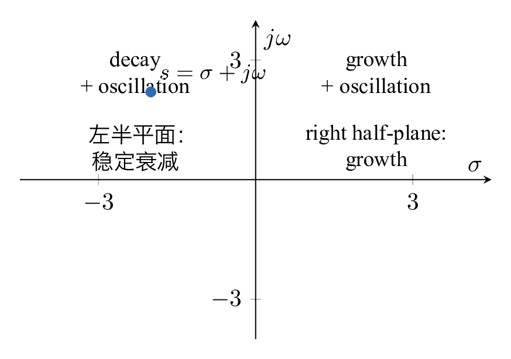
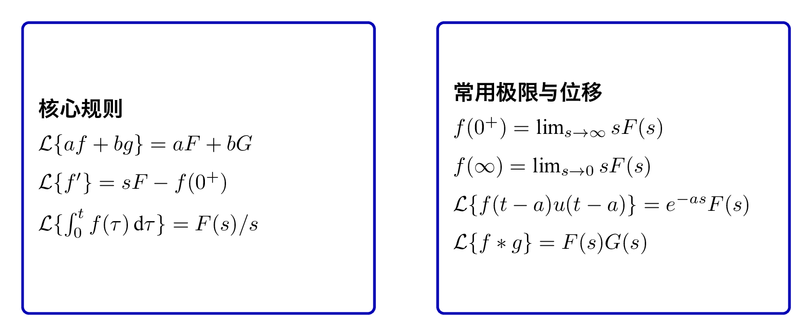
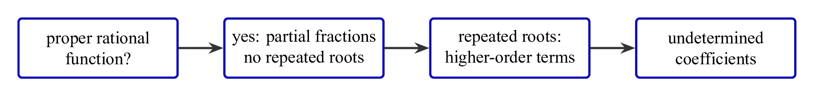

# `7.2拉氏变换_工程直觉的数学实现` 完整提取

## 1. 页面边界

- 原始文件：`course-content/slides-ref/7.2拉氏变换_工程直觉的数学实现.pptx`
- 总页数：31
- 正文范围：第 2-28 页
- 排除页面：
  - 第 1 页：封面
  - 第 4 页：目录
  - 第 5 页：学习目标
  - 第 29-30 页：课外拓展及预习要求
  - 第 31 页：结束页

## 2. 内容总览

| 原页号 | 主题 |
| --- | --- |
| 2 | 电阻电感电容微分方程引入 |
| 6-14 | 傅里叶到拉普拉斯的动机链 |
| 15-18 | 拉氏变换的主要定理 |
| 19-26 | 拉氏反变换方法与例题 |
| 27 | 总结 |
| 28 | 课后思考 |

## 3. 电阻电感电容串联电路为何需要“捷径”（第 2 页）

第 2 页通过一个电阻电感电容串联电路引入问题。对象层保留了：

- `电阻电感电容串联电路的微分方程`
- `由基尔霍夫定律得`
- `消去中间变量`
- `传统方法如何求解？`
- `有没有“捷径”？`

这页的教学目标很明确：

- 先承认物理系统天然会落到微分方程；
- 再指出直接解微分方程在工程上不够高效；
- 最终把“将微分方程代数化”作为拉氏变换的核心动机。

对这一页，最值得保留的是“工程动机链”：

- 物理定律；
- 微分方程；
- 求解成本高；
- 需要变换方法。

对应概念图如下：

- `tikz/01-rlc-to-laplace.tex`
- 预览：`tikz/rendered/01-rlc-to-laplace.png`

## 4. 从傅里叶到拉普拉斯（第 6-14 页）

第 6-14 页不是直接给定义，而是一步步建立“为什么需要拉普拉斯变换”。

### 4.1 工程直觉：信号可以分解到“基”上

第 6-12 页依次出现：

- 随堂投票：拉普拉斯变换最核心的作用是什么；
- 光波分解；
- 弦的振动；
- 傅里叶级数；
- 傅里叶变换；
- 傅里叶反变换；
- 复数系数、正交基。

对象层里还有一句关键表述：

> 任何周期函数都可以表达为正弦函数之和。

这说明课件在强调：

- 傅里叶级数本质上是“投影到正弦基上”；
- 周期信号可以做离散频谱分解；
- 非周期信号则引出傅里叶变换。

### 4.2 傅里叶变换的边界

第 13-14 页继续强调傅里叶变换并不是无条件可用。对象层保留了：

- 狄利赫里条件；
- 绝对可积；
- 函数不是绝对可积怎么办？
- 为保证一直衰减，在正半轴积分；
- 拉普拉斯变换！

这条逻辑可以压缩为：

1. 傅里叶变换要求信号满足较强条件；
2. 有些工程信号不绝对可积；
3. 给信号乘上一个指数衰减因子，就能扩大可变换的对象范围；
4. 这就自然导向拉普拉斯变换。

把这条动机链重建为一张桥接图最合适：

- `tikz/02-fourier-to-laplace-bridge.tex`
- 预览：`tikz/rendered/02-fourier-to-laplace-bridge.png`

### 4.3 拉普拉斯变换的定义直觉

在控制课程中，单边拉普拉斯变换通常写为：

$$
F(s)=\mathcal{L}\{f(t)\}=\int_0^\infty f(t)e^{-st}\,\mathrm{d}t
$$

其中

$$
s=\sigma+j\omega
$$

这意味着：

- $\sigma$ 对应指数衰减或增长；
- $\omega$ 对应振荡频率；
- 拉普拉斯变换同时编码了“衰减 + 振荡”。

这正对应第 6 页投票中提到的：

> 看到复数 $s=\sigma+j\omega$，第一反应应当与衰减和振荡有关。

对应可复用图如下：

- `tikz/03-s-plane-intuition.tex`
- 预览：`tikz/rendered/03-s-plane-intuition.png`

## 5. 拉氏变换的主要定理（第 15-18 页）

第 15-18 页进入正式工具层。对象层保留了如下关键词：

- 线性定理
- 微分定理
- 积分定理
- 初值定理
- 终值定理
- 位移定理
- 相似定理
- 卷积定理

虽然课件中的具体公式大多被拆成图块，但按控制课程标准，核心结论可以稳定整理为：

### 5.1 线性定理

$$
\mathcal{L}\{a f(t)+b g(t)\}=aF(s)+bG(s)
$$

### 5.2 微分定理

$$
\mathcal{L}\{f'(t)\}=sF(s)-f(0^+)
$$

### 5.3 积分定理

$$
\mathcal{L}\left\{\int_0^t f(\tau)\,\mathrm{d}\tau\right\}=\frac{F(s)}{s}
$$

### 5.4 初值定理

$$
f(0^+)=\lim_{s\to\infty}sF(s)
$$

### 5.5 终值定理

$$
f(\infty)=\lim_{s\to 0}sF(s)
$$

在系统稳定、极限存在的条件下，该公式才可直接使用。

### 5.6 位移、相似与卷积

- 时域位移：

$$
\mathcal{L}\{f(t-a)u(t-a)\}=e^{-as}F(s)
$$

- 卷积定理：

$$
\mathcal{L}\{f*g\}=F(s)G(s)
$$

这些定理可以沉淀为一张速查表：

- `tikz/04-laplace-theorems-card.tex`
- 预览：`tikz/rendered/04-laplace-theorems-card.png`

## 6. 拉氏反变换（第 19-26 页）

第 19-26 页主题非常明确：如何从象函数回到时域。

### 6.1 无重根：部分分式法

第 19 页对象层直接保留了：

> 部分分式法：只能用于真分式，其他情况先用长除法变为常系数和真分式之和。

这说明课件对方法边界非常明确：

- 先判断是不是有理真分式；
- 如果不是，先做长除法；
- 再做部分分式展开；
- 最后逐项查表做反变换。

### 6.2 例 1、例 2

第 20-21 页分别是：

- 拉普拉斯反变换：例 1
- 拉普拉斯反变换：例 2

对象层没保留完整分式内容，但从页面组织可以确定，课件在演示“无重根情形下的标准部分分式法”。

### 6.3 有重根

第 22-23 页对象层保留了：

- 有重根

这说明课件把有重根情况单独拿出来强调。对于这类问题，标准展开形式通常包含：

$$
\frac{A_1}{s-p}+\frac{A_2}{(s-p)^2}+\cdots+\frac{A_n}{(s-p)^n}
$$

其对应的时域项会出现：

$$
e^{pt},\ te^{pt},\ t^2 e^{pt}, \dots
$$

### 6.4 例 3、例 4 与待定系数法

第 24-26 页对象层保留了：

- 拉普拉斯反变换：例 3
- 拉普拉斯反变换：例 4
- 待定系数法
- 例 3 可以用待定系数吗？

这说明课件的收束重点不是再背几道题，而是比较两类方法：

- 部分分式法；
- 待定系数法。

因此，这一部分最适合沉淀成一张“反变换方法边界卡”：

- `tikz/05-inverse-transform-methods.tex`
- 预览：`tikz/rendered/05-inverse-transform-methods.png`

## 7. 总结与课后思考（第 27-28 页）

### 7.1 总结页

第 27 页对象层保留了：

- 傅里叶变换
- 拉氏变换
- 拉式反变换
- 部分分式分解
- 时域信号向频域投影
- 合成时域信号
- 留数法，待定系数法
- 图形化思考
- 工程与数学

这页把整讲压缩成 3 条主线：

1. 时域信号如何投影到复频域；
2. 微分方程如何在象域代数化；
3. 如何再从象函数回到时域。

### 7.2 课后思考

第 28 页文字似乎沿用了前一讲的模板，仍显示：

- 分析二阶系统开环增益和闭环极点分布的关系；
- 分析阻尼和振荡频率对欠阻尼二阶系统单位阶跃响应的影响。

这两问和本讲主题并不完全匹配，较大概率是课后思考页未完全替换。对资源库而言，应视为原课件中的残留内容，而不是本讲核心知识点。

## 8. 本讲最值得复用的教学骨架

从课程设计角度，这份课件最重要的不是“公式越多越好”，而是它把拉氏变换讲成了一个完整的工程故事：

1. 微分方程难直接解；
2. 傅里叶给出频域分解直觉；
3. 拉普拉斯把“衰减 + 振荡”一起纳入；
4. 象域中用代数操作替代微分运算；
5. 最后用反变换回到时域解释物理结果。

这条主线非常适合后续讲义、互动课和课堂提问设计复用。
