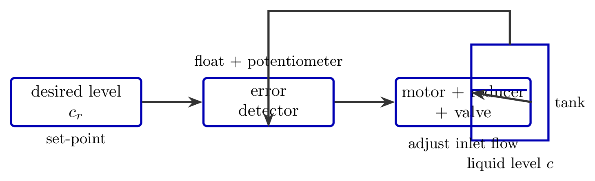
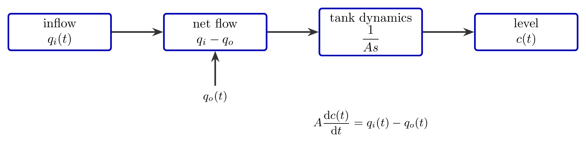
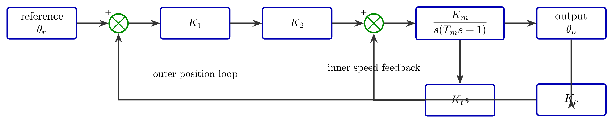
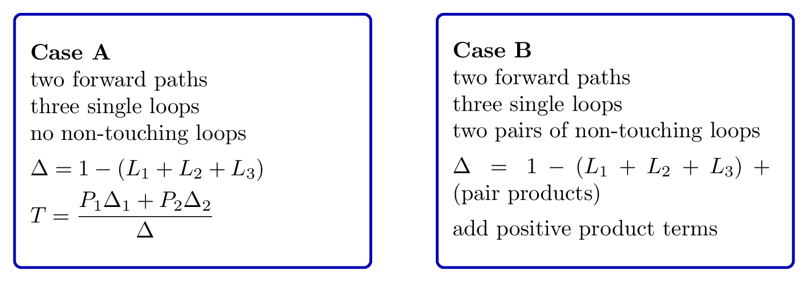

# `7控制系统建模习题2025` 完整提取

## 1. 页面边界

- 原始文件：`course-content/slides-ref/7控制系统建模习题2025.pptx`
- 总页数：11
- 正文范围：第 2-11 页
- 排除页面：
  - 第 1 页：封面

## 2. 内容总览

| 原页号 | 主题 |
| --- | --- |
| 2-4 | 液位系统原理 |
| 5 | 非线性方程线性化 |
| 6-9 | 位置随动系统建模 |
| 10-11 | 梅森公式应用 |

## 3. 液位系统原理（第 2-4 页）

### 3.1 题目与工作原理

第 2 页对象层直接给出题目：

> 下图是液位自动控制系统原理示意图。在任意情况下，希望液面高度 $c$ 维持不变，试说明系统工作原理并画出系统方框图。

第 3 页给出了完整的文字解释。可稳定恢复出的核心工作机理是：

- 当电位器电刷位于中点位置时，电动机不动，控制阀门保持某一开度；
- 此时进入水箱的流量与流出水量相等，液面保持在希望高度；
- 当液面升高时，浮子随之上升，经杠杆机构使电位器电刷偏离中点；
- 误差信号驱动电动机与减速器动作，减小阀门开度，使流入水量减小；
- 液面回落后，电刷回到中点，系统重新平衡；
- 若液位下降，则控制方向相反，系统自动增大阀门开度，使液位恢复。

这是一类非常典型的闭环液位控制原理题，本质上对应“液位偏差 $\rightarrow$ 执行机构动作 $\rightarrow$ 流量调整 $\rightarrow$ 液位恢复”的反馈链。

对应可复用的结构化图示如下：

- `tikz/01-liquid-level-closed-loop.tex`
- 预览：`tikz/rendered/01-liquid-level-closed-loop.png`

### 3.2 微分方程建模

第 4 页对象层明确保留了题意框架：

- 当某一平衡状态成立时，液位高度为给定值；
- 当流量条件变化时，液位高度将发生变化；
- 液位高度变化率与液体流量差成正比；
- 容器横截面积为 $A$，希望液位为某给定高度。

根据这组文字，可稳定恢复其标准建模关系：

$$
A\frac{\mathrm{d}c(t)}{\mathrm{d}t}=q_i(t)-q_o(t)
$$

其中：

- $c(t)$ 为液位高度；
- $q_i(t)$ 为流入流量；
- $q_o(t)$ 为流出流量；
- $A$ 为容器横截面积。

这不是对题图数值的猜测，而是由“截面积固定容器的体积守恒”直接得到的标准结果，也与课件第 4 页“液位高度变化率与液体流量差成正比”的文字一致。

可复用的建模骨架如下：

- `tikz/02-liquid-level-model.tex`
- 预览：`tikz/rendered/02-liquid-level-model.png`

## 4. 非线性方程线性化（第 5 页）

第 5 页通过 `slide.xml` 中的 `AlternateContent` 保留了完整题意文字。可恢复出的题目主线是：

- 研究对象：晶闸管三相桥式全控整流电路；
- 输入量：控制角；
- 输出量：空载整流电压；
- 已知其输入输出之间存在一条非线性关系；
- 题目要求：推导其线性化方程式。

对象层还保留了关键信息：

> 式中是整流电压的理想空载值，试推导其线性化方程式。  
> 本题考查电路非线性微分方程的线性化，具体做法是，对非线性微分方程在其平衡点附近用泰勒级数展开并取前面的线性项，得到等效的线性化方程。

### 4.1 基于题意的标准推断

原页中的公式字符没有完整落到文本层，但结合“控制角”“理想空载值”等关键词，可以稳定判断该题对应的标准关系为：

$$
U_d = U_{d0}\cos\alpha
$$

其中：

- $\alpha$ 为控制角；
- $U_d$ 为整流输出平均电压；
- $U_{d0}$ 为理想空载整流电压。

若在线性化工作点 $\alpha_0$ 附近展开，则有：

$$
U_d(\alpha)\approx U_d(\alpha_0)+
\left.\frac{\mathrm{d}U_d}{\mathrm{d}\alpha}\right|_{\alpha_0}(\alpha-\alpha_0)
$$

又因为

$$
\frac{\mathrm{d}U_d}{\mathrm{d}\alpha}=-U_{d0}\sin\alpha
$$

所以其小偏差线性化关系可写为：

$$
\Delta U_d \approx -U_{d0}\sin\alpha_0 \,\Delta\alpha
$$

这里需要明确：

- 以上公式是依据该类题的标准模型做的恢复；
- 题页中的数值工作点和中间排版符号未能从文本层稳定提取；
- 因此本包只保留线性化方法和标准形式，不输出带数值的伪结果。

## 5. 位置随动系统建模（第 6-9 页）

### 5.1 题目要求

第 6 页对象层保留了完整任务列表：

> 某位置随动系统原理方框图如下所示。已知电位器最大工作角度，功率放大器功放系数为，要求：  
> （1）分别求出电位器传递系数，第一级和第二级放大器系数；  
> （2）画出系统结构图；  
> （3）简化结构图，求系统传递函数。

这说明该题的重点不是单一公式，而是完整建模流程：

1. 从实物/原理图抽取元件参数；
2. 将原理图翻译成控制系统结构图；
3. 再由结构图化简求传递函数。

### 5.2 参数求取

第 7 页只保留了题号与“求某些系数”的提示，具体数值仍在题图中。根据题意，可以确定这一页要求的是：

- 电位器传递系数；
- 两级放大器系数。

但由于数值与标定量都嵌在图片中，文本层无法可靠恢复，所以本次仅保留求解类别，不虚构具体数字。

### 5.3 系统结构图

第 8 页保留了非常关键的文字：

> 假设电动机的时间常数为，可得直流电动机的传递函数（忽略电枢电感的影响）  
> 其中为直流电动机的传递系数。假设测速发电机的斜率为，则其传递函数为  
> 由此可见，系统的结构如下图所示。

由这组文字，可以稳定保留该题的标准结构骨架：

- 外环：位置给定与位置反馈的比较；
- 前向通道：放大器 + 直流电动机 + 机械传动；
- 内环：测速发电机形成速度负反馈；
- 位置反馈：由电位器完成。

对应可复用图如下：

- `tikz/03-position-servo-structure.tex`
- 预览：`tikz/rendered/03-position-servo-structure.png`

在符号层面，这一类系统通常可写成：

$$
G_m(s)=\frac{K_m}{s(T_m s+1)}
$$

测速反馈可抽象为：

$$
H_t(s)=K_t s
$$

位置反馈可抽象为：

$$
H_p(s)=K_p
$$

这里的 $K_p, K_1, K_2, K_m, K_t, T_m$ 具体取值应来自原题图，本次不虚构。

### 5.4 传递函数化简

第 9 页对象层只剩下一句：

> 由简化的结构图可得系统的传递函数为

这说明课件已经把重点从“看懂系统”转到了“结构化简”。但由于最终公式本身位于题图中，文本层无法完整恢复，因此本包只保留解题顺序：

1. 明确外环与内环；
2. 先化简测速反馈形成的内环等效环节；
3. 再将等效前向通道与位置反馈外环合并；
4. 最后写出闭环传递函数。

## 6. 梅森公式应用（第 10-11 页）

第 10-11 页的对象层都成功保留了“通道数 / 回路数 / 不接触回路数”的关键信息，即使具体图形与支路增益仍在图片中。

### 6.1 例 1：无互不接触回路

第 10 页：

> 存在两条前向通道，三个单独回路，无不接触回路。  
> 由梅森增益公式可得系统的传递函数为……

对这种情况，梅森公式的判别式结构应写为：

$$
\Delta = 1-(L_1+L_2+L_3)
$$

若两条前向通道分别为 $P_1, P_2$，则总传递函数形式为：

$$
T = \frac{P_1\Delta_1 + P_2\Delta_2}{\Delta}
$$

由于无互不接触回路，$\Delta$ 中不会出现二阶乘积项。

### 6.2 例 2：存在两对互不接触回路

第 11 页：

> 其存在两条前向通道，三个单独回路，两对互不接触回路。  
> 由梅森增益公式可得系统的传递函数为……

因此，这一页的判别式结构可以抽象为：

$$
\Delta = 1-(L_1+L_2+L_3) + (\text{two non-touching loop products})
$$

它和上一页的最大区别，不是前向通道数，而是：

- 需要额外检查互不接触回路；
- 判别式 $\Delta$ 中会出现正号的二回路乘积项。

为后续引用方便，本次把这两类习题整理成一张梅森公式应用卡片：

- `tikz/04-mason-checklist.tex`
- 预览：`tikz/rendered/04-mason-checklist.png`

## 7. 本包可直接复用的教学价值

相较于一般理论课件，这份习题课的提取价值主要不在“公式大全”，而在于保留了 4 条非常明确的工程解题链：

1. 从物理作用机理翻译成反馈结构；
2. 用守恒关系或元件特性写出微分方程；
3. 对非线性关系在工作点附近做线性化；
4. 对结构图 / 信号流图使用结构化公式求整体传递函数。

这正是后续讲义设计、课堂讲解和互动课制作时最值得复用的部分。
