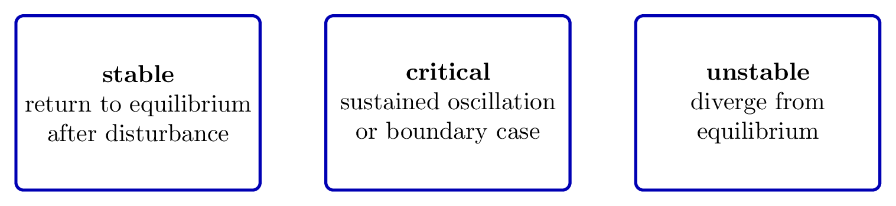
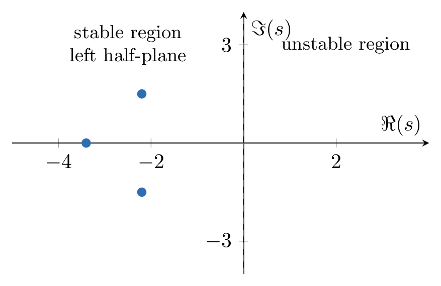
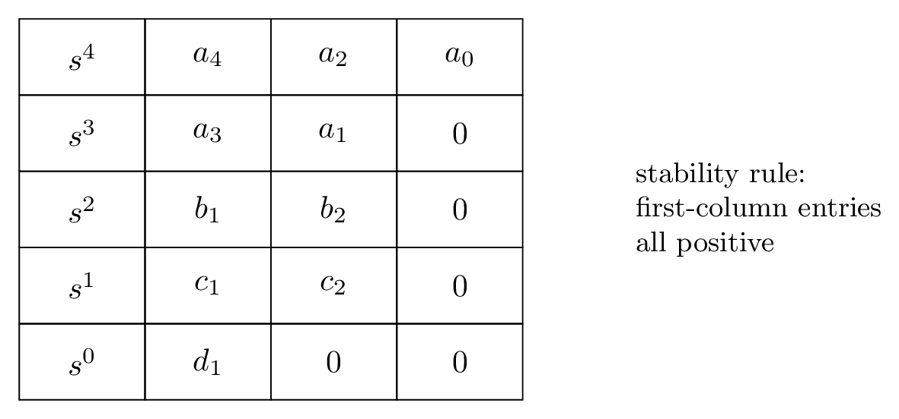
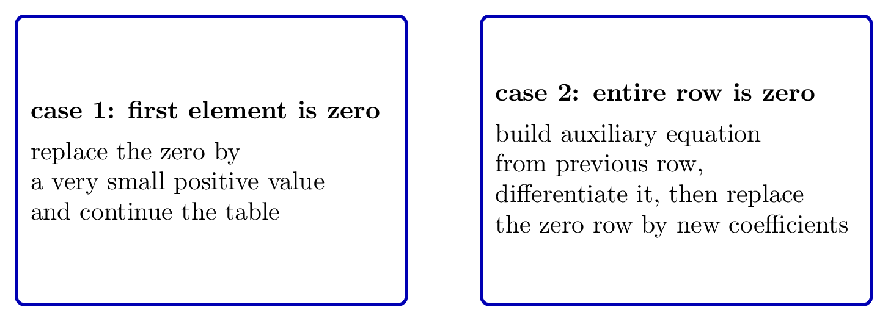

# `8稳定_控制系统首要任务` 完整提取

## 1. 页面边界

- 原始文件：`course-content/slides-ref/8稳定_控制系统首要任务.pptx`
- 总页数：27
- 正文范围：第 4-24 页
- 排除页面：
  - 第 1 页：封面
  - 第 2 页：目录
  - 第 3 页：学习目标
  - 第 25-26 页：课外拓展及预习要求
  - 第 27 页：结束页

## 2. 内容总览

| 原页号 | 主题 |
| --- | --- |
| 4-5 | 稳定性的概念与充要条件 |
| 6-8 | 稳定判据与 Routh-Hurwitz 判据 |
| 9-16 | 例题与特殊情况处理 |
| 17-22 | 参数稳定范围 |
| 23 | 总结 |
| 24 | 课后思考 |

## 3. 稳定性的概念（第 4 页）

第 4 页对象层保留了本讲最核心的定义文字：

> 稳定是控制系统正常工作的首要条件。分析、判定系统的稳定性，并提出确保系统稳定的条件是自动控制理论的基本任务之一。

同时给出了三种状态：

- 稳定
- 临界稳定
- 不稳定

以及定义：

> 如果在扰动作用下系统偏离了原来的平衡状态，当扰动消失后，系统能够以足够的准确度恢复到原来的平衡状态，则系统是稳定的；否则，系统不稳定。

这说明本讲首先把“稳定性”定义成一种响应性质，而不是一堆判据本身。

对应概念图可以整理为：

- `tikz/01-stability-concepts.tex`
- 预览：`tikz/rendered/01-stability-concepts.png`

## 4. 稳定的充要条件（第 5 页）

第 5 页对象层给出：

- 系统稳定的充要条件
- 系统所有闭环特征根均具有负的实部
- 或所有闭环特征根均位于左半 $s$ 平面
- 必要性
- 充分性

因此，本讲的核心理论结论可以压缩为：

> 对于线性定常系统，稳定的充要条件是所有闭环特征根都位于复平面的左半平面。

这条结论既解释了为什么要研究特征方程，也解释了为什么后续可以不必逐个求根，而改用判据。

对应可复用图如下：

- `tikz/02-left-half-plane-condition.tex`
- 预览：`tikz/rendered/02-left-half-plane-condition.png`

## 5. 稳定判据与 Routh-Hurwitz 判据（第 6-8 页）

### 5.1 为什么需要判据

第 6 页标题就是“稳定判据”，并保留了：

- 必要条件
- 说明
- 例

这说明课件先承认一个事实：

- 虽然稳定性本质上取决于极点位置；
- 但高阶系统逐个求根并不经济；
- 所以需要一个“不用显式求根，也能判断右半平面根个数”的方法。

### 5.2 Routh-Hurwitz 判据

第 8 页对象层给出本讲最重要的结论：

> 劳斯表第一列元素均大于零时系统稳定，否则系统不稳定且第一列元素符号改变的次数就是特征方程中正实部根的个数。

这句话本身就是 Routh 判据的工程表达。其教学价值在于：

- 不需要把所有根都求出来；
- 只需构造劳斯表并检查第一列符号；
- 还能直接数出右半平面极点个数。

把这部分整理成一张骨架图最合适：

- `tikz/03-routh-table-skeleton.tex`
- 预览：`tikz/rendered/03-routh-table-skeleton.png`

## 6. 普通例题与特殊情况（第 9-16 页）

第 9-16 页围绕 4 类典型情形展开。

### 6.1 普通情形（例 1）

第 9-10 页延续的是标准判稳流程，并给出 `roots`、`tf`、`step` 等代码做数值验证。这类题的通用步骤是：

1. 写出特征方程系数；
2. 列劳斯表；
3. 检查第一列是否全正；
4. 用数值求根或阶跃响应做交叉验证。

### 6.2 第一列首项为 0，但该行不全为 0（例 2）

第 11 页对象层明确给出：

> 某行第一列元素为 0，而该行元素不全为 0 时：将此 0 改为一个极小正数，继续运算。

并且对象层已经说明：

> 劳斯表第一列元素变号 2 次，有 2 个正根，系统不稳定。

这类题的教学重点是：

- “首项为零”不代表判据失效；
- 需要用极小正数替代，继续看符号变化。

### 6.3 出现全零行（例 3、例 4）

第 13、15 页对象层都明确保留了全零行处理规则：

> 出现全零行时，系统可能出现一对共轭虚根；或一对符号相反的实根；或两对实部符号相异、虚部相同的复根。  
> 用上一行元素组成辅助方程，将其对 $s$ 求导一次，用新方程的系数代替全零行系数，之后继续运算。

这是本讲第二个关键难点。

因此，特殊情况可以整理成一张方法卡：

- `tikz/04-special-cases-card.tex`
- 预览：`tikz/rendered/04-special-cases-card.png`

## 7. 参数稳定范围（第 17-22 页）

第 17-22 页是本讲从“判稳”走向“设计”的关键部分。

### 7.1 例 5 的目标

第 17 页对象层给出：

> 系统结构图如下：确定使系统稳定的参数的范围；当某条件满足时，确定使全部极点均位于某条竖线之左的值范围。

这说明这一组页不是单纯判断“稳不稳定”，而是在问：

- 参数取哪些值时稳定；
- 参数取哪些值时还能满足更强的极点区域约束。

### 7.2 带参数劳斯表

第 23 页总结页对象层已经点出了这里的方法：

- 带参数列劳斯表
- 变量代换

其标准求解路径为：

1. 将参数保留在特征方程系数中；
2. 列带参数的劳斯表；
3. 对第一列写出不等式组；
4. 联立解出参数稳定范围。

### 7.3 极点区域的平移变换

第 20 页对象层明确出现：

> 当某条件满足时，进行平移变换。

这说明课件在讲一个常用技巧：

- 若要求所有极点位于某条竖线左侧，而不是仅在虚轴左侧；
- 就令 $s=z-a$ 或做等价平移；
- 再对新变量写特征方程并应用劳斯判据。

这一段最适合沉淀为流程图：

- `tikz/05-parameter-range-checklist.tex`
- 预览：`tikz/rendered/05-parameter-range-checklist.png`

## 8. 总结与课后思考（第 23-24 页）

### 8.1 总结页

第 23 页对象层把全讲内容压缩得很完整：

- 所有特征根具有负实部
- 首列系数大于零
- 首位为 0 用极小值替代，全零行用辅助方程
- 带参数列劳斯表，变量代换
- 站在巨人的肩上
- 数学遇见工程

这页的结构其实就是本讲的知识树：

1. 理解稳定性的本质；
2. 掌握 Routh 表的基本判稳规则；
3. 记住两类特殊情况；
4. 学会把判据用于参数设计。

### 8.2 课后思考

第 24 页对象层给出：

> 试分析例 5 中阻尼大于 1 的情况下为什么依然发生振荡？

这是一道很好的反直觉问题，提示学生：

- “阻尼大于 1”这个说法只有在标准二阶模型中才有清晰含义；
- 对更高阶系统或含附加零极点的系统，不能机械照搬二阶直觉；
- 稳定性与振荡性并不总能由一个参数单独决定。

## 9. 本讲可直接复用的教学主线

这份课件最值得保留的是下面这条完整逻辑：

1. 稳定性的本质是扰动后是否回归平衡；
2. 对线性系统，这等价于闭环极点是否都在左半平面；
3. Routh-Hurwitz 判据让我们不用显式求根就能判稳；
4. 特殊情况处理体现了数学判据的工程鲁棒性；
5. 最终，判据还能用来求参数稳定范围和极点区域约束。

这条主线非常适合后续讲义、课堂板书和互动课的任务设计。
