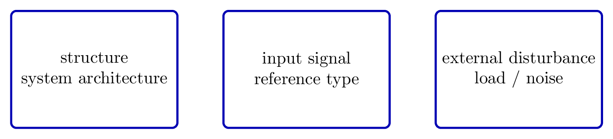
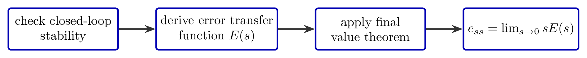
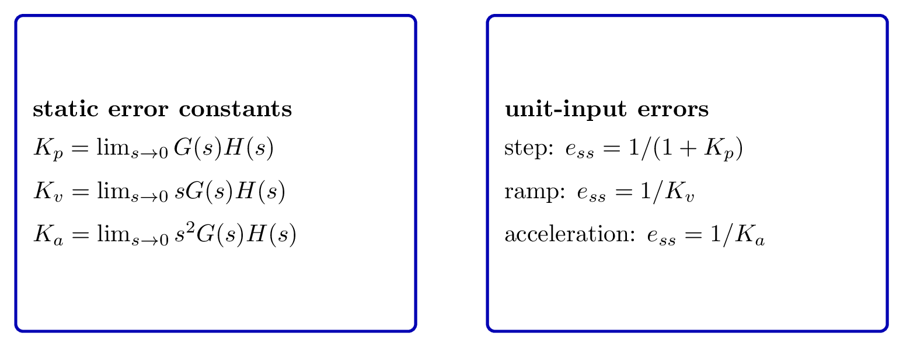
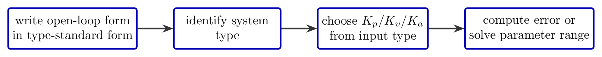

# `9稳态误差_准确性的度量` 完整提取

## 1. 页面边界

- 原始文件：`course-content/slides-ref/9稳态误差_准确性的度量.pptx`
- 总页数：21
- 正文范围：第 4-18 页
- 排除页面：
  - 第 1 页：封面
  - 第 2 页：目录
  - 第 3 页：学习目标
  - 第 19-20 页：课外拓展及预习要求
  - 第 21 页：结束页

## 2. 内容总览

| 原页号 | 主题 |
| --- | --- |
| 4-7 | 误差来源、误差定义与一般方法 |
| 8-10 | 终值定理例题 |
| 11-13 | 静态误差系数法 |
| 14-15 | 静态误差系数法例题 |
| 16 | 关于误差的工程直觉 |
| 17 | 总结 |
| 18 | 课后思考 |

## 3. 误差从哪里来（第 4-5 页）

第 4 页对象层直接给出一个三分结构：

- 结构
- 输入信号
- 外部扰动

第 5 页则说明：

> 稳态误差是系统的稳态性能指标，是对系统控制精度的度量。  
> 对稳定的系统研究稳态误差才有意义，所以计算稳态误差应以系统稳定为前提。  
> 本讲只讨论系统的原理性误差，即结构和输入信号引起的误差，不考虑由于非线性因素引起的误差。  
> 通常把在阶跃输入作用下没有原理性稳态误差的系统称为无差系统；而把有原理性稳态误差的系统称为有差系统。

这说明本讲的边界非常清晰：

- 先保证系统稳定；
- 再讨论稳态误差；
- 只研究由结构、输入和扰动引起的原理性误差。

对应概念图如下：

- `tikz/01-error-sources.tex`
- 预览：`tikz/rendered/01-error-sources.png`

## 4. 误差定义与一般方法（第 6-7 页）

第 6 页对象层给出：

- 按输入端定义的误差
- 稳态误差：误差中的稳态分量

因此在统一记号下，可以写成：

$$
e(t)=r(t)-c(t)
$$

而稳态误差定义为：

$$
e_{ss}=\lim_{t\to\infty} e(t)
$$

第 7 页则直接给出了“一般方法”：

1. 判定系统的稳定性；
2. 求误差传递函数；
3. 用终值定理求稳态误差。

这条求解路径很适合沉淀为流程图：

- `tikz/02-final-value-workflow.tex`
- 预览：`tikz/rendered/02-final-value-workflow.png`

## 5. 终值定理法（第 8-10 页）

### 5.1 基本思路

第 8-10 页通过 3 道例题说明：只要系统稳定，就可以通过误差传递函数和终值定理直接求稳态误差。

终值定理的标准形式是：

$$
e_{ss}=\lim_{t\to\infty}e(t)=\lim_{s\to 0}sE(s)
$$

其使用前提是闭环系统稳定，且极限存在。

### 5.2 例 1：速度调节系统

第 8 页对象层保留：

> 右图是一个速度调节系统。确定该系统对于单位阶跃响应的稳态误差。  
> 解：误差传递函数为……  
> 根据劳斯判据，某条件下这个二阶系统必定稳定，根据终值定理可有……

可见该页强调的不是特定数值，而是：

- 先写误差传递函数；
- 再用稳定性条件保障终值定理可用；
- 最后计算阶跃输入下的稳态误差。

### 5.3 例 2：含参数输入的稳态误差

第 9 页对象层保留：

- 误差定义为……
- 确定以若干参数表示的对于单位阶跃输入的稳态误差；
- 选择使稳态误差为零时的某参数。

这页把终值定理从“计算”推进到了“设计”：

- 终值定理不仅能算误差；
- 还能反推参数，使误差达到目标。

### 5.4 例 3：含结构图的稳态误差

第 10 页对象层只保留：

- 系统如右图，已知……
- 求系统的稳态误差。

这说明第三页例题延续的是同一方法链，只是结构更复杂。

## 6. 静态误差系数法（第 11-15 页）

第 11-15 页把稳态误差分析从“每次都列误差传递函数”提升到了“直接按型别判断”。

### 6.1 基本思想

第 11 页对象层保留：

- 静态误差系数法
- 开环增益
- 型别（类别）
- 稳态误差与某参数有关

这和标准控制理论完全一致。若开环传函写成尾一标准型：

$$
G(s)H(s)=\frac{K}{s^\nu}\cdot \text{(其他在 }s=0\text{ 有限的因子)}
$$

则：

- $\nu$ 为系统型别；
- $K$ 为开环增益或等效低频增益。

### 6.2 三个静态误差系数

标准定义为：

$$
K_p=\lim_{s\to 0}G(s)H(s),\qquad
K_v=\lim_{s\to 0}sG(s)H(s),\qquad
K_a=\lim_{s\to 0}s^2G(s)H(s)
$$

于是对单位输入：

- 阶跃输入：

$$
e_{ss}=\frac{1}{1+K_p}
$$

- 斜坡输入：

$$
e_{ss}=\frac{1}{K_v}
$$

- 加速度输入：

$$
e_{ss}=\frac{1}{K_a}
$$

### 6.3 型别与误差的对应关系

第 12-13 页对象层反复出现：

- 型别
- 静态误差系数
- 稳态误差计算
- 0、I、II 型

因此最值得固化的是一张标准对应表：

- `tikz/03-static-error-constants-card.tex`
- 预览：`tikz/rendered/03-static-error-constants-card.png`

对应常见结论是：

| 型别 | 阶跃输入 | 斜坡输入 | 加速度输入 |
| --- | --- | --- | --- |
| 0 型 | 有限非零 | 无穷大 | 无穷大 |
| I 型 | 0 | 有限非零 | 无穷大 |
| II 型 | 0 | 0 | 有限非零 |

## 7. 静态误差系数法例题（第 14-15 页）

第 14 页对象层保留：

> 系统结构图如图所示，已知输入……，求系统的稳态误差。

第 15 页对象层保留：

> 系统结构图如图所示，当某条件满足时……，要求某误差约束，求参数的范围。

这两页说明静态误差系数法的工程价值在于：

- 一类题是已知结构和输入，直接算稳态误差；
- 另一类题是已知误差要求，反求参数范围。

因此，这部分更适合沉淀为“计算与设计”的双路径卡：

- `tikz/04-type-and-design-checklist.tex`
- 预览：`tikz/rendered/04-type-and-design-checklist.png`

## 8. 关于误差的工程直觉（第 16 页）

第 16 页对象层给出了一个非常强的数量级直觉页：

- 天和核心舱轨道高度：远地点 394.9 km，轨道误差 < 5 m
- 误差为 0.00001266
- 南京到上海 304 km，相当于一辆大巴准确穿过环球金融中心

这页的价值不在数学，而在于强调：

- “稳态误差很小”不是一句空话；
- 当量纲放大到工程尺度后，极小误差意味着极高精度；
- 精度控制的意义必须用真实尺度去感受。

## 9. 总结与课后思考（第 17-18 页）

### 9.1 总结页

第 17 页对象层保留了本讲完整骨架：

- 误差来源
- 终值定理
- 静态误差系数
- 灵活运用
- 系统结构，输入信号，外部扰动
- 找到全部输入信号（包括扰动），确定系统总误差，再应用终值定理
- 输入信号与系统型别相同时……
- 首先将开环传函化为尾一标准型

这说明全讲主线可以压缩为：

1. 看误差从哪来；
2. 若直接求，总是先走“稳定性 + 误差传递函数 + 终值定理”；
3. 若想快速判断，则转到“型别 + 静态误差系数”。

### 9.2 课后思考

第 18 页对象层给出两道问题：

1. 提高增益是否能够消除稳态误差？
2. 消除稳态误差最根本的手段是什么？

这两问正好把本讲拔高到设计层：

- 单纯加大增益只能在某些情况下减小误差，不一定从根本上消除误差；
- 更根本的手段通常是提高系统型别，也就是引入积分环节。

因此，最适合在本讲末尾固化的结论是：

- 增益影响误差大小；
- 型别决定误差阶次；
- 想根本消除某类输入下的稳态误差，关键是系统型别而不是单纯大增益。

## 10. 本讲可直接复用的教学主线

这份课件最值得复用的不是某一道题，而是它把“精度”讲成了一条连续链路：

1. 误差来自结构、输入和扰动；
2. 稳态误差是精度的量化指标；
3. 终值定理提供通用计算路径；
4. 静态误差系数法提供快速判断与参数估计路径；
5. 型别才是消除某类稳态误差的根本结构条件。

这条主线非常适合后续讲义、互动课与例题设计继续复用。
