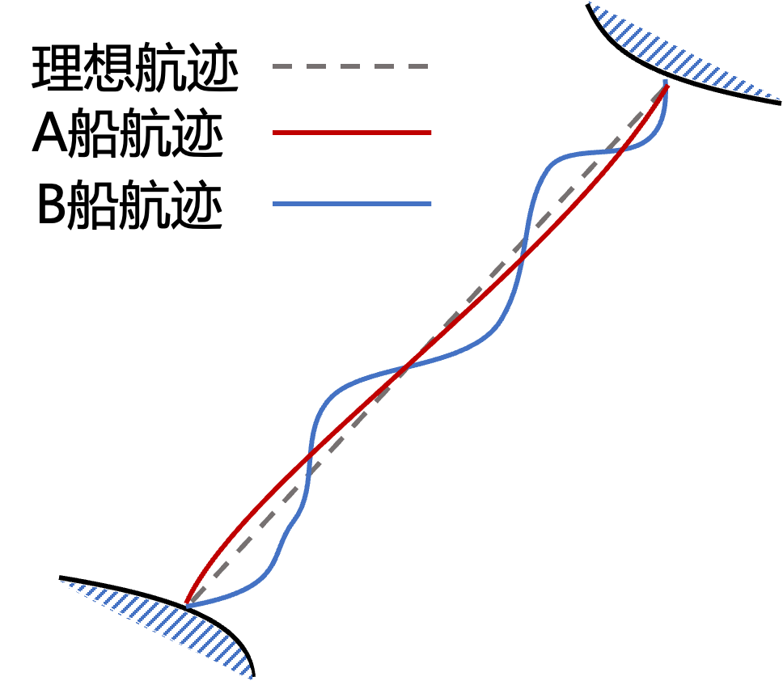
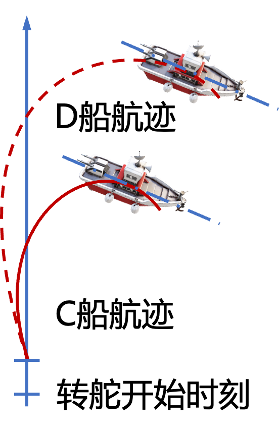
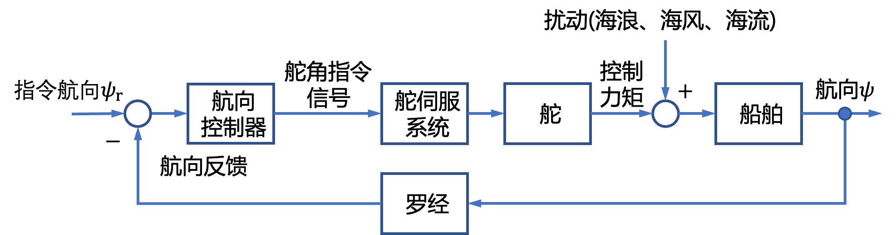
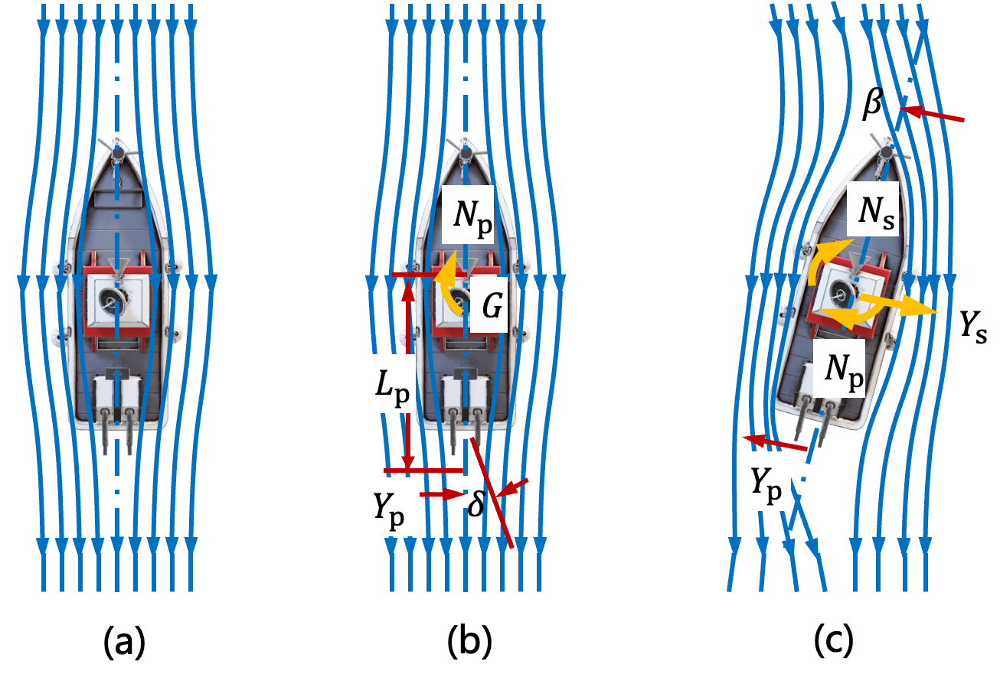
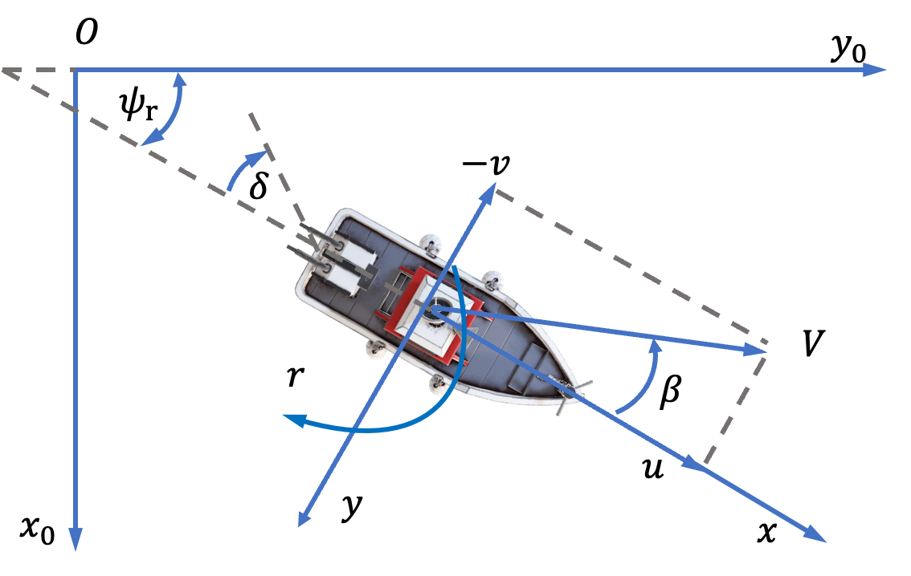
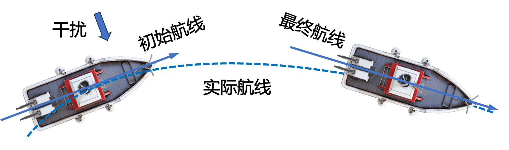
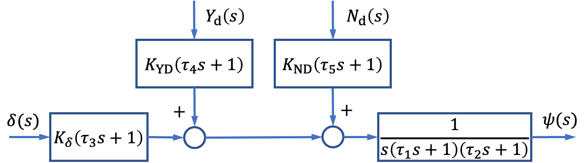
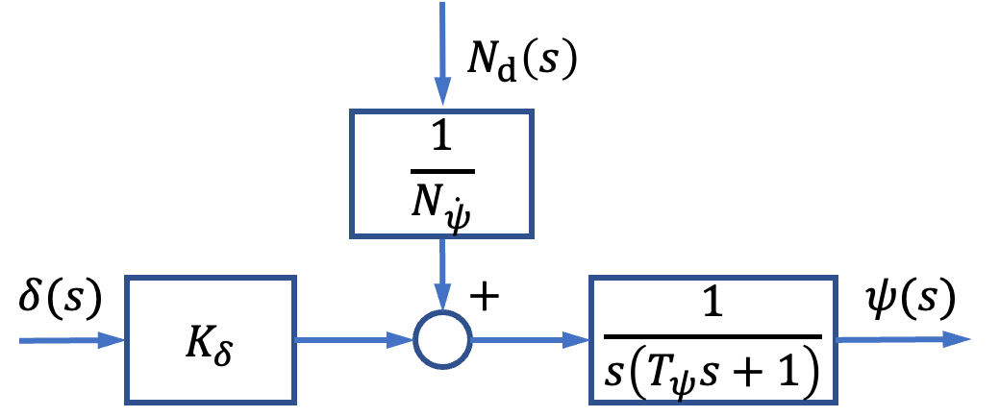
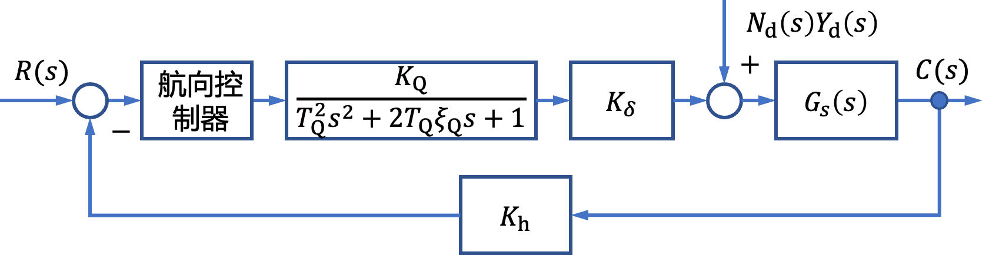

# 2.1 船舶航向控制建模实例

- 所属专题：船舶航向控制建模实例
- 来源文档：`course-content/questions/source/船舶控制案例20240116.docx`

## 正文

船舶航行时，对船舶航向进行控制是必需的。为了尽快地到达目的地和减少燃料的消耗，总是力求使船舶以一定的速度作直线航行，这是船舶的航向保持问题，也就是航向稳定性问题。而当在预定的航线上发现障碍物或其他船舶，或者在有限航道内航行(内河或进出港等)时，必须及时改变航速和航向，这就是船舶航行的机动性问题。航向稳定性和机动性是衡量一艘船舶操纵性好坏的标志。实际航行的船舶经常受到海浪、风和海流等海洋环境的扰动，所以它不可能完全按直线航行。设有A，B两艘船，它们在海上的实际航迹如图2.1.1所示。其中航向稳定性较好的A船，经过很少的操舵即能维持航向，并且航迹也较接近于理想航线。航向稳定性较差的B船则要频繁地进行操纵以纠正航向偏离，并且航迹曲折得多。曲折的航迹一方面增加了航程，另一方面由于校正航向偏差而增加了操纵机械和推进机械的功率消耗。通常由于上述原因而增加的功率消耗约占主机功率的2%~3%，而对于航向稳定性较差的船甚至可高达20%。由此可见，船舶操纵性对经济性有重要影响。

图2.1.2表示两艘机动性不同的船舶在改变航向时的不同航迹。机动性较好的C船，经过较短的时间和在较小的范围内就能改变航向；而机动性较差的D船，则要经过较长的时间和在大得多的水域才能完成转向。所以后者在曲折、狭窄的航道和船舶较多的水域中航行时，会增加碰撞的危险。

据统计，全世界100t以上排水量的船舶，每年有160~170艘主要由于碰撞和搁浅等事故而沉没。每艘船一年平均要出现大小事故约四次之多。造成这些事故的重要原因之就是船舶的操纵性不好。由此可见，操纵性对船舶的安全使用是极为重要的。作战舰艇的操纵性对于提高武器射击的命中率、占据有利阵位和规避敌舰攻击等更有重要意义。在船舶设计中，希望船舶既有良好的航向保持功能，又有灵敏的机动性，而航向稳定性和机动性往往是矛盾的。一般来说，航向稳定性好的船舶，其航向机动性就差。船舶航向控制系统可以较好地解决这个矛盾。

1\. 船舶航向控制系统原理

船舶的航向一般由罗经来测量。罗经测得的航向与指定航向比较后，产生一个航向误差信号，送入自动控制系统。系统根据航向误差计算出所需的舵角指令信号，舵机伺服系统在舵角指令信号的作用下把舵转到所需的角度。在舵的作用下，船舶开始改变航向，当船舶的航向与指令航向一致时，航向误差为零，于是控制系统控制器输出零舵角指令信号，舵机使舵回到零位，船舶在指令航向上航行。因此，海浪、海风和海流等扰动使船舶航向偏离指令航向时，在航向自动系统的作用下，可使船舶回到指令航向上。在船舶工程中，经常把船舶航向控制系统的控制器部分称作自动操舵仪。船舶航向控制系统原理如图2.1.3所示。

一艘左右舷形状对称的船舶，舱位于中间位置时，如果沿纵剖面方向直线航行，由于流体的对称性，船舶将不会受到侧向力作用，如图2.1.4(a)所示。当舵偏转一个$\delta$角时，则改变了水流的对称性，首先在舵上产生一个侧向力$Y_{p}$，$Y_{p}$的作用点距船舶重心$G$为$L_{p}$，时，同时也产生一个绕船舶重心的力矩$N_{p} = Y_{p}L_{p}$，如图2.1.4(b)所示。在力矩$N_{p}$作用下，船体相对于水流发生偏转，船体纵剖面与水流速度方向形成一漂角$\beta$，船体也产生一绕重心$G$的角速度$r$，这就进一步改变了水流的对称性，从而产生了一个作用于船体的侧向力$Y_{s}$和绕重心$G$的力矩$N_{s}$，见图2.1.4(c)。$Y_{s}$和$N_{s}$都与$\beta$和$r$有关。

此后，船舶就在$N_{p}$和$N_{s}$的作用下继续转向和横移运动。这就是利用转舵来改变船舶航向的一个水动力过程。船舶操纵性的好坏不仅与舵的大小、形状及位置有关，而且与船体的形状等有密切关系。

2\. 船舶操纵运动数学模型

(1)船舶操纵运动Davidson-Schiff线性模型

设船舶在图2.1.5所示的平面内运动。如果把动坐标的原点选在船的重心$G$上，并考虑到船舶的对称性，船舶在平衡位置做小幅度运动，则船舶横荡和艏摇运动方程分别为

$$\begin{array}{r}
m\left( \dot{v} + ur \right) = Y_{\delta}\delta + Y_{v}v + Y_{\dot{v}}\dot{v} + Y_{r}r + Y_{\dot{r}}\dot{r} + Y_{d}\tag{2.1.1}
\end{array}$$

$$\begin{array}{r}
I_{z}\dot{r} = N_{\delta}\delta + N_{r}r + N_{\dot{r}}\dot{r} + N_{v}v + N_{\dot{v}}\dot{v} + N_{d}\tag{2.1.2}
\end{array}$$

式中，$u$为船的纵向运动速度，当不考虑干扰作用下的纵荡速度$\Delta u$时，$u$等于航速；$v$为 船的横荡速度；$r$为船的艏摇角速度；$m$为船的质量；$I_{z}$为船的艏摇转动惯量。$Y_{d}$和$N_{d}$是海浪、海风和海流对船舶的横荡扰动力和**艏摇扰动力矩**；$\delta$为舵角；$Y_{\delta}$，$Y_{v}$，$Y_{\dot{v}}$，$Y_{r}$，$Y_{\dot{r}}$，$N_{\delta}$，$N_{r}$，$N_{\dot{r}}$，$N_{v}$，$N_{\dot{v}}$为相应的水动力系数，其定义可参考船舶操纵性方面文献。

式(2.1.1)和式(2.1.2)最初由Davidson和Schiff于1946年提出，所以叫作Davidson-Schiff线性模型。在这个船舶操纵运动模型中，假设船舶的航速为常数，所以忽略了船舶的纵荡运动方程。式中的水动力系数可以通过理论估算得到，但主要由船模或实船的水动力试验和测试得到。Davidson-Schiff模型很简单，但是对于航向自动控制系统的设计还显得有些复杂，所以有必要对此模型进行进一步简化。

(2)船舶操纵运动野本模型

野本谦作(Nomoto)在Davidson-Schiff模型基础上，于1957年提出了两个简单的线性模型。式(2.1.1)和式(2.1.2)可以改写成

$$\begin{array}{r}
\left( m - Y_{\dot{v}} \right)\dot{v} - Y_{v}v + \left( mu - Y_{r} \right)r - Y_{\dot{r}}\dot{r} = Y_{\delta}\delta + Y_{d}\tag{2.1.3}
\end{array}$$

$$\begin{array}{r}
\left( I_{z} - N_{\dot{r}} \right)\dot{r} - N_{r}r - N_{v}v - N_{\dot{v}}\dot{v} = N_{\delta}\delta + N_{d}\tag{2.1.4}
\end{array}$$

对以上两式进行拉普拉斯变换得

$$\begin{array}{r}
\left\lbrack s\left( m - Y_{\dot{v}} \right) - Y_{v} \right\rbrack v(s) + \left\lbrack s\left( - Y_{\dot{r}}\dot{r} \right) + \left( mu - Y_{r} \right) \right\rbrack r(s) = Y_{\delta}\delta(s) + Y_{d}(s)\tag{2.1.5}
\end{array}$$

$$\begin{array}{r}
\left\lbrack s\left( I_{z} - N_{\dot{r}} \right) - N_{r} \right\rbrack r(s) + \left\lbrack s\left( - N_{\dot{v}} \right) - N_{v} \right\rbrack v(s) = N_{\delta}\delta(s) + N_{d}(s)\tag{2.1.6}
\end{array}$$

从(2.1.5)中解出$v(s)$，代入(2.1.6)得

$${\left\lbrack \left( I_{z} - N_{\dot{r}} \right)\left( m - Y_{\dot{v}} \right) - N_{\dot{v}}Y_{\dot{r}} \right\rbrack s^{2}r(s)
}{+ \left\lbrack - \left( I_{z} - N_{\dot{r}} \right)Y_{v} - \left( m - Y_{\dot{v}} \right)N_{r} + \left( mu - Y_{r} \right)N_{\dot{v}} - Y_{\dot{r}}N_{v} \right\rbrack sr(s)
}{+ \left\lbrack \left( mu - Y_{r} \right)N_{v} + N_{r}Y_{v} \right\rbrack r(s) = \left( - Y_{v}N_{\delta} + N_{v}Y_{\delta} \right)\delta(s) + \left\lbrack \left( m - Y_{\dot{v}} \right)N_{\delta} + N_{\dot{v}}Y_{\delta} \right\rbrack s\delta(s)
}\begin{array}{r}
 + N_{v}Y_{d}(s) + N_{\dot{v}}sY_{d}(s) - Y_{v}N_{d}(s) + \left( m - Y_{\dot{v}} \right)sN_{d}(s)\tag{2.1.7}
\end{array}$$

定义

$$\begin{array}{r}
D_{s} = \left( mu - Y_{r} \right)N_{v} + N_{r}Y_{v}\tag{2.1.8}
\end{array}$$

上式在船舶操纵性理论中称为船舶操纵性的稳定性衡准式，$D_{s}$称为稳定性衡准数，它是表示船舶操纵运动稳定性的一个重要参数。对于水面船舶，原始的定常运动为沿实际航线的匀速直线运动，见图2.1.6。当它受到一个航向扰动力后，不经过操舵作用，船舶重心的运动轨迹最终恢复为一直线，但航向发生了变化。这种情况称为船舶具有直线运动稳定性，它表示原来作直线定常航行的船舶在受扰动并在扰动消失后，不经过操舵作用，船舶最终还可以恢复为沿直线航行的定常运动。

判断船舶是否具有直线稳定性可以利用稳定性衡准数来判断。当$D_{s} > 0$时 ，船舶在水平面内的运动具有直线稳定性；当$D_{s} < 0$时，则没有直线稳定性 。

把式(2.1.7)两边同时除以$D_{s}$，作拉氏反变换，并令

$$\begin{array}{r}
\dot{\psi} = r\tag{2.1.9}
\end{array}$$

于是得二阶野本模型为

$$\begin{array}{r}
\tau_{1}\tau_{2}\dddot{\psi} + \left( \tau_{1} + \tau_{2} \right)\ddot{\psi} + \dot{\psi} = K_{\delta}\left( \delta + \tau_{3}\dot{\delta} \right) + K_{YD}\left( Y_{d} + \tau_{4}{\dot{Y}}_{d} \right) + K_{ND}\left( N_{d} + \tau_{5}{\dot{N}}_{d} \right)\tag{2.1.10}
\end{array}$$

其中

$$\tau_{1}\tau_{2} = \frac{- Y_{v}\left( I_{z} - N_{\dot{r}} \right) - N_{r}\left( m - Y_{\dot{v}} \right) + N_{\dot{v}}\left( mu - Y_{r} \right) - Y_{\dot{r}}N_{v}}{D_{s}}$$

$$K_{\delta} = \frac{- Y_{v}N_{\delta} + N_{v}Y_{\delta}}{D_{s}};\ \tau_{3} = \frac{N_{\delta}\left( m - Y_{\dot{v}} \right) + N_{\dot{v}}Y_{\delta}}{N_{v}Y_{\delta} - Y_{v}N_{\delta}}$$

$$K_{YD} = \frac{N_{v}}{D_{s}};\tau_{4} = \frac{N_{\dot{v}}}{N_{v}};\ K_{ND} = - \frac{Y_{v}}{D_{s}};\tau_{5} = - \frac{- m - Y_{\dot{v}}}{Y_{v}}$$

对式(2.1.10)作零初始条件的拉普拉斯变换，得

$${\left\lbrack \tau_{1}\tau_{2}s^{3} + \left( \tau_{1} + \tau_{2} \right)s^{2} + s \right\rbrack\psi(s)
}\begin{array}{r}
 = K_{\delta}\left( \tau_{3}s + 1 \right)\delta(s) + K_{YD}\left( \tau_{4}s + 1 \right)Y_{d}(s) + K_{ND}\left( \tau_{5}s + 1 \right)N_{d}(s)\tag{2.1.11}
\end{array}$$

于是

$$\begin{array}{r}
\frac{\psi(s)}{\delta(s)} = \frac{K_{\delta}\left( \tau_{3}s + 1 \right)}{s\left( \tau_{1}s + 1 \right)\left( \tau_{2}s + 1 \right)}\tag{2.1.12}
\end{array}$$

$$\begin{array}{r}
\frac{\psi(s)}{Y_{d}(s)} = \frac{K_{YD}\left( \tau_{4}s + 1 \right)}{s\left( \tau_{1}s + 1 \right)\left( \tau_{2}s + 1 \right)}\tag{2.1.13}
\end{array}$$

$$\frac{\psi(s)}{N_{d}(s)} = \frac{K_{ND}\left( \tau_{5}s + 1 \right)}{s\left( \tau_{1}s + 1 \right)\left( \tau_{2}s + 1 \right)}$$

二阶野本模型的方框图如图2.1.7所示

船舶在舵作用下的运动基本上是一个质量很大的物体的缓慢的转艏运动，于是野本提出用一个惯性环节来描述船舶艏摇角速度运动方程，也就是著名的一阶野本模型，即

$$\begin{array}{r}
I_{z}\ddot{\psi} + N_{\dot{\psi}}\dot{\psi} = C_{\delta}\delta + N_{d}\tag{2.1.14}
\end{array}$$

式中，$I_{z}$，$N_{\dot{\psi}}$，$C_{\delta}$分别为船舶的回转惯性力矩系数、回转中所受阻尼力矩系数和舵产生的回转力矩系数。

式(2.1.14)可以改写为

$$\begin{array}{r}
T_{\psi}\ddot{\psi} + \dot{\psi} = K_{\delta}\delta + \frac{N_{d}}{N_{\dot{\psi}}}\tag{2.1.14}
\end{array}$$

式中，$T_{\psi} = \frac{I_{z}}{N_{\dot{\psi}}} = \tau_{1} + \tau_{2} + \tau_{3}$，$K_{\delta} = \frac{C_{\delta}}{N_{\dot{\psi}}}$。以力学的点看，$T_{\psi}$和$K_{\delta}$都具有鮮明的物理意义，它们是被广泛用来评定船舶操纵性的参数，$K_{\delta}$称为回转性参数，$T_{\psi}$称为稳定性参数。$T_{\psi}$和$K_{\delta}$可以通过船舶在海上作“Z”形试验得到。

对(2.1.14)作零初始条件下的拉氏变换，得

$$\begin{array}{r}
\left( T_{\psi}s^{2} + s \right)\psi(s) = K_{\delta}\delta(s) + \frac{1}{N_{\dot{\psi}}}N_{d}(s)\tag{2.1.15}
\end{array}$$

于是

$$\begin{array}{r}
\frac{\psi(s)}{\delta(s)} = \frac{K_{\delta}}{s\left( T_{\psi}s + 1 \right)}\tag{2.1.16}
\end{array}$$

$$\begin{array}{r}
\frac{\psi(s)}{N_{d}(s)} = \frac{\frac{1}{N_{\dot{\psi}}}}{s\left( T_{\psi}s + 1 \right)}\tag{2.1.17}
\end{array}$$

一阶野本模型方框图如图2.1.8所示。

(3)舵伺服系统数学模型

舵伺服系统是连接来自航向控制器控制信号和转舵机械组合体的中间转换和功率放 大装置。舵伺服系统主要由控制器、功放与驱动装置和舵机三个部分组成。

无论采用电液伺服系统，还是采用电驱动伺服系统，所设计的伺服系统闭环系统动态白动控制原理特性一般均具有二阶振荡环节的特性，即伺服系统的闭环传递函数为

$$\begin{array}{r}
G_{Q}(s) = \frac{K_{Q}}{T_{Q}s^{2} + 2T_{Q}\xi_{Q}s + 1}\tag{2.1.18}
\end{array}$$

式中，$t_{Q} \ll T_{\psi}$，所以，在设计航向控制系统时，通常可将伺服系统近似为一个比例环节。

(4)反馈通道数学模型

航向控制系统中航向的测量一般采用电罗经，电罗经的响应比电液伺服系统和船舵系统的响应快得多，故可近似为比例环节。

至此，船舶航向控制系统结构图如图2.1.9所示

图2.1.9中，输入信号$R(s)$为指令航向，输出信号$C(s)$为实际航向。$G_{s}(s) = \frac{1}{s\left( T_{\psi}s + 1 \right)}$或$G_{s}(s) = \frac{\tau_{3}s + 1}{s\left( \tau_{1}s + 1 \right)\left( \tau_{2}s + 1 \right)}$。
