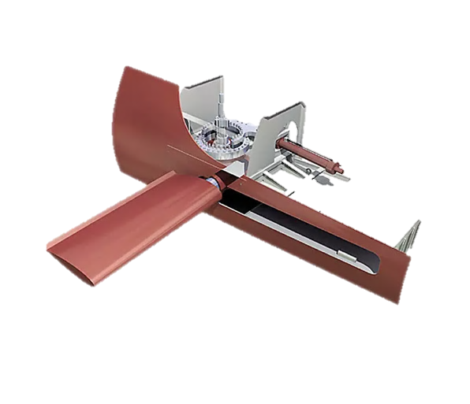
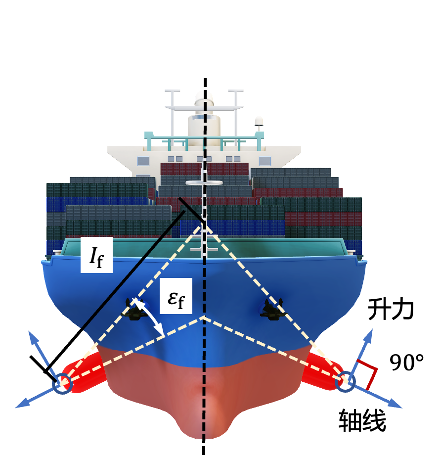
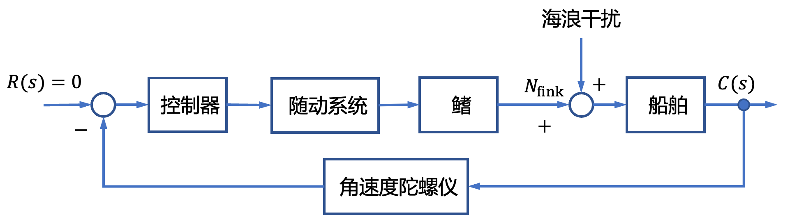
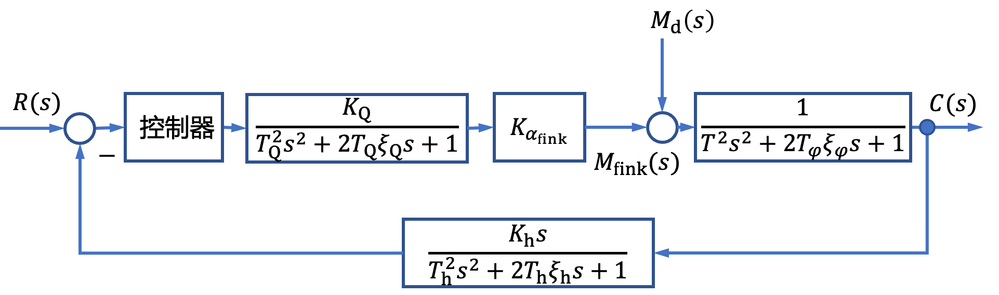

# 2.2 船舶横摇减摇鳍控制系统建模实例

- 所属专题：船舶航向控制建模实例
- 来源文档：`course-content/questions/source/船舶控制案例20240116.docx`

## 正文

船舶在海上航行时，在海浪、海风、海流等作用下，将产生摇荡运动。其中，横摇是较为严重的一种运动。为了减少船舶的横摇运动，就要寻求一种手段，能够产生抵消海浪对船的横摇干扰力矩的稳定力矩。船舶减摇鳍就是人类经过多年探索找到的一种有效减小船舶横摇的方法。船舶减摇鳍是一种主动式减摇装置，它是利用装在船的两弦侧的一对鳍(或两对鳍)的转动(差动)来产生与海浪等对船的横摇干扰力矩方向相反的控制力矩，在鳍的形状和结构尺寸确定的条件下，控制力矩的大小和方向依赖于鳍的转角大小和方向及船与水流的速度。

1.减摇鳍控制系统原理

减摇鳍由船体两舷伸出船体，安装于水线下的一定深度处，它的外形和舵差不多。当船体在风浪中航行产生横摇运动时，鳍在控制系统的控制下，根据船的横摇运动和控制器输出的指令信号，在鳍伺服驱动系统作用下作相应的转动，此时在鳍上产生升力，如图2.2.1左所示。升力作用线垂直水流相对速度和减摇鳍的轴线。由于减摇鳍的布置左右对称，当一侧舷的减摇鳍升力指向鳍面上方时，则另一舷的减摇鳍升力将指向鳍面下方。这样左右减摇鳍产生了升力和相对横摇轴的控制力矩(稳定力矩)，如图2.2.1右所示。

图2.2.1减摇鳍形态及鳍产生的横摇控制力矩示意图

减摇鳍装置作为一个自动控制装置，它可以分成三部分：鳍机械组合体、驱动鳍的随动伺服系统和控制器部分。当舰船在风浪中航行产生横摇时，控制系统通过角速度陀螺仪获得船舶横摇的信息，通过控制器的运算处理后得到鳍角控制信号，经放大后送到电液或电动随动系统，随动系统根据鳍角控制信号驱动鳍按指定动作运行。船体两边的鳍在驱动力和水动力的共同作用下，产生稳定力矩来平衡波浪对船舶产生的扰动力矩，以达到减摇的目的。稳定力矩和波浪的扰动力矩大小尽量相同，方向正好相反，也可称之为平衡力矩。减摇鳍控制系统构成原理图如图2.2.2所示，图中系统输出$C(s)$为船舶横摇角$\varphi$。

由于鳍角是受控制系统控制的，因此鳍所产生的升力也是受控制系统控制的。减摇效果的好坏不但与减摇鳍的水动力特性有关，而且还与控制系统的性能有关。

2.船舶减摇鳍控制系统数学模型

(1)船舶线性横摇运动数学模型

如果船舶的横摇运动角度很小，可以应用线性横摇理论来分析船舶的横摇运动。依照Conolly的理论，没安装减摇鳍的船舶线性横摇运动可以表示为

$$\begin{array}{r}
\left( I_{x} + \mathrm{\Delta}I_{x} \right)\ddot{\varphi} + 2N_{\mu}\dot{\varphi} + Dh\varphi = N_{d}\tag{2.2.1}
\end{array}$$

式中，$I_{x}$，$\mathrm{\Delta}I_{x}$——相对于通过船舶重心纵轴的惯量和附加惯量；

$2N_{\mu}$——每单位横摇角速度的船舶阻尼力矩；

$D$——船的排水量；

$h$——横稳心高

$N_{d}$——海浪对船的横摇干扰力矩。

当安装减摇鳍时，船舶线性横摇运动方程为

$$\begin{array}{r}
\left( I_{x} + \mathrm{\Delta}I_{x} \right)\ddot{\varphi} + 2N_{\mu}\dot{\varphi} + Dh\varphi = N_{fink} + N_{d}\tag{2.2.2}
\end{array}$$

式中，$N_{fink}$为鳍产生的控制力矩(稳定力矩),它与海浪干扰力矩$N_{d}$方向相反。式(2.2.2)两边同除$Dh$,得

$$\begin{array}{r}
\frac{\left( I_{x} + \mathrm{\Delta}I_{x} \right)}{Dh}\ddot{\varphi} + \frac{2N_{\mu}}{Dh}\dot{\varphi} + \varphi = M_{fink} + M_{d}\tag{2.2.3}
\end{array}$$

式中，$M_{fink} = \frac{N_{fink}}{Dh}$,$M_{d} = \frac{N_{d}}{Dh}$。

如令$T_{\varphi} = \sqrt{\frac{I_{x} + \mathrm{\Delta}I_{x}}{Dh}}$,$T_{\varphi}\xi = \frac{N_{\mu}}{Dh}$,则式（2.2.3）可写为

$$\begin{array}{r}
T_{\varphi}^{2}\ddot{\varphi} + 2T_{\varphi}\xi_{\varphi}\dot{\varphi} + \varphi = M_{fink} + M_{d}\tag{2.2.4}
\end{array}$$

在零初始条件下，即$\varphi(0) = \dot{\varphi}(0) = \ddot{\varphi}(0) = 0$，对式(2.2.4)作拉普拉斯变换，得船舶横摇运动传递函数为

$$\begin{array}{r}
G_{\varphi}(s) = \frac{\Phi(s)}{M_{fink}(s)} = \frac{\Phi(s)}{M_{d}(s)} = \frac{1}{T_{\varphi}^{2}s^{2} + 2T_{\varphi}\xi_{\varphi}s + 1}\tag{2.2.5}
\end{array}$$

即

$$\begin{array}{r}
G_{\varphi}(s) = \frac{\omega_{n}^{2}}{s^{2} + 2\xi\omega_{n} + \omega_{n}^{2}}\tag{2.2.6}
\end{array}$$

式中，$T_{\varphi}$——船的横摇运动时间常数；

$\xi_{\varphi}$——阻尼比，在船舶的设计时一般取$0 < \xi < 1$；

$\omega_{n}$——$\omega_{n} = \frac{1}{T_{\varphi}}$。

式(2.2.6)表明船舶线性横摇运动是一个典型的二阶振荡环节。

由于$\omega_{n} = 2\pi/T_{s}$，$T_{s}$为船的横摇固有周期，故有

$$\begin{array}{r}
T_{s} = \frac{2\pi}{\omega_{n}} = 2\pi T_{\varphi}\tag{2.2.7}
\end{array}$$

从式(2.2.7)可以看出，$T_{\varphi}$不是船的横摇固有周期，它与$T_{s}$,之间存在$2\pi$的关系。

将某船的参数带入式(2.2.6),得

$$\begin{array}{r}
G_{\varphi}(s) = \frac{1}{2.052s^{2} + 0.3929s + 1}\tag{2.2.8}
\end{array}$$

(2)减摇鳍数学模型

设鳍绕鳍轴转动的鳍角为$\alpha_{fink}$,此时在鳍上产生的升力为

$$\begin{array}{r}
L_{fink} = \frac{1}{2}\rho V^{2}A_{F}C_{y}(\alpha)\alpha_{fink}\tag{2.2.9}
\end{array}$$

式中，$A_{F}$——鳍的投影面积，$m^{2}$；

$\rho$——海水密度，$kg/m^{3}$；

$V$——航速，$m/s$；

$C_{y}(\alpha)$——鳍的单位鳍角升力系数。

这样左右减摇鳍产生的升力相对横摇轴的控制力矩(稳定力矩)为

$$\begin{array}{r}
N_{fink} = 2L_{fink}l_{f}\cos\varepsilon_{f}\tag{2.2.10}
\end{array}$$

式中，$\varepsilon_{f}$为鳍轴轴线与自鳍中心至穿过船重心的纵轴垂线$l_{f}$间的夹角。由于$\varepsilon_{f}$通常很小，故上式可以近似为

$$\begin{array}{r}
N_{fink} \approx 2L_{fink}l_{f}\tag{2.2.11}
\end{array}$$

(3)减摇鳍(伺服)随动系统模型

伺服系统是减摇鳍系统的重要组成部分，是连接来自控制器控制信号和转鳍机械组合体的中间转换和功率放大装置。减摇鳍伺服系统由控制器、功放与驱动装置和鳍机构组合体三个主要部分组成。无论是采用电液伺服系统，还是采用电动伺服系统，所设计的伺服系统闭环系统动态特性一般均具有二阶振荡环节的特性，即伺服系统的闭环传递函数为

$$\begin{array}{r}
G_{Q}(s) = \frac{K_{Q}}{T^{2}s^{2} + 2T_{Q}\xi_{Q}s + 1}\tag{2.2.12}
\end{array}$$

式中，$T_{Q} \ll T_{\varphi}$。,所以在设计横摇减摇系统控制器时，通常可将伺服系统近似为一个比例环节。

某型减摇鳍电液伺服系统闭环传递函数为

$$G_{Q}(s) = \frac{2}{\frac{1}{225}s^{2} + \frac{3}{125}s + 1}$$

(4)反馈通道数学模型

在减摇鳍控制系统中经常用角速度陀螺作为测量船舶横摇运动的敏感元件。它的运动方程为

$$\begin{array}{r}
\left\{ \begin{array}{r}
J_{T}\Omega\frac{d\varphi}{dt} = J_{R}\frac{d^{2}\beta_{T}}{dt^{2}} + d\frac{d\beta_{T}}{dt} + C\beta_{T} \\
U_{TC} = K_{TC}\beta_{T}
\end{array} \right.\ \tag{2.2.13}
\end{array}$$

式中，$J_{T}$，$J_{R}$——陀螺马达绕其转轴的转动惯量和马达转动角速度$\Omega$绕框架轴的转动惯量；

$\beta_{T}$——框架的转角：

$d$，$C$——框架转动的阻尼系数和框架扭矩力轴的刚度系数；

$K_{TC}$——微动同步器的比例系数。

得角速度陀螺的传递函数为

$$\begin{array}{r}
W_{T}(s) = \frac{k_{n}s}{T_{h}^{2}s^{2} + 2T_{h}\xi_{h}s + 1}\tag{2.2.14}
\end{array}$$

某型角度陀螺的传递函数为

$$\begin{array}{r}
W_{T}(s) = \frac{0.1s}{0.00025s^{2} + 0.002s + 1}\tag{2.2.15}
\end{array}$$

至此，船舶减摇鳍控制系统的结构图如图2.2.3所示。

