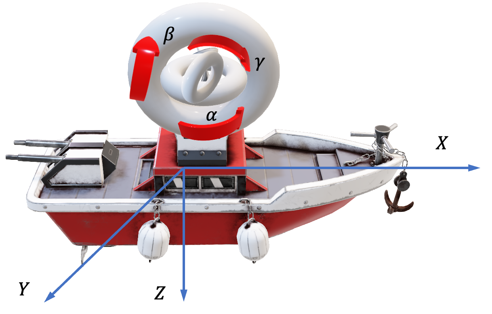
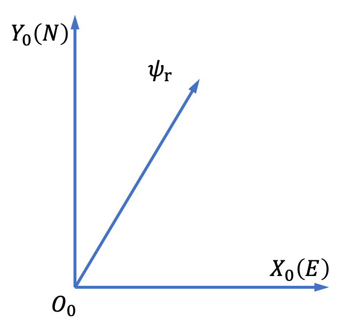
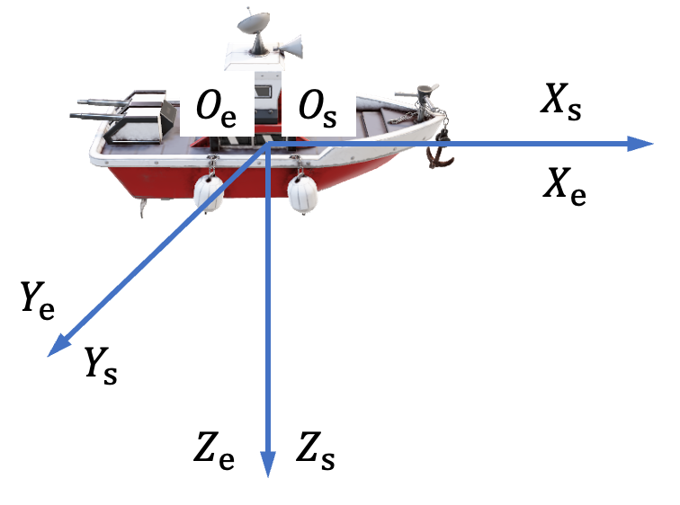
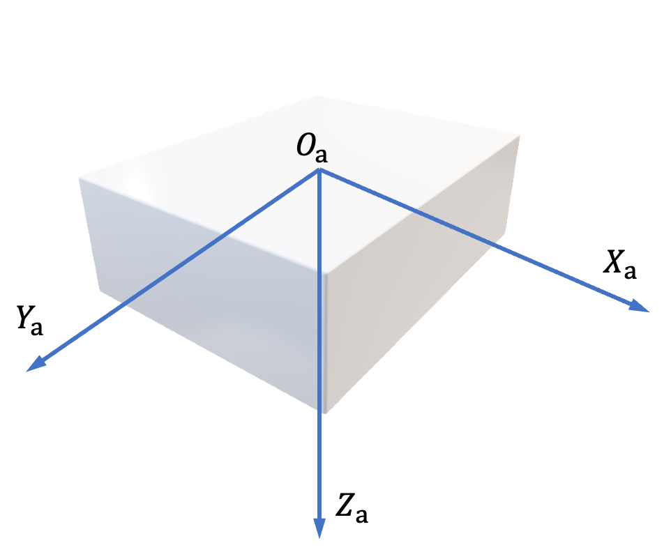
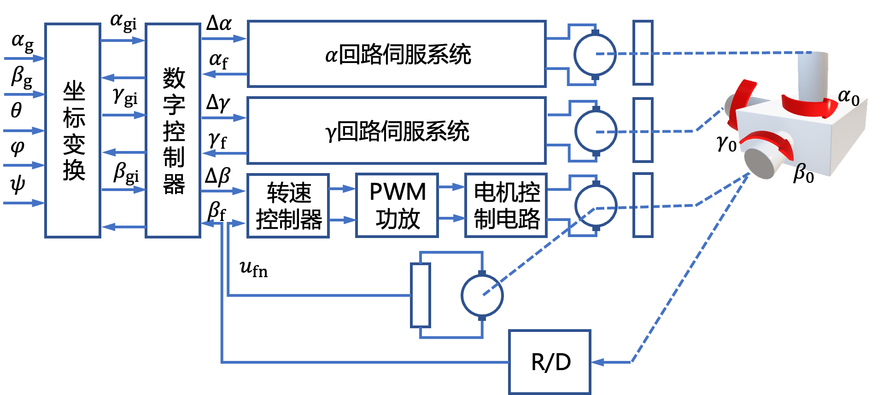
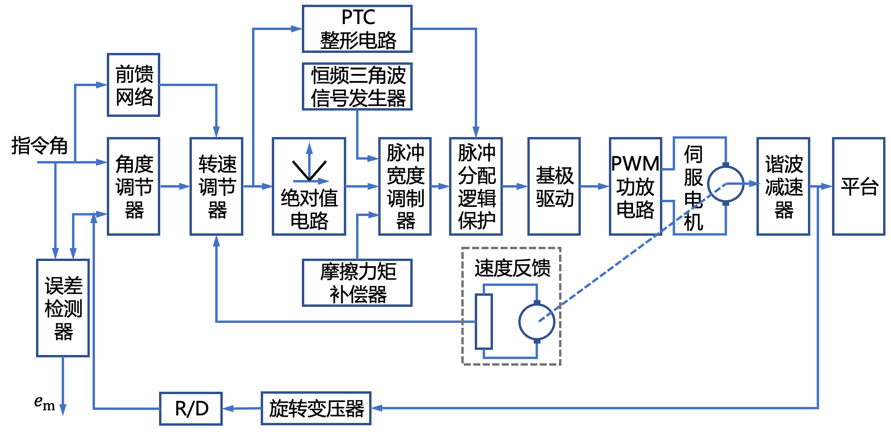
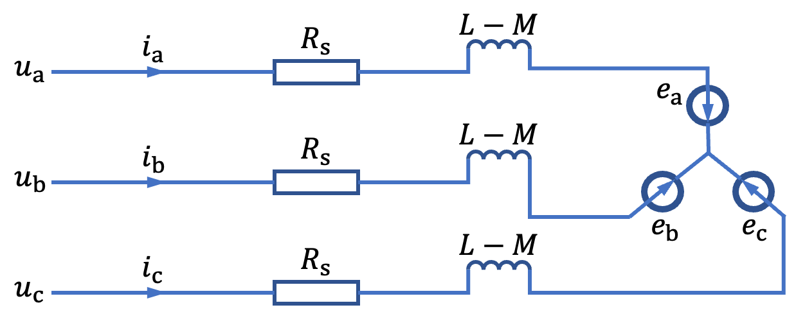
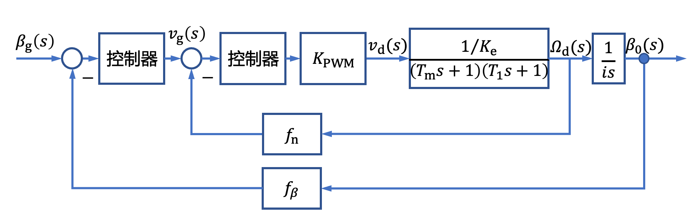

# 2.3 船舶稳定平台控制系统建模实例

- 所属专题：船舶航向控制建模实例
- 来源文档：`course-content/questions/source/船舶控制案例20240116.docx`

## 正文

1.  坐标变换

船舶在海上航行时，在风浪干扰下产生的纵摇﹑横摇、艏摇运动对船载设备(如船载雷达、卫星天线、武器系统、导航设备等)的性能产生很大影响，为了保证船载设备性能不受船舶摇摆的影响，保持这些设备在地球坐标系中的角位置不变，就需要提供一个能隔离船舶摇摆运动的稳定平台。船载稳定平台一般采用三个框架(三个转轴)串联结构，即内框、中框和外框，以抵消船的三个摇摆运动。其原理图如图2.3.1所示。

船载稳定平台控制系统主要有两个功能：一方面，它将隔离船的纵摇、横摇、艏摇三个摇摆运动对平台相对地球坐标系姿态的影响，将船的三个摇摆运动分解在平台的三个转轴上，补偿对平台姿态的影响，使其相对地理坐标系稳定；另一方面，根据指向控制平台驱动到预期位置。为了实现这两个功能，就要求在船作摇摆运动并已获悉船的摇摆信息条件下，根据平台俯仰和方位指向控制信号，得到平台三个转轴伺服系统的指令信号，驱动伺服系统转轴使平台姿态保持在相对地理坐标系期望的位置。如果船载平台的三个框架是独立的，则在测出船的纵摇、横摇、艏摇信号后，再将其反相后作为指令信号给入对应的框架伺服系统，即可达到隔离船的摇摆运动对平台姿态影响的目的。但遗憾的是，对于三轴框架串联结构平台，其三个框架的角度、角速度及转动惯量等是相互耦合影响的，这就需要研究坐标变换，以便求出在船摇摆运动和给定平台指向控制信号条件下三轴伺服系统的指令信号。为给出船载三轴稳定平台伺服系统指令信号，需要进行坐标变换，为此，首先要定义几个有关的坐标系。

（1）地理坐标系$O_{0}X_{0}Y_{0}Z_{0}$

该坐标系原点为船的初始位置，$X_{0}$轴为正东方向，$Y_{0}$轴为正北方向，给定航向(角)$\psi_{r}$,是船的期望航线与正北方向($Y_{0}$轴)的夹角，如图2.3.2(a)所示。

（2）联船地理坐标系$O_{e}X_{e}Y_{e}Z_{e}$

该坐标系是原点与船一起运动的地理坐标系，当船在海面上的无摇摆运动处于平衡状态时，$X_{e}$轴，$Y_{e}$轴，$Z_{e}$轴分别与船的纵轴、横轴、垂直轴重合，如图2.3.2(b)所示。

（3）船体固联轴坐标系$O_{s}X_{s}Y_{s}Z_{s}$

该坐标系与船体固联，其三个坐标轴与船体的纵轴、横轴、垂直轴重合，坐标原点与船的摇摆中心重合，当船处于平衡状态时，联船地理坐标系$O_{e}X_{e}Y_{e}Z_{e}$与该坐标系$O_{s}X_{s}Y_{s}Z_{s}$完全重合，如图2.3.2(b)所示。

|  |  |
|------------------------------------------------------------------------------------------------------------------------------------------------------------|-----------------------------------------------------------------------------------------------------------------------------------------------------------|
| (a)地理坐标系                                                                                                                                              | (b)联船地理坐标系与传递固联轴坐标系                                                                                                                       |

图2.3.2 坐标系

（4）平台坐标系$O_{a}X_{a}Y_{a}Z_{a}$

该坐标系与平台固联，$X_{a}$轴，$Y_{a}$轴，$Z_{a}$轴分别与平台的横滚轴、俯仰轴、方位轴重合，坐标原点与平台摇摆中心重合，且呈右手坐标系，如图2.3.3所示。

为了描述一个空间矢量在不同坐标系中坐标值之间的关系，通常采用变换矩阵表示转换关系。如果一个坐标系围绕其一坐标轴旋转角度$A$,则一个空间矢量在原坐标系中的坐标值$\lbrack x,y,z\rbrack^{T}$与它在新坐标系中的坐标值$\left\lbrack x^{'},y^{'},z^{'} \right\rbrack^{T}$之间的关系为

$$\begin{array}{r}
\left\lbrack \begin{array}{r}
x^{'} \\
y^{'} \\
z^{'}
\end{array} \right\rbrack = \mathbf{T}(A)\left\lbrack \begin{array}{r}
x \\
y \\
z
\end{array} \right\rbrack\tag{2.3.1}
\end{array}$$

式中，$\mathbf{T}(A)$为变换矩阵。

坐标系绕$X$轴、$Y$轴、$Z$轴分别旋转$A_{X},A_{Y},A_{Z}$角度的变换矩阵分别为

$$\begin{array}{r}
\mathbf{T}_{X}\left( A_{X} \right) = \begin{bmatrix}
1 & 0 & 0 \\
0 & \cos A_{X} & \sin A_{X} \\
0 & - \sin A_{X} & \cos A_{X}
\end{bmatrix}\tag{2.3.2}
\end{array}$$

$$\begin{array}{r}
\mathbf{T}_{Y}\left( A_{Y} \right) = \begin{bmatrix}
\cos A_{Y} & 0 & - \sin A_{Y} \\
0 & 1 & 0 \\
\sin A_{Y} & 0 & \cos A_{Y}
\end{bmatrix}\tag{2.3.3}
\end{array}$$

$$\begin{array}{r}
\mathbf{T}_{Z}\left( A_{Z} \right) = \begin{bmatrix}
\cos A_{Z} & \sin A_{Z} & 0 \\
 - \sin A_{Z} & \cos A_{Z} & 0 \\
0 & 0 & 1
\end{bmatrix}\tag{2.3.4}
\end{array}$$

式中，$A_{X}$，$A_{Y}$，$A_{Z}$的旋转正方向为绕旋转轴成右手定则。如果坐标系连续多次旋转，可根据旋转次序通过旋转矩阵乘积的方法求得总的坐标变换矩阵。

船体固联轴坐标系$O_{s}X_{s}Y_{s}Z_{s}$与联船地理坐标系$O_{e}X_{e}Y_{e}Z_{e}$之间的角度是由于船的摇摆运动引起的，其摇摆角是由船上的平台罗经提供的。考虑到平台罗经的常平架结构及测量机理，船体固联轴坐标系$O_{s}X_{s}Y_{s}Z_{s}$，从联船地理坐标系$O_{e}X_{e}Y_{e}Z_{e}$偏离次序为

艏摇角$\psi$→纵摇角$\theta$→横摇角$\varphi$

于是，船上任一点的三维坐标值在两个坐标系$O_{s}X_{s}Y_{s}Z_{s}$，$O_{e}X_{e}Y_{e}Z_{e}$的关系为

$$\begin{array}{r}
\left\lbrack \begin{array}{r}
x_{s} \\
y_{s} \\
z_{s}
\end{array} \right\rbrack = \mathbf{T}_{es}\left( \varphi,\theta,\psi,\psi_{g} \right)\left\lbrack \begin{array}{r}
x_{e} \\
y_{e} \\
z_{e}
\end{array} \right\rbrack\tag{2.3.5}
\end{array}$$

式中，变换矩阵

$${\begin{aligned}
 & \mathbf{T}_{es}\left( \varphi,\theta,\psi,\psi_{g} \right) \\
 = & \mathbf{T}_{X}(\varphi)\mathbf{T}_{Y}(\theta)\mathbf{T}_{Z}\left( \psi - \psi_{g} \right) \\
 = & \begin{bmatrix}
1 & 0 & 0 \\
0 & \cos\varphi & \sin\varphi \\
0 & - \sin\varphi & \cos\varphi
\end{bmatrix}\begin{bmatrix}
\cos\theta & 0 & - \sin\theta \\
0 & 1 & 0 \\
\sin\theta & 0 & \cos\theta
\end{bmatrix}\begin{bmatrix}
\cos\left( \psi - \psi_{g} \right) & \sin\left( \psi - \psi_{g} \right) & 0 \\
 - \sin\left( \psi - \psi_{g} \right) & \cos\left( \psi - \psi_{g} \right) & 0 \\
0 & 0 & 1
\end{bmatrix}\tag{2.3.6}\#
\end{aligned}
}\begin{array}{r}
\#
\end{array}$$

如不考虑线位移，规定平台的初始位置使得平台坐标系与船体固联轴坐标系完全重合。当平台在伺服系统驱动下绕$Z_{a}$，$X_{a}$，$Y_{a}$三个轴依次转动$\alpha$，$\beta$，$\gamma$角度时，根据内框为俯仰运动，中框为横滚运动，外框为方位运动的定义，那么,平台从船体固联轴坐标系中偏离的次序为

方位角$\alpha$→横滚角$\gamma$→俯仰角$\beta$

于是，平台上任一点的三维坐标值在两个坐标系$OX_{a}Y_{a}Z_{a}$与$OX_{s}Y_{s}Z_{s}$中的关系为

$$\begin{array}{r}
\left\lbrack \begin{array}{r}
x_{a} \\
y_{a} \\
z_{a}
\end{array} \right\rbrack = \mathbf{T}_{sa}\left( \alpha,\gamma,\beta,\beta_{g} \right)\left\lbrack \begin{array}{r}
x_{s} \\
y_{s} \\
z_{s}
\end{array} \right\rbrack\tag{2.3.7}
\end{array}$$

式中，变换矩阵

$$\begin{aligned}
 & T_{sa}\left( \alpha,\gamma,\beta,\beta_{g} \right) \\
 = & T_{Y}(\beta) \cdot T_{X}(\gamma) \cdot T_{Z}(\alpha) \\
 = & \begin{bmatrix}
\cos\beta & 0 & - \sin\beta \\
0 & 1 & 0 \\
\sin\beta & 0 & \cos\beta
\end{bmatrix}\begin{bmatrix}
1 & 0 & 0 \\
0 & \cos\gamma & \sin\gamma \\
0 & - \sin\gamma & \cos\gamma
\end{bmatrix}\begin{bmatrix}
\cos\gamma & \sin\gamma & 0 \\
 - \sin\gamma & \cos\gamma & 0 \\
0 & 0 & 1
\end{bmatrix}\tag{2.3.8}\#
\end{aligned}$$

平台坐标系与联船地理坐标系之间的关系是通过船体固联轴坐标系相联系的，由式(2.3.5)和式(2.3.6)有

$$\begin{array}{r}
\left\lbrack \begin{array}{r}
x_{a} \\
y_{a} \\
z_{a}
\end{array} \right\rbrack = T_{sa}(\alpha,\gamma,\beta)T_{es}\left( \varphi,\theta,\psi,\psi_{g} \right)\left\lbrack \begin{array}{r}
x_{e} \\
y_{e} \\
z_{e}
\end{array} \right\rbrack\tag{2.3.9}
\end{array}$$

坐标转换的作用就是保持平台上任意一点的坐标值在平台坐标系中和在联船地理坐标系中是相等的，即

$$\begin{array}{r}
\left\lbrack \begin{array}{r}
x_{a} \\
y_{a} \\
z_{a}
\end{array} \right\rbrack = \left\lbrack \begin{array}{r}
x_{e} \\
y_{e} \\
z_{e}
\end{array} \right\rbrack\tag{2.3.10}
\end{array}$$

于是，由式(2.3.9)和式(2.3.10)有

$$T_{sa}(\alpha,\gamma,\beta)T_{es}\left( \varphi,\theta,\psi,\psi_{g} \right) = I$$

由此得出船舶摇摆运动时经坐标变换后的三轴伺服系统指令信号为：

$$\begin{array}{r}
\left\{ \begin{matrix}
\alpha_{k} = \arccos\left\lbrack \frac{\cot\left( \psi - \psi_{g} \right)\cos\varphi}{\cos\theta} - \tan\theta\sin\varphi \right\rbrack, & \pi \leq \psi \leq \pi \\
\gamma_{k} = \arcsin\left\lbrack \sin{\left( \psi - \psi_{g} \right)\sin\theta\cos\varphi - \cos\left( \psi - \psi_{g} \right)\sin\varphi} \right\rbrack,\  & - \pi \leq \varphi \leq \pi \\
\beta_{k} = \arctan\left\lbrack \frac{\arctan\varphi\sin\left( \psi - \psi_{g} \right)}{\cos\theta} - \tan\theta\cos\left( \psi - \psi_{g} \right) \right\rbrack, & - \frac{2}{\pi} < \theta < \frac{2}{\pi}
\end{matrix} \right.\ \tag{2.3.11}
\end{array}$$

2.  稳定平台三轴伺服系统数学建模

船载稳定平台三自由度运动伺服系统是平台俯仰、横滚、方位三自由度转动的执行系统。俯仰角姿态伺服系统是平台在横向垂直面内转动的执行系统，它一方面要抵消船的纵摇及横摇运动对平台俯仰角姿态的影响，另一方面要根据俯仰角指令信号使平台俯仰角姿态转动到预期的位置。横滚角姿态伺服系统是平台在纵向垂直面内转动的执行系统，它主要是用来抵消船的横摇及纵摇运动对平台横滚角姿态的影响，从而达到稳定平台相对水平面基准的姿态。方位角姿态伺服系统是平台在水平面转动的执行系统，一方面用来克服船的艏摇、横摇和纵摇对平台方位角姿态的影响，另一方面根据方位角指令信号将平台驱动到指定的方位。因此，伺服系统性能的好坏将直接影响平台运动姿态的稳定控制效果。图2.3.4为船载稳定平台控制系统原理的结构图。

图2.3.4中，$\alpha_{g}$，$\beta_{g}$分别为平台方位角和俯仰角指令信号，$\alpha_{gi} = \alpha_{g} + \alpha_{k}$，$\gamma_{gi} = \gamma_{k}$，$,\beta_{gi} = \beta_{g} + \beta_{k}$，平台的俯仰、横滚、方位角三个回路伺服系统结构基本相同，均采用脉宽调制式无刷直流力矩电动机(PWM BDCM)伺服系统结构，见图2.3.5。

旋转变压器的输出是交流400 Hz电压信号，为了与计算机接口，需要模拟/数字转换装置。本系统选用跟踪式双速轴角/数字转换器(R/D)来完成模拟/数字转换功能。输入为旋转变压器的粗机正弦、粗机余弦和精机正弦、精机余弦信号，输出为粗、精组合的十六位角度数字信号和一个模拟量的角度信号。其主要性能指标如下：最大跟踪速率为1000(°)/s,分辨率为16位，精度为$40"$。该转换器转换精度高，跟踪速度快，使用方便。

PWM BDCM伺服系统采用角度、角速度双环从属控制结构。伺服电动机是伺服系统的执行元件，将电能转化为机械能，通过减速器带动平台的一个轴转动。

PWM功放装置有两个作用：一方面，它起着脉冲宽度调制信号功率转换装置的作用；另一方面，它又起着电动机的换向功率开关的作用。采用这种结构使得整体控制回路简化。这种情形下，PWM功放电路受 BDCM换向信号和PWM脉宽信号的联合控制。

以俯仰回路伺服系统为例对无刷直流力矩电动机进行数学建模，直接利用电动机原有的相变量来建立数学模型是比较方便的，而且可获得较准确的结果。假设：忽略磁路饱和，不计涡流和磁滞损耗，转子上没有阻尼绕组，永磁体也不起阻尼作用，则定子三相绕组的等效电路如图2.3.6所示。

BDCM定子三相绕组的电压方程为

$$\begin{array}{r}
\left\lbrack \begin{array}{r}
u_{a} \\
u_{b} \\
u_{c}
\end{array} \right\rbrack = \begin{bmatrix}
R_{s} & 0 & 0 \\
0 & R_{s} & 0 \\
0 & 0 & R_{s}
\end{bmatrix}\left\lbrack \begin{array}{r}
i_{a} \\
i_{b} \\
i_{c}
\end{array} \right\rbrack + \frac{d}{dt}\begin{bmatrix}
L_{a} & L_{ab} & L_{ac} \\
L_{ba} & L_{b} & L_{bc} \\
L_{ca} & L_{cb} & L_{c}
\end{bmatrix}\left\lbrack \begin{array}{r}
i_{a} \\
i_{b} \\
i_{c}
\end{array} \right\rbrack + \left\lbrack \begin{array}{r}
e_{a} \\
e_{b} \\
e_{c}
\end{array} \right\rbrack\tag{2.3.12}
\end{array}$$

式中，假定三相绕组的电阻相等，$L_{a}$，$L_{b}$，$L_{c}$分别为三相绕组的自感，$L_{ab}$为A相绕组和B相组间的互感，其他类同，且有$L_{ab} = L_{ba}$，$L_{ac} = L_{ca}$，$L_{bc} = L_{cb}$。对于凸装式转子结构，可忽略凸极效应，因此三相定子绕组的自感为常数，三相绕组间的互感也为常数，两者都与转子位置无关。因此，如令

$$L_{a} = L_{b} = L_{c} = L,\ \ L_{ab} = L_{bc} = L_{ca} = M$$

则式（2.3.12）可写为

$$\begin{array}{r}
\left\lbrack \begin{array}{r}
u_{a} \\
u_{b} \\
u_{c}
\end{array} \right\rbrack = \begin{bmatrix}
R_{s} & 0 & 0 \\
0 & R_{s} & 0 \\
0 & 0 & R_{s}
\end{bmatrix}\left\lbrack \begin{array}{r}
i_{a} \\
i_{b} \\
i_{c}
\end{array} \right\rbrack + \frac{d}{dt}\begin{bmatrix}
L & M & M \\
M & L & M \\
M & M & L
\end{bmatrix}\left\lbrack \begin{array}{r}
i_{a} \\
i_{b} \\
i_{c}
\end{array} \right\rbrack + \left\lbrack \begin{array}{r}
e_{a} \\
e_{b} \\
e_{c}
\end{array} \right\rbrack\tag{2.3.13}
\end{array}$$

若定子三相绕组为Y形连接，且没有中线，则有

$$\begin{array}{r}
i_{a} + i_{b} + i_{c} = 0\tag{2.3.14}
\end{array}$$

于是可得

$$\begin{array}{r}
\left\{ \begin{array}{r}
Mi_{a} + Mi_{c} = - Mi_{b} \\
Mi_{b} + Mi_{c} = - Mi_{a} \\
Mi_{a} + Mi_{b} = - Mi_{c}
\end{array} \right.\ \tag{2.3.15}
\end{array}$$

将上述关系代入式(2.3.13)得

$$\begin{array}{r}
\left\lbrack \begin{array}{r}
u_{a} \\
u_{b} \\
u_{c}
\end{array} \right\rbrack = \begin{bmatrix}
R_{s} & 0 & 0 \\
0 & R_{s} & 0 \\
0 & 0 & R_{s}
\end{bmatrix}\left\lbrack \begin{array}{r}
i_{a} \\
i_{b} \\
i_{c}
\end{array} \right\rbrack + \frac{d}{dt}\begin{bmatrix}
L - M & 0 & 0 \\
0 & L - M & 0 \\
0 & 0 & L - M
\end{bmatrix}\left\lbrack \begin{array}{r}
i_{a} \\
i_{b} \\
i_{c}
\end{array} \right\rbrack + \left\lbrack \begin{array}{r}
e_{a} \\
e_{b} \\
e_{c}
\end{array} \right\rbrack\tag{2.3.16}
\end{array}$$

因在任意时刻只有两相绕组导通，故有

$$\begin{array}{r}
\left\{ \begin{array}{r}
u_{a} - u_{b} = R_{s}\left( i_{a} - i_{b} \right) + (L - M)\frac{d\left( i_{a} - i_{b} \right)}{dt} + \left( e_{a} - e_{b} \right) \\
u_{b} - u_{c} = R_{s}\left( i_{b} - i_{c} \right) + (L - M)\frac{d\left( i_{b} - i_{c} \right)}{dt} + \left( e_{b} - e_{c} \right) \\
u_{c} - u_{a} = R_{s}\left( i_{c} - i_{a} \right) + (L - M)\frac{d\left( i_{c} - i_{a} \right)}{dt} + \left( e_{c} - e_{a} \right)
\end{array} \right.\ \tag{2.3.17}
\end{array}$$

由于三相绕组的对称性，因此可令

$$\begin{array}{r}
u_{d} = u_{a} - u_{b} = u_{b} - u_{c} = u_{c} - u_{a}\tag{2.3.18}
\end{array}$$

$$\begin{array}{r}
i_{d} = i_{a} - i_{b} = i_{b} - i_{c} = i_{c} - i_{a}\tag{2.3.19}
\end{array}$$

$$\begin{array}{r}
e_{d} = e_{a} - e_{b} = e_{b} - e_{c} = e_{c} - e_{a}\tag{2.3.20}
\end{array}$$

$$\begin{array}{r}
L_{d} = L - M\tag{2.3.21}
\end{array}$$

式中 $u_{d}$——电动机定子电枢电压；

> $i_{d}$——电枢电流；
>
> $e_{d}$——电枢反电势，

BDCM电枢电压平衡方程式为

$$\begin{array}{r}
u_{d} = R_{s}i_{d} + L_{d}\frac{di_{d}}{dt} + e_{d}\tag{2.3.22}
\end{array}$$

$$\begin{array}{r}
K_{m}i_{d} = J_{\beta\sum\ }\frac{d\omega}{dt}\tag{2.3.23}
\end{array}$$

于是有

$$\begin{array}{r}
u_{d} = \frac{R_{s}J_{\sum_{}^{}\ }}{K_{m}} \bullet \frac{d\omega}{dt} + \frac{L_{d}J_{\sum_{}^{}\ }}{K_{m}} \bullet \frac{d^{2}\omega_{d}}{dt^{2}} + K_{e}\omega_{d}\tag{2.3.24}
\end{array}$$

对上式在零初始条件下取拉氏变换得

$$\begin{array}{r}
\frac{\Omega_{d}(s)}{U_{d}(s)} = \frac{\frac{1}{K_{e}}}{\left( T_{m}s + 1 \right)\left( T_{1}s + 1 \right)}\tag{2.3.25}
\end{array}$$

式中 $T_{m}$——电动机的机电时间常数，$T_{m} = \frac{R_{s}J_{\beta\sum\ }}{K_{e}K_{m}}$;

> $T_{1}——$电动机的电磁时间常数，$T_{1} = \frac{L_{d}}{R_{s}}$;
>
> $J_{\beta\sum\ }$——等效到电动机轴上的转动惯量。

设PWM放大系数为$K_{PWM} = \frac{v_{d}(s)}{v_{g}(s)}$,角速度反馈系数为$f_{n} = \frac{v_{g}(s)}{\Omega_{d}(s)}$，角度反馈系数为$f_{\beta} = \frac{\beta_{g}(s)}{\beta_{0}(s)}$，谐波减速器的变比为$i$，则减速器的传递函数为

$$\begin{array}{r}
G(s) = \frac{1}{is}\tag{2.3.26}
\end{array}$$

综上，俯仰角伺服系统的结构图如图2.3.7所示。

需要指出，尽管方位角回路和横滚角回路伺服系统的结构图与俯仰角回路伺服系统的结构图非常相似，但由于三轴框架串联结构的特点，使得三轴间的转动惯量存在耦合影响。具体说就是

$$J_{\alpha\sum} = J_{\alpha} + f_{\alpha}\left( J_{\gamma} \right) + g_{\alpha}\left( J_{\beta} \right),J_{\gamma\sum} = J_{\gamma\sum} = J_{\gamma} + g_{\gamma}(J_{\beta})$$

式中 $J_{\alpha\sum}$——等效到$\alpha$轴上的总转动惯量；

> $J_{\alpha}$——$\alpha$轴自身转动惯量；
>
> $f_{\alpha}\left( J_{\gamma} \right)$——$\gamma$轴对$\alpha$轴转动惯量的影响部分；
>
> $g_{\alpha}\left( J_{\beta} \right)$——$\beta$轴对$\alpha$轴转动惯量的影响部分；
>
> $J_{\gamma\sum}$——等效到$\gamma$轴上的总转动惯量；
>
> $J_{\gamma}$——$\gamma$轴自身转动惯量；
>
> $g_{\gamma}(J_{\beta})$——$\beta$轴对$\gamma$轴转动惯量的影响部分。

