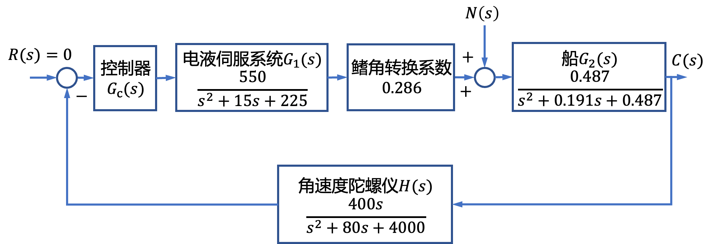
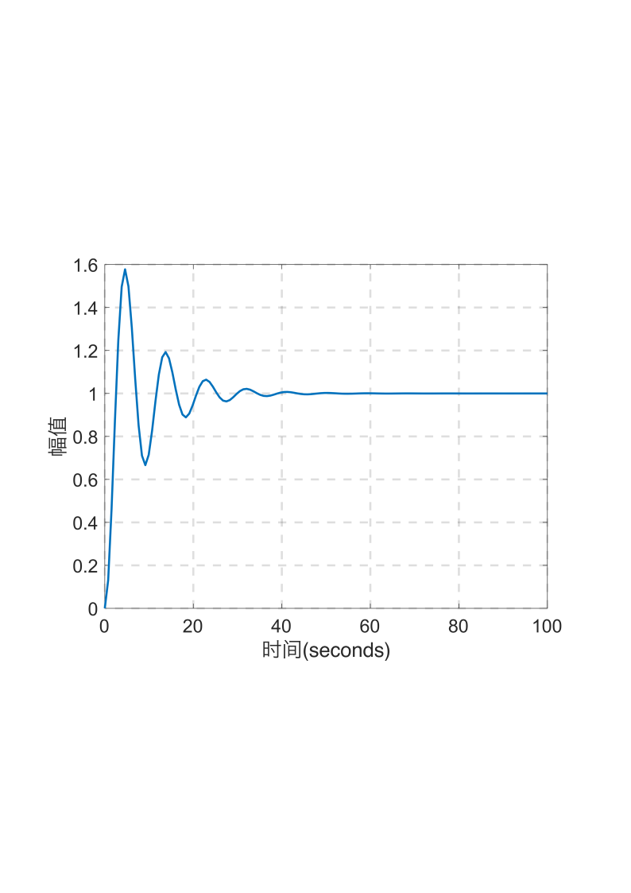
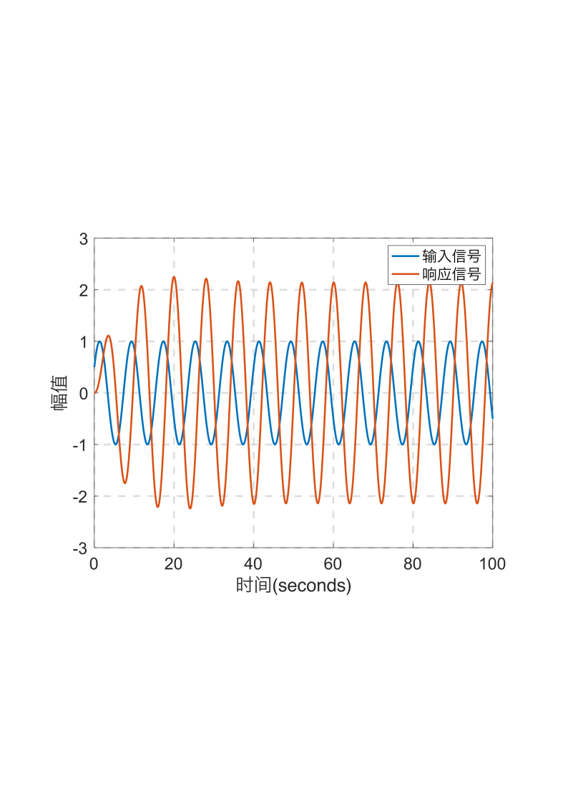

# 3.2 船舶横摇减摇鳍控制时域分析实例

- 所属专题：船舶时域分析实例
- 来源文档：`course-content/questions/source/船舶控制案例20240116.docx`

## 正文

在船舶横摇减摇鳍控制系统中，横摇减摇效果的好坏不但与横摇减摇鳍的水动力特性有关，还与控制系统的性能有关。图3.2.1为船舶横摇减摇鳍控制系统的结构图，图中，$R(s)$为预期的横摇减摇鳍角，通常$R(s) = 0$，$C(s)$为实际的横摇鳍角，$N(s)$为影响横摇的随机海浪扰动因素。本例的目的是，仅采用比例(P)控制，分析系统分别在单位阶跃扰动信号和正弦扰动信号作用下的动态响应。

> ①根据系统结构图，扰动输入信号$N(s)$作用下的系统闭环传递函数为
>
> $$\Phi_{\varepsilon n}(s) = \frac{C(s)}{N(s)} = \frac{G_{2}(s)}{1 + 0.286G_{c}(s)G_{1}(s)G_{2}(s)H(s)}$$
>
> 系统进采用比例(P)控制，即$G_{c}(s) = K_{p}$,则
>
> $${\Phi_{\varepsilon n}(s) = \frac{G_{2}(s)}{1 + 0.286K_{p}G_{1}(s)G_{2}(s)H(s)}
> }{= \frac{0.487\left( s^{2} + 15s + 225 \right)\left( s^{2} + 80s + 4000 \right)}{\left( s^{2} + 15s + 225 \right)\left( s^{2} + 0.191s + 0.487 \right)\left( s^{2} + 80s + 4000 \right) + 30642.04K_{p}s}\ }$$

设$N(s) = \frac{1}{s}$，则系统在单位阶跃扰动输入信号作用下的稳态输出为

$${C\left. （\infty \right.） = \lim_{s \rightarrow 0}{s\Phi_{\varepsilon n}(s)N(s)}
}{= \lim_{s \rightarrow 0}s\frac{0.487\left( s^{2} + 15s + 225 \right)\left( s^{2} + 80s + 4000 \right)}{\left( s^{2} + 15s + 225 \right)\left( s^{2} + 0.191s + 0.487 \right)\left( s^{2} + 80s + 4000 \right) + 30642.04K_{p}}\frac{1}{s}
}{= 1}$$

选择合适的比例(P)控制系数$K_{p}$，以满足闭环系统稳定。这里，选择$K_{p} = 1.43$,此时$C(\infty) = 1$，则当$K_{p} = 1.43$时系统在单位阶跃扰动信号下的响应曲线如图3.2.2。由图3.2.2可见，系统出现了较大振荡，其动态性能较差。

②考虑到船舶横摇减摇鳍控制系统的实际扰动为海浪干扰信号，设海浪干扰输入信号的频率为0.785rad/s，即信号周期为8s。则采用如下的等效正弦扰动信号作为海浪干扰

$$n(t) = \sin\left( \frac{2\pi}{8}t + \frac{\pi}{6} \right)$$

当$K_{p} = 1.43$时，系统在等效正弦扰动信号作用下的响应曲线如图3.2.3所示。

由图3.2.3和图3.2.3可见，船舶横摇减摇鳍控制系统中，若仅仅采用比例控制，其动态性能并不能令人满意，需要后续进一步探讨合适的控制器。

|  |  |
|------------------------------------------------------------------------------------------------------------------------------------------------------------|------------------------------------------------------------------------------------------------------------------------------------------------------------|
| 图3.2.2船舶横摇减摇鳍控制系统的单位阶跃响应曲线                                                                                                            | 图3.2.3船舶横摇减摇鳍控制系统的等效正弦响应曲线                                                                                                            |
