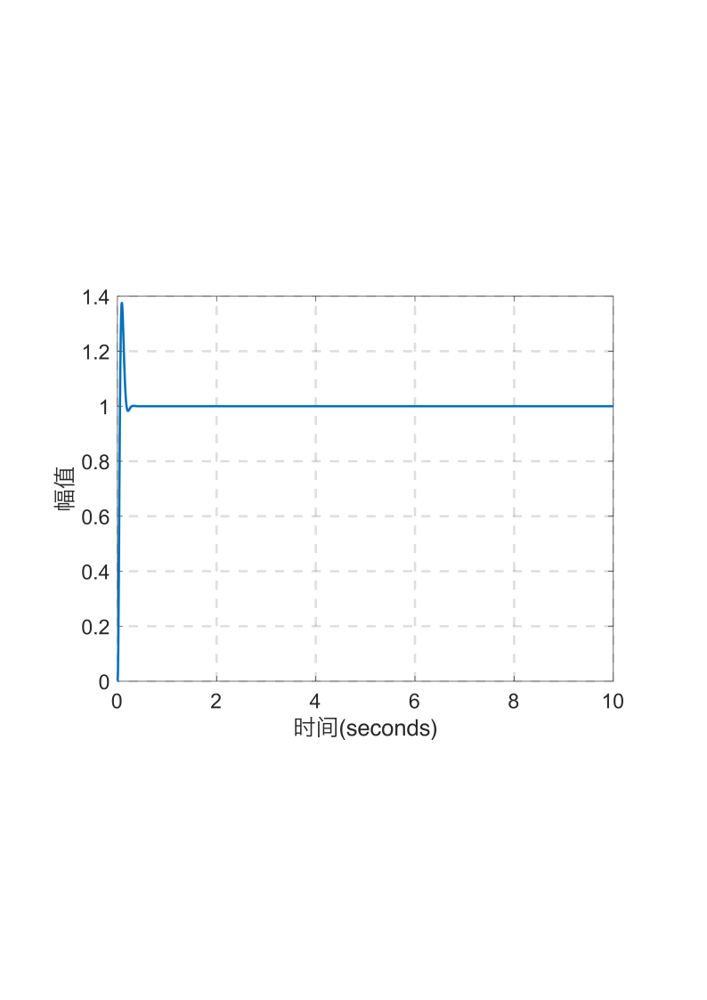
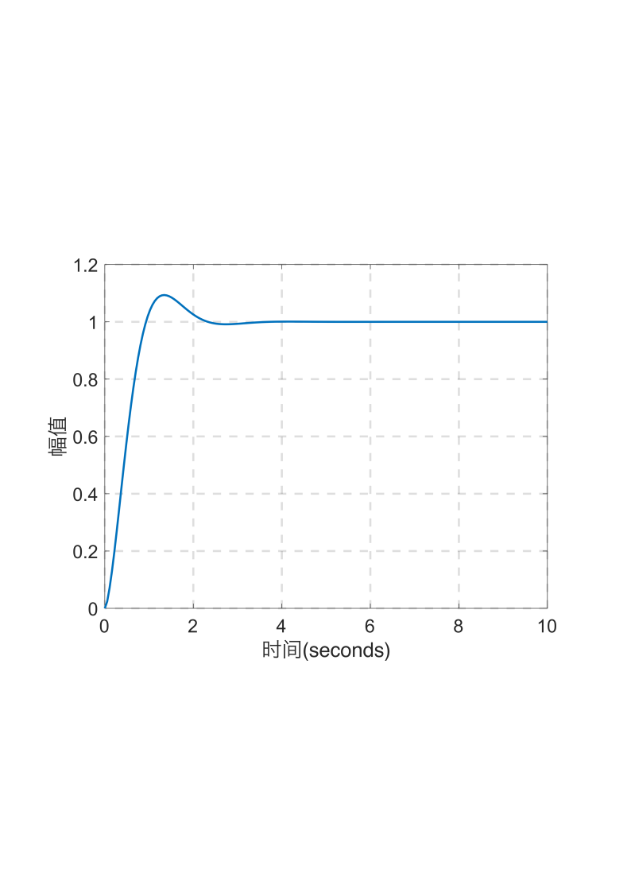
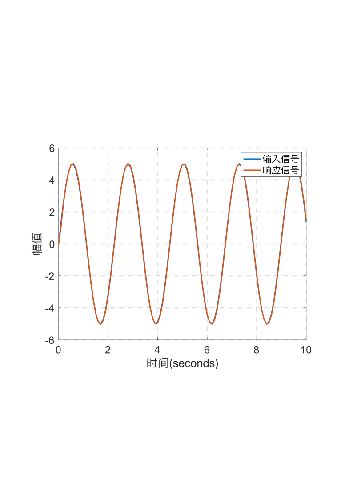
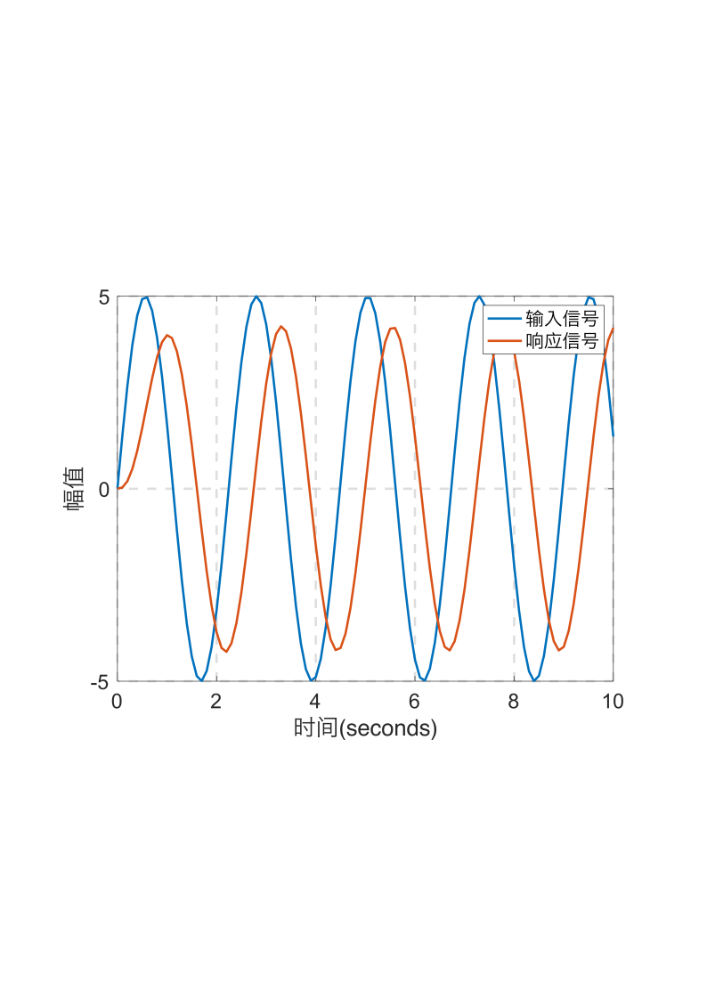

# 3.3 船载稳定平台控制系统时域分析实例

- 所属专题：船舶时域分析实例
- 来源文档：`course-content/questions/source/船舶控制案例20240116.docx`

## 正文

船载稳定平台俯仰角伺服系统是船载稳定平台在俯仰、横滚、方位三自由度运动的驱动系统。本例以船载稳定平台俯仰角伺服系统为例进行分析，船载稳定平台俯仰角伺服系统结构图如图3.3.1所示。图中，$C(s)$为实际的俯仰角，$R(s)$为给定的俯仰角。本例的目的是分析系统分别在单位阶跃信号和正弦信号作用下的动态性能和稳态性能。

**解** 由系统结构图可知，系统输入信号$R(s)$作用下的闭环传递函数为

$$\Phi(s) = \frac{C(s)}{R(s)} = \frac{G_{1}(s)G_{2}(s)G_{3}(s)}{1 + G_{1}(s)G_{2}(s)G_{3}(s)}$$

式中，系统的开环传递函数为$G_{1}(s)G_{2}(s)G_{3}(s)$。则系统的闭环特征方程为

$$D(s) = 1 + G_{1}(s)G_{2}(s)G_{3}(s) = 0$$

将$G_{1}(s)，G_{2}(s)，G_{3}(s)$代入上式整理得

$$D(s) = 0.0002833s^{5} + 0.341s^{4} + 57.89s^{3} + 3537s^{2} + (10100 + 19730K)s + 296000K = 0$$

列写劳斯表得

$$\begin{matrix}
s^{5} & 0.0002833 & 57.89 & 10100 + 19730K \\
s^{4} & 0.341 & 3537 & 296000K \\
s^{3} & 54.95 & 10100 + 19484.08563K & 0 \\
s^{2} & 3474.323 - 120.911K & 296000K & \\
s^{1} & \frac{- 2355840.2776K^{2} + 50207605.738K + 3509066.2}{3474.323 - 120.911K} & 0 & \\
s^{0} & 296000K & &
\end{matrix}$$

由劳斯稳定判据知，使系统闭环稳定的充分必要条件为

$$3474.323 - 120.911K > 0$$

$$2355840.2776K^{2} - 50207605.738K - 3509066.2 < 0$$

$$K > 0$$

由此可得，系统稳定的参数K的范围是$0 < K < 21.39$。

从稳态性能考虑，系统在输入信号$R(s)$作用下的误差传递函数为

$$\Phi_{e}(s) = \frac{E(s)}{R(s)} = \frac{1}{1 + G_{1}(s)G_{2}(s)G_{3}(s)}$$

当系统稳定时，有

$$\begin{aligned}
e_{ss} & = \lim_{s \rightarrow 0}{s\Phi_{e}(s)R(s)} \\
 & = \lim_{s \rightarrow 0}{s\frac{s\left\lbrack (1.7s + 1)(0.005s + 1)(0.001s + 1) + 100 \right\rbrack\left( \frac{s}{3} + 1 \right)}{s\left\lbrack (1.7s + 1)(0.005s + 1)(0.001s + 1) + 100 \right\rbrack\left( \frac{s}{3} + 1 \right) + 2960K\left( \frac{s}{15} + 1 \right)}\frac{1}{s}} \\
 & = 0\#
\end{aligned}$$

上式表明，系统在单位阶跃输人下的稳态误差为零，此时开环增益$K$的取值不会影响系统的稳态性能。当$K = 5$和$K = 0.09$时系统的单位阶跃响应如图3.3.2和图3.3.3所示。由图3.3.2可见，当$K = 5$时系统对输入信号的响应速度很快，但超调量非常大；当开环增益$K$减小至$K = 0.09$时，系统对输入信号的超调量减小，但响应速度变慢。因此，应根据系统对动态性能的要求选择$K$的最佳值，以使得系统响应能兼顾快速性和阻尼程度的要求。

<table>
<colgroup>
<col style="width: 50%" />
<col style="width: 50%" />
</colgroup>
<thead>
<tr class="header">
<th></th>
<th></th>
</tr>
</thead>
<tbody>
<tr class="odd">
<td>
图3.3.2 船载稳定平台俯仰角伺服系统当

<em>K</em> = 5时的单位阶跃响应曲线
</td>
<td>
图3.3.3 船载稳定平台俯仰角伺服系统当

<em>K</em> = 0.09 时的单位阶跃响应曲线
</td>
</tr>
</tbody>
</table>

对于船载稳定平台俯仰角伺服系统，由于船舶摇摆是随机的，所以三轴平台伺服系统的输入指令也是随机信号。为了分析和设计该系统，有必要求出船载稳定平台俯仰角伺服系统的等效正弦运动及系统的等效正弦输入，并分析正弦输入信号下的系统响应。

这里以俯仰角伺服系统为例。设船的纵摇周期为$T_{\theta}$,纵摇角最大幅度为$\theta_{m}$,则船的纵摇等效正弦运动为

$$\theta(t) = \theta_{m}\sin\left( \frac{2\pi}{T}t \right)$$

于是，有

$$\dot{\theta}(t) = \frac{2\pi}{T}\theta_{m}\sin\left( \frac{2\pi}{T}t + \frac{\pi}{2} \right)$$

$$\ddot{\theta}(t) = - \left( \frac{2\pi}{T} \right)^{2}\theta_{m}\sin\left( \frac{2\pi}{T}t \right)$$

由此可得

$${\dot{\theta}}_{m} = \frac{2\pi}{T}\theta_{m}，{\ddot{\theta}}_{m} = \left( \frac{2\pi}{T} \right)^{2}\theta_{m}$$

设俯仰角伺服系统等效正弦输入为

$$\beta_{r}(t) = \beta_{m}\sin\left( \omega_{\beta}t \right)$$

于是有

$$\dot{\beta}(t) = \omega_{\beta}\beta_{m}\sin\left( \omega_{\beta}t + \frac{\pi}{2} \right)$$

$$\ddot{\beta}(t) = - \omega_{\beta}^{2}\beta_{m}\sin\left( \omega_{\beta}t \right)$$

由此可得

$${\dot{\beta}}_{m} = \omega_{\beta}\beta_{m},\ \ {\ddot{\beta}}_{m} = \omega_{\beta}^{2}\beta_{m}$$

由于俯仰角伺服系统在隔离船的纵摇运动的同时，还要实现其转向控制。设转向控制最大角速度为${\dot{\beta}}_{gm}$,则俯仰角伺服系统的等效正弦输入最大角速度

$${\dot{\beta}}_{m} = \theta_{m} + {\dot{\beta}}_{gm},\ \ \beta_{m} = \theta_{m}$$

于是有

$$\omega_{\beta} = \frac{{\dot{\beta}}_{m}}{\beta_{m}} = \left( {\dot{\theta}}_{m} + {\dot{\beta}}_{gm} \right)/\theta_{m}$$

进一步得等效正弦输入为

$$\beta_{r}(t) = \theta_{m}\sin\left( \frac{{\dot{\theta}}_{m} + {\dot{\beta}}_{gm}}{\theta_{m}}t \right)$$

设某船载稳定平台俯仰角伺服系统的参数为$T_{\theta} = 3.5\ s$，$\beta_{m} = 5^{\circ}$，${\dot{\beta}}_{gm} = 5({^\circ})/s$。于是，有

$$\beta_{r}(t) = 5\sin{2.8t}$$

本例中，设给定的俯仰角$R(s) = \beta_{r}(t) = 5\sin{2.8t}$，船载稳定平台俯仰角伺服系统当$K = 5$和$K = 0.09$时在等效正弦输入下的系统响应曲线如图3.3.4和图3.3.5。

|  |  |
|------------------------------------------------------------------------------------------------------------------------------------------------------------|------------------------------------------------------------------------------------------------------------------------------------------------------------|
| 图3.3.4船载稳定平台俯仰角伺服系统当$K = 5$时在等效正弦输入下的响应曲线                                                                                     | 图3.3.5载稳定平台俯仰角伺服系统当$K = 0.09$时在等效正弦输入下的响应曲线                                                                                    |

##
