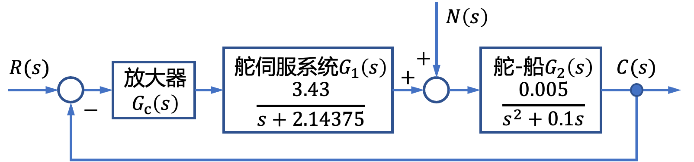
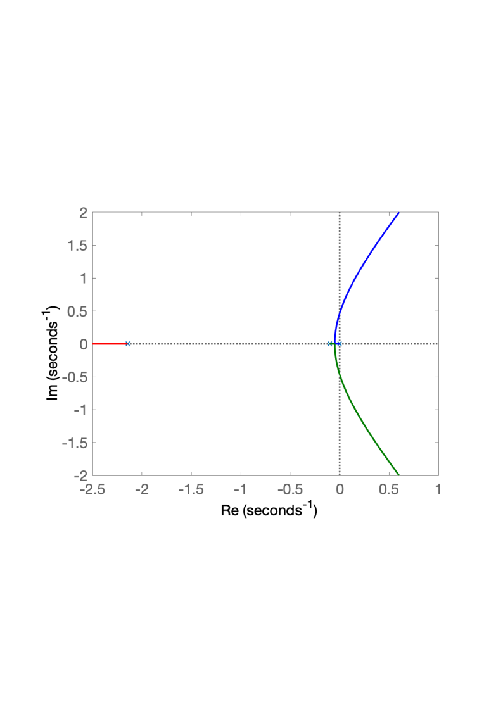
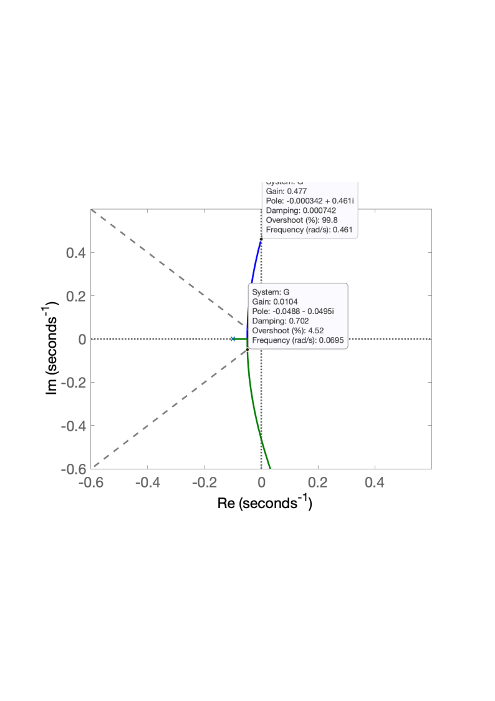
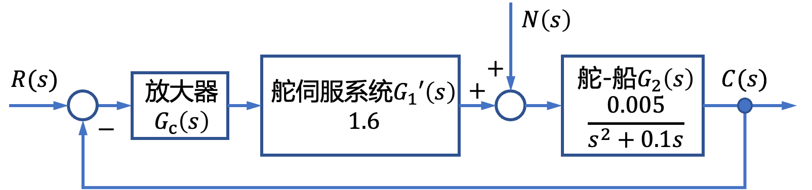
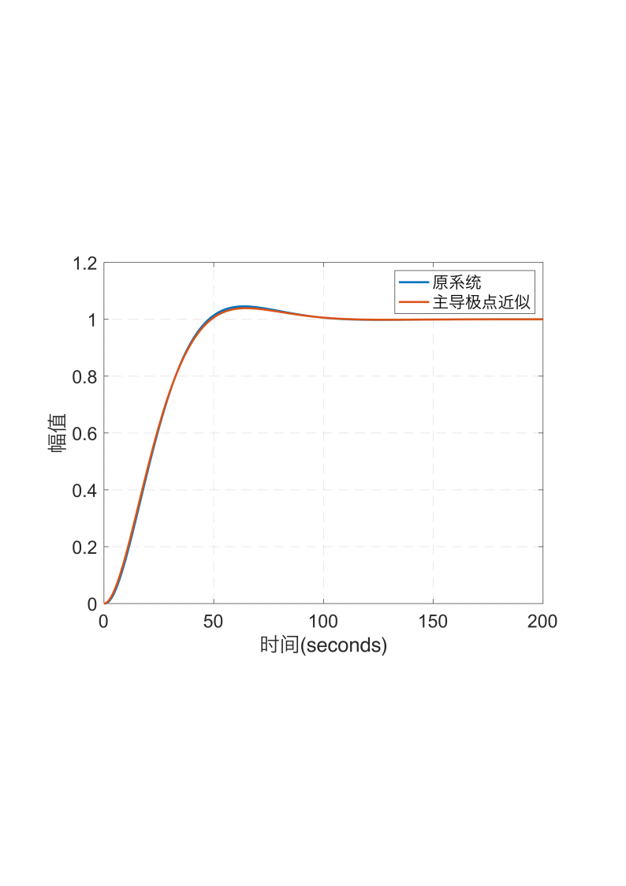
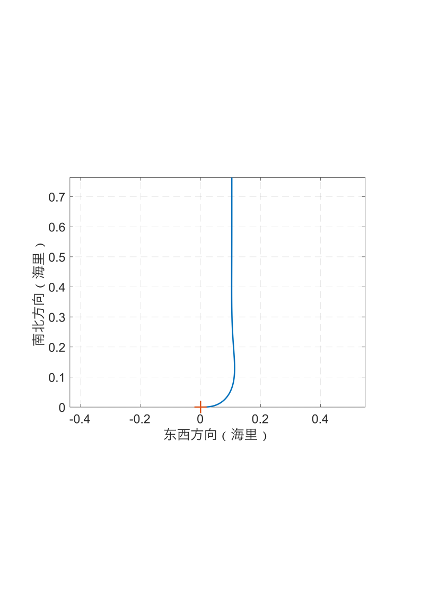
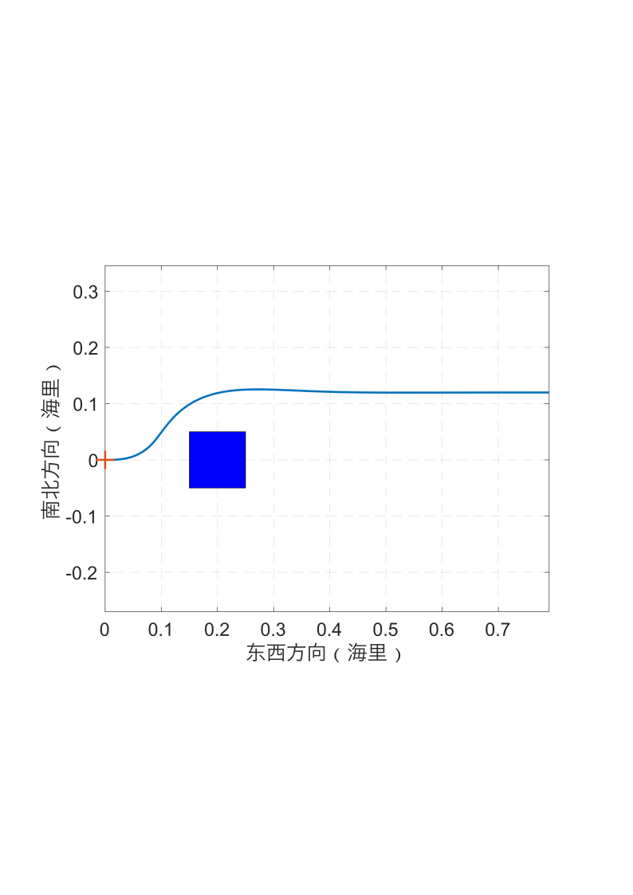
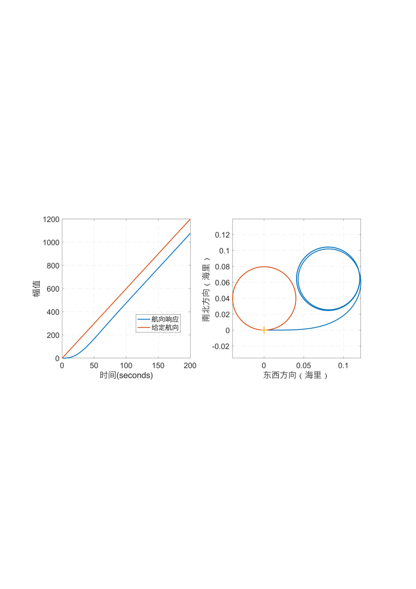
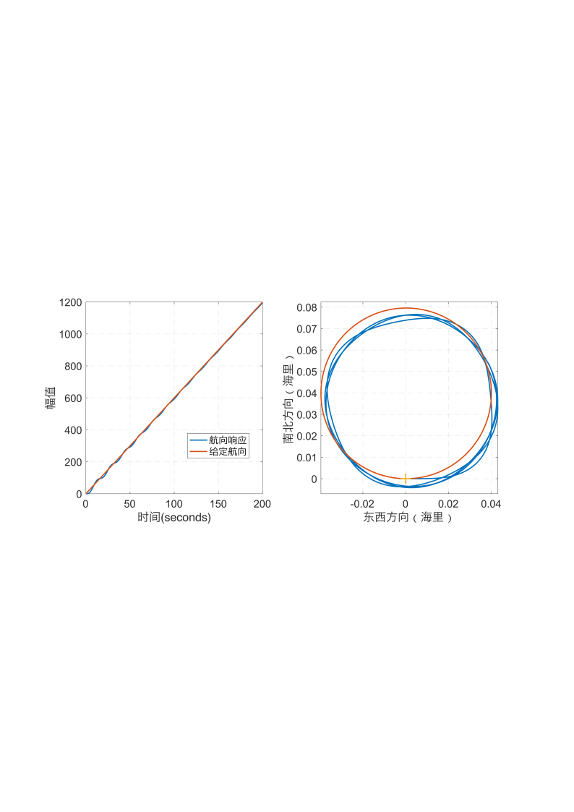

# 4.1 船舶航向控制根轨迹分析

- 所属专题：船舶根轨迹分析实例
- 来源文档：`course-content/questions/source/船舶控制案例20240116.docx`

## 正文

船舶航向控制系统的结构图如图4.1.1所示，图中，$C(s)$为实际的航向，$R(s)$为给定的航向，$N(s)$为影响航向的扰动因素。设控制器$G_{c}(s) = K$，本例的目的是用根轨迹法分析参数$K$的变化时船舶航向控制系统的根轨迹，并分析系统的主导极点的阻尼比$\xi = 0.707$时的闭环极点，以及使系统稳定的参数$K$的范围。

解闭环特征方程为

$$D(s) = 1 + \frac{0.01715K}{s(s + 0.1)(s + 2.14375)} = 0$$

则根轨迹方程为

$$G(s) = \frac{0.01715K}{s(s + 0.1)(s + 2.14375)}$$

令$k = 0.01715K$，则$K$从$0$变化到$\infty$时系统的根轨迹如图4.1.2。

由图4.1.2可见，系统实轴上的一个极点离另一对共轭极点距离较远，可以使用主导极点对系统性能进行近似。

通过局部方法根轨迹图，并选择合适的极点如图4.1.3所示。该系统的闭环主导极点当阻尼比$\xi = 0.707$ 时的闭环极点为$- 0.0488 \pm j0.0495$ 。当$k = 0.01715K = 0.0104$时系统稳定，此时$K = 0.6064$。

为了比较主导极点近似系统和原系统在同样开环增益下单位阶跃响应的差别，消去舵伺服系统中的极点，同时保证$G_{1}(s)$的增益不变。将$G_{1}(s)$化为尾一式：

$$G_{1}(s) = \frac{1.6}{0.4665s + 1}$$

消去分母部分的极点，仅保留增益，则近似系统结构图如下：

分别对原系统和主导极点近似系统在开环增益$K = 0.6064$时进行单位阶跃响应仿真，输出响应对比如下：

可以发现，近似系统的时域响应与原系统非常近似，说明对本系统采用主导极点近似分析的结果是满足精度要求的。

使用90倍阶跃响应模拟转向性能，形成的航迹如下：

可以发现，在最佳阻尼比下，尽管转向和避障性能较好，但是回转性能不好。由于对斜坡信号在初始阶段跟踪有误差，使得回转轨迹与期望轨迹之间有较大距离。提高增益后再次进行仿真。

可见，当提高增以后，对于斜坡信号的跟踪误差减小了，使得回转性能提升，但此时对于阶跃输入的响应调节时间变长。因此，在实际中选择开环增益，需要在阶跃响应性能和斜坡响应性能之间做出权衡。
