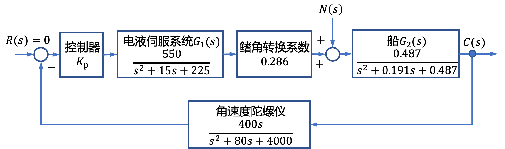
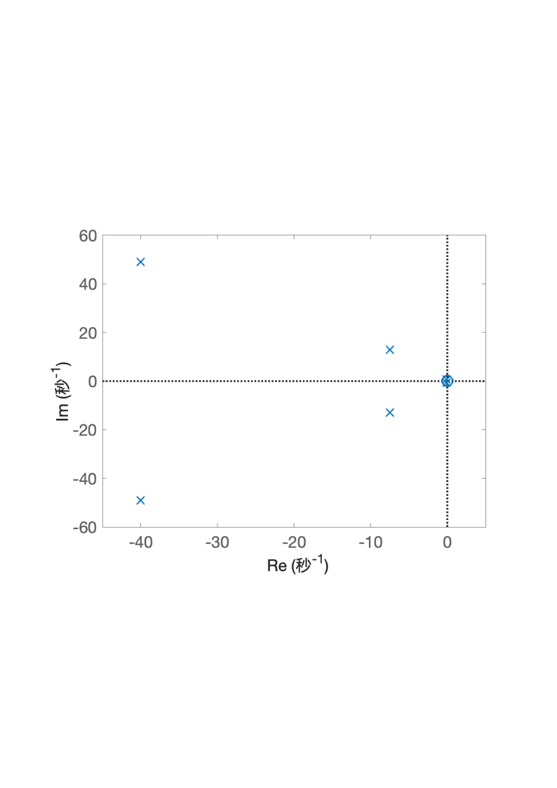
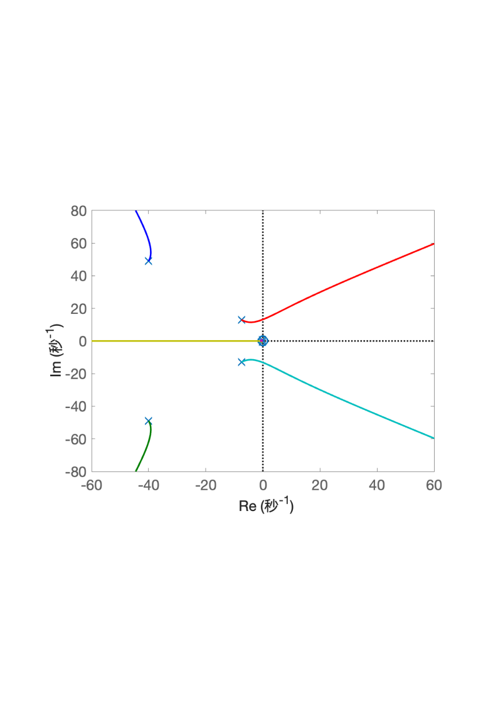
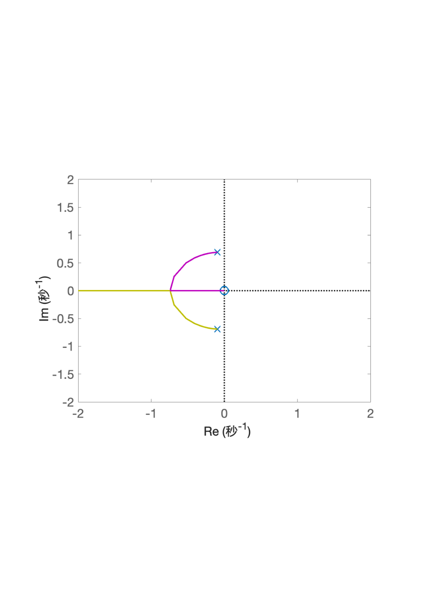

# 4.2 船舶横摇减摇鳍控制根轨迹分析

- 所属专题：船舶根轨迹分析实例
- 来源文档：`course-content/questions/source/船舶控制案例20240116.docx`

## 正文

船舶横摇减摇鳍控制系统的结构图如图4.2.1所示，图中，$R(s)$为预期的横摇角，通常设$R(s) = 0,C(s)$为实际的横摇角，$N(s)$为影响横摇角的扰动因素。为分析简便，本例中采用比例控制器。本例的目的是分析参数$K_{p}$,从0变化到$\infty$时的系统根轨迹。

由图4.2.1可知，系统的开环传递函数为

$$G(s) = \frac{30.642.04K_{p}s}{\left( s^{2} + 15s + 225 \right)\left( s^{2} + 0.191s + 0.487 \right)\left( s^{2} + 80s + 4000 \right)}$$

则开环系统的零点、极点分布图如图4.2.2所示。

令$K = 30642.04K_{p}$,则当$K_{p}$从0变化到$\infty$时，可画出$K$从0变化到$\infty$时系统的根轨迹如图4.2.3和图4.2.4所示

|  |  |
|------------------------------------------------------------------------------------------------------------------------------------------------------------|------------------------------------------------------------------------------------------------------------------------------------------------------------|
| 图4.2.2舶横摇减摇鳍开环系统的零点、极点分布图                                                                                                              | 图4.2.3船舶横摇减摇鳍控制系统根轨迹图                                                                                                                      |
|  |                                                                                                                                                            |
| 图4.2.4船舶横摇减摇鳍控制系统根轨迹中虚轴附近的根轨迹图                                                                                                    |                                                                                                                                                            |
