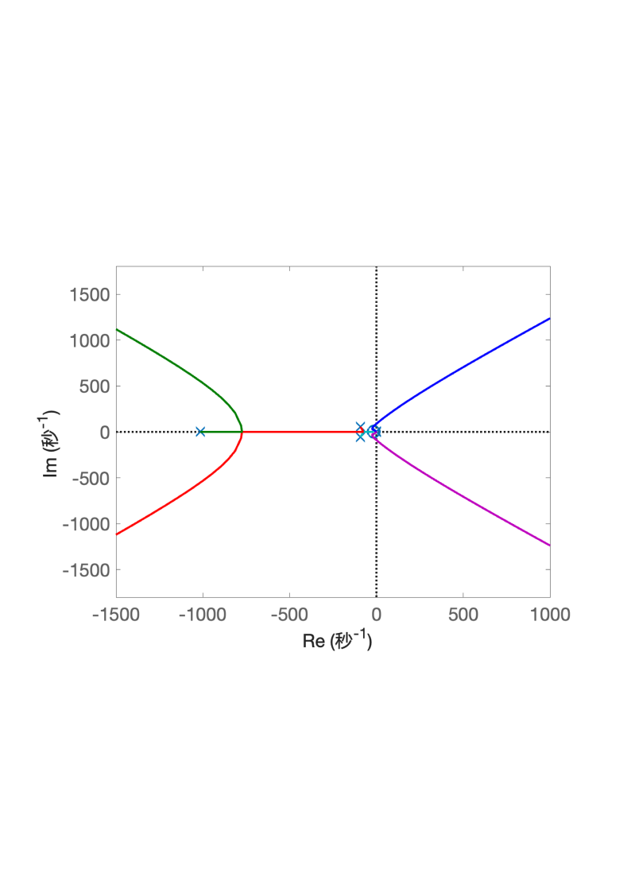
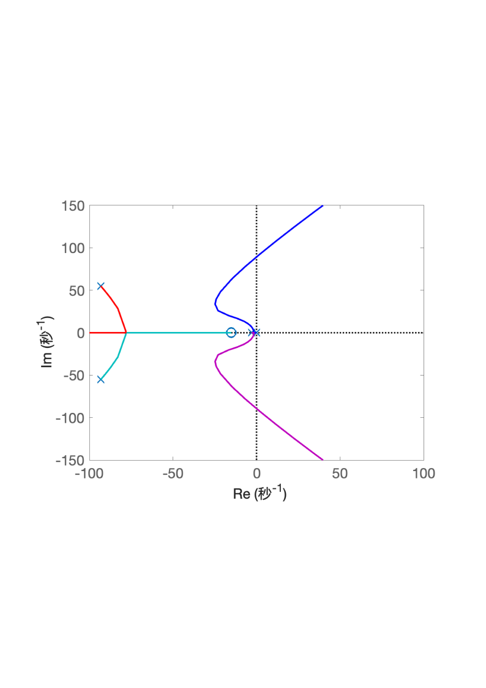

# 4.3 船载稳定平台控制系统根轨迹分析

- 所属专题：船舶根轨迹分析实例
- 来源文档：`course-content/questions/source/船舶控制案例20240116.docx`

## 正文

船载稳定平台俯仰角伺服系统的结构图如图4.3.1所示。本例的目的是用根轨迹法分析参数$K$的变化对系统的影响。

**解** 由图4.3.1可知，系统开环传递函数为

$$\begin{aligned}
G(s) & = \frac{2960K\left( \frac{s}{15} + 1 \right)}{s\left( \frac{s}{3} + 1 \right)\left\lbrack (1.7s + 1)(0.005s + 1)(0.001s + 1) + 100 \right\rbrack} \\
 & = \frac{69643487.46911K(s + 15)}{s(s + 3)\lbrack(s + 0.588)(s + 200)(s + 1000) + 11764705.88\rbrack}\#
\end{aligned}$$

令$k = 69643487.46911K$。当参数$k$从$0$变化到$\infty$时，其根轨迹图如图4.3.2和4.3.3所示，其中，图4.3.3为图4.3.2放大后虚轴附近的根轨迹图。

由图可见，当参数$K$从$0$变化到$\infty$时，只有右侧的两支根轨迹延伸至$s$平面的右半平面，其他各支根轨迹分支都在左半$s$平面。从图中得到根轨迹与虚轴交点处的参数值，并根据$k = 69643487.46911K$，于是得到使系统稳定的参数$K$的范围是$0 < K < 21.39$。

|  |  |
|------------------------------------------------------------------------------------------------------------------------------------------------------------|------------------------------------------------------------------------------------------------------------------------------------------------------------|
| 图4.3.2船载稳定平台俯仰角伺服系统根轨迹图                                                                                                                  | 图4.3.3 船载稳定平台俯仰角伺服系统根轨迹中虚轴附近的根轨迹图                                                                                               |
