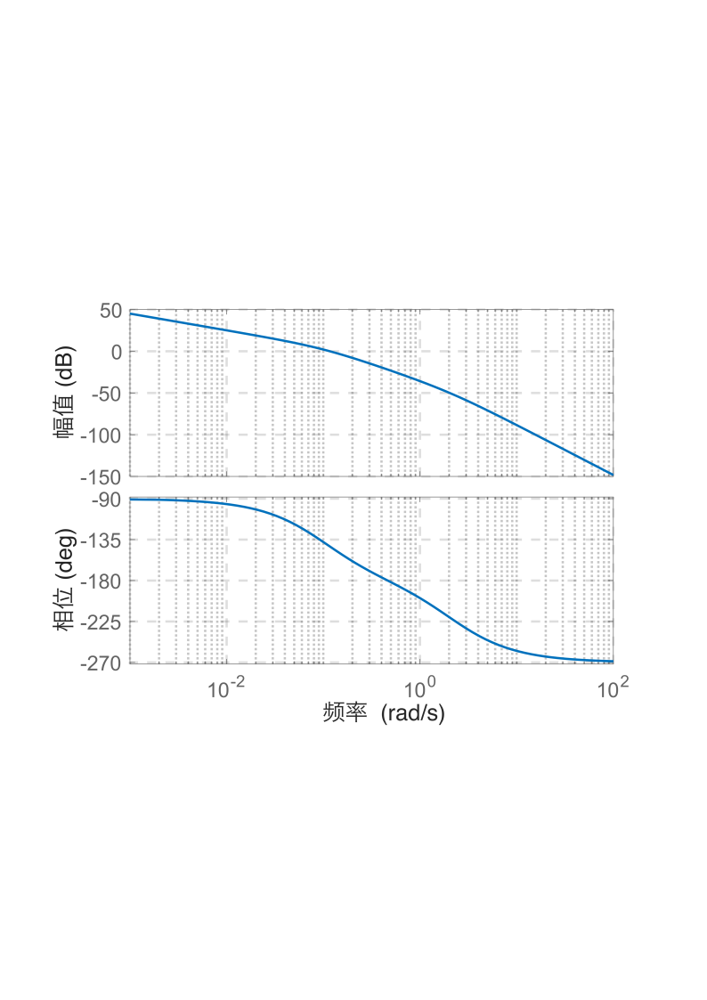
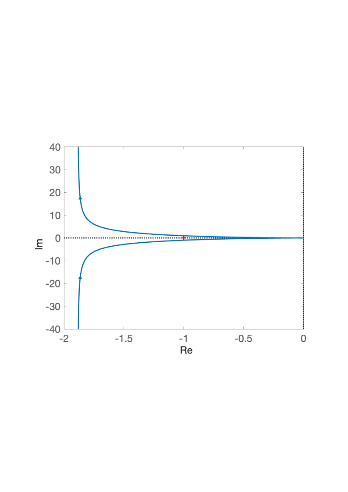
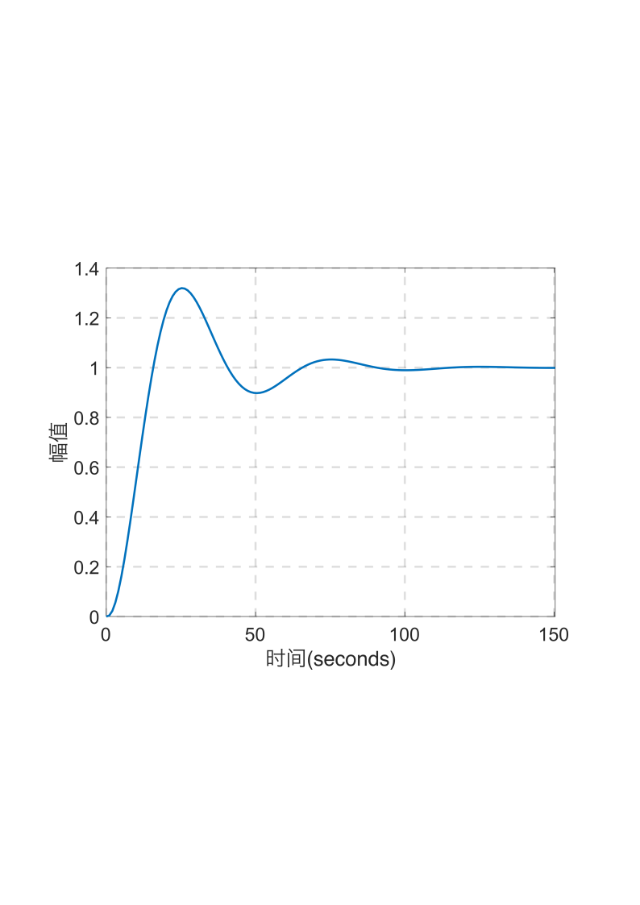
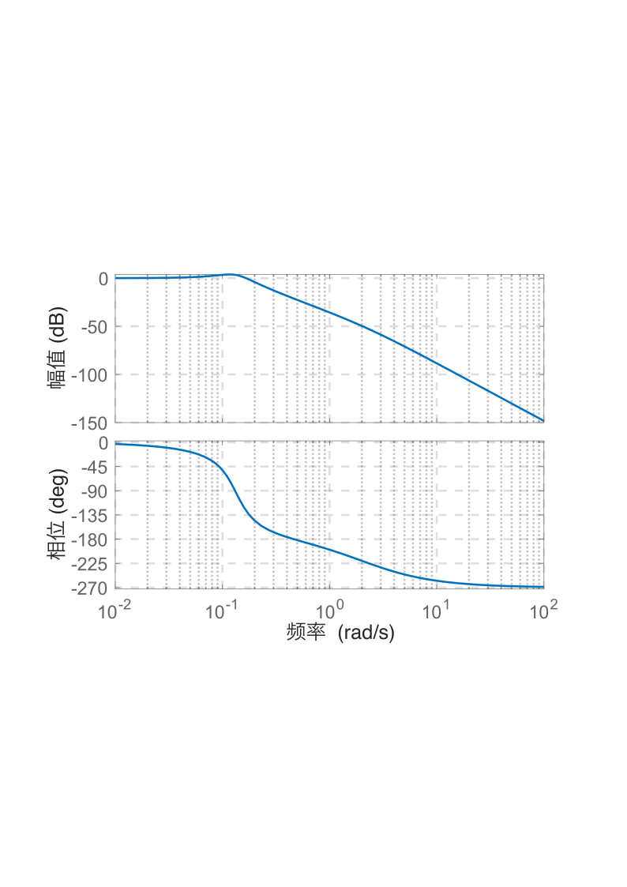

# 5.1 船舶航向控制频域分析

- 所属专题：船舶频域分析实例
- 来源文档：`course-content/questions/source/船舶控制案例20240116.docx`

## 正文

船舶航向控制系统的结构图如图5.1.1所示，图中，$C(s)$为实际的航向，$R(s)$为给定的航向，$N(s)$为影响航向的扰动因素。

本例的目的是：

①绘制$K = 2.25$时系统的开环对数频率特性曲线和开环幅相曲线，并计算此时系统的单位阶跃响应的各项指标$\sigma\%$，$t_{p}$和$t_{s}(\Delta = 0.02)$。

②分析$K = 2.25$时系统的幅值裕度$K_{g}\ dB$、相角裕度$\gamma$以及闭环系统的带宽频率$\omega_{b}$。

解①系统的开环传递函数为

$$G(s) = \frac{0.01715K}{s(s + 0.1)(s + 2.14375)}$$

则系统的开环频率特性为

$$G(j\omega) = \frac{0.01715K}{j\omega(j\omega + 0.1)(j\omega + 2.14375)}$$

现取$K = 2.25$,计算开环频率特性$G(j\omega)$的幅值与相位，绘制开环对数频率特性和开环幅相曲线如图5.1.2和图5.1.3所示。由图5.1.3可知闭环系统稳定。

实际船舶航向控制系统的单位阶跃响应曲线如图5.1.4所示，由此得到各项指标，$\sigma\% = 32\%$，$t_{p} = 25\ s$，$t_{s} = 84.6\ s(\Delta = 0.02)$。

②当取$K = 2.25$时，根据图5.1.2和图5.1.3，可得系统的幅值裕度$K_{g}(dB) = 12.4653\ dB$,相角裕度$\gamma = 37.4347{^\circ}$，截止频率$\omega_{c} = 0.117\ rad/s$。

为了确定闭环系统的带宽频率$w_{b}$绘制系统的闭环对数频率特性曲线如图5.1.5所示。由图可确定闭环系统的带宽频率$\omega_{b} = 0.19\ rad/s$，系统的谐振频率$\omega_{r} = 0.121\ rad/s$。

