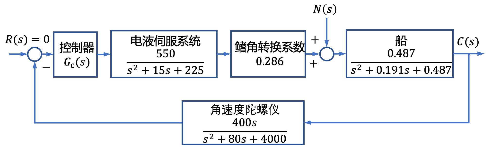
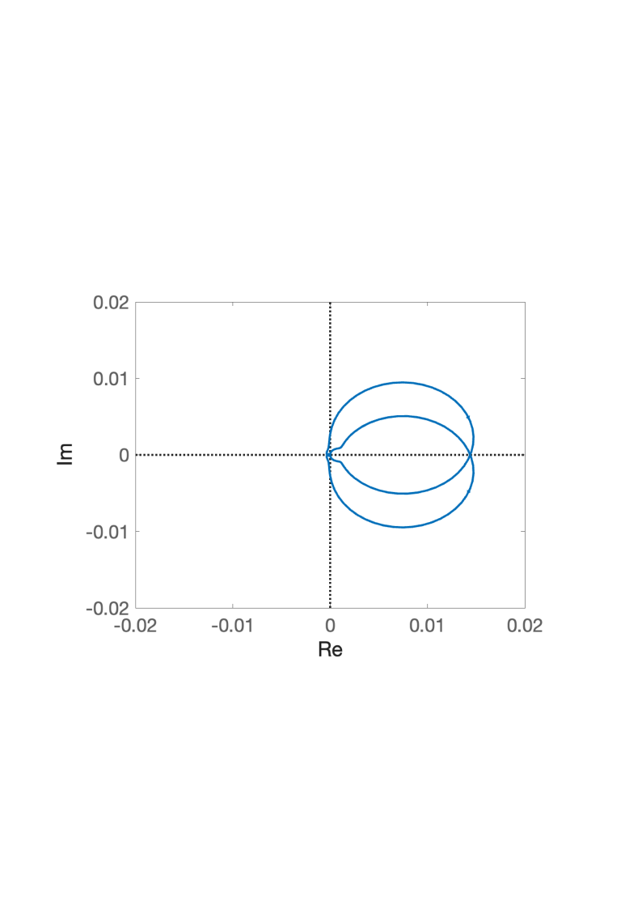

# 5.2 船舶横摇减摇鳍控制频域分析

- 所属专题：船舶频域分析实例
- 来源文档：`course-content/questions/source/船舶控制案例20240116.docx`

## 正文

设船舶横摇减摇鳍控制系统的结构图如图5.2.1所示。图5.2.1中，$R(s)$为预期的横摇减摇鳍角，通常$R(s) = 0$，$C(s)$为实际的横摇减摇鳍角，$N(s)$为影响横摇减摇鳍角的扰动因素。根据船舶横摇减摇鳍的参数，这里设控制器为

$$G_{c}(s) = K\left\lbrack 0.2 + \frac{1}{24.607s + 1} + \frac{0.0128s}{(0.18s + 1)(0.064s + 1)} \right\rbrack$$

式中，$K$为参数。

本案例目的是应用奈奎斯特稳定判据判断系统的稳定性。

该系统为非单位反馈系统，且$R(s)$对$C(s)$的开环传递函数为

$$G(s) = \frac{30642.04KG_{c}(s)s}{\left( s^{2} + 15s + 225 \right)\left( s^{2} + 0.191s + 0.487 \right)\left( s^{2} + 80s + 4000 \right)}$$

则系统的开环幅相曲线如图5.2.2所示。

根据开环传递函数可得其右半$s$平面的极点数$P = 0$。由奈奎斯特稳定判据，$N = 0$。因此$Z = 0$，则闭环系统稳定。

