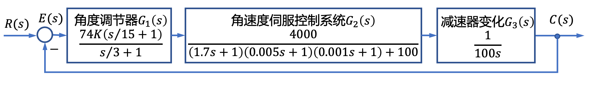
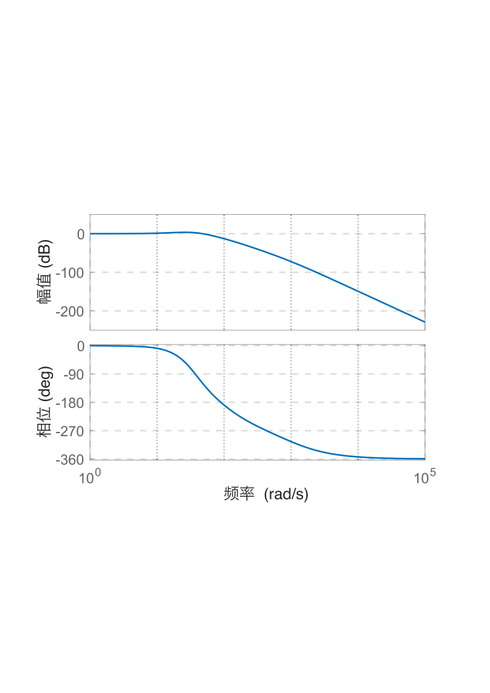
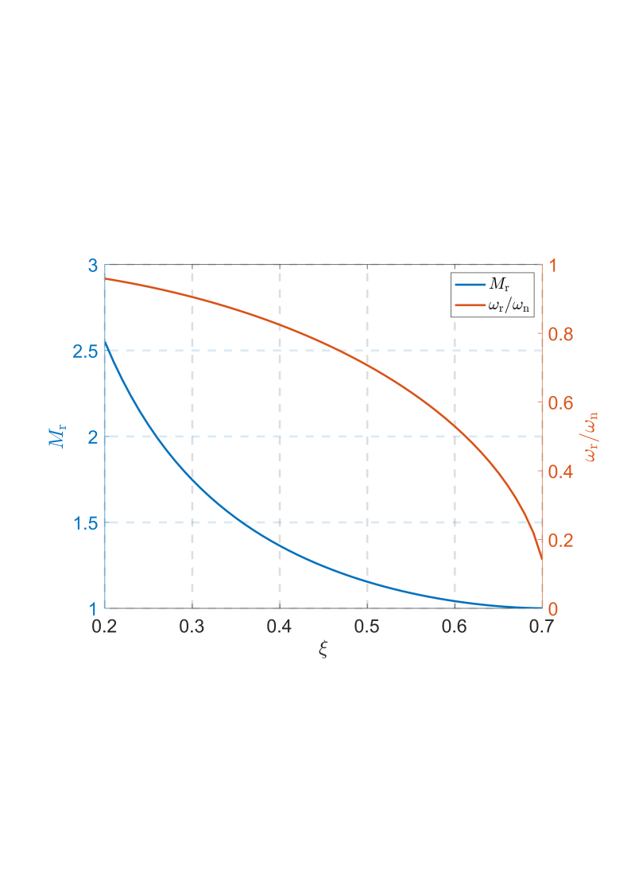
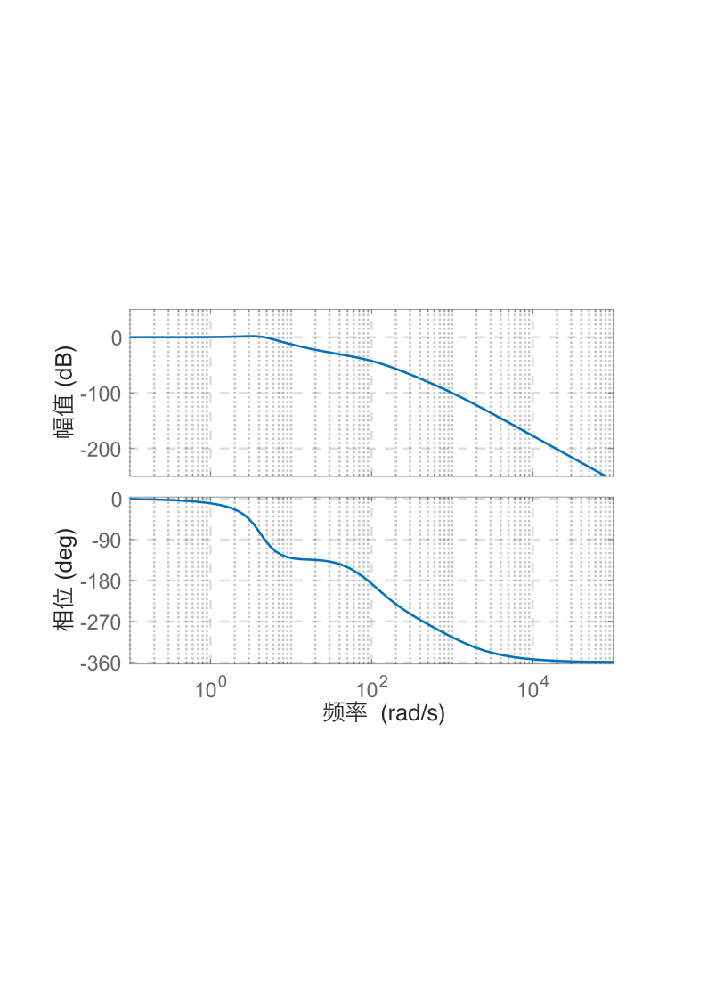
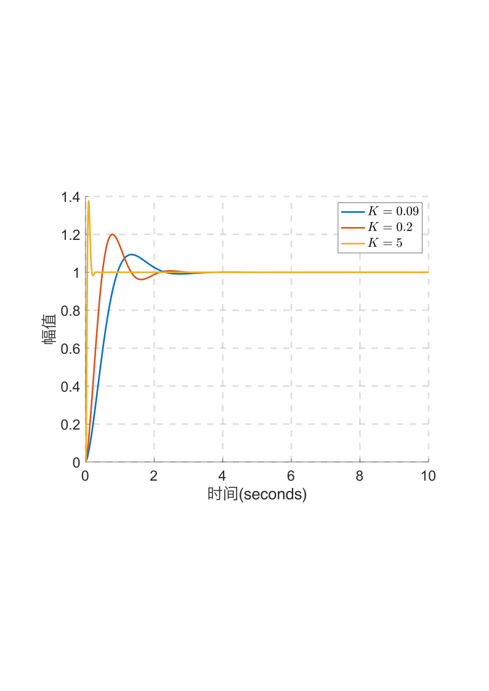

# 5.3 船载稳定平台控制系统频域分析

- 所属专题：船舶频域分析实例
- 来源文档：`course-content/questions/source/船舶控制案例20240116.docx`

## 正文

船载稳定平台俯仰角伺服系统的结构图如图5.3.1所示。本例的目的是用频

率响应法分析参数$K$的变化对系统动态性能的影响。

**解** 首先考虑保证系统稳定性的$K$值范围，系统稳定的参数$K$的范围是 $0 < K < 21.39$。其次考虑系统在单位阶跃输入作用下的稳态误差，系统在单位阶跃输入下的稳态误差为零，且与开环增益$K$取值无关。

从$R(s)$到$C(s)$之间所对应的开环传递函数为

$$G(s) = \frac{2960K(\frac{s}{15} + 1)}{s(s/3 + 1)\lbrack(1.7s + 1)(0.005s + 1)(0.001s + 1) + 100\rbrack}$$

则其开环频率特性为

$$G(s) = \frac{2960K(\frac{j\omega}{15} + 1)}{j\omega(j\omega/3 + 1)\lbrack(j1.7\omega + 1)(j0.005\omega + 1)(j0.001\omega + 1) + 100\rbrack}$$

考虑$R(s)$到$C(s)$之间所对应的船载稳定平台俯仰角伺服系统闭环频率特性为

$$\Phi(s) = \frac{2960K(\frac{j\omega}{15} + 1)}{j\omega(j\omega/3 + 1)\lbrack(j1.7\omega + 1)(j0.005\omega + 1)(j0.001\omega + 1) + 100\rbrack + 2960K(\frac{j\omega}{15} + 1)}$$

1、当取$K = 5$时，船载稳定平台俯仰角伺服系统的闭环频率特性曲线如图5.3.2所示。

由图5.3.2可见，系统存在谐振频率，其值$\omega_{r} = 24.4\ rad/s$时，相应的谐振峰值$20\lg M_{r} = 3.52\ dB$或$M_{r} = 1.4997$。根据图5.3.2，可认为系统的主导极点为共轭复极点。由谐振峰值$M_{r}$、相角裕度$\gamma$、超调量$\sigma\%$与调节时间$t_{s}$的关系曲线，可得图5.3.3的关系曲线。

由$M_{r} = 1.4997$可估算出系统的阻尼比$\xi = 0.35$，然后进一步得到标准化谐振频率为$\frac{\omega_{r}}{\omega_{n}} = 0.87$。因为已经求得$\omega_{r} = 24.4\ rad/s$，故无阻尼自然频率为

$$\omega_{n} = \frac{24.4}{0.87} = 28.046\ rad/s$$

于是，船载稳定平台俯仰角伺服系统的二阶近似模型应为

$$\Phi(s) \approx \frac{\omega_{n}^{2}}{s^{2} + 2\xi\omega_{n}s + \omega_{n}^{2}}$$

表明此时系统的阶跃响应为欠阻尼响应。根据近似模型，可以估算出系统的超调量为

$$\sigma\% = e^{- \pi\xi/\sqrt{1 - \xi^{2}}} \times 100\% = 40\%$$

调节时间($\bigtriangleup = 0.02$)为

$$t_{s} = \frac{4.4}{\xi\omega_{n}} = 0.448s$$

最后，按实际三阶系统进行计算，利用式

$$M_{r} \approx \frac{1}{\left| \sin\gamma \right|}$$

得相角裕度$\gamma \approx {41.82}^{{^\circ}}$。根据式(6.93)和式(6.94),可以估算出此时系统的超调量$\sigma\% \approx 35.99\%$，$t_{s} = 0.425s$。由此可见，取$K = 5$时系统的超调量较大，但响应速度很快。

2、如果要求更小的超调量，应该减小系统的增益，取$K < 5$。取$K = 0.2$时单位负反馈船载稳定平台俯仰角伺服系统的闭环频率特性曲线如图5.3.4所示。

谐振频率$\omega_{r}$与阻尼比$\xi$的关系曲线

由图5.3.4可见，系统存在谐振频率，当$\omega_{r} = 3.18\ rad/s$，相应的谐振峰值$20\lg M_{r} = 1.86\ dB$或$M_{r} = 1.2388\ dB$。同理，利用式(6.96)，得相角裕度$\gamma \approx 53.83{^\circ}$。根据式(6.94)和式(6.95),可以估算出此时系统的超调量$\sigma\% \approx 25.55\%$，$t_{s} = 2.47\ s$。船载稳定平台俯仰角伺服系统当$K$取不同值时的单位阶跃响应曲线如图5.3.5所示。由图5.3.5可见，取$K = 0.2$时系统的超调量较小，但响应速度变慢。

综合考虑超调量和调节时间，在满足系统稳定的参数$0 < K < 21.39$的范围内，若要求超调量小，则应该尽可能地减小$K$；但若要求响应速度指标，则应该尽可能的增大$K$。因此，可以根据系统的性能指标要求选择合适的$K$。

##
