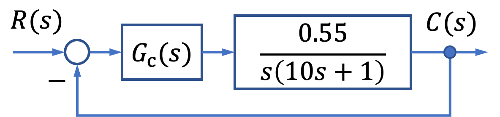
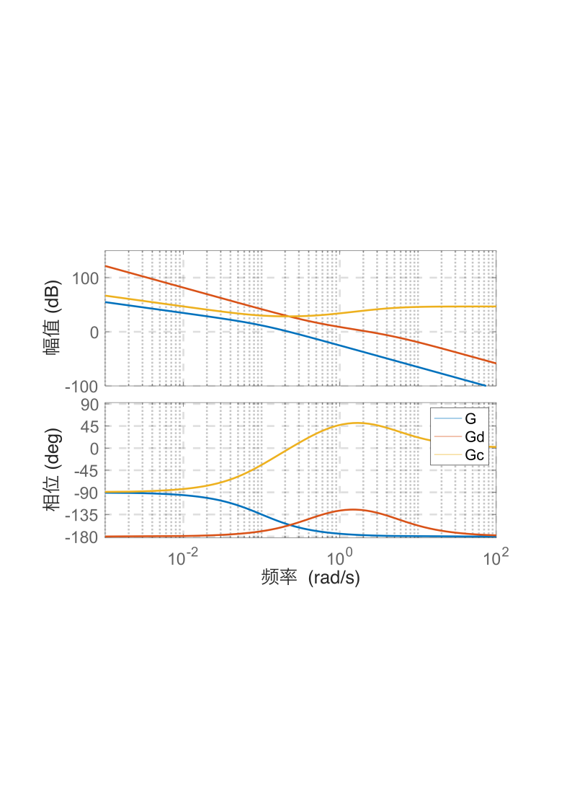

# 6.1 船舶航向控制频域校正

- 所属专题：船舶频域校正实例
- 来源文档：`course-content/questions/source/船舶控制案例20240116.docx`

## 正文

船舶直线航行航向保持控制系统的结构图如图6.1.1。

要求设计航向控制器传递函数，使得系统阶跃响应超调量不大于$\sigma\% \leq 24.9\%$，过渡过程时间不大于$t_{s} \leq 3\ s$。

**解** 选定系统的预期开环传递函数为

$$G(s) = \frac{k(\tau s + 1)}{s^{2}(Ts + 1)}\ $$

由$\sigma \leq 24.9\%$，得$M_{r} = 1.225$，于是

$$h = \frac{\tau}{T} = \frac{M_{r} + 1}{M_{r} - 1} = \frac{2.225}{0.225} = 9.98 \approx 10$$

由$t_{s} \leq 3\ s$得，系统预期开环幅频特性截止频率为

$$\omega_{c} = \frac{2 + 1.5\left( M_{r} - 1 \right) + 2.5\left( M_{r} - 1 \right)^{2}}{t_{s}} = 2.572\ rad/s$$

由$\omega_{2} \leq \omega_{c}\frac{M_{r} - 1}{M_{r}}$，$\omega_{3} \geq \omega_{c}\frac{M_{r} + 1}{M_{r}}$，得$\omega_{2} \leq 0.4673\ rad/s$，$\omega_{3} \geq 4.678\ rad/s$，所以

$$\tau = \frac{1}{\omega_{2}} = 2.138\frac{rad}{s},\ \ T = \frac{1}{\omega_{3}} = 0.2138\ rad/s$$

系统预期的开环传递函数为

$$G(s) = \frac{k(2.138s + 1)}{s^{2}(0.2138s + 1)}$$

$\omega_{2}$处的对数幅值$y = - 20\left( \lg{0.4673} - \lg{2.572} \right) = 14.81$，$\omega_{0}$为低频段延长线与横轴的交点，由直线方程$\frac{14.81}{\lg{0.4673} - \lg\omega_{0}} = - 40$，得$\omega_{0} = 1.096$，$k = w_{0}^{2} = 1.202$，所以

$$G(s) = \frac{1.202(2.138s + 1)}{s^{2}(0.2138s + 1)}$$

> 由$k_{c} \times 0.55 = k = \omega_{0}^{2}$,得

$$k_{c} = \frac{\omega_{0}^{2}}{0.55} = 2.185$$

因此

$$G_{c}(s) = \frac{2.185(10s + 1)(2.138s + 1)}{s(0.2138s + 1)}$$

系统固有开环传递函数幅频与相频特性如图6.1.2曲线G，预期开环传递函数幅频与相频特性如Gd，$G_{c}(s)$幅频特性与相频特性如图6.1.2曲线Gc。

值得说明的是，上述设计是在航向控制系统针对常值航向给定条件下的跟踪性能设计的，而在船舶实际航行中，风、浪和流对船舶航向的随机干扰作用是非常强的，也是不可忽略的。这样航向的实际轨迹是一个随机过程轨迹，航向控制误差也不可能是零，因此，要想提高航向控制精度，还应考虑采用随机控制理论设计航向控制系统。
