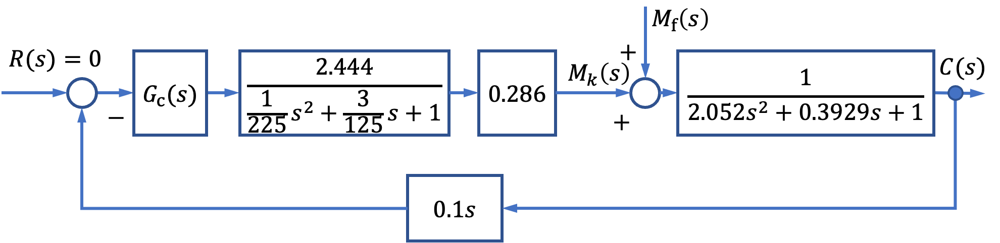
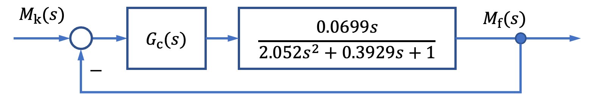
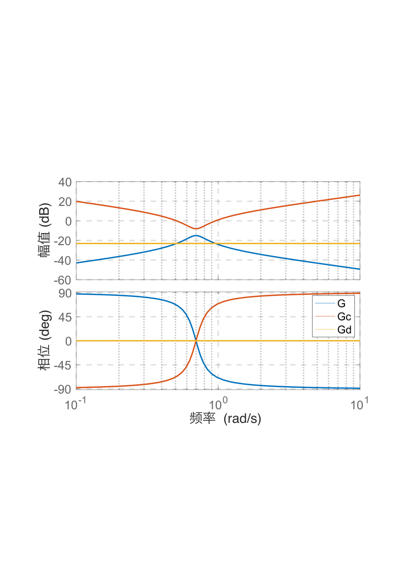

# 6.2 船舶横摇减摇鳍控制频域校正

- 所属专题：船舶频域校正实例
- 来源文档：`course-content/questions/source/船舶控制案例20240116.docx`

## 正文

某船减摇鳍控制系统的结构如图6.2.1所示。

由于液压伺服系统的时间常数$(1/15)$远远小于船本身固有时间常数$(\sqrt{2.052})$,故在系统综合时可将液压伺服系统近似为比例环节。

船舶横摇减摇鳍控制系统是一个零给定控制系统，通过鳍产生的力(矩)抵消海浪等随机干扰作用，从而稳定和减少船的横摇。实际上是一个抗干扰(力矩)控制系统。

将图6.2.1改成以$M_{f}(s)$为输入以$M_{k}(s)$为输出的形式，如图6.2.2所示。

在鳍的作用下，产生了一个对抗海浪干扰力矩的控制力矩$M_{k}(s)$,则船舶横摇运动方程可写成

$$\left( I_{X} + \mathrm{\Delta}I_{X} \right)\ddot{\varphi} + 2N_{\mu}\dot{\varphi} + Dh\varphi = M_{f} - M_{k}$$

若使$M_{k} = M_{f}$,则上式右边为零，船的横摇稳态后停止横摇。问题是$M_{f}$不可测量，那么，控制力矩$M_{k}$如何选取实现，才能使横摇减摇效果最好？由上式知，船作横摇时，自身产生的三种力矩(惯性力矩$(I_{X} + \Delta I_{X})\ddot{\varphi}$,阻尼力矩$2N_{\mu}\dot{\varphi}$，恢复力矩$Dh\varphi$)与外加力矩(海浪扰动力矩$M_{f}$和控制力矩$M_{k}$)平衡，于是可知，如果要抵消海浪干扰力矩$M_{f}$,则控制力矩必须会有与横摇角加速度$\ddot{\varphi}$成比例的控制力矩和与横摇角$\varphi$成比例的控制力矩，即

$$M_{k} = A\varphi + B\dot{\varphi} + C\ddot{\varphi}$$

此时，船的横摇运动方程为

$$\left( I_{X} + \mathrm{\Delta}I_{X} + C \right)\ddot{\varphi} + \left( 2N_{\mu}\dot{\varphi} + B \right) + (Dh + C)\varphi = M_{f}$$

若参数$A$，$B$，$C$的选取满足下式

$$\frac{A}{Dh} = \frac{B}{2N_{\mu}} = \frac{C}{I_{X} + \mathrm{\Delta}I_{X}} = P(常数)$$

则有

$$\left( I_{X} + \mathrm{\Delta}I_{X} \right)(1 + P)\ddot{\varphi} + 2N_{\mu}(1 + P)\dot{\varphi} + Dh(1 + P)\varphi = M_{f}$$

于是，有

$$\left( I_{X} + \mathrm{\Delta}I_{X} \right)\ddot{\varphi} + 2N_{\mu}\dot{\varphi} + Dh\varphi = \frac{M_{f}}{1 + P}$$

从上式看出，控制力矩$M_{k}$的作用相当于把海浪对船的横摇干扰力矩$M_{f}$减少了$(1 + P)$倍，因此，使得船在各个频率下的横摇角都减少了$(1 + P)$倍。

从未加校正前的$M_{f}(s) - C(s)$传递函数看出，船的横摇对海浪干扰响应是一个典的二阶振荡环节，在较低频率内幅值为1。随着频率靠近固有谐振角频率$(1/T_{\varphi})$,幅值增加，当频率接近固有谐振角频率$\left( \omega_{r} = \frac{1}{T}\sqrt{1 - 2\xi_{\varphi}^{2}} \right)$时，横摇角对海浪干扰作用的响应出现谐振峰值达到增益最大点，随着频率的进一步增加，幅值逐渐衰减。

为了获得满意的减摇效果，应选取控制器$G(s)$具有与船的$M_{f}(s) - C(s)$幅频特性相反的特性。

如果采用角速度陀螺作为测量元件，测量到信息是与横摇角速度成比例的量，如控制器$G(s)$采用PID控制器，则控制器$G_{c}(s)$的输入-输出关系为

$$u(t) = A\int_{}^{}{\dot{\varphi}(t)dt + B\dot{\varphi}(t) + C\frac{d\dot{\varphi}(t)}{dt}}$$

式中，$u(t)$为PID控制器的输出，$\dot{\varphi}(t)$为船的横摇角速度(可测量)，$A$，$B$，$C$为PID控制待定系数。

对PID控制器输入-输出关系式进行零初始条件下的拉氏变换，得

$$G_{c}(s) = \frac{U(s)}{C(s)} = \frac{A}{s} + B + Cs$$

为使船舶在各个频率下的横摇干扰力矩都有相同的减摇效果，选取参数$A,B,C$与船的横摇固有参数$T_{\varphi}$，$\xi_{\varphi}$。之间满足如下关系

$C = T_{\varphi}^{2}$，$B = 2T_{\varphi}\xi_{\varphi}$，$A = 1$

则有

$$G_{c}(s) = T_{\varphi}^{2}s + 2T_{\varphi}\xi_{\varphi} + \frac{1}{s} = \frac{T_{\varphi}^{2}s^{2} + 2T_{\varphi}\xi_{\varphi}s + s}{s} = \frac{2.052s^{2} + 0.3929s + 1}{s}$$

未加校正前的横摇固有频率特性，控制器$G_{c}(s)$的频率特性和PID校正后的系统开环频率特性如图6.2.3中曲线G、曲线Gc和曲线Gd所示。

值得指出的是，对于工作时间较长的控制系统，纯积分器会产生积分漂移，将破坏控制系统正常工作，所以工程上常用一个大惯性环节代替纯积分器，只要合理选择惯性环节时间常数，则可使其在工作频率内接近积分器的频率特性。纯微分环节会产生很大的高频干扰，故工程上常采用带有小惯性环节的微分$\left( \frac{s}{Ts + 1} \right)$来代替纯微分器。
