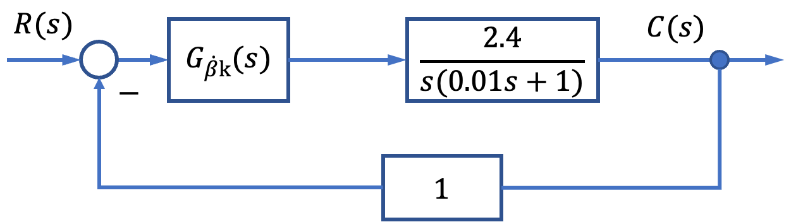
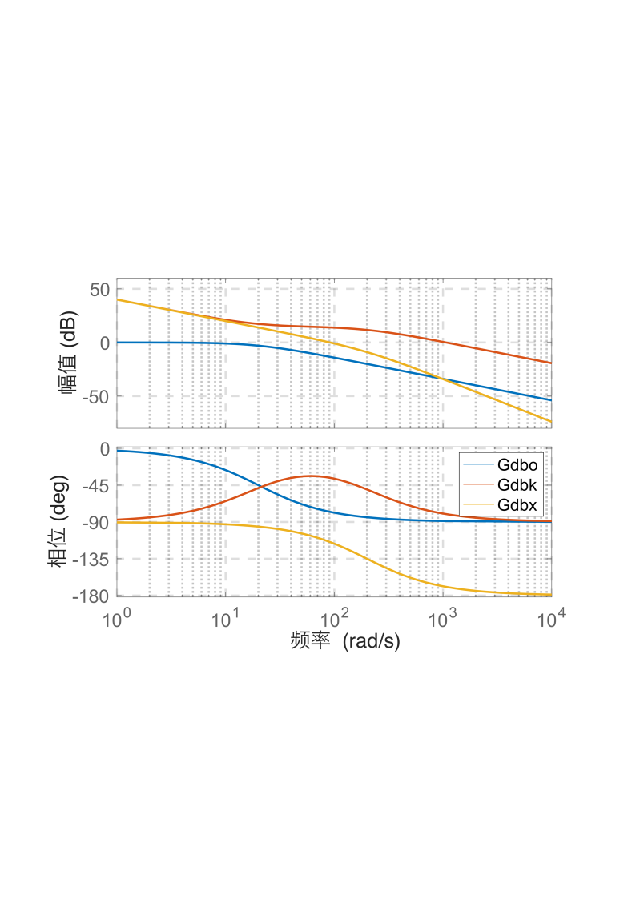
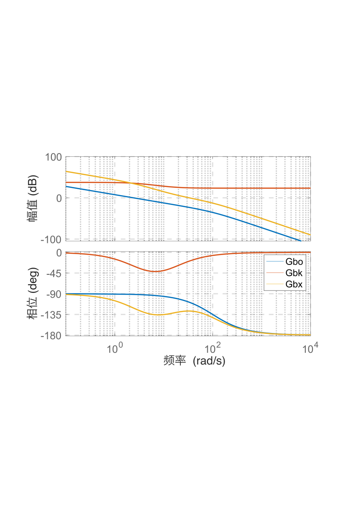

# 6.3 船载稳定平台控制系统校正设计

- 所属专题：船舶频域校正实例
- 来源文档：`course-content/questions/source/船舶控制案例20240116.docx`

## 正文

由于船舶在海上航行时其摇摆运动是随机的，所以船载平台三轴伺服系统的输入指令信号也具有随机性(确定性指向输入信号与船的摇摆运动经数学变换后的输入信号)。对于这样的伺服系统，其控制器校正网络的设计一般不能用单位阶跃输入和斜坡输入下动态性能和稳态性能指标来进行，而是考虑在等效正弦输入下进行系统的校正网络设计，使其闭环系统满足给定的动态和稳态性能指标。

对于某船舰平台俯仰角伺服系统的等效正弦输入为$R(t) = \beta_{m}\sin{\omega_{\beta}t}$,其中$\beta_{m} = 5^{{^\circ}}$，$\omega_{\beta} = 2.8\ rad/s$，于是

$$\dot{R}(t) = 5 \times 2.8\sin{(2.8t + 90^{{^\circ}})}$$

$$\ddot{R}(t) = 5 \times {2.8}^{2}\cos\left( 2.8t + 90^{{^\circ}} \right) = - 5 \times {2.8}^{2}\sin{(2.8t + 90^{{^\circ}})}$$

这样，输出轴最大角速度$\Omega_{m} = 13.976\ rad/s$，最大角加速度

$$\varepsilon_{m} = \beta_{m}\omega_{m} \times 5 \times {2.8}^{2} = 39.2\ rad/s^{2}$$

对于多闭环回路系统的动态设计基本原则是先内环，后外环，且内环截止频率要大于外环截止频率。取角度环截止频率$\omega_{\beta c}$和角速度环截止频率分别为$\omega_{\beta c} = 30\ \frac{rad}{s} \geq 10\omega_{\beta}$和$\omega_{\dot{\beta}c} = 100\ rad/s$，将角速度环预期开环传递函数校正成如下形式

$$G_{\dot{\beta}x}(s) = \frac{K_{\dot{\beta}}}{s(Ts + 1)}$$

于是，$K_{\dot{\beta}} = \omega_{\dot{\beta}c} = 100$，取阻尼比$\xi = 0.707$，对应$K_{\dot{\beta}}T = 0.5$，得$T = 0.005$，由此得角速度调节器传递函数为

$$G_{\dot{\beta}k}(s) = \frac{100(0.054s + 1)}{s(0.005s + 1)}$$

对应的角速度闭环传递函数为

$$\Phi_{\beta}(s) = \frac{240}{6 \times 10^{- 5}s^{2} + 0.01s + 1} \approx \frac{240}{0.01s + 1}$$

于是得角度环的结构如图6.3.1所示。校正时要求系统稳态误差$e_{m}$最大值为0.1°。

当系统输入$R(t)$为等效正弦时，稳态后系统的跟踪误差也为同频率的正弦信号，即$e(t) = E_{m}\sin{(\omega_{\beta}t)}$,于是有

$$E_{m} = \left| \frac{1}{1 + G_{\beta x}(j\omega_{\beta})} \right|\beta_{m}$$

式中，$G_{\beta x}(\omega_{\beta})$为系统预期开环频率特性，由于$\omega_{\beta}$与$\omega_{\beta c}$相比处在低频段，故有$\left| G_{\beta x}(j\omega_{\beta}) \right| \gg 1$，所以$E_{m} \approx \frac{\beta_{m}}{\left| G_{\beta x}(j\omega) \right|}$。欲使系统满足给定的正弦跟踪精度指标要求，即

$$E_{m} = \frac{\beta_{m}}{\left| G_{\beta x}(j\omega) \right|} \leq e_{m}$$

则

$$\left| G_{\beta x}(j\omega_{\beta}) \right| \geq \frac{\beta_{m}}{e_{m}} = \frac{\Omega_{m}^{2}}{\varepsilon_{m}e_{m}}，\beta_{m} = \frac{\Omega_{m}^{2}}{\varepsilon_{m}}$$

系统在$\omega_{\beta}$处应满足幅频特性，$\omega_{\beta}$所对应的点称精度点A。将上式两端取对数有$20\lg\left| G_{\beta x}(j\omega_{\beta}) \right| \geq 40\lg\Omega_{m} - 20\lg\varepsilon_{m} - 20\lg e_{m}$，由$\Omega_{m} = \beta_{m}\omega_{\beta}$和$\varepsilon_{m} = \beta_{m}\omega_{\beta}^{2}$得

$$\omega_{\beta} = \frac{\varepsilon_{m}}{\Omega_{m}}$$

当$\varepsilon_{m}$不变，$\Omega_{m}$下降10倍，$\omega_{\beta}$增加10倍时，$20\lg\left| G_{\beta x}(j\omega_{\beta}) \right|$下降40dB。当$\Omega_{m}$不变，$\varepsilon_{m}$下降10倍时，$\omega_{\beta}$减少10倍时，$20\lg\left| G_{\beta x}(j\omega_{\beta}) \right|$上升20 dB。故在精度点A的左右侧分别是以-20dB/dec直线和-40dB/dec直线与精度点A一起构成了伺服系统精度界限区。只要$\left| G_{\beta x}(s) \right|$的对数幅频特性不进入这个区域，就能保证系统跟踪等效正弦的误差不大于$0.1{^\circ}$的要求。

由$\omega_{\beta c} = 30\ rad/s$，得角度环预期开环频率特性如图6.3.2，由此得预期开环传递函数为

$$G_{\beta x}(s) = \frac{160\left( \frac{1}{15}s + 1 \right)}{s(\frac{1}{3}s + 1)(\frac{1}{100}s + 1)}$$

于是，得角度调节器传递函数为

$$G_{\beta k}(s) = \frac{74\left( \frac{1}{15}s + 1 \right)}{(\frac{1}{3}s + 1)}$$

内环角速度固有频率特性，调节器$G_{\dot{\beta}k}(s)$的频率特性和预期开环频率特性分别如图6.3.2中曲线Gdbo、Gdbk和Gdbx所示。

外环角速度固有频率特性，调节器$G_{\beta k}(s)$的频率特性和预期开环频率特性分别如图6.3.3中曲线Gbo、Gbk和Gbx所示。

|  |  |
|------------------------------------------------------------------------------------------------------------------------------------------------------------|------------------------------------------------------------------------------------------------------------------------------------------------------------|
| 图6.3.2舰载平台内环控制系统频率特性曲线                                                                                                                    | 图6.3.3舰载平台外环控制系统频率特性曲线                                                                                                                    |
