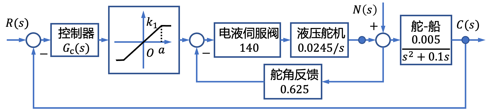
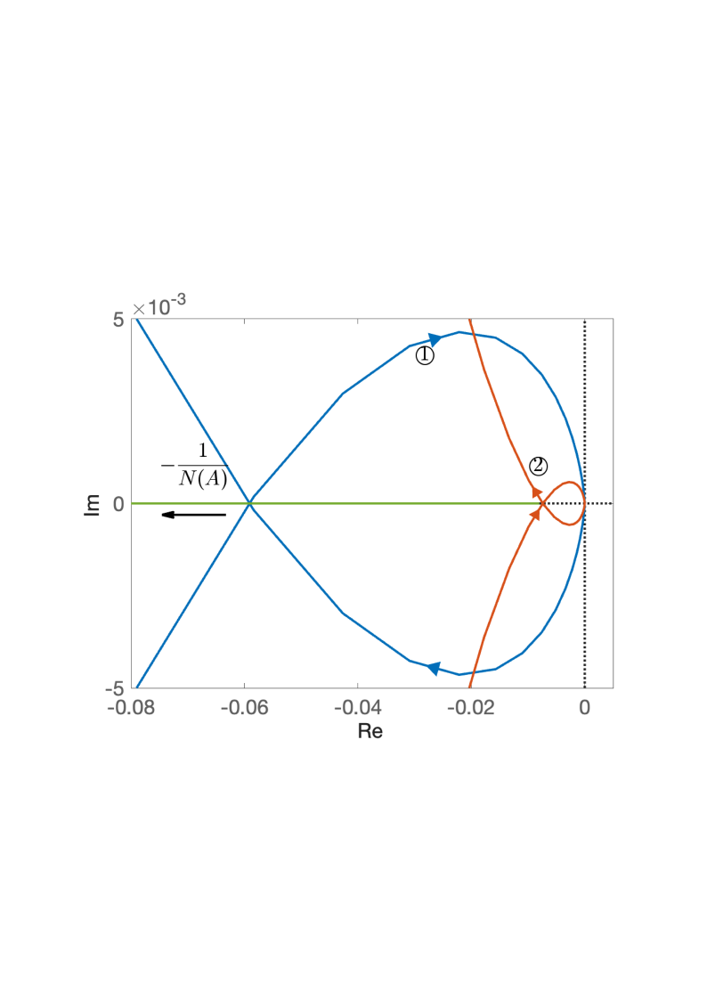
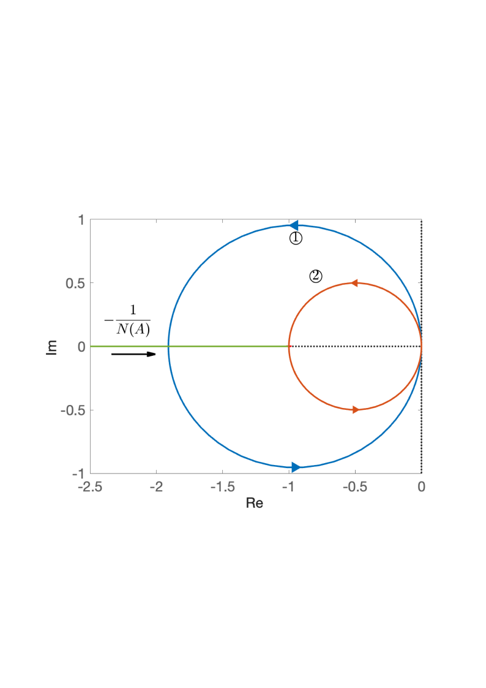

# 7.1 船舶航向控制系统非线性分析

- 所属专题：船舶非线性控制系统分析实例
- 来源文档：`course-content/questions/source/船舶控制案例20240116.docx`

## 正文

船舶航向控制系统中考虑放大器饱和特性的结构如图7.1.1所示，其中控制器取为PI

$$G_{c}(s) = \frac{1 + 0.1704s}{1 + 0.3368s}$$

由图可知系统线性部分的传递函数为

$$G(s) = \frac{0.08(90.88s + 1)}{s(0.4467s + 1)(10s + 1)(50s + 1)}\ $$

系统线性部分的开环增益为$K = 0.08$。

饱和非线性特性的描述函数为

$$N(A) = \frac{2k}{\pi}\left\lbrack \arcsin\frac{a}{A} + \frac{a}{A}\sqrt{1 - \left. （\frac{a}{A} \right.）^{2}} \right\rbrack,\ \ A \geq a$$

由结构图可知，非线性环节参数$k = \frac{1}{K} = 125$，由实际系统的最大输出电压为10V可得参数$a = 0.008$。系统的$- \frac{1}{N(A)}$曲线如图7.1.2所示，$\Gamma_{G}$曲线如图7.1.2中的曲线①所示。由图可知穿越频率$\omega_{x} = 0.493\ rad/s$。曲线与负实轴的交点为$G(j\omega) = - 0.059020$，且该交点处$- \frac{1}{N(A)}$沿$A$增大方向，由不稳定区域进入稳定区域，根据周期运动稳定性判据可知，系统存在稳定的周期运动，由

$${Re}{\left( G(j\omega) \right) = - \frac{1}{N(A)}}$$

可求得振幅$A = 0.0753$,由此可知而非线性系统处于自振荡情况下的输入信号为

$$e(t) = 0.0753\sin{0.493t}$$

为使系统不出现自振，可以调整线性部分的开环增益$K$使$\Gamma_{G}$，$- \frac{1}{N(A)}$曲线无交点此时$K$应满足$- \frac{0.05902K}{0.08} > - \frac{1}{k}$，而$K$的临界值应使上述不等式变为等式，即

$$K_{\max} = \frac{0.008 \times 0.08}{0.05902} = 0.01$$

$K = 0.01$时的$\Gamma_{G}$曲线如图7.1.2中曲线②所示。

另外，在实际系统中，电液伺服系统中电液伺服阀还存在死区特性，下面分析死区特性对内环性能的影响。

死区非线性特性的描述函数为

$$N(A) = \frac{2k}{\pi}\left\lbrack \frac{\pi}{2} - \arcsin\frac{\Delta}{A} - \frac{\Delta}{A}\sqrt{1 - \left. （\frac{\Delta}{A} \right.）^{2}} \right\rbrack,\ \ A \geq \Delta$$

其中液压舵机的非简化的传递函数为

$$G_{1}(s) = \frac{K_{R}}{s(T_{R}^{2}s^{2} + 2T_{R}\zeta_{R}s + 1)}$$

式中，$K_{R} = 2.45 \times 10^{- 2}$，$T_{R}^{2} = 1.33 \times 10^{- 3}$，$2T_{R}\xi_{R} = 1.53 \times 10^{- 3}$，所以

$$G_{1}(s) = \frac{0.0245}{s(0.00133s^{2} + 0.00153s + 1)}$$

取非线性参数$k = 1$，$\Delta = 0.5$，绘制$- \frac{1}{N(A)}$曲线如图7.1.3所示，线性部分$\Gamma_{G}$曲线如图7.1.3中的曲线①所示，由图可得穿越频率$\omega_{s} = 27.4\ rad/s$，$\Gamma_{G}$曲线与负实轴的交点为$G(j\omega_{x}) = - 1.86$，且该交点处$- \frac{1}{N(A)}$沿$A$增大的方向，由稳定区域进入不稳定区域，根据周期运动稳定性判据，系统对应的周期运动时是不稳定的。消除系统不稳定的周期运动可以改变线性部分电液何服阀的增益$K_{1}$，应有$- \frac{1.86}{140}K_{1} > - \frac{1}{K}$，而$K_{1}$的临界值应使上述不等式变为等式，即

$$K_{1\max} = \frac{140}{1.86} = 75.269$$

$K_{1} = 75.269$时的$\Gamma_{G}$曲线如图7.1.3中曲线②所示。
