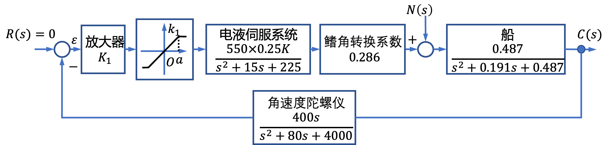
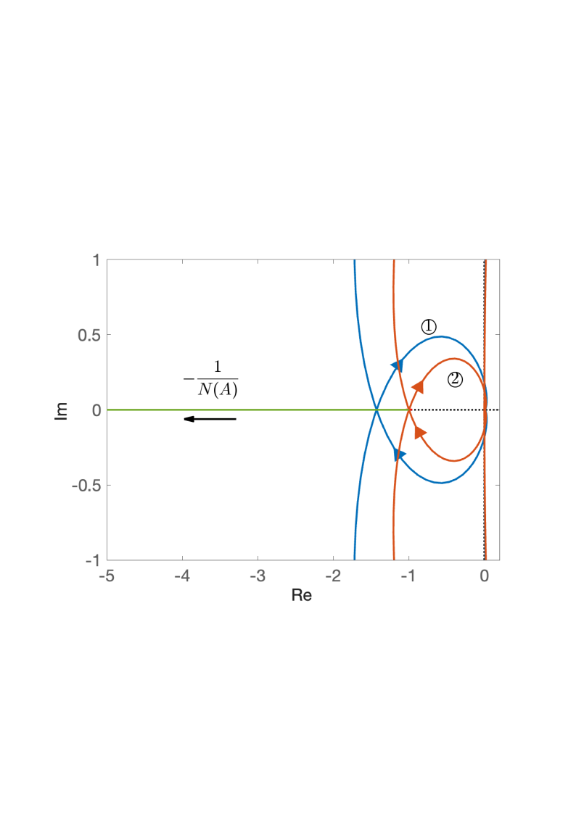
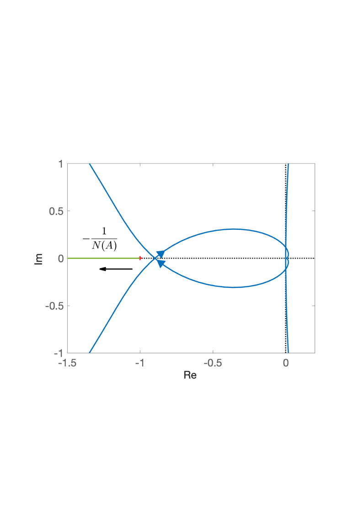
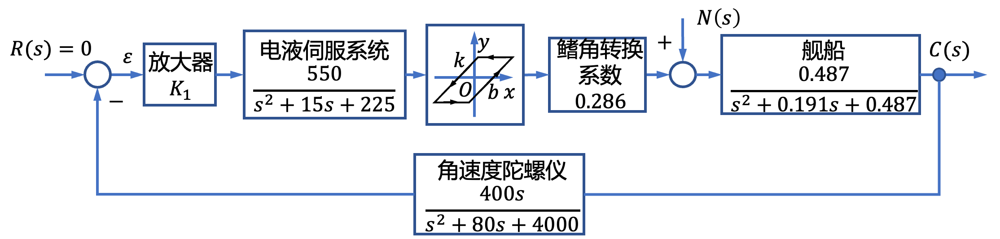
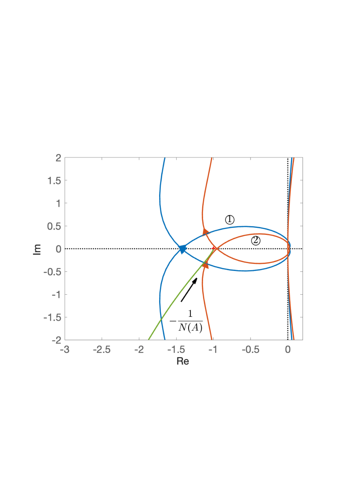
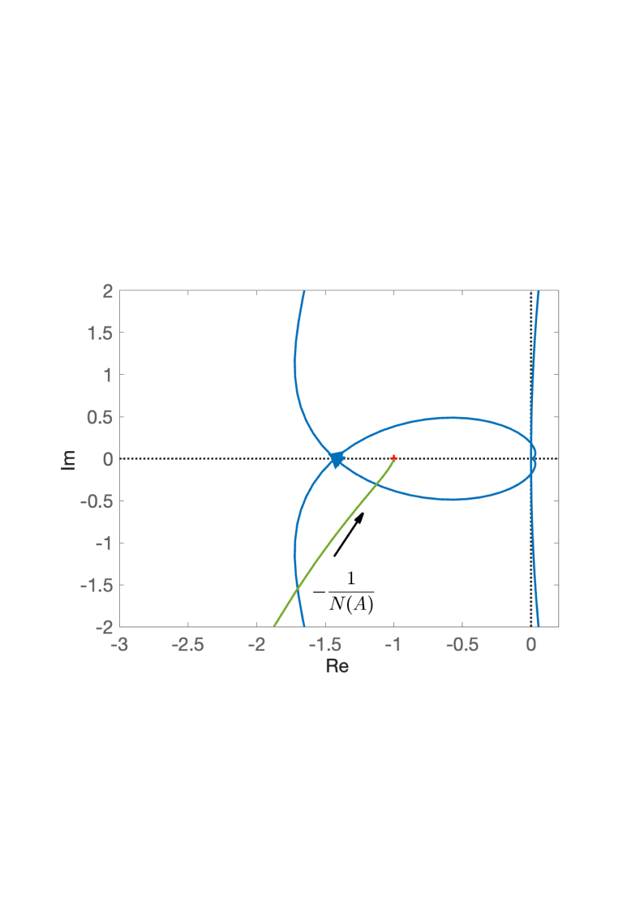

# 7.2 船舶摇减摇鳍控制系统非线性分析

- 所属专题：船舶非线性控制系统分析实例
- 来源文档：`course-content/questions/source/船舶控制案例20240116.docx`

## 正文

这里，设放大器增益为$K_{1} = 500$，$G_{1}(s) = 0.286 \times \frac{550}{s^{2} + 15s + 225}$，$G_{2}(s) = \frac{0.487}{s^{2} + 0.191s + 0.487}$，$H(s) = \frac{400s}{s^{2} + 80s + 4000}$。则系统线性部分的等效开环传递函数为

$$G(s) = \frac{35s}{\left( 0.0044s^{2} + 0.0667s + 1 \right)\left( 2.0534s^{2} + 0.3922s + 1 \right)\left( 0.00025s^{2} + 0.02s + 1 \right)}$$

下面分析放大环节的饱和特性对系统的影响。

饱和非线性特性的描述函数为

$$N(A) = \frac{2k_{1}}{\pi}\left\lbrack \arcsin{\frac{a}{A} + \frac{a}{A}\sqrt{1 - \left( \frac{a}{A} \right)^{2}}} \right\rbrack ，A \geq a$$

设非线性参数$k_{1} = 1$，由实际系统的最大输出电压为10V可得到非线性参数$a = 10$，则

$- \frac{1}{N(a)} = \frac{1}{k_{1}} = - 1$,$- \frac{1}{N(\infty)} = - \infty$

作$- \frac{1}{N(A)}$曲线如图7.2.2所示，线性部分开环增益$K = 35$时的$\Gamma_{G}$曲线如图7.2.2中的曲线①所示。由图7.2.2可得其中穿越频率$\omega_{x} = 13.2\ rad/s$，$\Gamma_{G}$曲线与负实轴的交点为$G\left( j\omega_{x} \right) = - 1.43$,且该交点处$- \frac{1}{N(A)}$沿$A$增大方向，由不稳定区域进入稳定区域。根据周期运动稳定性判据，系统存在稳定的周期运动，由

$$Re\left( G(j\omega)N(A) \right) = - \frac{1}{N(A)}$$

可求得振幅$A = 21.17$。由此可知非线性系统处于自振荡情况下的非线性环节的输入信号为

$$e(t) = 21.17\sin{13.2t}$$

为使该系统不出现自持振荡，可以调整系统线性部分的增益$K$，此时$K$应满足$- \frac{1.43K}{35} \geq - 1$，即$K \leq 24.47$，$\Gamma_{G}$和$- \frac{1}{N(A)}$曲线没有交点，系统不存在自持振荡，如图7.2.2中曲线②所示。

当然，消除自振荡还可以采用校正的方法，下面为线性部分开环增益$K = 35$时，系统加入PI控制器$G_{c}(s) = \frac{1 + 0.1704s}{1 + 0.3368s}$，线性部分$\Gamma_{G}$和$- \frac{1}{N(A)}$曲线如图7.2.3所示。由图7.2.3可以看出，系统加入校正环节(控制器)后，$\Gamma_{G}$曲线和$- \frac{1}{N(A)}$曲线无交点，控制器的加入消除了系统的自激振荡，削弱了非线性因素对系统的影响。

|  |  |
|------------------------------------------------------------------------------------------------------------------------------------------------------------|------------------------------------------------------------------------------------------------------------------------------------------------------------|
| 图7.2.2 系统的$\Gamma_{G}$曲线和$- \frac{1}{N(A)}$曲线                                                                                                     | 图7.2.3 加入校正环节后的系统曲线                                                                                                                           |

在实际的电液伺服系统中还存在间隙非线性特性，含间隙非线性特性的结构图如图7.2.4所示。下面分析间隙非线性特性对系统性能的影响。

间隙非线性描述函数为

$$N(A) = \frac{k}{\pi}\left\lbrack \frac{\pi}{2} + \arcsin{\left( 1 - \frac{2b}{A} \right) + 2\left( 1 - \frac{2b}{A} \right)\sqrt{\frac{b}{A}\left( 1 - \frac{b}{A} \right)}} \right\rbrack + j\frac{4kb}{\pi A}\left( \frac{b}{A} - 1 \right),A \geq b$$

设非线性参数$k = 1$，$b = 0.1$，作$- \frac{1}{N(A)}$曲线如图7.2.5所示，系统的$\Gamma_{G}$曲线如图7.2.5中的曲线①所示。

由图7.2.5可得线性部分$\Gamma_{G}$。曲线穿越频率$\omega_{x} = 13.2\ rad/s$，$\Gamma_{G}$曲线与负实轴的交点为$G\left( j\omega_{x} \right) = - 1.4375$。由图7.2.5可知$\Gamma_{G}$和$- \frac{1}{N(A)}$曲线存在交点$( - 1.568, - j0.2457)$且该交点处$- \frac{1}{N(A)}$沿$A$增大方向，由稳定区域进入不稳定区域，故系统不存在稳定的周运动。当$\Gamma_{G}$和$- \frac{1}{N(A)}$曲线无交点时，有$- \frac{1.43K}{35} \leq - 1$,即$K \leq 24.47$，此时系统稳定，不存在自激振荡，如图7.2.5中曲线②所示。

当同时考虑饱和非线性和间隙非线性对系统的影响时，应使开环增益$K \leq 23.35$,即可消除自激振荡。

下面分析参数变化时对系统的影响。当非线性参数$b = 0.3$和$b = 0.5$时，系统的$\Gamma_{G}$曲线和$- \frac{1}{N(A)}$曲线均如图7.2.6所示。由曲线可以看出，参数$b$的变化对系统并未产生影响，这主要是由于系统的开环增益比$b$大很多倍的缘故。当增益较大时，可以忽略参数$b$的影响。

