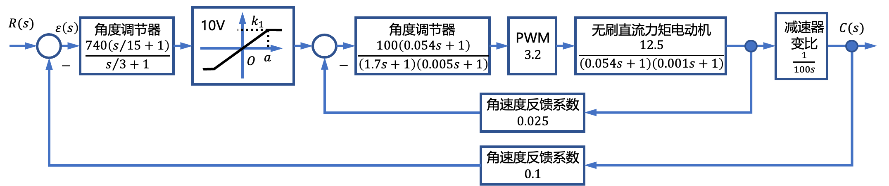
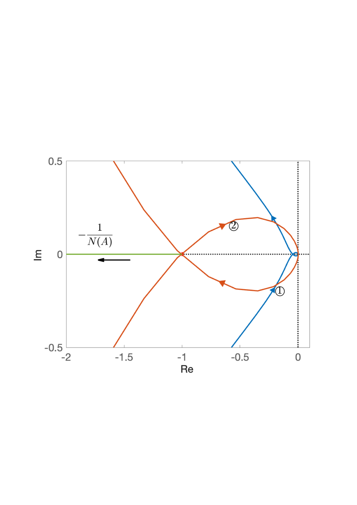
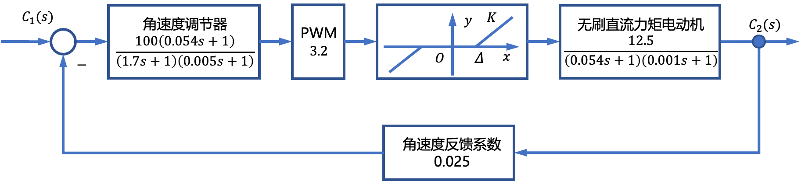
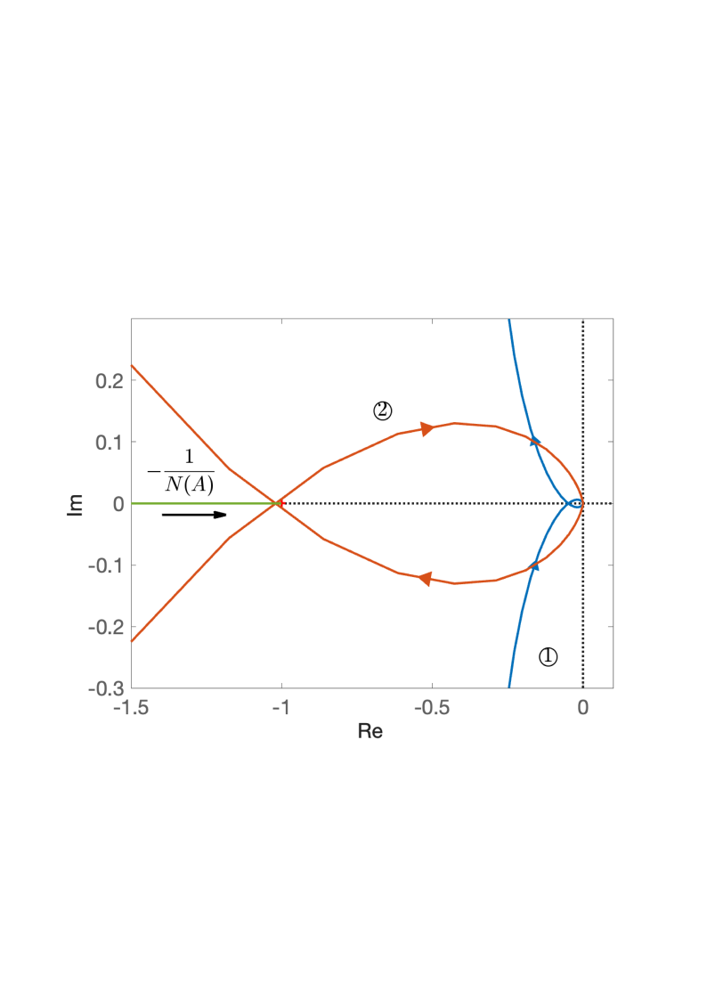
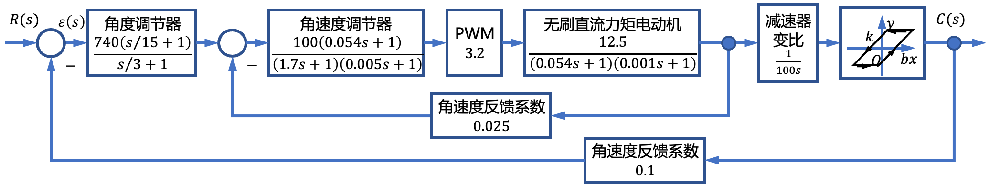
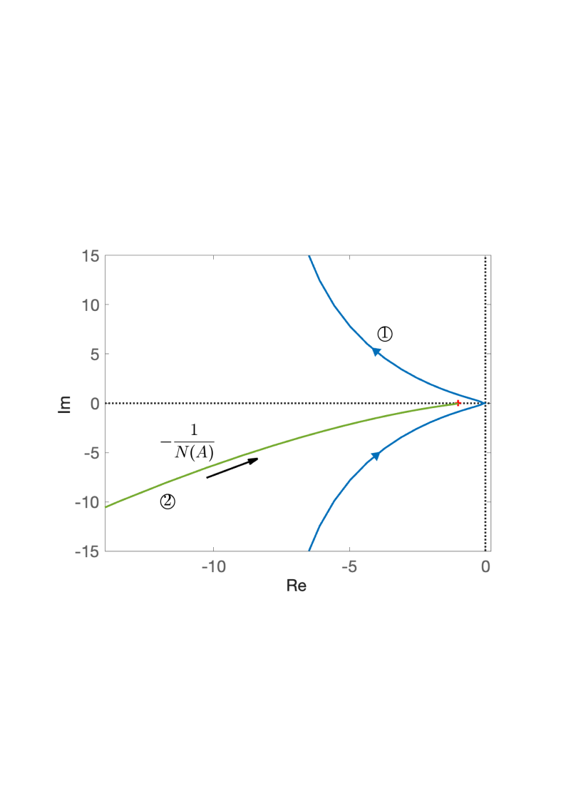

# 7.3 船载稳定平台控制系统非线性分析

- 所属专题：船舶非线性控制系统分析实例
- 来源文档：`course-content/questions/source/船舶控制案例20240116.docx`

## 正文

含饱和非线性特性的船载稳定平台控制系统结构如图7.3.1所示。饱和非线性特性的描述函数为

$$N(A) = \frac{2k}{\pi}\left\lbrack \arcsin\frac{a}{A} + \frac{a}{A}\sqrt{1 - \left( \frac{a}{A} \right)^{2}} \right\rbrack ，A \geq a$$

设非线性参数$k_{1} = 1$，由最大输出电压为10v得到非线性参数$a = 10$，则

$$- \frac{1}{N(A)} = - \frac{1}{k_{1}} = - 1, - \frac{1}{N(\infty)} = - \infty$$

作$- \frac{1}{N(A)}$曲线如图7.3.2所示，线性部分的$\Gamma_{G}$曲线如图7.3.2中的曲线所示。由图7.3.2得系统线性部分的穿越频率为$\omega_{x} = 90\ rad/s$。$\Gamma_{G}$曲线与负实轴的交点为$G\left( j\omega_{x} \right) = - 0.045$。当$\Gamma_{G}$与$- \frac{1}{N(A)}$曲线有交点时，开环增益$K$的临界值为$- \frac{0.045K}{1} \geq - 1$，得$K \leq 22.22$，$K = 22.22$时的$\Gamma_{G}$曲线如图7.3.2曲线所示。

电液伺服系统中存在死区非线性，含有死区非线性特性的电液伺服系统的结构图如图7.3.3所示。

死区非线性特性的描述函数为

$$N(A) = \frac{2k}{\pi}\left\{ \frac{\pi}{2} - \arcsin\frac{\Delta}{A} - \frac{\Delta}{A}\sqrt{\left( 1 - \left( \frac{\Delta}{A} \right)^{2} \right)} \right\},A \geqslant \Delta$$

死区非线性参数$k = 1$，$\Delta = 0.1$时，作$- \frac{1}{N(A)}$曲线如图7.3.4所示。线性部分系统$\Gamma_{G}$曲线如图7.3.4中的曲线①所示。由图7.3.4可知，系统线性部分的穿越频率$\omega_{x} = 495\ rad/s$。$\Gamma_{G}$曲线与负实轴的交点为$G\left( j\omega_{x} \right) = - 0.047$。当$\Gamma_{G}$与$- \frac{1}{N(A)}$曲线有交点时，开环增益$K$的临界值为$- \frac{0.047K}{1} \geq - 1$,得$K \leq 21.27$。$K = 21.2$时的曲线$\Gamma_{G}$如图7.3.4曲线②所示。

下面分析一下系统减速器中存在的间隙特性对系统的影响，结构如图7.3.5所示。

含间隙非线性特性描述函数为

$$N(A) = \frac{k}{\pi}\left\lbrack \frac{\pi}{2} + \arcsin\left( 1 - \frac{2b}{A} \right) + 2\left( 1 - \frac{2b}{A} \right)\sqrt{\frac{b}{A}\left( 1 - \frac{b}{A} \right)} \right\rbrack + j\frac{4kb}{\pi A}\left( \frac{b}{A} - 1 \right),A \geqslant b$$

设含间隙非线性参数为$k = 1$，$b = 0.1$，作$- \frac{1}{N(A)}$曲线如图7.3.6曲线②所示，系统线性部分的$\Gamma_{G}$曲线如图7.3.6曲线①所示。由图可得线性部分$\Gamma_{G}$曲线穿越频率$\omega_{x} = 90\ rad/s$。$\Gamma_{G}$曲线与负实轴的交点为$G\left( j\omega_{x} \right) = - 0.045$。

综上所述，实际系统的内环和外环的角速度调节器的存在，使系统$\Gamma_{G}$曲线和$- \frac{1}{N(A)}$曲线无交点，消除了非线性系统的自激振荡，提高了系统的稳定性能。
