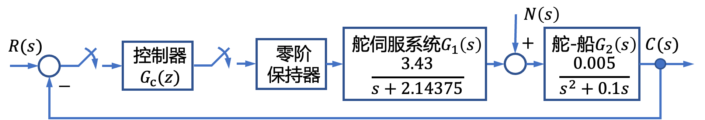
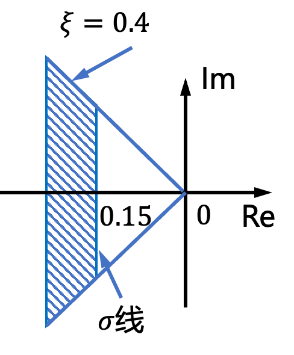
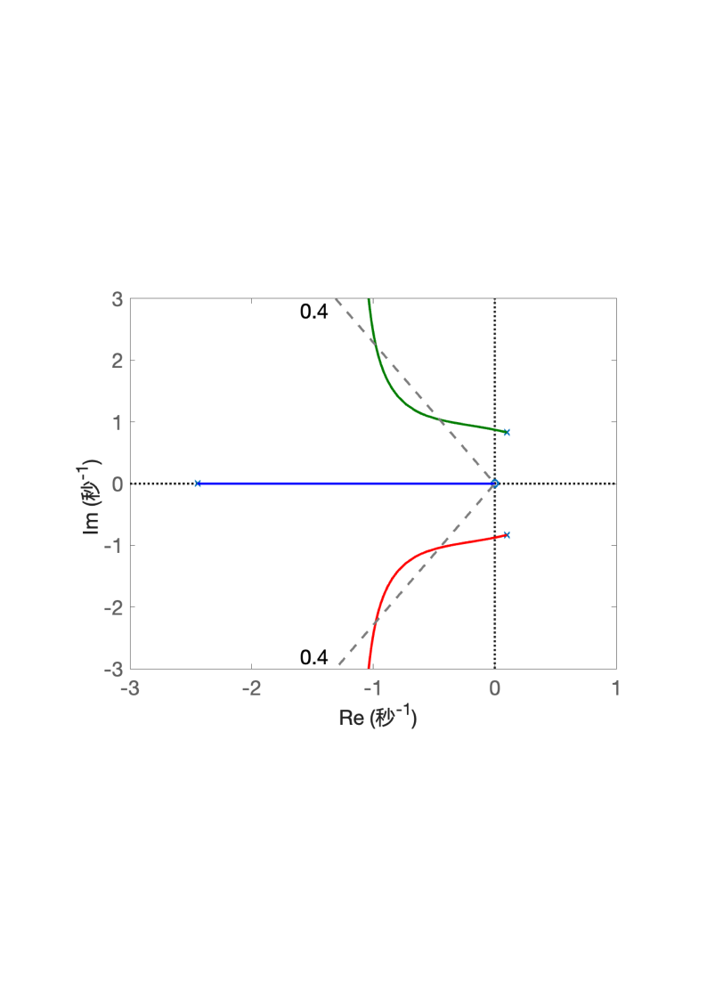
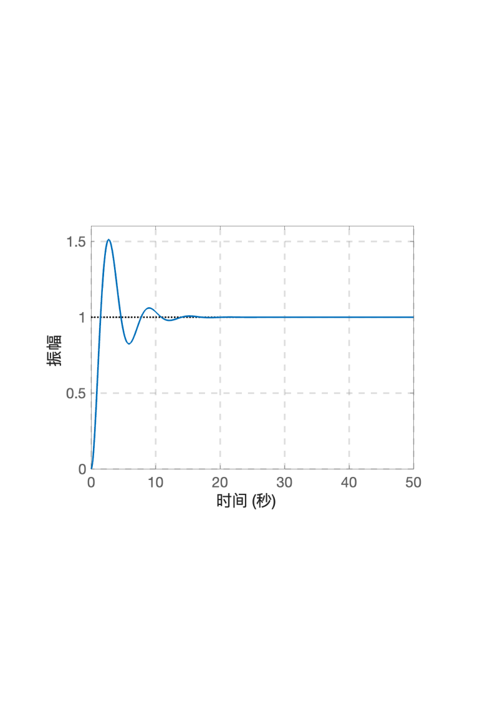

# 8.1 船舶航向控制离散系统分析

- 所属专题：船舶离散系统分析实例
- 来源文档：`course-content/questions/source/船舶控制案例20240116.docx`

## 正文

船舶航向采样控制系统的结构图如图8.1.1所示。图8.1.1中，$C(s)$为实际的航向，$R(s)$为给定的航向，$N(s)$为影响航向的扰动因素。

本例设计的目的是利用模拟化设计方法设计数字控制器$G_{c}(z)$，即用连续系统的设计理论确定$G_{c}(s)$，并采用合适的离散化方法由$G_{c}(s)$求$G_{c}(z)$，使系统满足如下性能指标：

①当扰动$N(s) = 0$时，系统对斜坡输入响应的稳态误差不大于斜坡幅值的30%；

②系统阶跃响应的调节时间$t_{s} \leq 20s(\Delta = 5\%)$。

解①用连续系统的设计理论确定$G_{c}(s)$。

采用PD控制器，选择控制器$G_{c}(s) = K_{2}s + K_{1}$，用根轨迹法选择合适的参数$K_{1}$和$K_{2}$，设系统主导极点的阻尼比$\xi = 0.4$。

由图可知，系统开环传递函数为

$$G(s) = \frac{0.01715\left( K_{2}s + K_{1} \right)}{s(s + 0.1)(s + 2.14375)}$$

显然，该系统为I型系统，在斜坡输入作用下，存在稳态误差。系统的误差信号为

$$E(s) = \frac{R(s)}{1 + G(s)} = \frac{s(s + 0.1)(s + 2.14375)R(s)}{s(s + 0.1)(s + 2.14375) + 0.01715\left( K_{2}s + K_{1} \right)}$$

令$R(s) = R/s^{2}$,其中$R$为指令幅度，则系统的稳态误差为

$$e_{ss}(\infty) = \lim_{s \rightarrow 0}{E(s)} = \frac{12.5R}{K_{1}} \leq 0.30R$$

上式表明，为了获得满意的性能，必须满足$K_{1} \geq 41.67$。这里，选择$K_{1} = 100$。

根据系统对主导极点的阻尼比要求，系统的闭环极点应位于$s$平面上$\xi = 0.4$的与负实轴交角为$\pm \arccos{0.4}$的斜线之间；再由对系统的调节时间的指标要求可知，主导极点实部的绝对值应满足

$$t_{s} = \frac{3}{\sigma} \leq 20\ s$$

因此有$\sigma \geq 0.15$。则满足设计指标要求的闭环极点，应全部位于图8.1.2所示的扇形区域内。

在闭环特征方程中代入$K_{1} = 100$，则

$$D(s) = s(s + 0.1)(s + 2.14375) + 0.01715\left( K_{2}s + 100 \right) = 0$$

$$\frac{0.01715K_{2}s}{s(s + 0.1)(s + 2.14375) + 0.01715 \times 100} = - 1$$

令$K = 0.01715K_{2}$，$K$从0变化到$\infty$，其根轨迹图如图8.1.3所示。

当取模值条件$K = 0.01715K_{2} = 1.99$时，即$K_{2} = 116.03499$时，得到了满足阻尼比$\zeta = 0.4$的闭环主导极点$s_{12} = - 0.382 \pm j0.875$,其实部绝对值$\sigma = 0.382$，由其决定的调节时间为

$$t_{s} = \frac{3}{0.382} = 7.85,\ s \leq 20s,\ \Delta = 5\%$$

相应的稳态误差值

$$e_{ss}(\infty) = \frac{12.5R}{K_{1}} = 0.125R$$

因而$K = 100$，$K_{2} = 116.03499$的设计值，满足全部设计指标要求。

②采用合适的离散化方法由$G(s)$求$G_{c}(z)$。

PD控制器$G_{c}(s) = 116.03499s + 100$，选取采样周期$T = 0.02\ $s,离散化为

$$G_{c}(z) = \frac{116.03499}{T}\left( 1 - z^{- 1} \right) + 100 = \frac{5801.749z - 5701.749}{z}$$

由图8.1.1可知，系统开环脉冲传递函数为

$$G(z) = G_{c}(z)\left\lbrack G_{h}(s)G_{1}(s)G_{2}(s) \right\rbrack = \frac{0.00013175(z - 0.9828)(z + 0.2649)(z + 3.691)}{z(z - 1)(z - 0.998)(z - 0.958)}$$

显然，该离散系统为I型系统，在斜坡输入作用下，存在稳态误差。系统的误差信号为

$$E(z) = \frac{R(z)}{1 + G(z)} = \frac{z(z - 1)(z - 0.998)(z - 0.958)R(z)}{(z + 0.0001312)(z - 0.9699)\left( z^{2} - 1.986z + 0.9865 \right)}$$

令$R(z) = R\frac{Tz}{(z - 1)^{2}}$，其中$R$为指令幅度，则系统的稳态误差

$$e_{ss}(\infty) = \lim_{z \rightarrow 1}{\left( 1 - z^{- 1} \right)E(z)} = 0.125R \leq 0.30R$$

> 稳态误差与连续系统相同，可见具有零阶保持器的离散系统，稳态误差的计算结果与采样周期无关。离散系统的单位阶跃响应和单位斜坡响应分别如图8.1.4和图8.1.5所示。由图可见，该系统较好地满足了给定系统的时域动态性能要求。

图8.1.5 船舶航行采样控制系统的单位斜坡响应曲线
