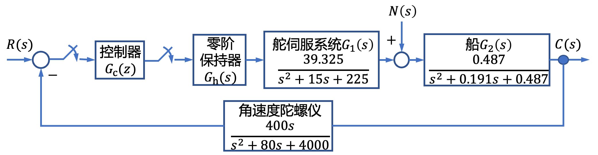
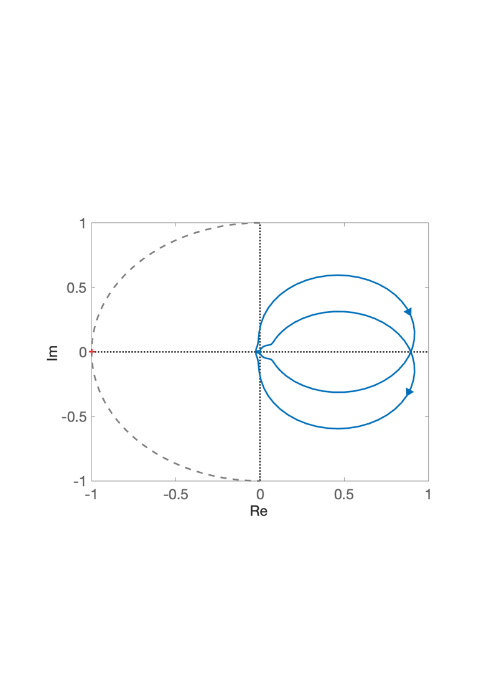

# 8.2 船舶横摇减摇鳍控制离散系统分析

- 所属专题：船舶离散系统分析实例
- 来源文档：`course-content/questions/source/船舶控制案例20240116.docx`

## 正文

对于船舶横摇减摇鳍控制系统，设其采样系统的结构如图8.2.1所示。

图8.2.1中，$R(s)$为预期的横摇减摇鳍角，通常设$R(s) = 0$；$C(s)$为实际的横摇减摇鳍角；$N(s)$为影响横摇减摇鳍角的扰动因素。目前船舶横摇减摇鳍系统的控制规律通常是采取经典或现代控制方法在连续域内设计，得到的控制规律通过软件编程实现，因此需要将设计所得的控制规律离散化，变成离散的控制器。本例设计目的是根据奈奎斯特稳定判据判断离散系统的稳定性。

设连续控制器采用如下PID控制器

$$G_{c}(s) = K\left\lbrack 0.2 + \frac{1}{24.607s + 1} + \frac{0.0128s}{(0.18s + 1)(0.064s + 1)} \right\rbrack$$

设$G_{h}(s) = \frac{1 - e^{- Ts}}{s}$，采样周期$T = 0.02\ s$。对$G_{c}(s)$采用双线性变换法离散化，得到离散控制器的脉冲传递函数为

$$G_{c}(z) = \left. \ G_{c}(s) \right|_{s = \frac{2}{T} \cdot \frac{z - 1}{z + 1}} = K\frac{0.2095z^{3} - 0.5341z^{2} + 0.4457z - 0.1211}{z^{3} - 2.624z^{2} + 2.276z - 0.6524}$$

该系统为非单位反馈系统，且系统$R(z)$对$C(z)$的开环脉冲传递函数为

$$G(z) = G_{c}(z)\mathcal{Z}\left\lbrack G_{h}(s)KG_{1}(s)G_{2}(s)H(s) \right\rbrack$$

令$K = 5200$，则系统的开环奈奎斯特曲线如图8.2.2所示。

