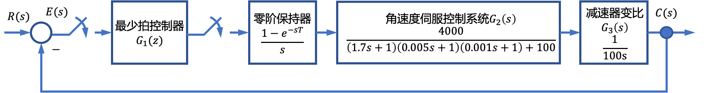
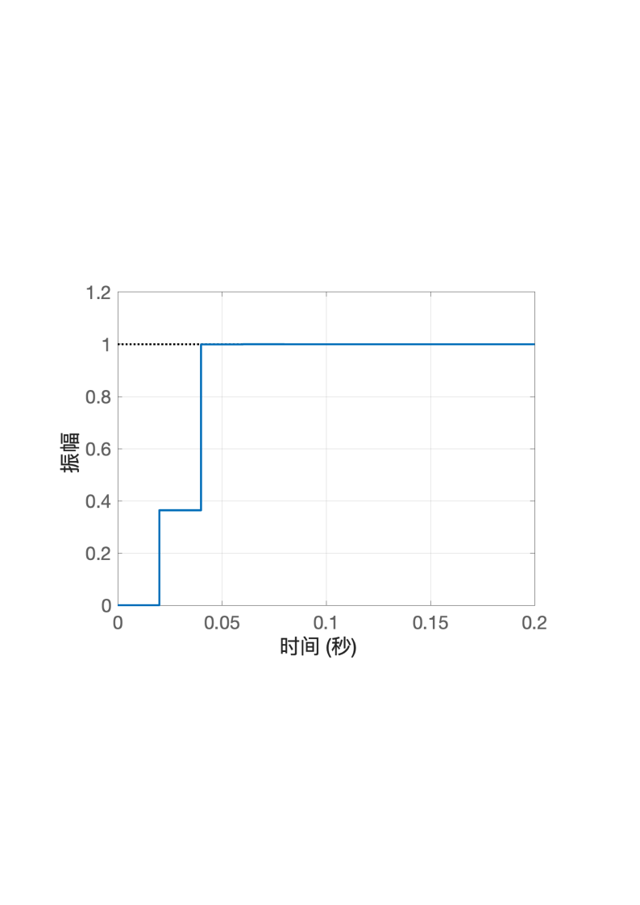

# 8.3 船载稳定平台离散控制系统分析

- 所属专题：船舶离散系统分析实例
- 来源文档：`course-content/questions/source/船舶控制案例20240116.docx`

## 正文

船载稳定平台俯仰角伺服采样控制系统结构如图8.3.1所示。图8.3.1中，$C(s)$为实际的俯仰角，$R(s)$为给定的俯仰角，采样周期$T = 0.02\ s$。本例的目的是针对阶跃输入信号设计最少拍控制器。

**解** 广义对象脉冲传递函数$G(z)$为

$$\begin{array}{r}
G(z) = \mathcal{Z}\left\lbrack G_{2}(s)G_{3}(s)G_{h}(s) \right\rbrack = \left( 1 - z^{- 1} \right)\mathcal{Z}\left\lbrack \frac{1}{s}G_{2}(s)G_{3}(s) \right\rbrack \\
 = \frac{0.0023z^{2} + 0.0043z + 0.0005}{z^{3} - 1.1402z^{2} + 0.1643z - 0.0241} \\
 = \frac{(z + 1.745)(z + 0.1246)}{(z - 1)(z - 0.701 - j0.1385)(z - 0.701 + j0.1385)}
\end{array}$$

$R(z) = 1/\left( 1 - z^{- 1} \right)$，注意到$G(z)$在单位圆上有一个极点$z = 1$，在单位圆外有不稳定零点$(z + 1.745)$，所以设

$$\begin{array}{r}
\Phi_{e}(z) = \left( 1 - z^{- 1} \right)\left( 1 + az^{- 1} \right) \\
\Phi(z) = bz^{- 1}\left( 1 + 1.745z^{- 1} \right)
\end{array}$$

根据$\Phi(z) = 1 - \Phi_{e}(z)$，有

$$\begin{array}{r}
bz^{- 1} + 1.745bz^{- 2} = (1 - a)z^{- 1} + az^{- 2} \\
\left\{ \begin{array}{r}
b = 1 - a \\
1.745b = a
\end{array} \Rightarrow \left\{ \begin{array}{r}
a = 0.635 \\
b = 0.364
\end{array} \right.\  \right.\
\end{array}$$

解得

$$\begin{array}{r}
\Phi_{e}(z) = \left( 1 - z^{- 1} \right)\left( 1 + 0.635z^{- 1} \right) \\
\Phi(z) = 0.364z^{- 1}\left( 1 + 1.745z^{- 1} \right) \\
G_{1}(z) = \frac{\Phi(z)}{G(z)\Phi_{e}(z)} = \frac{0.364(z - 0.701 - j0.1385)(z - 0.701 + j0.1385)}{(z + 0.635)(z + 0.1246)} \\
E(z) = \Phi_{e}(z)R(z) = 1 + 0.635z^{- 1}
\end{array}$$

显然，该最少拍系统响应阶跃输入的调节时间为两拍。由于$G(z)$在单位圆外存在一个零点，使调节时间比典型最少拍系统多一拍。其单位阶跃响应如图8.3.2所示，由图可见，系统超调量为零，调节时间为40ms，具有稳定且快速的响应。

