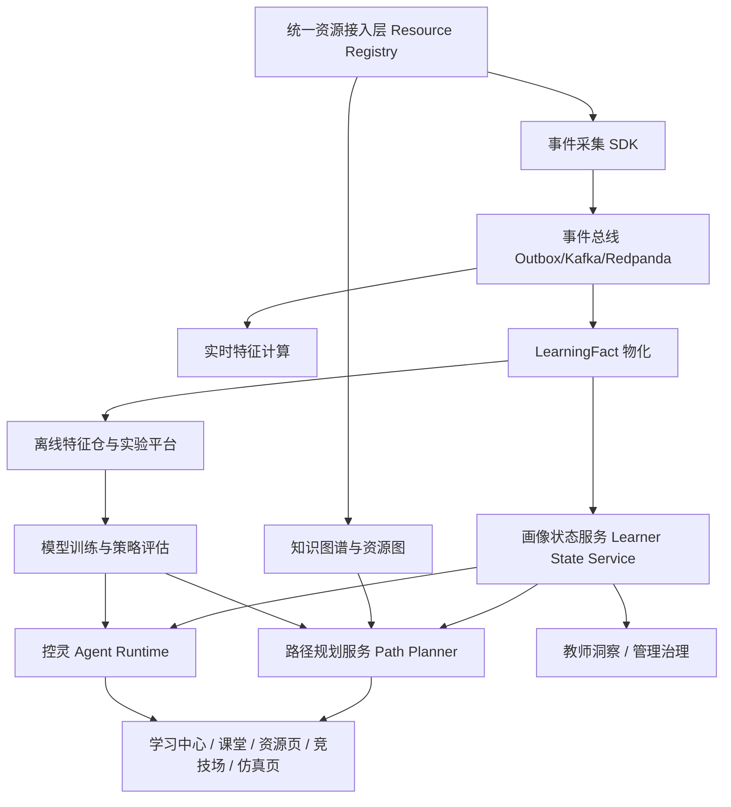
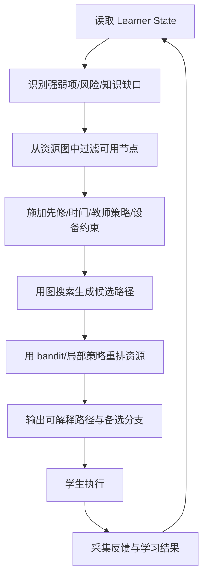
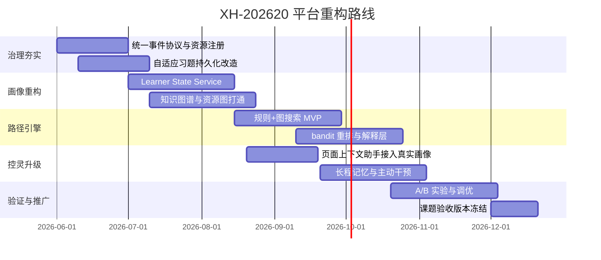
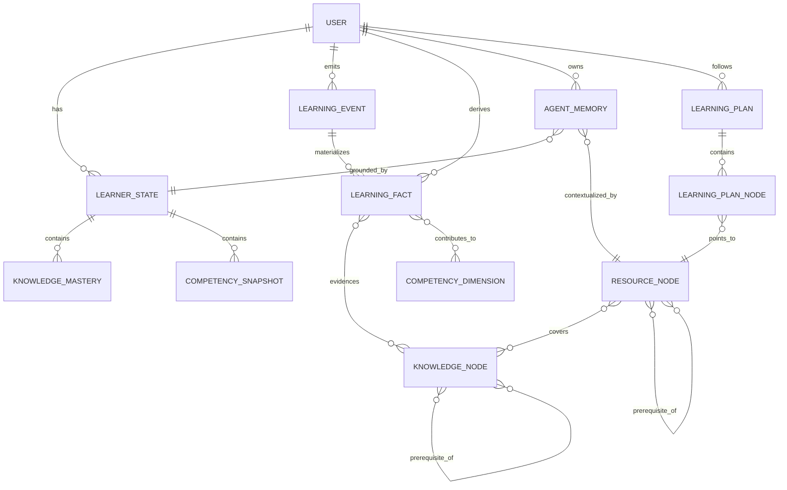

# yong-wei/act 集成分支面向 XH-202620 的智慧自适应教学平台重构研究报告

## 执行摘要

本次研究优先基于 GitHub 连接器检索并分析了 `yong-wei/act` 仓库集成分支的代码、Prisma 数据模型、OpenSpec 规范、API 路由、学习证据治理实现、前端画像/知识图谱/竞技场/智能体“控灵”相关实现，同时交叉核对了仓库内方案文档与近期 issue / PR 主题。结论很明确：**当前仓库已经具备“学习证据治理层”的雏形，但距离“系统级自适应学习系统 + 多模态学生画像 + 基于画像的学习路径规划 + 长程记忆智能体”的完整平台，还差关键的编排层、在线决策层和统一画像服务层。** 当前最成熟的部分不是“路径规划”，而是“事件采集—学习事实物化—证据缓存—画像摘要—推荐解释—治理可视化”这条治理链路；最薄弱的部分则是**自适应引擎持久化、知识图谱与画像联动、资源层统一抽象、显式路径规划服务、控灵的真实画像接入与长程记忆**。fileciteturn36file0 fileciteturn37file0 fileciteturn39file0 fileciteturn41file0 fileciteturn49file0

仓库当前技术路线更接近“**带数据治理能力的 Next.js 单体应用**”：前端页面与后端路由都在同一仓库；核心数据落在 Prisma / PostgreSQL 模型中；事件进入 `InteractionLog` 后，被派发、规整，并物化为 `LearningFact`，随后再生成 `StudentCompetencySnapshot`、`StudentProfileSummary`、`StudentEvidenceFeatureCache` 以及教师/管理员端治理视图。这条链路是平台最值得保留的资产，因为它已经开始显式区分 **ready / stale / missing / partial / low-confidence** 等治理状态，而且也开始把“被动浏览”“打开资源”“知识卡片查看”等行为从“直接能力证据”降级为“上下文证据”，这比很多教学平台“凡点击皆成绩”的粗糙做法更可靠。fileciteturn53file0 fileciteturn54file0 fileciteturn95file0 fileciteturn96file0 fileciteturn92file0

但平台的关键短板同样明显。首先，所谓“自适应练习引擎”目前仍是 `globalThis` 上的内存态题库与作答存储，没有持久化、没有真实 item 参数估计、没有与 `LearningFact` 或画像缓存打通，难以支撑课题级成果。其次，知识图谱虽然已有可视化与节点/关系筛选系统，但尚未看到基于画像的知识缺口定位、路径约束求解与资源编排服务。再次，“控灵”已经具备页面上下文、统一侧边栏、Vercel AI SDK 流式聊天与少量仿真工具调用能力，但画像是默认伪造值，当前任务上下文仍返回 `unknown`，会话仅以 7 天 JSON 消息保存，尚不具备长程记忆、证据检索、主动干预和策略闭环能力。fileciteturn67file0 fileciteturn68file0 fileciteturn59file0 fileciteturn75file0 fileciteturn76file0 fileciteturn78file0 fileciteturn79file0 fileciteturn84file0

因此，本报告给出的核心建议不是在现有代码上继续“补页面”，而是进行**四层重构**：其一，保留现有事件治理与证据缓存资产，抽象为统一 Learner State Service；其二，在资源侧引入资源注册中心与知识图谱/资源图统一索引，使任何资源都能进入路径引擎；其三，新增“路径规划服务 + 在线策略服务 + 实验平台”，把推荐从静态规则跳转升级为可解释、可评估、可 A/B 的个性化路径；其四，把“控灵”从聊天面板升级为**页面上下文助手 + 轨迹解释器 + 干预执行器 + 记忆代理**。如果要控制风险，建议采用“**保守实现：模块化单体 + 事件总线 + Postgres/pgvector**”；如果课题追求更强前瞻性，则采用“**颠覆实现：事件驱动 + 特征仓 + 图/向量双索引 + 在线策略服务**”。两条路线都能与当前仓库衔接，但落地速度和组织要求差异很大。fileciteturn20file0 fileciteturn41file0 fileciteturn77file0

## 仓库现状诊断

### 当前系统的真实强项

当前集成分支最值得重视的不是某个单独页面，而是已经形成了一条较完整的“学习证据治理”主链：`/api/interactive/events` 接收课堂与课外互动事件，先落 `InteractionLog`，再派生 `StudentStepResponse`，然后把核心事件物化为 `LearningFact`，最后由快照、摘要、特征缓存、推荐器、教师洞察和管理员治理接口消费。这条链路同时引入了事件去重、resourceId 降级、合同步上下文归一化、课堂结束后报告刷新等操作，说明仓库已经从“页面驱动”走向“事件驱动”。fileciteturn53file0 fileciteturn54file0 fileciteturn95file0

Prisma 模型也显示仓库已经为课程、学生画像、知识图谱、学习路径、推荐、风险、AI 会话等对象预留了较多结构化表：包括 `StudentProfile`、`StudentCompetencySnapshot`、`StudentProfileSummary`、`StudentRiskFlag`、`LearningRecommendation`、`KnowledgeNode`、`KnowledgeEdge`、`KnowledgeProgress`、`LearningPath`、`LearningPathNode`、`LearningResource`、`KonlingSession` 等。这意味着数据底座已经超出“普通 LMS”，具备向智慧自适应平台演进的可能。fileciteturn21file0 fileciteturn22file0 fileciteturn23file0 fileciteturn24file0 fileciteturn25file0 fileciteturn26file0

在治理层上，仓库已经明确区分不同证据源的价值等级与资格。`evidence-source-catalog.ts` 把 `InteractionLog`、`StudentStepResponse`、`SimulationLog`、`UserAnswer`、`PromptAssessment`、`DesignSession`、`ArenaSubmission`、`LearningFact` 等分为 `eligible`、`context-only`、`unsupported` 等状态，并显式把 `knowledge_card_open`、`resource_open`、`resource_view`、`arena_leaderboard_view` 一类行为列为低价值或上下文性事件。这一点很关键，它说明仓库已经具备“画像可信度治理”的意识。fileciteturn92file0 fileciteturn97file0 fileciteturn98file0

### 当前系统的关键缺口

尽管数据治理做得比表面看上去成熟，但真正决定课题高度的三个中枢仍然缺位。

第一，**自适应学习引擎仍然是原型级**。`adaptive-engine.ts` 把 session、answers、generatedQuestions 存在 `globalThis`，`getDiagnostic`、`selectNextQuestion`、`submitAnswer` 都是内存逻辑；能力估计只是基于正确率、平均难度和平均时间的手工公式，没有数据库持久化、没有项目反应理论参数、没有知识节点后验更新，也没有纳入治理证据流。这个实现适合演示，不适合作为课题核心。fileciteturn67file0 fileciteturn68file0

第二，**学习路径目前主要仍是“推荐跳转”，不是“显式规划”**。推荐引擎的产出本质上是规则触发后的 `actionUrl`，例如跳到 `/missions`、`/knowledge`、`/assessment/diagnostic`、某个互动课程或某个仿真入口。它有理由码、证据窗口、来源覆盖和置信信息，但仍不是一个支持任意资源、显式约束、目标函数和在线调整的路径求解器。fileciteturn39file0 fileciteturn40file0

第三，**控灵已经有框架，但还没有“真实智能”所依赖的状态接入**。全局 AI Provider 里构造的 `userProfile` 是默认值；`KonlingContext` 接口虽然能读 `StudentProfileSummary` 与最新快照，但 `current_task_context` 仍然是 `unknown`/`null`；消息 API 直接把消息 JSON 存入 `KonlingSession`，缺少分层记忆、工具结果缓存、证据检索和行动策略。侧边栏可调用的工具也几乎只限于仿真状态、参数修改和结果分析。fileciteturn84file0 fileciteturn75file0 fileciteturn76file0 fileciteturn78file0 fileciteturn79file0 fileciteturn82file0

### 当前数据流与模块边界

```mermaid
flowchart LR
  A[前端页面/互动课程/知识图谱/资源页/竞技场] --> B[/api/interactive/events]
  B --> C[InteractionLog]
  B --> D[StudentStepResponse]
  B --> E[LearningFact 物化]
  E --> F[StudentCompetencySnapshot]
  E --> G[StudentProfileSummary]
  E --> H[StudentEvidenceFeatureCache]
  H --> I[Recommendation Engine]
  H --> J[/api/user/profile]
  H --> K[/api/teacher/classes/:id/insights]
  H --> L[/api/admin/data-governance/status]
  A --> M[/api/assessment/*]
  M --> N[Adaptive Engine 内存态]
  A --> O[/api/ai/chat 与 /api/ai/sessions/*]
  O --> P[KonlingSession JSON 会话]
```

上图不是仓库中的现成图，而是根据路由、服务和模型关系抽象出的当前主链。它揭示了一个核心事实：**治理链路已经结构化，而适应性决策链路尚未结构化**。fileciteturn53file0 fileciteturn54file0 fileciteturn41file0 fileciteturn44file0 fileciteturn91file0

### 现有资源、字段、事件与质量评估

| 资源域 | 当前实现/表 | 关键字段或事件 | 采集频率 | 质量判断 | 说明 |
|---|---|---|---|---|---|
| 课堂互动与互动课程 | `InteractionLog`、`StudentStepResponse`、`LearningFact` | `lesson_submit`、`lesson_resubmit`、`session_finalize`、`lesson_step_view`、`ai_query_submit`、`sourceLogId`、`clientEventId` | 近实时 | 中高 | 已有去重、上下文归一化和事实物化；课堂提交证据相对可靠。fileciteturn53file0 fileciteturn54file0 fileciteturn95file0 |
| 课堂外资源学习 | `InteractionLog`、`LearningFact` | `resource_view/open/play/progress/download/complete` | 近实时 | 中 | `resource_complete` 可作为核心事实，其余多为上下文性证据。fileciteturn56file0 fileciteturn97file0 fileciteturn98file0 |
| 知识图谱/知识卡片 | `KnowledgeNode`/`KnowledgeEdge`/`KnowledgeProgress` 及知识图谱页面 | `knowledge_card_open`、`knowledge_graph_node_focus`、节点/关系/章节/布鲁姆层级 | 近实时 | 中偏低 | 图谱可视化强，但当前更多用于浏览，尚未形成路径求解闭环。fileciteturn57file0 fileciteturn59file0 fileciteturn97file0 fileciteturn25file0 |
| 船舶仿真 | `SimulationLog`、`workspace_param_change`、`simulation_finish` | `score`、`duration`、`avgError`、`maxRudderRate` 等 | 任务级 | 高 | 在能力映射中占权重大，是参数设计与工程约束的重要来源。fileciteturn41file0 fileciteturn93file0 fileciteturn97file0 |
| 竞技场与综合控制仿真 | `ArenaSubmission`、`ArenaEvaluationRun`、Arena evidence summary | `taskId`、`score`、`valid`、硬约束结果、满意度分布、方法偏好 | 提交级 | 中高 | 竞技场已开始沉淀班级/个人证据摘要，但更多是评测层，不是路径层。fileciteturn100file0 fileciteturn92file0 |
| 自适应习题 | `/api/assessment/next-question`、`submit-answer`、`diagnostic`、`adaptive-engine.ts` | `questionId`、`selectedOption`、`timeSpent`、`estimatedAbility` | 题目级 | 低 | 当前为原型：内存态、无持久化、无治理接入。fileciteturn64file0 fileciteturn65file0 fileciteturn67file0 |
| 画像聚合 | `StudentPortraitV2Snapshot`、`StudentProfileSummary`、`StudentEvidenceFeatureCache` | 七维 portrait v2、overallScore、trend、riskFlags、evidenceWindow、sourceCoverage、confidence；旧 `StudentCompetencySnapshot` 仅作兼容输入 | 批处理/刷新 | 高 | 这是当前平台最成熟的画像资产。fileciteturn37file0 fileciteturn41file0 fileciteturn43file0 |
| 教师洞察 | `/api/teacher/classes/[classId]/insights` | 班级能力统计、风险、evidenceStatus、session quality | 页面读取时 | 中高 | 已可看到“可信度/覆盖度”，但还缺 drill-down 到路径干预。fileciteturn44file0 fileciteturn45file0 fileciteturn46file0 |
| 管理治理 | `/api/admin/data-governance/status` | 证据源覆盖、cache 健康、队列、session 质量 | 页面读取时 | 高 | 适合继续扩展为数据质量控制台。fileciteturn91file0 fileciteturn49file0 fileciteturn92file0 |
| 控灵 | `GlobalAIProvider`、`/api/ai/chat`、`/api/ai/sessions/*`、`/api/ai/konling-context` | `pageContext`、`userProfile`、session messages、simulation tools | 会话级 | 低到中 | 框架完整，但画像接入和记忆层明显不足。fileciteturn84file0 fileciteturn79file0 fileciteturn78file0 fileciteturn75file0 |

### 学生画像当前能力维度与控灵现状

当前正式进入画像聚合与推荐体系的主能力维度是七维 portrait v2：**控制建模与表征、系统分析与解释、控制器设计与综合、仿真验证与证据、工程约束与安全、迁移整合与应用、反思改进与 AI 协作**。历史六维 `competencyVector` 仍保留在迁移和审计边界内，但只能通过显式兼容映射参与回退，不能作为在线路径、推荐或页面的主画像。fileciteturn93file0

控灵则处于“**界面层比状态层成熟**”的阶段：页面上下文类型定义较完整，课程 AI 上下文注册表也相当庞大，说明作者已经为不同课程和步骤准备了上下文脚手架；但全局 Provider 里画像仍是默认值，Prompt Builder 依赖静态学习风格和简化能力向量，会话 API 也没有真正的 learner-state 检索，因此控灵当前更像“带课程语气的聊天助手”，还不是“以学习轨迹为核心的教学协作智能体”。fileciteturn72file0 fileciteturn73file0 fileciteturn74file0 fileciteturn84file0 fileciteturn85file0

## 目标能力与总体架构

### 面向 XH-202620 的目标能力清单

| 能力域 | 功能描述 | 优先级 | 建议 KPI |
|---|---|---|---|
| 自适应学习引擎 | 基于知识状态、能力向量、资源图和约束条件动态生成下一步学习动作 | P0 | 推荐资源点击率、任务完成率、知识点掌握增益、7/14 日留存 |
| 多模态学生画像 | 统一融合课堂、仿真、竞技场、资源、视频音频、知识图谱、题目、AI 交互等证据 | P0 | 画像新鲜度、证据覆盖率、可解释率、低置信比例 |
| 知识图谱集成 | 知识点、先修关系、资源映射、能力维度映射、错因标签一体化 | P0 | 资源映射覆盖率、节点掌握可计算率、路径命中率 |
| 学习路径规划与可视化 | 支持任意资源节点的显式路径编排、在线调整、可视解释 | P0 | 路径采纳率、路径偏离后纠偏成功率、解释点击率 |
| 实时与离线分析 | 实时事件特征、会话级诊断、离线特征仓与实验分析并存 | P1 | 实时更新延迟、离线训练周期、A/B 实验可观测性 |
| 长程记忆与会话智能体 | 把控灵升级为带工作记忆、情景记忆、学习记忆、策略记忆的教学智能体 | P0 | 相关回答率、干预接受率、重复问答降低率 |
| 可扩展资源接入层 | 任何资源只要注册为 Resource Node 都可纳入路径规划与画像计算 | P0 | 新资源接入时长、接入一致性、事件完备率 |
| 隐私与合规 | 最小必要、分级脱敏、可追溯审计、师生权限隔离 | P0 | PII 暴露事件为 0、访问审计完整率、敏感字段脱敏覆盖率 |

### 推荐的总体重构原则

我不建议一上来把现有 Next.js 体系完全拆散。当前仓库最大资产在于**数据模型和治理链已经落地**，最合理的做法是：

**保守路线**：保留 Next.js + Prisma + PostgreSQL 的主框架，增加事件总线、特征服务、路径规划服务和记忆服务，先做“模块化单体”。
**颠覆路线**：把事件、特征、路径、智能体拆成独立服务，引入流式计算和策略服务，形成“轻量微服务 + 数据平台”架构。
如果 XH-202620 更看重可交付与可验收，优先走保守路线；如果更看重平台前瞻性与可持续科研产出，可在第二阶段切向颠覆路线。

### 推荐的目标架构



### 关键技术选型建议

| 子系统 | 保守选型 | 颠覆选型 | 优点 | 风险/代价 | 建议 |
|---|---|---|---|---|---|
| 应用架构 | 模块化单体 | 微服务 | 保守路线迁移成本低、与现仓库贴合 | 微服务治理成本高 | 先模块化单体 |
| 事件总线 | Postgres Outbox + Redis/BullMQ | Kafka / Redpanda | Outbox 实现简单；Kafka 更适合高吞吐 | Kafka 运维复杂 | 先 Outbox，后 Redpanda |
| OLTP | PostgreSQL | PostgreSQL 分库分域 | 现有 Prisma 已在用 | 分库增加复杂度 | 继续 Postgres |
| 向量检索 | pgvector | Milvus / Weaviate | 与 Postgres 同栈，集成简单 | 大规模下性能上限较低 | 初期 pgvector |
| 图存储 | Postgres 边表 + 图视图 | Neo4j | Postgres 统一事务；Neo4j 查询更强 | 双存储成本 | 初期双写可选，先边表后 Neo4j |
| 时序分析 | Postgres 分区/Timescale | ClickHouse + 流式 | 简单；ClickHouse 分析强 | 新栈维护成本 | 先 Postgres/Timescale |
| 特征仓 | 表级特征缓存 | Feast + Offline/Online store | 简单可控 | Feast 需要更多基础设施 | 先自建 Feature Store |
| 前端状态 | React Query + Zustand | 前端事件总线 + BFF | 易落地 | BFF 设计额外成本 | 采用 React Query + Zustand |
| Agent Runtime | Next.js route + tool router | 独立 Agent Gateway | 保持现有接口；后期扩展 आसान | 复杂工具编排受限 | 先 route + tool router，后独立 |
| 部署 | Docker Compose / K8s 轻集群 | 完整 K8s + GitOps | 成本低 | 扩展受限 | 视规模先轻后重 |

### 性能目标与容量估算

以下为**未指定规模下的工程假设**，用于课题方案，不是仓库现状事实。

| 指标 | MVP 目标 | 成熟期目标 |
|---|---:|---:|
| 峰值在线学生 | 400 | 1500 |
| 峰值事件吞吐 | 80 条/秒 | 500 条/秒 |
| 画像实时刷新延迟 | < 60 秒 | < 10 秒 |
| 推荐/路径 API P95 | < 500 ms | < 200 ms |
| 控灵上下文装载 P95 | < 300 ms | < 120 ms |
| 会话流式首 token | < 2.5 s | < 1.2 s |
| 单日事件量 | 200 万 | 1200 万 |
| 特征重建 | 夜间批处理 | 小时级增量 + 夜间全量 |

## 学生画像与学习路径引擎重构

### 学生画像数据源与能力维度扩展

当前仓库的历史六维能力模型适合作为**兼容输入**继续保留；七维 portrait v2 负责主画像展示和决策。为了支撑真正的路径规划，还需要在 portrait v2 下增设二级状态维。建议结构如下：

| 一级维度 | 建议二级维度 | 量化方式 |
|---|---|---|
| 控制建模与分析 | 概念掌握、时域/频域转换、模型辨识可靠度 | 节点掌握概率、题目/设计任务正确性、辨识残差 |
| 参数设计与调优 | 调参效率、约束下优化、方案稳定性 | 提交轮次、满意度、硬约束失败率 |
| 跨域迁移与联动 | 概念跨域映射、资源跨模态迁移、场景泛化 | 图谱跨边成功率、跨类型任务表现 |
| 工程决策与约束 | 风险识别、约束遵守、解释质量 | 违反次数、恢复质量、鲁棒场景表现 |
| 探究反思与提示词 | 问题表达、AI 使用策略、反思深度 | prompt 质量、有效追问率、反思文本评分 |
| 自主学习进展 | 路径执行、坚持性、补弱主动性 | 路径完成率、间隔重复执行、补弱命中率 |

进一步建议新增两个**横切状态维**：
其一是**知识节点掌握状态**，用于路径规划；其二是**资源偏好与媒介吸收效率**，用于资源层个性化。

### 多源证据采集与特征工程建议

| 数据源 | 采集事件 | 特征工程建议 | 时序/会话建模 | 多模态融合 | 质量与隐私 |
|---|---|---|---|---|---|
| 虚拟仿真 | 参数变更、开始/结束、误差曲线、约束触发、成绩 | 误差积分、收敛速度、调参步长、失败恢复率 | 以一次实验为 session；保留迭代序列 | 与讲义/知识节点关联到目标概念 | 参数与日志分级脱敏；保留聚合，不暴露原始上传方案 |
| 课堂交互 | step view/submit/resubmit/finalize、AI 追问 | 正确率、重提改进率、拖延/跳步模式 | 课堂 session + step session 双层建模 | 绑定课堂计划、知识点、教师意图 | 学生原始答案单独保护；画像侧仅用衍生特征 |
| 竞技场与综合控制仿真 | workspace start、save、run、submit、evaluation | 有效提交率、弱指标分布、方法偏好、改进幅度 | task session + season session | 与任务协议、对象库和约束标签融合 | 榜单公开与画像私有分离 |
| 知识图谱/知识卡片 | node focus、card open、path drill | 节点停留、回访、先修跨越、错后回流 | 以探索 session 建模，不直接给高权重能力分 | 与题目错因、资源点击、后续表现联动 | 仅作上下文证据，避免点击即高分 |
| 视频/音频/讲义 | open/play/progress/download/complete | 完成率、倍速、重播片段、跳出点 | 媒体 session + 资源 session | 与文本摘要、知识点、题目表现对齐 | 原始媒体行为匿名化、聚合化 |
| 自适应习题 | next question、submit answer、response time | IRT/BKT 更新、认知负荷代理、弱点恢复率 | 连续答题 session + 长期 mastery state | 与知识图谱节点、资源补救结果联动 | 题目原文和答案日志分权访问 |
| 控灵互动 | query、tool call、helpfulness、follow-up | 求助时机、问题质量、工具命中、误用恢复率 | conversation session + intent thread | 与页面上下文、画像状态、任务结果联动 | 对话摘要入画像，原文受更严权限控制 |

### 路径表示、约束与目标函数

建议把平台任意资源统一抽象为 `ResourceNode`，节点类型至少包含：

`lesson_step / knowledge_node / knowledge_card / video / audio / handout / quiz / simulation / arena_task / reflection / ai_intervention / project`

路径本体采用**带权有向图上的个性化计划 DAG**。每个节点携带：

- `prerequisites`
- `estimatedTime`
- `cognitiveLoad`
- `resourceType`
- `knowledgeCoverage`
- `abilityImpact`
- `cost`
- `availability`
- `teacherPolicy`
- `privacyLevel`

目标函数建议不是单一“学得快”，而是多目标优化：

\[
\max \; J = \alpha \cdot LearningGain + \beta \cdot Engagement + \gamma \cdot ConstraintSatisfaction + \delta \cdot Diversity - \lambda \cdot Fatigue - \mu \cdot DropoutRisk
\]

同时受以下约束：

- 先修约束
- 时间预算约束
- 教师指定必修约束
- 资源可用性约束
- 风险干预优先约束
- 隐私/权限约束
- 终端环境约束

### 算法候选比较

| 方法 | 适用阶段 | 优点 | 缺点 | 适合本项目的定位 |
|---|---|---|---|---|
| 基于规则 | 冷启动/MVP | 可控、可解释、上线快 | 个性化上限低 | 第一阶段必须保留 |
| 图搜索 | 已有知识图谱后 | 能显式满足先修与时间约束 | 需高质量图与权重 | 作为主路径骨架 |
| 上下文 bandit | 有在线反馈后 | 能优化“下一步推荐” | 不擅长长序列规划 | 用于局部资源选择 |
| 强化学习 | 数据量大、闭环成熟后 | 可优化长期回报 | 训练难、解释难 | 不宜一上来主用 |
| 混合方法 | 成熟期 | 兼顾可解释和效果 | 系统复杂 | 本项目最终推荐 |

我真正认可的路径是：**规则+图搜索打底，bandit 做局部重排，RL 只在成熟阶段研究性引入**。直接跳到强化学习，工程上大概率失控。

### 推荐的路径规划流程



### 路径规划伪代码

```text
Input:
  learner_state S
  resource_graph G
  policies P
  budget T

1. deficits <- infer_knowledge_gaps(S)
2. candidates <- filter_nodes(G, deficits, P, T)
3. feasible_subgraph <- apply_constraints(candidates, prerequisites, availability, privacy)
4. base_path <- multi_objective_graph_search(feasible_subgraph, objective=J)
5. reranked_path <- contextual_bandit_rerank(base_path, context=S.current_context)
6. explanations <- generate_path_explanations(reranked_path, deficits, evidence=S.evidence)
7. return {path, alternatives, explanations}
```

### 学习路径可视化建议

建议前端同时提供三种视图：

- **地图视图**：展示主路径、分支路径、当前节点、风险节点
- **时间线视图**：展示未来 3 天 / 7 天 / 14 天安排
- **证据视图**：每个节点为什么被推荐，基于哪些证据，置信度如何

这会比当前纯 `actionUrl` 推荐卡片强得多，也更适合作为课题成果演示。

## 控灵智能体与接口规范

### 现状判断

控灵已经具备全局侧边栏、课程上下文、聊天 API、会话保存与少量工具调用能力；但其核心问题是**没有接到真实 learner state**。当前 Provider 使用默认画像，Prompt Builder 只做静态拼接，会话接口把消息整段写入 `KonlingSession.messages`，`KonlingContext` 的 `current_task_context` 仍未填充。它能聊天，但还不能做“因人、因页、因轨迹而异”的教学协作。fileciteturn84file0 fileciteturn74file0 fileciteturn75file0 fileciteturn78file0

### 目标定位

重构后的控灵应当不是一个独立产品，而是四种角色的统一运行时：

| 角色 | 职能 |
|---|---|
| 页面上下文助手 | 理解当前页面、任务、知识节点和用户操作 |
| 学习轨迹解释器 | 告诉学生“为什么推荐这个、你弱在哪里、下一步为什么是它” |
| 主动干预执行器 | 在风险、停滞、误用、偏离路径时给出干预 |
| 长程记忆代理 | 保留可压缩的学习情节、偏好、错因和干预结果 |

### 记忆管理策略

| 记忆层 | 存什么 | 存储建议 | 生命周期 |
|---|---|---|---|
| 工作记忆 | 当前页面、当前任务、最近 20 条事件 | Redis / session store | 分钟到小时 |
| 会话记忆 | 当前对话摘要、已解释过的概念、未完成事项 | Postgres JSON + summary | 天级 |
| 情节记忆 | “某次竞技场卡在约束”“某知识点连续三次薄弱” | Postgres + 向量索引 | 周到学期 |
| 语义记忆 | 稳定偏好、长期弱项、常用干预策略 | Feature Store / Vector Store | 学期级 |
| 策略记忆 | 哪类提示对该学生有效 | Online policy store | 持续更新 |

### 对话与工具调用接口建议

#### 页面上下文接口

```json
{
  "pageContext": {
    "pageId": "unit-5-2-step-4",
    "resourceNodeId": "res_kg_ode_stability",
    "pageType": "knowledge",
    "currentTaskId": "task_ode_transfer_01",
    "knowledgeNodes": ["kg_stability", "kg_routh", "kg_root_locus"],
    "sessionId": "class_2026_05_28_01"
  }
}
```

#### 实时画像接口

```json
{
  "learnerState": {
    "userId": "u_123",
    "overallLevel": "good",
    "competency": {
      "controlModeling": 0.72,
      "parameterDesign": 0.61,
      "crossDomainTransfer": 0.43
    },
    "knowledgeMastery": {
      "kg_stability": 0.84,
      "kg_routh": 0.39
    },
    "riskFlags": ["cross_domain", "stagnation"],
    "pathContext": {
      "currentPlanId": "lp_20260524_01",
      "currentNodeId": "res_kg_ode_stability",
      "nextCandidates": ["res_video_margin", "res_quiz_routh_basic"]
    }
  }
}
```

#### 控灵工具协议建议

| 工具 | 作用 | 调用条件 |
|---|---|---|
| `get_page_context` | 读取当前页面与资源上下文 | 每轮对话默认 |
| `get_learner_state` | 读取实时画像与风险 | 默认 |
| `get_plan_context` | 读取当前学习路径与下一步候选 | 默认 |
| `search_learning_memory` | 检索长期记忆与重复困惑 | 相关问题或追问 |
| `search_knowledge_graph` | 查先修、相邻概念、证据链接 | 概念解释/路径解释 |
| `recommend_next_action` | 生成下一步动作卡片 | 对话结束/停滞时 |
| `record_intervention_result` | 记录干预是否生效 | 干预后 |
| `get_simulation_status` | 读取仿真状态 | 仿真页 |
| `analyze_attempt` | 对某次题目/提交做证据解释 | 评测后 |

### 主动干预策略

建议把主动干预收敛到四类，而不是泛泛“多提示”：

- **纠偏型**：学生偏离路径但并未失败时
- **补弱型**：某知识节点掌握度持续低于阈值时
- **降载型**：认知负荷过高、连续失败时
- **挑战型**：掌握度高且参与度稳定时

每次干预都必须有三段式解释：**为什么现在干预、依据哪些证据、替代方案是什么**。否则控灵会成为“看起来聪明、实际上扰人”的功能。

## 迁移路线、评估与交付物

### 分阶段实施路线图



### MVP 定义

如果必须收敛为最小可行交付，MVP 应只做五件事：

1. 自适应习题从内存态改为持久化，并接入 `LearningFact`
2. 统一 `Resource Registry`，把互动课程、知识图谱、视频讲义、仿真、竞技场都映射成可规划资源
3. 落地 `Learner State Service`
4. 实现规则+图搜索的路径规划 MVP，并提供解释视图
5. 让控灵读取真实画像、当前页面上下文和当前路径，并能执行补弱/纠偏干预

这五件事做成，平台就从“治理增强的 LMS”变成“可称为自适应平台的系统”。

### 测试与评估设计

#### 离线评估

| 模块 | 指标 |
|---|---|
| 画像 | 证据覆盖率、状态新鲜度、特征漂移、缺失率 |
| 路径 | top-k 命中、路径完成率预测、平均期望增益 |
| 控灵 | 工具命中率、记忆检索命中率、回答相关性 |
| 推荐/路径解释 | 可解释率、解释一致性、置信度校准 |

#### 在线评估

| 目标 | 指标 |
|---|---|
| 学习增益 | 前后测提升、节点掌握度提升、任务得分提升 |
| 留存 | 7 日/14 日留存、连续活跃天数 |
| 参与度 | 完成率、平均学习时长、回流率 |
| 干预效果 | 干预接受率、干预后 48 小时完成率、误用恢复率 |
| 路径效果 | 路径采纳率、偏离率、纠偏成功率 |

#### A/B 设计建议

- **A 组**：当前规则推荐卡片
- **B 组**：规则+图搜索路径
- **C 组**：规则+图搜索+bandit 重排
- **D 组**：C 组 + 控灵主动干预

统计上采用分层随机：按班级、年级、初始能力层次分层；指标上同时看均值差异与分位数改善，避免只看平均分。

### 数据迁移与回滚

| 事项 | 建议 |
|---|---|
| 事件迁移 | 原始事实不改写，新增规范化视图或新表 |
| 自适应习题 | 新表承接，旧内存逻辑只作兼容读，不再作主写 |
| 路径服务 | 先旁路输出建议，不直接强制替换现有推荐 |
| 控灵 | 先读真实状态，后引入主动干预，分两步上线 |
| 回滚 | 保留现有 `/api/user/profile`、推荐引擎与聊天路由的兼容分支；采用 feature flag 灰度开关 |

### 风险与缓解

| 风险 | 本质 | 缓解 |
|---|---|---|
| 事件质量不齐 | 历史数据与新数据混杂 | 继续沿用 evidence status / session quality gate |
| 路径规划算得出但学生不采纳 | 规划可用性差 | 必须提供解释与备选分支 |
| 控灵过度干预 | 交互负担上升 | 干预冷却时间、教师可配置 |
| 多模态接入过慢 | 资源标准不统一 | 先做 Resource Registry 契约 |
| 架构过度设计 | 团队吞不下 | 先模块化单体，后抽服务 |

### 建议交付物

| 交付物 | 内容 |
|---|---|
| 代码草案 | `learner-state-service`、`path-planner`、`resource-registry`、`agent-runtime` 模块 |
| 接口规范草案 | 事件协议、Learner State API、Path API、Agent Tool API |
| ER 图 | 统一资源、知识图谱、画像、路径、记忆五大域 |
| 数据字典 | 事件字段、特征字段、画像字段、路径字段、记忆字段 |
| API 示例 | 学习状态查询、路径生成、干预记录、记忆检索 |
| 部署清单 | 应用服务、DB、Redis、对象存储、向量索引、监控 |
| 时间表 | 见上方路线图 |
| 人力估算 | 无特定预算；建议核心团队 4–7 人，至少覆盖前端、后端、数据、AI/算法、测试/运维角色 |

### 建议的目标 ER 图



## 参考文件与开放问题

### 本次重点检索并使用的仓库文件

以下文件是本报告判断最关键的证据基础：

- `docs/ProjectDescription.md` fileciteturn20file0
- `docs/memory/10-project/10-current-state.md` fileciteturn21file0
- `prisma/schema.prisma` fileciteturn22file0 fileciteturn23file0 fileciteturn24file0 fileciteturn25file0 fileciteturn26file0
- `docs/proposals/2026-05-21-data-governance-pro.md` fileciteturn36file0
- `openspec/specs/student-evidence-feature-cache/spec.md` fileciteturn37file0
- `openspec/specs/learning-evidence-source-catalog/spec.md` fileciteturn38file0
- `src/lib/data-governance/student-evidence-feature-cache.ts` fileciteturn37file0
- `src/lib/data-governance/recommendation-engine.ts` fileciteturn39file0 fileciteturn40file0
- `src/lib/data-governance/profile-center.ts` fileciteturn43file0
- `src/lib/data-governance/competency-model.ts` fileciteturn93file0
- `src/lib/data-governance/risk-detector.ts` fileciteturn94file0
- `src/lib/data-governance/evidence-source-catalog.ts` fileciteturn92file0
- `src/lib/data-governance/session-quality-status.ts` fileciteturn49file0
- `src/lib/data-governance/teacher-evidence-governance.ts` fileciteturn46file0
- `src/lib/data-governance/learning-fact-materialization.ts` fileciteturn95file0
- `src/lib/data-governance/event-normalization.ts` fileciteturn96file0
- `src/lib/data-governance/event-types.ts` fileciteturn97file0 fileciteturn98file0
- `src/app/api/interactive/events/route.ts` fileciteturn53file0 fileciteturn54file0
- `src/app/api/user/profile/route.ts` fileciteturn41file0 fileciteturn42file0
- `src/app/api/teacher/classes/[classId]/insights/route.ts` fileciteturn44file0 fileciteturn45file0
- `src/app/api/admin/data-governance/status/route.ts` fileciteturn91file0
- `src/features/assessment/adaptive-engine.ts` fileciteturn67file0 fileciteturn68file0
- `src/features/knowledge/knowledge-graph-system.tsx` fileciteturn59file0
- `src/features/interactive/hooks/useResourceInteractionTracking.ts` fileciteturn56file0
- `src/features/arena/evidence-summary.ts` fileciteturn100file0
- `src/features/ai/personal-learning-center.tsx` fileciteturn71file0
- `src/types/ai-context.ts` fileciteturn72file0
- `src/lib/ai-context-resolver.ts` fileciteturn73file0
- `src/lib/ai-prompt-builder.ts` fileciteturn74file0
- `src/components/providers/global-ai-provider.tsx` fileciteturn84file0
- `src/components/ai/global-ai-sidebar.tsx` fileciteturn83file0
- `src/app/api/ai/konling-context/route.ts` fileciteturn75file0
- `src/app/api/ai/sessions/route.ts` fileciteturn77file0
- `src/app/api/ai/sessions/[id]/messages/route.ts` fileciteturn78file0
- `src/app/api/ai/chat/route.ts` fileciteturn79file0
- `src/lib/ai-tools.ts` fileciteturn82file0
- `docs/arena.md` fileciteturn99file0

此外，已通过 GitHub 连接器扫描与本次主题高度相关的 issue / PR，集中围绕学生证据缓存、推荐解释、教师证据治理、管理员治理面板、会话质量与历史证据修复等主题，方向与上述代码和 OpenSpec 规范一致。

### 开放问题与限制

有几处信息在仓库中仍然属于“未指定”或“只有数据模型、缺少完整实现”：

- `LearningPath` / `LearningPathNode` 在 schema 中已存在，但本次检索到的业务实现仍以推荐跳转为主，路径求解服务未成型。
- 知识图谱可视化存在，但知识点掌握状态如何回写到图、再如何驱动路径，目前未见完整闭环实现。
- Personal Learning Center 组件明显仍是高保真原型，和现有 `/api/user/profile` 数据契约尚未对齐。fileciteturn71file0
- 控灵的长程记忆、记忆检索、主动干预、策略学习仍未见系统级实现。fileciteturn75file0 fileciteturn78file0
- 自适应习题引擎仍属原型，若要作为课题核心，必须优先重做。fileciteturn67file0

因此，本报告中凡涉及这些未指定部分，均已给出**保守实现**与**颠覆实现**两条建议路径。我的判断是：**先把“证据—状态—路径—干预”主链打通，再讨论更花哨的智能体与强化学习，才是更稳、更强、也更符合 XH-202620 课题逻辑的路线。**
