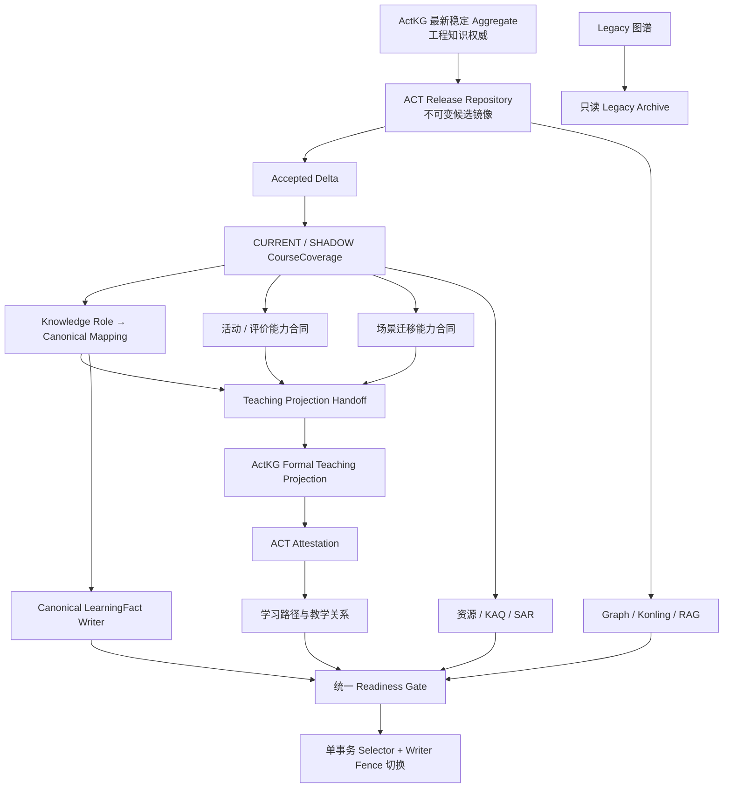

# ACT 最终权威图谱接入、教学语义闭合与生产切换执行方案

> 2026-08-01 Buddy 拆分裁决：下文第 0 节“单一可执行 Change”已被本轮执行要求取代。Issue #1173 改为只读 series parent，不再对应可领取的 OpenSpec Change。执行工作按 A–K 独立变更登记；CourseCoverage 审核批次 B1..Bn 只能由 B 阶段冻结的当前 worklist manifest 生成，禁止预先按历史 3,609 项划分。

## Buddy 变更序列

| 顺序 | Change | 依赖 | 交付边界 |
| --- | --- | --- | --- |
| A | `admit-latest-stable-actkg-aggregate` | 无 | 最新稳定 Aggregate 解析、兼容链、隔离候选导入和 Delta；生产 selector 不变。 |
| B | `establish-current-course-coverage-review` | A | 生成当前 worklist、证据边界和确定性审核批次 manifest。 |
| B1..Bn | `review-course-coverage-<manifest-batch-id>` | B | 逐批完成 Primary、Challenger、必要 Third；批次 ID 和成员完全由 B 的 manifest 决定。 |
| C | `close-nine-role-teaching-contracts` | 全部 B1..Bn | 七个知识角色及两个 capability contract、可信重载和 Third 终态。 |
| D | `attest-formal-teaching-projection` | C | handoff、ActKG Projection、KAQ K2K 冲突和正式 attestation。 |
| E | `prepare-canonical-read-consumers` | D | 图谱、控灵、RAG 的同身份 shadow readiness。 |
| F | `prepare-canonical-pedagogy-consumers` | D | 资源、KAQ、SAR、路径的同身份 shadow readiness。 |
| G | `prepare-canonical-learning-fact-writer-fence` | E、F | Canonical writer fence、历史事实保留和无双写证明。 |
| H | `prepare-legacy-archive-and-authority-switch` | E、F、G | Archive、UI 状态清理、receipt 聚合和原子事务实现。 |
| I | `rehearse-final-knowledge-cutover` | H | 最新生产数据恢复演练、smoke、停服与回滚时限证据。 |
| J | `execute-final-knowledge-cutover` | I、显式生产授权 | 停服、备份、原子切换及重开前 smoke。 |
| K | `retire-legacy-knowledge-runtime` | J、稳定窗口通过 | 删除旧业务运行时，保留只读 Archive。 |

本轮只预先登记 A 与 B。B1..Bn 及其后的真实依赖图必须在 B 产出精确 manifest 后建立，避免用历史数量或暂定批次制造错误的 Buddy 调度关系。

## 0. 执行决策

本轮不再新建 OpenSpec Change，直接以现有：

```text
complete-course-teaching-projection-and-final-knowledge-cutover
Issue #1173
```

作为唯一父任务。#1173 已经明确覆盖 CourseCoverage、角色 Mapping、Teaching Projection、全部消费者迁移、生产演练、原子切换和 Legacy Archive，没有必要再创建一套平行设计。

执行主体为 ACT。ActKG 只在两个窄边界参与：

1. 当最新稳定 Aggregate 缺少 ACT 可接受的 Release Diff、revision bundle 或 predecessor chain 时，补发兼容工件；
2. ACT 导出正式教学语义 handoff 后，由 ActKG 生成并签发 Teaching Projection 增强包。

其余工作，包括 CourseCoverage、KAQ Mapping、资源、RAG、SAR、学习路径、LearningFact、selector、生产迁移和 Legacy Archive，全部在 ACT 内完成。

---

# 1. 当前基线与真实缺口

## 1.1 ActKG 当前工程图谱

ActKG 当前已发布：

```text
control-theory-engineering-v0.9
```

M1L-v1S 实验状态为 `ACCEPT`、发布裁决为 `AUTHORIZED`，状态空间模块、Integration v0.7 和 Aggregate v0.9 均已通过抽取、Formula、身份、关系、查询、RAG legality、历史回归和增量重放门禁。

当前章节覆盖矩阵为：

```text
总 Section：280
RELEASED_FULL：122
RELEASED_PARTIAL：16
REGISTERED_EXCLUDED：20
UNTOUCHED：122
SOURCE_DRIFT：0
EXTRACTED_UNRELEASED：0
```


## 1.2 ACT 当前权威快照

ACT 已经完成的协调结果停在：

```text
control-theory-engineering-v0.8:r3
```

已完成：

```text
v0.3:r2 → v0.8:r3 完整 Release 链导入
全部逐跳 Delta ACCEPTED / AGREED
Bundle、Release、Projection、Crosswalk 和前驱闭包验证
3609 项 CourseCoverage worklist 生成
生产 selector 保持不变
```

但没有完成：

```text
CourseCoverage 审核
九角色 Mapping
Teaching Projection
消费者切换
生产激活
```

因此，当前第一个问题是版本错位：

```text
ActKG 最新稳定工程图谱：v0.9
ACT 当前只读候选快照：v0.8:r3
```

现有 v0.8:r3 快照可以继续作为历史审计证据和接口测试基线，但不得作为最终生产切换依据。

## 1.3 当前 ACT 合同已经具备的能力

ACT 已有以下基础合同：

* CourseCoverage 四类角色：`formal_objective`、`necessary_prerequisite`、`explicit_extension`、`excluded_with_rationale`；
* KAQ Role → Canonical Binding；
* `PRIMARY_IDENTITY / COMPOSITION_PART / SUPPORTING_OBJECT`；
* 禁止 Legacy ID 和同名自动绑定；
* `contains / prerequisite / association` 正式教学关系；
* Legacy、Canonical Shadow 和 Canonical 三种权威模式；
* Teaching Projection Availability；
* KAQ 关系冲突与学习路径门禁。

缺少的是这些合同的最终数据闭合、消费者统一接入和生产切换。

---

# 2. 目标架构



最终权威边界：

```text
ActKG：
工程知识对象、工程关系、Canonical 身份、来源与证据

ACT CourseCoverage：
哪些 Canonical 属于本课程、承担什么课程角色

ACT Teaching Projection：
知识—知识教学关系的正式消费与冲突治理

ACT KAQ / SAR：
知识—能力—素养—目标及学习者覆盖层

ACT LearningFact：
学习者事实与历史版本
```

---

# 3. Phase 0：锁定最新稳定 Aggregate

## 3.1 动态解析

复用并完善现有：

```text
scripts/actkg-release/latest-stable-aggregate.ts
scripts/knowledge-cutover/resolve-latest-actkg-aggregate.ts
```

生成：

```text
latest-stable-aggregate-binding.json
```

绑定：

```yaml
actkgMainCommit:
releaseId:
releaseVersion:
releaseHash:
sourceDatasetHash:
bundleId:
bundleDigest:
manifestSha256:
schemaVersion:
schemaSha256:
sourceTag:
sourceCommit:
stableTag:
packagingCommit:
previousBundleId:
resolutionDigest:
resolvedAt:
```

禁止：

```text
按目录名选择
按字符串版本号选择
使用固定v0.8或v0.9常量
找不到最新版时自动退回旧版
```

## 3.2 兼容链检查

当前 ACT 的可验证 r3 链终点为 v0.8，而 ActKG 已有 v0.9。执行时必须检查：

```text
v0.8:r3 → v0.9:rN
```

是否存在合法 successor：

```text
previous_bundle闭合
release-diff语义合法
Canonical身份保持
Release Hash与sourceDatasetHash闭合
ACT支持Bundle Contract和Schema
```

若不存在，由 ActKG 只补发 revision package，不重新抽取、不改变语义对象：

```text
control-theory-engineering-v0.9-rN
```

该步骤是第一处跨项目协调。

## 3.3 隔离导入和 Delta

在独立数据库 schema 中：

```text
导入最新Bundle
→ 创建或复用CANDIDATE ReleaseSet
→ 生成ACCEPTED_CANDIDATE Bundle Receipt
→ 计算逐跳Delta
→ 独立交叉校验上游release-diff
→ 生成ACCEPTED Delta Receipt
```

不得修改生产 selector。

## 3.4 门禁

```text
LATEST_STABLE_AGGREGATE_RESOLUTION_GATE=PASS
LATEST_BUNDLE_COMPATIBILITY_GATE=PASS
PREDECESSOR_CHAIN_GATE=PASS
CANDIDATE_IMPORT_GATE=PASS
DELTA_ACCEPTANCE_GATE=PASS
IDENTITY_VIOLATION_COUNT=0
PRODUCTION_SELECTOR_CHANGE=0
```

---

# 4. Phase 1：重新生成并审核 CourseCoverage

## 4.1 重新生成当前 worklist

现有 3609 项 worklist 绑定 v0.8:r3，只能作为历史线索。应基于最新 Aggregate 重新生成：

```text
current-course-coverage-worklist.json
```

新数量记为：

```text
N_current
```

不得预设仍为 3609。

每一项至少包含：

```yaml
canonicalId:
canonicalRevision:
entityType:
preferredLabel:
descriptionDigest:
sourceCoverage:
moduleMembership:
relationNeighborhoodDigest:
priorDecisionRefs:
profileOnly:
evidenceRefs:
worklistInputDigest:
releaseId:
deltaReceiptId:
authoringRevision:
```

旧决定可以出现在 `priorDecisionRefs` 中，但不能直接复制为新权威。

## 4.2 审核角色

正式 CourseCoverage 只允许：

```text
formal_objective
necessary_prerequisite
explicit_extension
excluded_with_rationale
```

每项必须具有：

```text
当前Canonical ID
当前对象修订
当前worklist digest
当前Release和Delta
审核身份
审核理由
证据引用
sourceEvidenceDigest
```

## 4.3 审核流程

### Proposal

确定性或模型 Proposal 只负责建议：

```text
建议角色
建议理由
候选证据
```

它没有审核权限。

### Primary

对 `N_current` 全部逐项审核。

### Challenger

以下对象必须独立复核：

```text
全部拟进入ACTIVE CourseCoverage的对象
全部profile-only对象
全部新Canonical
全部对象修订发生变化的Canonical
全部历史决定与新建议不一致的对象
全部Formula、SystemModel和高连接对象
```

普通 `excluded_with_rationale` 项可稳定抽样复核，但不得漏审其 Primary 决定。

### Third

Primary 与 Challenger 在以下字段不一致时进入 Third：

```text
是否纳入课程
CourseCoverage role
证据是否充分
对象粒度是否合适
```

## 4.4 profile-only 项

profile-only 不得根据：

```text
标签
描述
模块名
```

直接纳入课程。

最终必须形成以下之一：

```text
有独立课程证据 → 纳入
有充分排除理由 → excluded_with_rationale
证据仍不足 → 阻断最终Coverage
```

不允许将未决项从分母中删除。

## 4.5 增量重验证机制

为了避免 ActKG 每发布一个新版本就重审全部对象，建立显式：

```text
CourseCoverageRevalidationReceipt
```

只有以下全部不变时，历史决定才可进入快速重验证：

```text
Canonical ID
Canonical revision
entity type
主要语义Digest
证据Digest
课程角色
来源范围
```

仍需生成绑定当前 worklist digest 的新决定，不能直接复制旧记录。

新对象、变化对象和证据变化对象必须重新审核。

## 4.6 输出

```text
course-coverage-decisions.jsonl
course-coverage-review-summary.json
automatic-control-aggregate-coverage-vNext.json
course-coverage-assembly-receipt.json
```

正式 Coverage：

```text
lifecycleState=CURRENT
authorityState=SHADOW
productionAuthoritative=false
```

## 4.7 门禁

```text
COURSE_COVERAGE_DECISION_COUNT=N_current/N_current
MISSING_DECISION_COUNT=0
DUPLICATE_DECISION_COUNT=0
PROFILE_ONLY_UNRESOLVED_COUNT=0
ACTIVE_OBJECT_EVIDENCE_COVERAGE=100%
WORKLIST_DIGEST_MATCH=PASS
RELEASE_DELTA_ALIGNMENT=PASS
COURSE_COVERAGE_GATE=PASS
```

---

# 5. Phase 2：修订九角色合同并完成 Mapping

## 5.1 九角色不能统一视为知识节点

现有九个宏观角色应分为三类。

### Canonical Knowledge Role

```text
反馈与闭环控制
传递函数模型
时域响应与性能指标
根轨迹分析
频域响应判读
稳定裕度
控制器与校正
```

### Activity / Evaluation Capability

```text
仿真验证与跨模型比较
```

它描述活动和评价能力，不得强行绑定某个“仿真”知识对象。

### Composite Scene-Migration Role

```text
现代控制与船海迁移
```

应拆成两个组成：

```text
现代控制知识部分
    → 可绑定Canonical知识对象

船海迁移部分
    → scene-migration capability
```

对外可以继续保留原九角色目录，但内部合同必须区分知识身份和场景能力。

## 5.2 持久化治理事实

完成或修复现有持久化模型：

```text
ActkgKaqCanonicalBinding
ActkgKaqCanonicalBindingReview
ActkgKaqReviewedMappingVersion
```

每个 Binding 至少保存：

```yaml
kaqRoleId:
contractKind:
canonicalId:
bindingRole:
releaseSetId:
releaseId:
releaseHash:
sourceDatasetHash:
coverageVersion:
pinnedContextDigest:
objectRevision:
evidenceRefs:
evidenceDigest:
semanticRationale:
reviewState:
lifecycleState:
authorityState: SHADOW
productionAuthoritative: false
```

非知识角色不写入虚假 `canonicalId`，改由相应 capability contract 保存。

## 5.3 修复可信重载边界

必须关闭此前暴露的两个 P1。

### raw-row capability mint

禁止外部模块通过 raw database row 直接恢复可信 capability。

只允许：

```text
Repository内部查询真实数据库
→ 重算revision和digest
→ 验证Release/Coverage/Delta
→ 内部authority module mint
```

普通 JSON、副本对象和测试 fixture 不能获得可信身份。

### Third 终态

审核状态机必须支持：

```text
Primary=ACCEPT + Challenger=REJECT
→ Third_REQUIRED

Third=ACCEPT
→ Binding ACCEPTED

Third=REJECT
→ Binding REJECTED

Third=DEFER
→ Mapping保持阻断
```

Third 决定必须写入追加式审核历史和 Binding 终态。

## 5.4 Mapping 审核

所有九个外部角色都必须有最终处置。

知识角色执行：

```text
Primary
→ Challenger
→ 必要Third
```

每个 Knowledge Role 至少形成：

```text
恰好一个PRIMARY_IDENTITY
0..n COMPOSITION_PART
0..n SUPPORTING_OBJECT
```

活动和场景角色形成对应 capability contract，不参与知识关系端点生成。

## 5.5 可信重载测试

流程：

```text
持久化Binding
→ 关闭进程
→ 重新启动
→ 从DB加载
→ 重算全部digest
→ 内部mint ReviewedKaqRoleCanonicalMapping
```

要求：

```text
重载前后mappingDigest完全一致
普通JSON副本无效
篡改review或objectRevision后加载失败
Coverage外Canonical加载失败
```

## 5.6 门禁

```text
ROLE_CONTRACT_DISPOSITION=9/9
KNOWLEDGE_ROLE_PRIMARY_IDENTITY_COVERAGE=100%
ACTIVITY_ROLE_APPROXIMATE_BINDING_COUNT=0
SCENE_ROLE_APPROXIMATE_BINDING_COUNT=0
MULTIPLE_PRIMARY_COUNT=0
DEFER_ROLE_COUNT=0
RAW_ROW_MINT_BOUNDARY_GATE=PASS
THIRD_TERMINAL_TRANSITION_GATE=PASS
TRUSTED_RELOAD_GATE=PASS
KAQ_MAPPING_GATE=PASS
```

---

# 6. Phase 3：生成并验收 Teaching Projection

## 6.1 ACT 导出正式 handoff

ACT 导出：

```text
act-teaching-projection-handoff/1
```

绑定：

```text
ReleaseSet
Release
Release Hash
sourceDatasetHash
Accepted Delta
CURRENT/SHADOW CourseCoverage
Reviewed Mapping
活动/评价合同
场景迁移合同
现有KAQ K2K inventory
路径场景
全部digest
```

导出前再次解析最新稳定 Aggregate。

如版本变化：

```text
重新生成增量Delta
重验证受影响Coverage
重验证受影响Mapping
禁止继续使用旧handoff
```

## 6.2 ActKG 返回正式增强包

ActKG 只负责：

```text
审核知识—知识教学关系
生成contains / prerequisite / association
生成Teaching Projection
生成Relation Set Digest
生成Attestation
生成增强Bundle
```

工程谓词不能机械转换为教学谓词。

这是第二处、也是最后一处必要的跨项目协调。

## 6.3 ACT 验收

ACT 验证：

```text
基础Release身份
CourseCoverage成员闭合
Mapping Digest
Projection ID与Digest
Relation Set Digest
谓词和方向
端点均位于CourseCoverage
prerequisite无环
contains无环
来源与审核谱系
Attestation
```

## 6.4 KAQ 冲突迁移

当前 KAQ 知识—知识边与 ActKG Teaching Projection 对比，逐项处置：

```text
ACCEPTED_ACTKG
RETAIN_KAQ
RETIRED_KAQ
UNRESOLVED
```

原则：

```text
知识—知识关系由Teaching Projection接管
知识—能力、能力—素养、目标关系继续由KAQ管理
同一关系不能双重激活
```

## 6.5 门禁

```text
HANDOFF_EXPORT_GATE=PASS
TEACHING_PROJECTION_IMPORT_GATE=PASS
TEACHING_RELATION_SET_NONEMPTY=true
TEACHING_RELATION_DIGEST_GATE=PASS
TEACHING_MEMBERSHIP_CLOSURE_GATE=PASS
TEACHING_CYCLE_COUNT=0
KAQ_K2K_UNRESOLVED_CONFLICT_COUNT=0
FORMAL_ATTESTATION_GATE=PASS
```

---

# 7. Phase 4：逐一关闭消费者 Readiness

每个消费者必须输出绑定同一身份的：

```text
KnowledgeAuthorityReadinessReceipt
```

建议统一字段：

```yaml
consumer:
releaseSetId:
releaseId:
releaseHash:
sourceDatasetHash:
coverageVersion:
mappingDigest:
teachingProjectionId:
teachingProjectionDigest:
relationSetDigest:
applicationRevision:
schemaRevision:
ready:
blockingReasons:
receiptDigest:
```

## 7.1 图谱页面和 API

需要完成：

```text
所有节点和关系读取统一到Authoritative Release Repository
节点详情使用Canonical ID
支持DomainConcept、Formula、KnowledgeStatement、
SystemModel、ModelRepresentation
显示Gold/Silver、来源覆盖和证据元数据
渐进加载和缓存版本绑定releaseHash
生产模式禁止回退旧KnowledgeNode数据库
```

图谱显示可以保留现有画布，但不能再把所有节点压成通用 `THEORY`。

## 7.2 控灵

必须将：

```text
search_knowledge_graph
```

改为读取同一个权威 Repository。

输出至少包含：

```text
canonicalId
entityType
displayName
description
releaseId
sourceCoverage
formalRelations
```

禁止继续直接查询 Legacy `KnowledgeNode` 作为正式搜索结果。

页面上下文中的节点 ID、收藏定位和解释请求全部改用 Canonical ID。

## 7.3 RAG

RAG 切换分成两层。

### 必须完成

```text
graphNodeRefs统一为Canonical ID
RAG Crosswalk绑定当前Release
正文引用继续定位教材结构单元
Canonical对象只用于实体链接、过滤和排序
缓存绑定releaseHash
```

### 暂不启用

```text
Graph邻居扩展
多跳Graph-RAG
图关系强制注入召回
```

M1H 已证明 Graph-RAG runtime intake 尚未通过效用评估，但该阻断不否定工程 Release。

因此 RAG Readiness 可以在以下状态通过：

```text
文本 + 向量 + 重排正常
Canonical Crosswalk正常
Graph Expansion=false
```

Graph-RAG 效用以后单独开启。

## 7.4 资源绑定

所有资源引用分为：

```text
DETERMINISTIC_BINDING
REVIEWED_SEMANTIC_BINDING
UNRESOLVED
INVALIDATED
```

迁移：

```text
knowledgeNodeIds / graphNodeRefs
→ canonicalIds
```

禁止名称猜测。

正式课程中正在使用的资源若仍为 `UNRESOLVED`，阻断切换；非活动历史资源可以进入 Legacy Archive 或保留待审状态。

## 7.5 KAQ 与 SAR

KAQ：

```text
知识节点身份改为Canonical ID
能力、素养、目标保持ACT自有ID
```

SAR：

```text
从Reviewed Mapping和KAQ投影
不得从工程图谱直接推导能力或素养
```

## 7.6 学习路径

规划器只消费：

```text
正式Teaching Projection
+
ACT活动/评价能力合同
+
ACT场景迁移能力合同
+
学习者画像
```

不得消费：

```text
工程is_a
工程association
章节顺序
未经审核的KAQ旧边
```

执行宏观路径等价和细粒度可达性验证。

## 7.7 LearningFact

### 新事实

切换后新 LearningFact 必须写入：

```text
canonicalId
releaseSetId
releaseId
mappingRevision
teachingProjectionId
knowledgeRevision
writerFenceRevision
```

### 历史事实

历史 LearningFact：

```text
不重写
不自动映射
继续保存Legacy knowledgeRevision和Legacy node ID
通过Archive解释
```

## 7.8 写入围栏

正式切换前：

```text
Canonical writer fence = CLOSED
Legacy writer = ACTIVE
```

原子切换后：

```text
Canonical writer fence = OPEN
Legacy writer = RETIRED
```

禁止双写。

## 7.9 消费者门禁

```text
GRAPH_READINESS_GATE=PASS
KONLING_READINESS_GATE=PASS
RAG_READINESS_GATE=PASS
RESOURCE_READINESS_GATE=PASS
KAQ_READINESS_GATE=PASS
SAR_READINESS_GATE=PASS
PATH_READINESS_GATE=PASS
LEARNING_FACT_WRITER_GATE=PASS
ALL_RECEIPTS_SAME_IDENTITY=PASS
```

现行 OpenSpec 要求图谱、控灵、RAG、SAR、KAQ、资源、CourseCoverage、路径和 Canonical writer 在同一事务中切换，不能分批激活。

---

# 8. Phase 5：Legacy Archive 与用户状态处理

## 8.1 Archive 内容

在切换边界冻结：

```text
Legacy节点
Legacy关系
历史修订
未完成路径
历史节点注释
Legacy LearningFact定位
```

## 8.2 权限

```text
历史公开内容维持原可见性
私有注释正文仅原所有者可见
管理员只能读取治理审计元数据
```

## 8.3 Archive 禁止能力

Archive 不提供：

```text
图谱业务查询
AI知识检索
RAG
推荐
资源绑定
路径规划
LearningFact写入
节点编辑
```

## 8.4 UI 状态

以下状态直接清理，不做名称映射：

```text
Legacy收藏
Legacy画布布局
Legacy最近访问
Legacy节点定位
```

历史注释从 Archive 路由访问。

## 8.5 门禁

```text
LEGACY_ARCHIVE_MANIFEST_GATE=PASS
ARCHIVE_PERMISSION_GATE=PASS
ARCHIVE_WRITE_REJECTION_GATE=PASS
LEGACY_UI_STATE_RESET_GATE=PASS
HISTORICAL_LINK_GATE=PASS
```

---

# 9. Phase 6：生产数据演练

## 9.1 演练环境

使用：

```text
最新生产数据库导出
最终应用revision
最终Prisma migration
最终ReleaseSet
最终CourseCoverage
最终Mapping
最终Teaching Projection
最终Archive实现
```

不得使用合成数据库代替。

## 9.2 演练流程

```text
恢复生产数据库副本
→ 应用迁移
→ 导入最新Release
→ 装载Coverage和Mapping
→ 导入Teaching Projection
→ 建立Legacy Archive
→ 生成全部Readiness Receipt
→ 执行原子selector事务
→ 运行完整Smoke
```

## 9.3 记录

```text
备份耗时
恢复耗时
迁移耗时
Archive生成耗时
切换事务耗时
表级行数
关键Digest
失败点
回滚耗时
总停服窗口
```

## 9.4 最新版本复核

生产演练前再次解析最新稳定 Aggregate。

若新版本出现：

```text
演练失效
重新计算Delta
增量重验证Coverage和Mapping
重新生成Teaching Projection
```

## 9.5 门禁

```text
LATEST_PRODUCTION_EXPORT_GATE=PASS
EXACT_APPLICATION_REVISION_GATE=PASS
SCHEMA_MIGRATION_GATE=PASS
PRODUCTION_DATA_REHEARSAL_GATE=PASS
ROLLBACK_TIMING_GATE=PASS
DOWNTIME_WINDOW_GATE=PASS
```

---

# 10. Phase 7：生产停服与原子切换

## 10.1 停服

按顺序停止：

```text
Web application
Background workers
Schedulers
WebSocket/SSE相关写入任务
```

确认没有进行中的知识事实写入。

## 10.2 备份

```text
创建数据库备份
验证备份可读取
记录备份Hash和水位
```

## 10.3 执行迁移

严格复用演练命令和顺序，不临时修改。

## 10.4 单一权威事务

一个数据库事务内同时写入：

```text
active ReleaseSet selector
graph selector
Konling selector
RAG canonical selector
SAR selector
KAQ selector
resource selector
CourseCoverage selector
path selector
LearningFact writer fence
Legacy retirement state
cutover receipt
```

任何一项缺失或版本不一致：

```text
事务整体回滚
```

## 10.5 重开前 Smoke

必须覆盖：

```text
图谱列表与节点详情
控灵知识查询
RAG正文引用
资源关联
KAQ与SAR
路径生成
权限隔离
Legacy Archive访问
后台worker
scheduler
Canonical LearningFact预写检查
Legacy写入拒绝
```

## 10.6 回滚边界

### 第一条 Canonical Fact 写入前

如果 Smoke 失败：

```text
保持停服
恢复备份
恢复旧应用
Legacy重新成为权威
```

### 第一条 Canonical Fact 写入后

禁止重新激活 Legacy：

```text
停止服务
执行前向修复
追加操作审计
```

这一写入边界已经在当前正式设计中明确规定。

---

# 11. Phase 8：稳定期与旧运行时退役

生产恢复后观察一个稳定窗口，确认：

```text
Canonical写入正常
无混合权威读取
无Legacy业务调用
无Crosswalk悬空
无路径异常环
无权限回退
无缓存版本串用
```

稳定后删除：

```text
Legacy业务DTO
Legacy知识API
Legacy数据库fallback
Legacy正式缓存
Legacy图谱切换开关
旧GraphProjection兼容入口
旧KnowledgeNode正式读取器
```

Archive 路由和历史解释能力保留。

---

# 12. 建议 PR 拆分

不建议把全部工作放入一个超大 PR。

| PR   | 范围                                          | 依赖           |
| ---- | ------------------------------------------- | ------------ |
| PR-A | 最新 Aggregate 解析、兼容链和隔离导入                    | 无            |
| PR-B | CourseCoverage 当前审核与增量重验证                   | PR-A         |
| PR-C | 角色合同、Binding 持久化、可信重载                       | PR-B         |
| PR-D | Teaching Projection handoff、导入和 attestation | PR-C + ActKG |
| PR-E | 所有消费者 Readiness 与 shadow 验证                 | PR-D         |
| PR-F | Legacy Archive、演练、原子事务和 runbook             | PR-E         |
| PR-G | 生产切换后的 Legacy 运行时代码清理                       | 实际切换成功后      |

每个 PR：

```text
独立高推理Review
修复后再次Review
无P0/P1才合并
```

---

# 13. 总停止条件

出现以下任一情况，生产切换继续保持阻断：

```text
无法唯一解析最新稳定Aggregate
最新Bundle缺少合法successor chain
CourseCoverage存在未决项
profile-only对象未经当前证据审核
活动/场景角色被近似绑定知识节点
Mapping存在多个PRIMARY_IDENTITY
可信重载Digest不一致
Teaching Projection为空或存在未决冲突
prerequisite或contains形成环
任一消费者Readiness Receipt缺失
Readiness Receipt身份不一致
RAG仍读取Legacy节点
Konling仍读取Legacy KnowledgeNode
活动资源存在未解决绑定
路径规划仍消费工程关系
Canonical writer fence不能原子切换
Legacy Archive权限不闭合
生产演练不是基于最新数据
停服窗口或回滚耗时超限
最终cutover前出现更新的稳定Aggregate
```

---

# 14. 最终机器裁决

```text
LATEST_STABLE_AGGREGATE_GATE=PASS|REJECT
LATEST_BUNDLE_CHAIN_GATE=PASS|REJECT
DELTA_ACCEPTANCE_GATE=PASS|REJECT

COURSE_COVERAGE_REVIEW_GATE=PASS|REJECT
COURSE_COVERAGE_CURRENT_GATE=PASS|REJECT

ROLE_CONTRACT_GATE=PASS|REJECT
KAQ_MAPPING_GATE=PASS|REJECT
TRUSTED_RELOAD_GATE=PASS|REJECT

TEACHING_PROJECTION_GATE=PASS|REJECT
FORMAL_ATTESTATION_GATE=PASS|REJECT
KAQ_CONFLICT_MIGRATION_GATE=PASS|REJECT

GRAPH_READINESS_GATE=PASS|REJECT
KONLING_READINESS_GATE=PASS|REJECT
RAG_READINESS_GATE=PASS|REJECT
RESOURCE_READINESS_GATE=PASS|REJECT
SAR_READINESS_GATE=PASS|REJECT
KAQ_READINESS_GATE=PASS|REJECT
PATH_READINESS_GATE=PASS|REJECT
CANONICAL_WRITER_GATE=PASS|REJECT

LEGACY_ARCHIVE_GATE=PASS|REJECT
PRODUCTION_REHEARSAL_GATE=PASS|REJECT
ATOMIC_SELECTOR_TRANSACTION_GATE=PASS|REJECT
POST_CUTOVER_SMOKE_GATE=PASS|REJECT

GRAPH_RAG_EXPANSION_STATUS=SEPARATE_BLOCKED
PRODUCTION_CUTOVER=AUTHORIZED|DENIED
LEGACY_BUSINESS_RUNTIME=ACTIVE|RETIRED
KNOWLEDGE_AUTHORITY=LEGACY|CANONICAL
```

---

# 15. 最终验收标准

只有以下条件全部成立，才允许生产切换：

```text
最新稳定Aggregate已经接入
当前CourseCoverage全部审核完成
九角色全部按正确类型合同闭合
正式Teaching Projection已经验收
全部消费者绑定同一版本
新LearningFact只写Canonical
历史LearningFact不被重写
Legacy Archive可用且权限正确
生产数据演练通过
备份和回滚路径通过
单事务切换通过
重开前Smoke全部通过
```

该方案的核心不是“把图谱页面的数据源换掉”，而是完成三层权威的闭合：

[
\boxed{
\text{工程知识权威}
+
\text{课程教学语义权威}
+
\text{运行与学习事实权威}
}
]

图谱页面只是其中一个消费者。真正的完成标志，是图谱、控灵、RAG、资源、KAQ、SAR、路径和 LearningFact 在同一版本上运行，同时 Legacy 只保留为权限隔离的历史档案。
