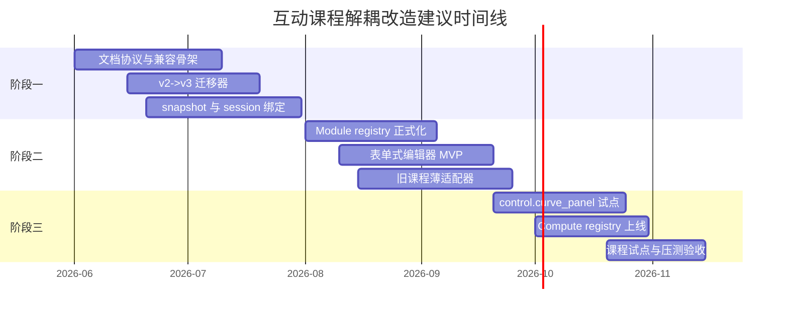

# 互动课程能力内核与内容层完全解耦的 OpenSpec 实施路径报告

## 执行摘要

这份报告的核心判断很明确：你要推动的不是一次“把页面改成 JSON 渲染”的局部重构，而是一套**课程运行时协议化**改造。真正的一等公民不应再是课程私有组件或大体量 `step-panels.tsx`，而应是四类可独立演化的契约：**课程运行时文档、模块定义注册表、计算能力注册表、不可变快照与课堂绑定规则**。如果这四层没有收口，编辑器只会把硬编码问题换一种形式继续存在；如果这四层先收口，编辑器反而只是协议的一个可视化外壳。JSON Schema 适合承担文档层与模块层的强约束，因为它不仅用于验证 JSON 实例，还明确覆盖文档化和“interaction control”，并提供 `properties`、`required`、`additionalProperties`、`oneOf`、条件依赖等机制，足以支撑模块配置、资源引用与条件表单。citeturn13search6turn12view0turn12view1turn13search1

对“复杂互动面板怎么解耦”的判断也需要更锋利一点：**不要试图让教师在课程编辑器里“定义计算逻辑”**。这会把内容编辑升级成插件开发，直接把编译、沙箱、安全、回滚、缓存失效、兼容性和责任边界全都带进编辑器。更合理的做法，是让复杂面板只配置“已发布的计算能力”，而把具体实现在 Rust/WASM 或 Wasm Component 内核中。WebAssembly Component Model 的目标就是把“接口契约”与“行为实现”分离，WIT 语言只定义 contracts，不定义 behavior；Wasmtime 既能运行组件、调用导出函数，也默认拒绝文件系统、环境变量等系统资源访问，这非常适合把平台能力做成可审核、可版本化的 compute capability。citeturn12view4turn12view5turn17view0turn17view1turn12view3

版本管理上，不应让“当前课程草稿”直接驱动课堂。语义化版本规范要求先声明公共 API，并要求已发布版本的内容不得被原地修改；这给你的平台一个很清晰的方向：**课程文档发布后生成 snapshot，课堂绑定 snapshot，不绑定 draft**。同样的规则也应适用于 capability：课程快照锁定 capability 名称、版本与 digest，运行期按锁定内容解析，不允许“同版本热替换”。citeturn12view2

编辑器 MVP 也不该从拖拽画布起步。现成生态已经证明，JSON Schema 可以直接驱动 Web 表单生成，`react-jsonschema-form` 就是以此为核心思路的成熟实现。你的第一版更应该是**左侧步骤树 + 中间预览 + 右侧 schema 驱动属性面板**，而不是一开始就做自由拖拽、任意布局与低代码编排。复杂模块先做“预设 + 参数化配置”，不要做“任意拼装仿真工作台”。citeturn12view6turn12view0turn12view1

关于学习数据治理，也不建议继续依赖“运行日志后处理猜语义”。Caliper 的价值在于为学习活动建立统一标签语言，xAPI 的价值在于定义学习活动数据的捕获、存储与检索；你的平台最合理的路径不是一开始强制全量对齐某个外部标准，而是先在模块协议中声明**学习事实**，再提供到 xAPI / Caliper 的映射导出层。这样做既保留平台自主性，也不把未来互操作堵死。citeturn12view7turn12view8turn16search2

需要提前说明一个边界：本回合我优先按要求尝试走已启用的 GitHub 连接器检索 `yong-wei/act` 集成分支，但未获得可直接滚动核验的仓库源码结果。因此，报告中凡涉及“当前集成分支已有实现”的内容，我都采用**保守推断**并明确标注“已知存在 / 高概率存在 / 在仓库中未找到，假设为 X”；而凡涉及规范设计、版本治理、WASM 沙箱、Schema 驱动表单与学习数据标准的部分，则全部建立在已核验的官方资料之上。报告因此仍然足以作为 Codex/OpenSpec 变更提案草案，但你在落地前应要求编程代理先补做一次针对真实仓库的源码对照核验。

## 证据边界与当前实现判断

下面这部分不把未核验内容写成事实，而是按你点名的文件族和工程症状做收口。为了避免误导，我采用三种标记：

- **已知存在**：来自你在问题中明确点名的目录、文件或实现形态。
- **高概率存在**：由你描述的运行方式与课程症状推断，极可能在集成分支中存在。
- **在仓库中未找到，假设为 X**：本回合未能直接核验，但为了不阻塞提案，按未来集成分支补齐方向给出假设。

| 构件或接口 | 当前判断 | 字段或入口 | 主要用途 | 当前主要短板 | 兼容性风险 |
|---|---|---|---|---|---|
| `interactive-manifest` | 已知存在 | 高概率包含 `pages/steps/modules/payload` | 课程内容与互动配置的承载文档 | 若仅有开放式 payload，则编辑器无法可靠生成表单，运行时也难以严格校验 | 旧课程容易依赖“放什么都能跑”的隐式约定 |
| `runtime` | 已知存在 | 高概率包含 manifest 读取、页面渲染、学生/教师态分发 | 运行时装配课程页面与模块 | 若 runtime 同时承担内容解释、业务分支、课程私有逻辑，边界会继续模糊 | 新旧模块共存时回归面大 |
| `registry` | 已知存在 | 高概率存在模块到 renderer 的映射 | 通过注册表而非直接 import 实现内容渲染 | 如果 registry 只注册 renderer，而不注册 schema、默认值、学习事实和教师汇总，就仍然只是“组件索引表” | 后续编辑器无法复用 registry 生成能力面板 |
| `step-panels.tsx` | 已知存在 | 课程私有面板入口 | 组合页面、模块、作答逻辑、教师视图 | 体量大意味着内容层与实现层耦合，是当前问题的表征而不是偶发写法 | 每门课都复制一套会导致维护指数增长 |
| compute / WASM / Rust 内核 | 已知存在 | 高概率通过前端桥接或服务端桥接调用 | 负责时域响应、频域分析、仿真求解等数值能力 | 若调用协议不显式版本化，课程文档会隐式依赖实现细节 | 能力版本升级时旧课程结果可能漂移 |
| 模块级强 schema | 在仓库中未找到，假设当前缺失 | 目标应为每个模块自带 `configSchema` | 驱动编辑器、校验器、发布器 | 没有 schema，`payload` 很容易退化成 `Record<string, unknown>` 式垃圾桶 | 无法安全开放给其他教师 |
| snapshot 与 `ClassSession` 绑定 | 在仓库中未找到，假设不完整 | 目标应为 `snapshotId + contentHash + capabilityLocks` | 保证课堂运行内容不可变 | 若会话绑定的是“最新草稿”，热更新会直接污染课堂现场 | 容易出现学生端与教师端不一致 |
| 配置覆盖顺序 | 在仓库中未找到，假设当前模糊 | 目标应显式声明 canonical precedence | 处理默认值、预设、课程级覆盖、页面级覆盖、会话级覆盖 | 当前若无统一顺序，调试与排错成本会极高 | 多来源配置一起存在时出现“阴影配置”问题 |

基于这些已知与高概率结构，更合理的“当前运行时加载流程”判断如下：课程文档先经 runtime 读取，再通过 registry 解析模块类型并分发到学生态/教师态 renderer；复杂互动如果存在 Rust/WASM 内核，则还会经过一个桥接层把模块配置翻译成可执行求解请求。现在真正缺的不是“再多写两个模板”，而是这条链路缺乏统一协议边界：文档层没有被严格类型化，模块层没有被产品化为注册表，计算层没有被产品化为 capability，课堂层没有被 snapshot 固定。

因此，当前问题不应继续表述为“把 `step-panels.tsx` 拆一拆”，而应收口为四个明确缺口：

| 缺口 | 本质 | 直接后果 | 应对原则 |
|---|---|---|---|
| 文档缺乏封闭结构 | 内容只到“能渲染”，未到“可验证、可演化” | 编辑器无法安全发布 | 先做 `LessonRuntimeDocument v3` |
| 模块缺乏正式协议 | renderer 被注册，schema 和学习事实未注册 | 内容/行为仍纠缠 | 先做 `ModuleDefinitionRegistry` |
| 计算缺乏版本化 API | 复杂面板直接依赖实现细节 | 一升级就破课 | 先做 `ComputeCapabilityRegistry` |
| 课堂缺乏不可变发布单元 | 草稿与上课内容可能混在一起 | 热更新污染课堂 | 先做 snapshot 与 session pinning |

## 规范目标与分层架构

我建议把 OpenSpec 的目标写得更尖锐：**实现“平台能力发布”与“课程内容发布”的双轨制”**。课程文档发布一次，不触发 Rust/WASM 重新构建；计算能力发布一次，不要求课程文档跟着改写。两者通过稳定契约对接，而不是通过页面组件私有 props 对接。

这个目标之所以成立，不是因为“配置化”本身很时髦，而是因为几个外部约束已经给出非常清晰的工程信号。JSON Schema 2020-12 明确定位自己不仅服务于验证，也服务于文档化和 interaction control；对象字段、额外字段控制、条件依赖与组合子模式足够表达“模块最小配置 + 条件配置 + 资源引用 + 预设覆盖”的大部分需求。citeturn13search6turn12view0turn12view1turn13search0turn13search1

与之对应，复杂数值能力不应再以“前端 renderer 的一部分”来表达，而应以“平台侧导出的稳定接口”来表达。WebAssembly Component Model 的设计目标就是构建可互操作的 Wasm 库、应用与运行环境；WIT 只定义组件间契约，不规定行为本身。对你的场景，这意味着可以用 WIT 或等价的 JSON I/O contract 把 `control.lti.time_response@1` 这种能力定义为稳定接口，而不把数学求解过程暴露给课程文档。citeturn12view4turn12view5

基于此，建议把未来互动课程运行时拆成五层，而不是三层：

| 层级 | 责任边界 | 变更主体 | 是否需要重新发版平台 |
|---|---|---|---|
| 课程运行时文档层 | 页面、步骤、模块实例、文案、媒体、资源引用、学习事实声明 | 教师/教研团队 | 不需要 |
| 模块定义层 | 模块类型、schema、renderer、默认配置、教师汇总、学习事实映射 | 平台前端/全栈 | 视情况而定 |
| 计算能力层 | Wasm/Rust 内核、WIT/JSON 契约、版本、沙箱与限制 | 平台后端/系统 | 需要，但不影响课程文档结构 |
| 运行时编排层 | 文档装载、registry 解析、snapshot 绑定、权限与审计 | 平台 | 需要 |
| 数据治理层 | 学习事实、事件审计、xAPI/Caliper 导出 | 平台数据侧 | 需要 |

这里最重要的一刀，是把“复杂面板”从“UI 组件”改定义为“能力模块实例”。例如 `control.curve_panel` 不再代表一个写死的 React 面板，而是：

- 一种模块类型；
- 一份严格配置；
- 一组资源引用；
- 一个绑定好的 compute capability；
- 一份固定的学生提交协议；
- 一份固定的教师汇总协议；
- 一份固定的学习事实声明。

这才叫真正解耦。否则你只是把 JSX 挪进 JSON。

建议在 OpenSpec 中明确写出**目标配置覆盖顺序**，哪怕当前仓库里还没有统一收口。我的建议顺序是：

1. `ModuleDefinitionRegistry.defaultConfig`
2. `Preset.defaultConfig`
3. `LessonRuntimeDocument.resources[*].defaults`
4. `Page/Step/Module.config`
5. `Snapshot.publishOverrides`
6. `Session.runtimeOverlay`
7. `LearnerEphemeralState`

这个顺序的价值不在于“层数多”，而在于把**内容层、发布层、课堂层、临时交互态**明确区分开。课程作者只能改前四层；发布动作只能写第五层；正在上课的个体态只能写第六和第七层。否则你会继续遇到“到底是谁覆盖了谁”的灰色地带。

## 课程运行时文档与模块协议草案

这里建议直接在 OpenSpec 中引入两份正式规范名：

- `LessonRuntimeDocument v3`
- `ModuleDefinitionRegistry v1`

它们的关系应当是：**LessonRuntimeDocument 只引用模块类型，不拥有模块实现；ModuleDefinitionRegistry 拥有模块实现，但不拥有课程实例内容。**

JSON Schema 的几个关键特性会直接决定这套协议的可维护性。`properties` 用来定义模块合法字段；`required` 保证最小可运行配置；`additionalProperties: false` 用来阻断 payload 无限膨胀；`dependentRequired` 或 `dependentSchemas` 用来处理“出现 A 必须出现 B”的条件配置，例如启用自定义输入信号时必须提供信号参数；`oneOf/anyOf` 用来处理不同模型类型或不同资源类型。没有这些封闭约束，所谓“内容层与功能层分离”很快就会退化成“文档里塞一团随缘对象”。citeturn12view0turn12view1turn13search0turn13search1

`ModuleDefinitionRegistry` 的最小字段建议如下：

| 字段 | 类型 | 必需 | 说明 |
|---|---|---:|---|
| `type` | string | 是 | 模块类型，如 `text.rich` |
| `version` | semver | 是 | 模块协议版本 |
| `category` | enum | 是 | `content / assessment / compute-visualization / workbench` |
| `displayName` | i18n object | 是 | 编辑器展示名称 |
| `configSchema` | JSON Schema | 是 | 模块配置 schema |
| `defaultConfig` | object | 是 | 默认值 |
| `rendererKey` | string | 是 | 前端 renderer 注册键 |
| `teacherSummaryKey` | string | 否 | 教师聚合视图注册键 |
| `submissionSchema` | JSON Schema | 否 | 学生提交结构 |
| `learningFacts` | array | 否 | 模块会产出的学习事实类型 |
| `capabilityBindingPolicy` | object | 否 | 指定可绑定哪些 compute capability |
| `migration` | object | 否 | 配置版本迁移器 |
| `deprecated` | boolean | 否 | 弃用标识 |

`LessonRuntimeDocument v3` 的最小字段建议如下：

| 字段 | 类型 | 必需 | 说明 |
|---|---|---:|---|
| `documentVersion` | semver | 是 | 文档协议版本 |
| `lessonId` | string | 是 | 课程标识 |
| `snapshotId` | string | 否 | 草稿阶段可空，发布后必填 |
| `title` | i18n object | 是 | 课程标题 |
| `capabilityLocks` | array | 是 | 绑定的 capability 版本和 digest |
| `resources` | object | 是 | `models/signals/controllers/computeBindings/rubrics/media` |
| `pages` | array | 是 | 页面列表 |
| `permissions` | object | 否 | 文档层权限约束 |
| `analyticsProfile` | object | 否 | 学习事实导出策略 |
| `compat` | object | 否 | 旧版兼容映射 |

建议把模块分成四类，每类都定义自己的最小可行 schema，而不是用一个万能 payload 兜底：

| 模块类别 | 典型类型 | 最小可行 schema 核心 | 不应放进去的内容 |
|---|---|---|---|
| 内容模块 | `text.rich`, `image.figure`, `formula.block` | 文案、富文本、媒体引用、显影节拍 | 求解逻辑、课堂状态机 |
| 结构化互动模块 | `quiz.single`, `quiz.multi`, `match.drag` | 题干、选项、答案、判分、反馈、提交协议 | 专用数值内核 |
| 计算可视化模块 | `control.curve_panel`, `control.bode_panel` | 模型引用、能力绑定、控件、视图、指标、提交 | 具体数值算法源码 |
| 综合工作台模块 | `simulation.workbench`, `arena.challenge` | 任务背景、开放参数、能力包、提交与评估 | 自由拼装的底层求解图 |

下面给出一个 `LessonRuntimeDocument v3` 的骨架示例：

```yaml
documentVersion: 3.0.0
lessonId: ac-auto-control-04-06
snapshotId: snap_20260615_001
title:
  zh-CN: 二阶系统时域响应与参数作用
capabilityLocks:
  - capability: control.lti.time_response
    version: 1.2.0
    digest: sha256:2a5b...f91
  - capability: control.frequency.bode
    version: 1.0.3
    digest: sha256:91ce...aa2
resources:
  models:
    second_order_std:
      kind: lti.transfer_function.template
      template: [1, "2*zeta*wn", "wn^2"]
      variables: [zeta, wn]
  signals:
    unit_step:
      kind: step
      amplitude: 1
  controllers: {}
  computeBindings:
    time_response_main:
      capability: control.lti.time_response@1
      inputSchemaRef: "#/$defs/timeResponseRequest"
      outputSchemaRef: "#/$defs/timeResponseResult"
  rubrics:
    tuning_reasoning_v1:
      scoreItems:
        - id: identify_overshoot
          max: 2
        - id: explain_tradeoff
          max: 3
pages:
  - id: page_intro
    title: 现象观察
    layout: article-right-panel
    modules:
      - id: intro_text
        type: text.rich
        config:
          blocks:
            - kind: markdown
              value: |
                观察标准二阶系统对单位阶跃输入的响应。
      - id: step_curve
        type: control.curve_panel
        config:
          modelRef: second_order_std
          signalRef: unit_step
          computeRef: time_response_main
          parameters:
            - key: zeta
              label: 阻尼比
              default: 0.4
              min: 0.05
              max: 2.0
            - key: wn
              label: 自然频率
              default: 1.0
              min: 0.2
              max: 5.0
          plots: [response, error]
          metrics: [overshoot, settling_time]
          studentTask:
            kind: short_reflection
            rubricRef: tuning_reasoning_v1
compat:
  legacyManifestRef: interactive-manifest-v2
```

下面给出四类模块的最小示例。

`text.rich`：

```yaml
type: text.rich
config:
  blocks:
    - kind: markdown
      value: |
        闭环传递函数为：
    - kind: formula
      latex: G_{cl}(s)=\frac{\omega_n^2}{s^2+2\zeta \omega_n s+\omega_n^2}
    - kind: image
      mediaRef: figure_second_order_response
  reveal:
    mode: step
    steps: [1, 2, 3]
```

`quiz.single`：

```yaml
type: quiz.single
config:
  stem:
    kind: markdown
    value: 哪个参数对超调量影响更直接？
  options:
    - id: a
      label: 自然频率 \(\omega_n\)
    - id: b
      label: 阻尼比 \(\zeta\)
    - id: c
      label: 采样周期 \(T_s\)
  answer:
    correctOptionId: b
  feedback:
    correct: 阻尼比升高通常会降低超调。
    incorrect: 回到响应曲线，观察不同阻尼比下峰值变化。
```

`control.curve_panel`：

```yaml
type: control.curve_panel
config:
  modelRef: second_order_std
  signalRef: unit_step
  computeRef: time_response_main
  parameters:
    - key: zeta
      label: 阻尼比
      default: 0.4
      min: 0.05
      max: 2.0
    - key: wn
      label: 自然频率
      default: 1.0
      min: 0.2
      max: 5.0
  view:
    plots: [response, error]
    metrics: [overshoot, peak_time, settling_time]
    xRange: [0, 12]
  submit:
    kind: parameter_snapshot
    fields: [zeta, wn]
  learningFacts:
    - factType: control.parameter_tuning_attempt
    - factType: control.transient_tradeoff_explanation
```

`simulation.workbench`：

```yaml
type: simulation.workbench
config:
  scenarioRef: ship_heading_intro_v1
  capabilityRef: simulation.ship.heading@1
  controls:
    - key: kp
      label: 比例增益
      default: 1.2
      min: 0.0
      max: 10.0
    - key: kd
      label: 微分增益
      default: 0.3
      min: 0.0
      max: 5.0
  task:
    goal: 在 120 s 内完成航向切换并限制超调
    evaluation:
      indicators: [settling_time, overshoot, control_energy]
  submit:
    kind: workbench_report
    reportFields: [parameters, metrics, reflection]
```

为了从根上治理 `payload: Record<string, unknown>` 类问题，我建议在 OpenSpec 中加一条硬规则：**所有新模块默认 `additionalProperties: false`，除非该模块被显式标记为 `extensiblePayload` 且通过安全评审。** 这不是吹毛求疵，而是为了阻断“临时字段慢慢堆成隐式接口”的系统性腐化。JSON Schema 官方文档也明确指出，`additionalProperties` 就是用来控制未声明字段的。citeturn13search1turn12view0

## Compute Capability 注册表与安全部署

这一部分是整份提案最关键也最容易被做歪的地方。真正正确的边界是：**课程作者配置 capability，平台开发者发布 capability，课堂运行时只消费 capability 契约。**

建议引入 `ComputeCapabilityRegistry v1`，字段如下：

| 字段 | 类型 | 必需 | 说明 |
|---|---|---:|---|
| `name` | string | 是 | 例如 `control.lti.time_response` |
| `apiVersion` | semver-major alias | 是 | 例如 `@1` |
| `implVersion` | semver | 是 | 例如 `1.2.0` |
| `artifactType` | enum | 是 | `wasm-component / wasm-module / native-service` |
| `witWorld` | string | 否 | 如果是 component，指向 world |
| `inputSchema` | JSON Schema | 是 | 输入契约 |
| `outputSchema` | JSON Schema | 是 | 输出契约 |
| `deterministic` | boolean | 是 | 是否要求确定性 |
| `resourceLimits` | object | 是 | CPU fuel、wall time、memory、table 等 |
| `hostPermissions` | object | 是 | 文件、网络、环境变量、时钟、随机数等 |
| `artifactDigest` | string | 是 | 内容摘要 |
| `releaseChannel` | enum | 是 | `dev / staging / prod` |
| `rollbackTo` | string | 否 | 回滚目标版本 |
| `owner` | string | 是 | 责任团队 |
| `compatPolicy` | object | 是 | 向后兼容规则 |

命名与版本策略建议这样定：

- `name` 使用稳定语义名，不含实现细节，例如 `control.lti.time_response`；
- `@1` 代表**公共接口主版本**，只在输入输出契约不兼容时升级；
- `implVersion` 使用 SemVer，允许兼容性新增与 bugfix 独立演进；
- 课程文档写入的是 `name@major`，snapshot 固化时再解析为 `implVersion + digest`。

这样设计有两个好处。第一，课程作者不需要理解底层实现只需绑定能力族；第二，课堂运行期仍然能精确锁定某一次求解器实现。SemVer 要求公共 API 明确，且发布后的同版本内容不得更改，这正好支持 capability 锁定到 `version + digest` 的双重不可变策略。citeturn12view2

在接口表达上，长期建议优先走 Wasm Component Model + WIT，而不是继续让“前端 JSON 随便塞一个对象给 wasm”。因为 WIT 的定位就是定义 contracts between components，不定义 behavior；这使 capability 能从具体语言和具体 UI 框架中抽离出来。Wasmtime 作为参考实现，既支持运行组件，也支持调用组件导出的函数，为后续服务端执行、桌面预编译或浏览器端沙箱执行都留出了统一接口。citeturn12view5turn17view0turn17view1

一个 `control.lti.time_response@1` 的 WIT 草案可以写成这样：

```wit
package act:control@1.0.0

interface common {
  record transfer-function {
    numerator: list<f64>,
    denominator: list<f64>,
  }

  record step-input {
    amplitude: f64,
  }

  record time-range {
    start: f64,
    end: f64,
    samples: u32,
  }

  record time-response-request {
    model: transfer-function,
    input: step-input,
    parameters: list<tuple<string, f64>>,
    range: time-range,
    metrics: list<string>,
  }

  record sampled-series {
    x: list<f64>,
    y: list<f64>,
  }

  record time-response-result {
    response: sampled-series,
    error: option<sampled-series>,
    metrics: list<tuple<string, f64>>,
  }

  variant capability-error {
    invalid-schema(string),
    invalid-model(string),
    numerical-failure(string),
    resource-limit(string),
  }
}

world time-response-world {
  export solve: func(req: common.time-response-request) -> result<common.time-response-result, common.capability-error>
}
```

对应 capability 示例建议至少覆盖三类：

```yaml
name: control.lti.time_response
apiVersion: 1
implVersion: 1.2.0
artifactType: wasm-component
witWorld: time-response-world
deterministic: true
resourceLimits:
  wallMs: 80
  memoryMB: 64
  maxTables: 8
  fuel: 8_000_000
hostPermissions:
  filesystem: none
  network: none
  env: none
  clock: monotonic-only
  random: pseudo-fixed-seed
```

```yaml
name: control.frequency.bode
apiVersion: 1
implVersion: 1.0.3
artifactType: wasm-component
deterministic: true
resourceLimits:
  wallMs: 100
  memoryMB: 64
  fuel: 10_000_000
```

```yaml
name: simulation.ship.heading
apiVersion: 1
implVersion: 1.1.0
artifactType: wasm-component
deterministic: true
resourceLimits:
  wallMs: 150
  memoryMB: 128
  fuel: 15_000_000
```

关于“如何复用现有 Rust/WASM 内核”，建议不要做破坏式重写，而做**适配包装**：

- 如果现有内核已经是 Rust 代码但导出接口松散，先补一层 capability adapter；
- 如果现有内核是普通 wasm module，先用 JSON I/O adapter 兼容，后续再迁到 component；
- 如果已有结果计算正确但没有严格资源限制，先补 Wasmtime 侧 limiter，再谈协议升级。

Wasmtime 的安全模型正好能支撑这一策略。它明确把执行不可信 WebAssembly 代码的沙箱安全作为核心目标；默认要求 guest 显式导入功能；对组件执行默认拒绝系统资源；同时可通过 `ResourceLimiter` 约束 memory/table 增长，并通过 fuel 或 epoch interruption 控制 CPU 预算。citeturn12view3turn17view0turn15view1

部署与回滚策略也不要含糊。建议 capability 发布走下面这条链：

1. Rust/WASM 源码提交；
2. 生成 artifact；
3. 合同测试、golden 测试、确定性测试、性能基准；
4. 生成 `artifactDigest`；
5. 可选做 Wasmtime 预编译产物缓存；
6. 写入 registry；
7. 进入 `staging`；
8. 通过后晋升到 `prod`；
9. 旧版本保留可回滚窗口。

Wasmtime 的 `Module::serialize` / `deserialize` 机制可以用于缓存预编译产物，减少模块重复编译成本；同时 `Module` 是可跨线程共享的编译后表示，适合做 capability 缓存池。citeturn15view0

这里必须写进提案的硬约束是：**教师配置不能触发 Rust 代码生成和即时编译**。新增 capability 只能由开发者通过 CI 发布。课程编辑器只允许教师在白名单 capability 中做参数化配置。否则你想获得的“免项目级重建和上线”，会被能力编译链重新拖回去。

## 分阶段实施路线

这件事不适合大爆炸式重构。更合理的节奏是三阶段推进，每阶段结束都能单独交付价值，并且可回滚。



阶段一的目标不是编辑器，而是**协议先行**。建议粗略投入 2.0–2.5 人月。

| 项目 | 内容 |
|---|---|
| 目标 | 建立 `LessonRuntimeDocument v3`、snapshot、session pinning 和 v2 兼容层 |
| 里程碑 | 文档 schema 定稿；发布后生成 snapshot；课堂只读 snapshot；存在 v2 → v3 迁移器 |
| 开发任务 | 定义 JSON Schema；写文档校验器；实现草稿/快照模型；实现 `ClassSession.snapshotId`；补迁移器 |
| 测试用例 | 非法字段拒绝；缺失资源引用拒绝；同一草稿多次发布生成新 snapshot；旧 manifest 能迁移后运行 |
| 回滚策略 | 保留 v2 runtime；v3 通过 feature flag 受控启用 |
| 兼容策略 | v2 课程先走 adapter，不强制立即改写原始文档 |
| 风险 | schema 一次性设计过大；旧课程迁移字段不齐 |
| 缓解 | 只定义最小闭包；允许 `compat.legacyManifestRef` 保留来源信息 |

阶段二的目标是把“模块”从组件清单升级为协议对象，并交付**表单式编辑器 MVP**。建议粗略投入 3.0–3.5 人月。

| 项目 | 内容 |
|---|---|
| 目标 | 建立 `ModuleDefinitionRegistry`，并让编辑器基于 schema 自动生成属性面板 |
| 里程碑 | `text.rich`、`quiz.single` 等基础模块 schema 化；编辑器可创建页面、添加模块、校验并预览 |
| 开发任务 | registry 数据结构；模块 schema 注册；前端表单生成；预设库；发布前校验；旧 `step-panels` 薄适配 |
| 测试用例 | 表单与 schema 一致；非法配置不能发布；基础模块预览与运行一致；旧课程 adapter 仍可用 |
| 回滚策略 | 编辑器只生成草稿，不替换现有运行时入口；registry 可与现有 renderer 并存 |
| 兼容策略 | 对旧模块保留 `legacyRendererKey`，逐个模块收口 |
| 风险 | 试图过早做拖拽编辑器；schema 不稳定导致表单频繁返工 |
| 缓解 | MVP 只做树形结构 + 属性面板；版控上先冻结基础模块集合 |

阶段三的目标是验证“复杂互动是否真能被协议化”，试点模块只建议选一个：`control.curve_panel`。建议粗略投入 2.5–3.5 人月。

| 项目 | 内容 |
|---|---|
| 目标 | 建立 `ComputeCapabilityRegistry`，把一个典型控制面板跑通到生产级 |
| 里程碑 | `control.lti.time_response@1` 发布；`control.curve_panel` 上线；至少一门试点课程脱离私有面板 |
| 开发任务 | capability contract；Wasm/Rust adapter；资源限制；曲线面板 renderer；教师汇总；学习事实声明 |
| 测试用例 | 参数调节结果正确；同输入下结果确定；资源超限可控退出；课堂内学生/教师结果一致 |
| 回滚策略 | 模块实例可回退到 legacy panel；snapshot pin 可锁旧 capability 版本 |
| 兼容策略 | 旧 `step-panels.tsx` 作为 fallback adapter 保留一个发布周期 |
| 风险 | 试点范围失控，试图同时做 Bode、根轨迹、仿真工作台 |
| 缓解 | 只做时域响应；把多表征联动明确推迟到下一阶段 |

综合估算上，这三阶段合计大约 7.5–9.5 人月，比较现实的配比是：

- 前端 2 人；
- 后端/平台 1 人；
- Rust/WASM 0.5–1 人；
- QA/自动化 0.5 人；
- 架构负责人贯穿参与。

如果团队更小，也能做，但必须接受更慢节奏，并严格压缩范围：**先协议，后编辑器，再复杂模块**。反过来做，很容易在 UI 工具工程里迷失。

## 运行时版本管理、权限审计与兼容迁移

发布和运行必须彻底分开。建议在 OpenSpec 中把三个对象写死：

- `Draft`
- `Snapshot`
- `ClassSession`

它们的关系应是：

- `Draft` 可编辑、可验证、不可直接上课；
- `Snapshot` 不可变、可复现、可审计；
- `ClassSession` 只绑定 `snapshotId`，不绑定 draft。

这个设计并不是形式主义，而是发布治理的底线。SemVer 规定发布后的同版本内容不得修改；对课程平台来说，对应的工程动作就是：**草稿可以改，snapshot 不可改；修改内容只能重新发布新 snapshot。**citeturn12view2

建议 snapshot 至少保存这些字段：

| 字段 | 说明 |
|---|---|
| `snapshotId` | 唯一快照 ID |
| `lessonId` | 所属课程 |
| `documentVersion` | 文档协议版本 |
| `contentHash` | 文档内容摘要 |
| `capabilityLocks` | capability 的 `name@major + implVersion + digest` |
| `publishedBy` | 发布者 |
| `publishedAt` | 发布时间 |
| `migrationFrom` | 如由旧版迁移而来则记录来源 |
| `auditNotes` | 发布说明 |

热更新规则建议写成硬规则，而不是“默认大家自觉”：

| 场景 | 允许与否 | 规则 |
|---|---|---|
| 编辑草稿 | 允许 | 不影响已有 session |
| 发布新 snapshot | 允许 | 新 session 默认使用新 snapshot |
| 已开课 session 自动切换 snapshot | 不允许 | 除非教师执行显式“安全切换” |
| 已绑定 capability 版本原地替换 | 不允许 | 必须发布新 implVersion 或新 digest |
| 学生进行中的回答态迁移到新 snapshot | 不默认允许 | 需要模块级迁移器声明可迁移 |

权限与审计也不应留空。建议引入四个角色：

| 角色 | 权限 |
|---|---|
| `author` | 编辑草稿、运行预览 |
| `reviewer` | 审核内容、查看差异 |
| `publisher` | 生成 snapshot、回滚 snapshot |
| `operator` | 发布/下线 capability、调整沙箱策略 |

日志至少记录三类事件：

- 文档变更事件；
- 发布事件；
- 课堂绑定与切换事件。

至于学习事实，不建议继续事后从埋点里反推。更合理的路径是模块自己声明会产出什么。Caliper 的价值在于为学习数据提供通用标签语言，xAPI 的价值在于规定如何捕获、存储、检索学习活动数据；因此平台内部可以先定义 `LearningFactDeclaration`，然后提供到 Caliper/xAPI 的导出映射。citeturn12view7turn12view8

一个最小 `LearningFactDeclaration` 可以这样写：

```json
{
  "moduleType": "control.curve_panel",
  "facts": [
    {
      "factType": "control.parameter_tuning_attempt",
      "requiredFields": ["parameters", "metrics", "timestamp"]
    },
    {
      "factType": "control.transient_tradeoff_explanation",
      "requiredFields": ["text", "rubricRef", "timestamp"]
    }
  ],
  "exporters": {
    "xapi": {
      "verbMap": {
        "control.parameter_tuning_attempt": "configured",
        "control.transient_tradeoff_explanation": "explained"
      }
    },
    "caliper": {
      "profile": "AssessmentProfile"
    }
  }
}
```

兼容迁移方面，不建议“一刀切废旧课”，而应把迁移分成三层：

| 兼容对象 | 兼容策略 | 退场条件 |
|---|---|---|
| 旧 `interactive-manifest` | 提供 v2→v3 迁移器 | 新课程不再允许创建 v2 |
| 旧私有 `step-panels.tsx` | 包装为 `legacy.adapter_panel` 模块 | 对应课程完成 schema 化后下线 |
| 旧开放式 payload | 采用 `legacyPayload` 命名空间临时收容 | 每个 legacy 模块完成单独 schema 后删除 |

这里真正要避免的，是“为了兼容，永远保留万能后门”。兼容层要有退场时间表，否则新协议会永远被旧写法绑架。

## 编辑器实现建议与前后端契约

编辑器 MVP 的建议非常明确：**先做 schema 驱动属性表单，不做拖拽自由画布。** 这是因为 JSON Schema 天生适合做配置表单约束，而现成生态也证明了这一点：`react-jsonschema-form` 的定位就是“用 JSON Schema 声明式构建 Web 表单”。你完全可以先借力成熟思路，把心力放在协议和运行时，而不是先把画布系统做成一个新产品。citeturn12view6turn12view0turn12view1

MVP 的编辑器布局建议如下：

- 左侧：课程树（页面、步骤、模块实例）；
- 中间：实时预览；
- 右侧：schema 驱动属性面板；
- 顶部：校验、预览、发布、差异比较；
- 底部或侧抽屉：资源库（模型、信号、控制器、题库预设、rubric）。

发布流程则应固化为：

`草稿 -> schema 校验 -> capability 校验 -> 预览 -> 发布生成 snapshot -> 课堂绑定`

而不是“点保存后直接上线”。

下面给出前后端接口契约建议。

REST 风格：

```http
GET /api/module-definitions?documentVersion=3.0.0
GET /api/compute-capabilities?channel=prod
POST /api/lessons/{lessonId}/drafts
GET /api/lessons/{lessonId}/drafts/{draftId}
POST /api/lessons/{lessonId}/drafts/{draftId}/validate
POST /api/lessons/{lessonId}/drafts/{draftId}/publish
GET /api/lessons/{lessonId}/snapshots/{snapshotId}
POST /api/class-sessions
POST /api/class-sessions/{sessionId}/switch-snapshot
POST /api/compute-executions
```

`POST /api/lessons/{lessonId}/drafts/{draftId}/validate` 返回示例：

```json
{
  "ok": false,
  "errors": [
    {
      "scope": "pages[0].modules[1].config",
      "code": "missing_required",
      "message": "computeRef is required when module type is control.curve_panel"
    }
  ],
  "warnings": [
    {
      "scope": "pages[0].modules[1].config.parameters[0]",
      "code": "wide_slider_range",
      "message": "Suggested max range for zeta is <= 2.0"
    }
  ]
}
```

`POST /api/lessons/{lessonId}/drafts/{draftId}/publish` 返回示例：

```json
{
  "snapshotId": "snap_20260615_001",
  "lessonId": "ac-auto-control-04-06",
  "documentVersion": "3.0.0",
  "contentHash": "sha256:7e1b...99d",
  "capabilityLocks": [
    {
      "capability": "control.lti.time_response",
      "version": "1.2.0",
      "digest": "sha256:2a5b...f91"
    }
  ],
  "publishedAt": "2026-06-15T09:00:00Z"
}
```

GraphQL 风格也可以同时保留，用于编辑器需要的复合查询：

```graphql
query LessonEditorBootstrap($lessonId: ID!, $draftId: ID) {
  lesson(id: $lessonId) {
    id
    title
    draft(id: $draftId) {
      id
      documentVersion
      document
      validationSummary
    }
  }
  moduleDefinitions(documentVersion: "3.0.0") {
    type
    version
    category
    configSchema
    defaultConfig
  }
  computeCapabilities(channel: PROD) {
    name
    apiVersion
    implVersion
    inputSchema
    outputSchema
  }
}
```

一个编辑器需要消费的模块定义对象，可以是这样的：

```json
{
  "type": "quiz.single",
  "version": "1.0.0",
  "category": "assessment",
  "displayName": {
    "zh-CN": "单选题"
  },
  "configSchema": {
    "type": "object",
    "properties": {
      "stem": { "$ref": "#/$defs/richText" },
      "options": {
        "type": "array",
        "items": { "$ref": "#/$defs/choiceOption" },
        "minItems": 2
      },
      "answer": {
        "type": "object",
        "properties": {
          "correctOptionId": { "type": "string" }
        },
        "required": ["correctOptionId"],
        "additionalProperties": false
      }
    },
    "required": ["stem", "options", "answer"],
    "additionalProperties": false
  },
  "defaultConfig": {
    "options": [
      { "id": "a", "label": "选项 A" },
      { "id": "b", "label": "选项 B" }
    ]
  }
}
```

编辑器层面还应该有三类“不得先做”的范围控制：

| 暂不做 | 原因 |
|---|---|
| 自由拖拽与任意嵌套布局 | 很容易演变成画布工程，掩盖协议问题 |
| 教师自定义脚本或公式解释器之外的任意代码 | 会破坏内容层与能力层边界 |
| capability 在线编译发布 | 把平台插件发布链混入内容编辑链 |

真正值得优先做的是三类库：

- **预设库**：模板页面、题型模板、曲线面板模板；
- **资源库**：模型、信号、控制器、媒体、rubric；
- **差异库**：草稿与上次 snapshot 的结构化差异。

## CI/CD、测试与验收清单

最后这一部分不能写虚，因为你要交给编程代理做 OpenSpec 起草，验收边界必须足够硬。

先说原则。WASM/Rust capability 不是“写完能跑就行”，而是发布对象。Wasmtime 文档强调它既重视安全，也可配置 CPU/内存消耗；模块可缓存预编译产物；组件默认不授予系统资源。换句话说，capability 能不能进生产，不看功能演示，看的是**契约、确定性、资源边界、回滚与回归**。citeturn17view1turn12view3turn15view0turn15view1

建议把 CI/CD 拆成以下门禁：

| 类别 | 必做项 | 验收标准 |
|---|---|---|
| 文档协议测试 | `LessonRuntimeDocument v3` schema validate | 所有草稿/快照在 publish 前必须过 validate |
| 模块协议测试 | 每个模块 `configSchema`、`defaultConfig`、`submissionSchema` 一致性测试 | 新模块未注册 schema 不得合入 |
| 迁移测试 | v2 manifest → v3 文档迁移 golden tests | 样例课程迁移后渲染等价 |
| 运行时集成测试 | 文档加载 → registry 解析 → renderer 渲染 → 提交 → 教师汇总 | 基础模块与试点模块全部打通 |
| capability 合同测试 | 输入输出 schema、错误分支、边界值、确定性测试 | 相同输入重复执行结果一致或在误差门限内一致 |
| 性能基准 | `control.lti.time_response`、`control.frequency.bode`、`simulation.ship.heading` | 建议浏览器侧 p50 < 20ms、p95 < 80ms；重仿真可走服务端或 worker |
| 安全审计 | host permissions、资源限制、禁止网络/文件系统、fuzz/异常输入 | capability 不得自行突破 sandbox |
| 回归矩阵 | 旧课程、旧模块、新模块、新编辑器交叉组合 | 至少覆盖核心课程样例和试点课 |
| 发布回滚演练 | snapshot 回滚、capability 回滚、session 继续运行 | 回滚过程不得污染已绑定 session |

我建议把回归测试矩阵显式写进提案，而不是交给实现时临时决定：

| 维度 | 样例 |
|---|---|
| 课程文档版本 | v2、迁移后 v3、原生 v3 |
| 模块类型 | 内容、结构化互动、计算可视化、工作台 |
| 运行入口 | 编辑器预览、学生端、教师端 |
| capability 来源 | legacy adapter、wasm module adapter、wasm component |
| 课堂状态 | 新建 session、进行中 session、回滚后 session |

性能基准也不要只写“快”。建议直接设建议阈值：

| 场景 | 建议目标 |
|---|---|
| 基础内容模块预览 | 首屏 schema 解析 + 渲染 < 50ms |
| `quiz.single` 判题 | < 10ms |
| `control.lti.time_response` 单次求解 | 浏览器 worker p50 < 20ms，p95 < 80ms |
| `control.frequency.bode` | p50 < 30ms，p95 < 120ms |
| `simulation.ship.heading` | 如超过前端预算，默认走服务端或预计算缓存 |

对于 capability 的安全门禁，至少应包含这些规则：

- 默认拒绝文件系统、网络、环境变量；
- 只允许单调时钟，不允许真实时间依赖；
- 默认固定随机种子或完全禁用随机；
- 设定 fuel、memory、table、instance 上限；
- 所有 capability 必须声明 `deterministic` 策略；
- 所有 capability 必须提供失败码，不允许把崩溃冒泡为前端白屏。

Wasmtime 侧已经给出足够多的技术抓手：默认资源拒绝、ResourceLimiter、fuel/epoch interruption、预编译缓存、组件导出调用。这意味着你不需要再发明一套新的“安全执行框架”，而应把现有平台能力正规化地吸纳进 capability registry。citeturn17view0turn15view1turn15view0turn12view3

最终建议可以压缩成一句可执行的话：**先把课程变成可验证文档，再把模块变成协议对象，再把计算变成能力产品，最后才把这些协议做成教师可用的编辑器。** 如果顺序反了，项目会变成一个漂亮但不可信的低代码外壳；如果顺序对了，面向其他教师开放就不是额外梦想，而是协议自然带来的结果。