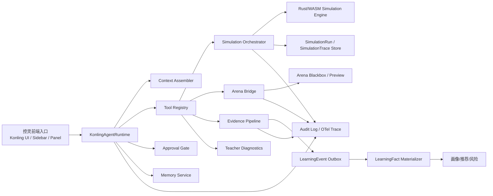
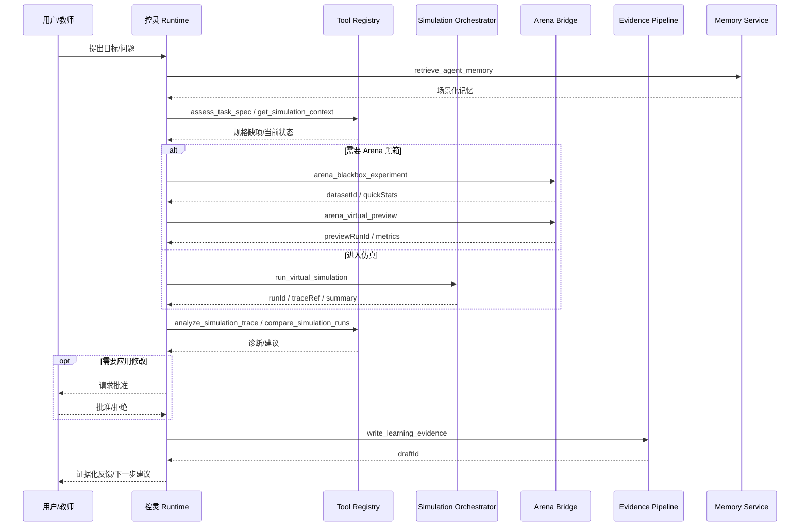
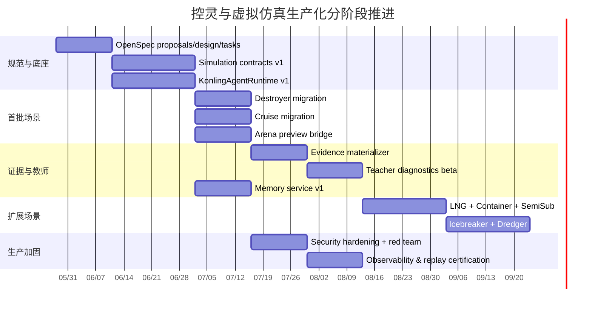

# 控灵与虚拟仿真一体化生产级智能体技术路线图

## 执行摘要

本报告在两个前提下展开：其一，用户已明确假设 `integration` 分支与 OpenSpec 相关变更已经合并；其二，未给出预算、时延或部署形态等额外运营约束，因此以下设计按“无特定约束、以生产级可靠性与可治理性优先”处理。

从仓库现状看，平台已经具备非常可贵的基础：一方面，应用本身不是单点聊天或单页仿真，而是把课程、虚拟仿真、AI 对话、竞技场、学习事件与学习画像放在同一架构中，技术栈已经包含 Next.js/React、Prisma/PostgreSQL、Redis/BullMQ、Rust/WASM 数值内核和 Vercel AI SDK；另一方面，虚拟仿真已明确建模为 7 类典型控制对象，Arena 也已经出现“黑箱对象—数据集—辨识模型—控制器 artifact—虚拟预演”的桥接雏形。fileciteturn9file0L11-L21 fileciteturn9file0L23-L31 fileciteturn50file0L15-L35 fileciteturn50file0L35-L218 fileciteturn81file0L43-L72 fileciteturn82file0L24-L47

真正的短板不在于“再接一个更强的大模型”，而在于运行时契约与治理链路没有闭合。当前控灵入口已经有品牌、侧边栏、`/api/ai/chat`、工具调用和多步上限，但工具仍偏演示态：聊天能力以 `streamText + tools + maxSteps` 为骨架，仿真工具又还明显依赖进程内全局状态，AI 介入逻辑也仍大量停留在规则模板而非面向场景的多步任务智能体。fileciteturn72file0L3-L64 fileciteturn68file0L46-L69 fileciteturn68file0L327-L340 fileciteturn69file0L137-L147 fileciteturn70file0L12-L30 fileciteturn61file0L45-L84 fileciteturn63file0L16-L26

因此，我的核心判断是：**控灵的正确定位不是“聊天壳 + 提示词优化器”，而是“以 OpenSpec 管理需求与变更、以仿真运行与证据链为核心、以 Arena 和 LearningFact 为两端锚点的控制实验助教智能体”。** OpenSpec 的职责是为这套能力提供变更治理与“意图即源代码上游”的规范层，而不是充当运行时编排器。OpenSpec 官方文档明确把 `specs/` 作为 source of truth，把 `changes/` 下的 `proposal/specs/design/tasks` 作为一次变更的工件集合；GitHub 对 spec-driven development 的解释也强调“规格成为共享的 source of truth，并驱动实现、校验与任务拆解”。citeturn15view0turn16view1

推荐路线不是大拆大建，而是沿现有主干做“薄而硬”的重构：保留现有 Next.js + Prisma + Redis/BullMQ + Rust/WASM + Vercel AI SDK 主干，在其上新增 `KonlingAgentRuntime`、`Tool Registry`、`Simulation Orchestrator`、`Memory Service`、`Evidence Pipeline`、`Arena Bridge` 六个关键构件；数据上统一 `SimulationTaskSpec / SimulationRun / SimulationTrace / AgentSession / AgentToolRun / AgentMemory`；运行上形成“任务规格—多步工具执行—可暂停审批—可恢复长任务—trace 入库—证据物化—教师诊断”的闭环。该路线既继承仓库现有实现，又能把控灵从普通侧边栏升级为真正可扩展的场景化助教智能体。fileciteturn92file0L3-L23 fileciteturn93file0L3-L16 fileciteturn93file0L156-L209 fileciteturn79file0L8-L40 fileciteturn80file0L154-L187

## 仓库现状与差距摘要

基于现有代码证据，平台已经有足以支撑生产级控灵的一半基础，但另一半——即运行时边界、可恢复工作流、长期记忆、审计和教师侧批量能力——仍未成型。数值内核方面，仓库已经明显在往统一运行时收敛：仿真规范要求新增数值模型优先进入 Rust/WASM 或服务端 WASM runtime，前端尽量只承担固定步长调度、展示、控制面板与埋点；Rust/WASM dispatch 也已显式覆盖 `destroyer_hifi`、Nomoto、MMG、`semisub3dof`、`azipod3dof` 以及舒适度与鲁棒性分析等模型入口。fileciteturn92file0L3-L23 fileciteturn31file0L220-L249 fileciteturn13file0L66-L200 fileciteturn14file0L11-L41

在应用层，驱逐舰与邮轮页面已经证明平台不是只会做“参观式仿真”。驱逐舰页已有直角转向、复杂避障、定常回转等任务形态，并通过 high-fidelity step 与 3D 场景、航迹和图表联动；邮轮页则已有航线任务、舒适度评价、海况参数、AI 面板、目标表单与一致性校验。换句话说，仓库里已经出现了“实验场景”的雏形，而不是只有模型演示。fileciteturn43file0L78-L170 fileciteturn48file0L28-L90 fileciteturn36file0L132-L160 fileciteturn37file0L132-L195 fileciteturn38file0L229-L297 fileciteturn39file0L107-L183

但差距同样非常清楚。第一，控灵虽然已有品牌化入口和工具调用壳，但当前 `/api/ai/chat` 只是在现有页面之上包了一层通用 `streamText`，并未形成独立的 agent runtime；AI tools 还直接读写进程内全局仿真状态，这在并发、多用户和恢复场景下都不成立。第二，当前 AI 伴学能力仍大量依赖手工输入指标与阈值规则，而不是“读取 run 上下文—调用工具—比较实验—给出证据化建议”的多步执行。第三，控灵会话虽已落库，但设计目的仍偏短会话持久化，而不是跨场景长期记忆。fileciteturn69file0L137-L147 fileciteturn70file0L12-L30 fileciteturn61file0L45-L84 fileciteturn64file0L95-L131 fileciteturn64file0L133-L230 fileciteturn73file0L15-L21 fileciteturn80file0L106-L126

更关键的差距在于数据治理。仓库已有 `InteractionLog`、`LearningEventBatch`、`EventDictionary`、`LearningFact` 和能力快照/风险/推荐等治理结构，说明“把交互变成事实”的平台理念已经成立；但虚拟仿真这条高价值链路还没有稳定走完。目前能看到的更多是页面层 telemetry、摘要事件和 UI 面板，而不是每次仿真运行都成为一份可重放、可比对、可写入画像的标准实验工件。SceneSpec v1 和 SimulationTrace v1 已经定义了 `disturbance / evaluation / telemetry / replay / governance` 等关键维度，这正说明方向是对的，只是尚未成为全平台强约束。fileciteturn79file0L8-L40 fileciteturn80file0L128-L187 fileciteturn39file0L186-L264 fileciteturn93file0L3-L16 fileciteturn93file0L156-L209

下面这张表把现状与差距压缩成可直接进入 OpenSpec proposal 的摘要。

| 维度 | 现有仓库证据 | 当前差距 | 判断 |
|---|---|---|---|
| 仿真对象与任务 | 已有 7 类虚拟仿真对象卡片与明确控制意图；驱逐舰、邮轮已有较完整任务页与 3D/图表/HUD 实现。fileciteturn50file0L15-L35 fileciteturn50file0L35-L218 fileciteturn43file0L78-L170 fileciteturn36file0L132-L160 | 7 类场景尚未全部纳入统一运行契约与统一 trace 治理。 | 基础强，但未平台化。 |
| 数值运行时 | 仿真规范已要求进入 Rust/WASM 统一 runtime；dispatch 已显式支持多模型族。fileciteturn92file0L3-L23 fileciteturn31file0L220-L249 | 页面内历史逻辑仍有残留，前端/服务端职责边界未完全清理。 | 方向正确，需继续收敛。 |
| 控灵入口 | 已有控灵品牌、侧边栏、工具结果区、`/api/ai/chat` 多步入口。fileciteturn72file0L3-L64 fileciteturn68file0L327-L340 fileciteturn69file0L137-L147 | 仍是聊天壳，不是可恢复、可审批、可审计的 agent runtime。 | 不应再停留在 UI 包装层。 |
| 工具与上下文 | 已有 `get_simulation_status / set_simulation_params / analyze_result` 等工具雏形。fileciteturn70file0L82-L186 fileciteturn70file0L188-L267 | 工具使用进程全局状态，缺少 run/session/user 作用域、幂等性和审批门。fileciteturn70file0L12-L30 | 这是生产化首要阻塞点。 |
| Arena 连接 | 已有黑箱实验、预算和 hash/preview 结构；虚拟预演已具备 task/controller/trace/metrics 输出。fileciteturn86file0L10-L29 fileciteturn86file0L190-L239 fileciteturn82file0L24-L47 | 缺少“预演—真实仿真—LearningFact”的统一证据链。 | 价值极高，应优先打通。 |
| 数据治理 | 已有事件、事实、能力贡献和学生快照模型。fileciteturn79file0L8-L40 fileciteturn80file0L154-L187 | 仿真 trace 仍未稳定物化为教学证据。 | 技术资产已在，缺桥梁层。 |
| 长期记忆 | 已有 KonlingSession 持久化。fileciteturn80file0L106-L126 | 仍偏会话归档，非场景化长期记忆；当前 TTL 设计不适合作为教学记忆。fileciteturn73file0L15-L21 | 需新增独立记忆模型。 |

## 目标架构与运行生命周期

这套能力必须分成四个平面理解，否则会继续把“OpenSpec、聊天 UI、仿真执行、证据治理”搅在一起。**第一层是变更治理平面**，由 OpenSpec 管理：它负责 `specs/` 作为 source of truth、`changes/` 下的 `proposal/specs/design/tasks` 作为一次改造的工件集合，并通过 `propose/apply/sync/archive` 或扩展路径驱动实现。**第二层是在线交互平面**，由控灵 UI 与 `KonlingAgentRuntime` 负责：它负责上下文拼装、多步工具循环、审批中断、流式输出和用户体验。**第三层是执行与证据平面**，由 Simulation Orchestrator、Arena Bridge、Memory Service、Evidence Pipeline 负责。**第四层是可观测与安全平面**，由 OTel、审核日志、最小权限与注入防护负责。OpenSpec 官方文档和 GitHub 对 spec-driven development 的阐述都明确强调：规格驱动实现与校验，但运行时仍需要自己的工程基础设施。citeturn15view0turn16view1



在组件层面，推荐的最小生产架构如下。`KonlingAgentRuntime` 是核心，不再把控灵实现为一个普通对话接口，而是实现为“具备上下文拼装、工具白名单、会话状态机、审批门、恢复上下文和记忆读写”的服务对象。它上接现有侧边栏与 AI 面板，下接工具注册中心与队列。AI SDK 的工具机制天然适合这个角色，因为其工具对象本身就以 `description / inputSchema / execute / strict` 为核心要素，且 `execute` 可以留空以转发给客户端或队列而不是在同进程内执行；对于带审批的多步循环，官方 loop control 也明确把“tool call needs approval”当作停止条件之一。citeturn14view0turn18view1

`Simulation Orchestrator` 的职责不是做动画，而是执行规范化的仿真运行请求。它接受 `SimulationTaskSpec + controller snapshot + seed + engine version`，创建 `SimulationRun`，调用 Rust/WASM 引擎批量推进，产出 `SimulationTrace` 与 `summary`，再把摘要事件送入 outbox。这样做的直接好处是把“可视化播放”和“仿真求值”分离开：UI 是否打开、帧率是否波动，都不会影响结果工件。这个方向与仓库当前“数值模型进入统一 runtime、前端只负责调度与展示”的规范完全一致。fileciteturn92file0L3-L23

`Arena Bridge` 应当成为独立边界，而不是在页面内杂糅。它至少要提供三类操作：黑箱试验生成数据集、基于数据集的辨识/分析、控制器 artifact 的虚拟预演。仓库已有预算、归属校验、artifact hash、dataset hash 和 preview 结果结构，这说明桥接不需要从零设计，只需要把其上升为标准接口，并确保 preview 与 official 评价严格分离。SceneSpec/EvaluationSpec 里已经有 `modelRelation` 与 `prohibitsMixedClaims` 这样的字段，这很适合继续强化“教学预演结果不能冒充正式竞技成绩”的边界。fileciteturn86file0L10-L29 fileciteturn86file0L190-L239 fileciteturn82file0L24-L47 fileciteturn93file0L78-L107

`Memory Service` 和 `Evidence Pipeline` 必须拆开。前者服务于 agent 推理，后者服务于教育证据。仓库现有 `KonlingSession` 可以保留为短期消息历史，但不应承担长期记忆语义；长期记忆必须独立成结构化事实库，按用户、课程、场景、能力维度和证据来源做检索。Evidence Pipeline 则负责把仿真运行摘要、Arena 结果、提示词/目标规格评估、教师点评和 agent 工具调用，转成 LearningEvent，再去重、聚合、物化为 LearningFact。仓库已有事实与能力贡献模型，缺的是这条物化管线。fileciteturn80file0L106-L126 fileciteturn79file0L8-L40 fileciteturn80file0L154-L187

运行生命周期建议明确成下面的状态机，而不是继续隐含在页面状态里：

| 状态 | 含义 | 进入条件 | 退出条件 |
|---|---|---|---|
| `draft` | 任务或对话刚创建，尚未形成完整规格 | 用户进入场景或新建 agent session | 规格完整性通过 |
| `ready` | 具备可执行 TaskSpec，等待运行/工具调用 | 目标、约束、场景、控制器候选齐备 | 执行 run 或进入审批 |
| `running` | 正在执行仿真或 Arena 工具链 | worker 接单 | 成功、失败、超时、等待人工 |
| `awaiting_approval` | 状态改变型工具待用户/教师批准 | 命中审批门 | 批准/拒绝 |
| `paused` | 长任务挂起，可恢复 | 人工中断、资源限制、外部依赖未就绪 | 恢复继续 |
| `succeeded` | run 完成且产出 trace/summary | worker 正常结束 | 进入证据生成或归档 |
| `failed` | run/tool 失败 | 运行异常 | 重试或终止 |
| `evidence_pending` | 等待物化 LearningFact | 成功运行已有摘要 | 物化完成 |
| `archived` | 周期完成，可追溯不可变更 | 结课、任务关闭、证据封板 | 只读 |

安全基线不能晚做。OWASP 2025/2026 对 LLM 应用的首位风险就是 prompt injection；官方 cheat sheet 进一步把输入校验、结构化 prompts、HITL、最小权限、细粒度工具参数校验与全面监控列为主要防线，并特别指出 agent-specific attacks 包括工具操控、上下文污染和跨会话记忆污染。对于控灵这种“带工具、带记忆、连 Arena 和数据治理”的系统，这不是锦上添花，而是底线。citeturn12view11turn19view0 因而本架构必须内建：只读与写入工具分层、状态改变型工具强制 approval、按用户和课程作用域校验权限、工具输入参数白名单、工具输出审查、跨会话记忆污染检测，以及完整的审计链。与此同时，生产期观测不要依赖 AI SDK DevTools，因为官方明确标注其为实验性质且仅适用于本地开发；生产应基于 OpenTelemetry 的 traces/metrics/logs 三类信号。citeturn13search0turn12view10

## 框架选型与取舍

先给结论：**主选 Vercel AI SDK 作为在线 agent loop 与 UI 流式输出核心；在此之上实现薄层 `KonlingAgentRuntime`；长任务与恢复依赖现有 Redis/BullMQ；Mastra 可作为次选增强项，不应先于 runtime 契约落地；LangGraph、LlamaIndex、Pydantic AI 不建议作为当前平台主运行时，但可以在后续作为专业 sidecar 或 worker 框架引入。** 这样选，不是因为别的框架不好，而是因为仓库当前已经是 Next.js/TypeScript/Prisma/Redis/BullMQ 主干，并且已经在用 Vercel AI SDK；在这种前提下，优先顺着现有骨架往前推，比把系统改造成 Python-first agent 平台更合理。fileciteturn9file0L23-L31 fileciteturn69file0L137-L147 citeturn12view0turn18view2

| 框架 | 语言/运行时 | 适合能力 | 优势 | 代价与短板 | 与当前仓库集成复杂度 | 建议定位 |
|---|---|---|---|---|---|---|
| Vercel AI SDK | TypeScript / Node / Next.js | 在线多步工具循环、流式 UI、轻量 agent | 现仓库已在使用；工具 schema 明确；支持 strict tool calling；支持把工具执行转发给队列；ToolLoopAgent/loop control 与 workflow patterns 都已成型。fileciteturn69file0L137-L147 citeturn14view0turn18view1turn18view2turn18view3 | 持久化长任务、审批恢复、跨会话记忆仍需自己补工程层。 | 低 | **主选** |
| Mastra | TypeScript / Node | agent、workflow、memory、一体化开发体验 | 官方明确区分 agents 与 workflows，并提供 memory；全部在 TS 内完成，和当前栈语言一致。citeturn12view1turn12view2turn12view3 | 相比直接在 AI SDK 上做薄层，会增加一层抽象；若团队已在 AI SDK 上积累较多，自定义适配成本不可忽略。 | 中 | **可选增强** |
| LangGraph | Python 为主，亦有 JS 生态 | durable execution、HITL、checkpoint、time travel | 官方最强项就是持久化、thread/checkpoint、故障恢复与 HITL。citeturn12view4turn12view5 | 与当前 TS 主干分裂明显；如果作为主运行时，会显著增加跨语言部署、鉴权和数据一致性复杂度。 | 高 | **后期 worker/批任务可选** |
| LlamaIndex Workflows | Python/TS 生态 | 事件驱动工作流、RAG/agent 微服务化 | Workflow 是 event-driven、step-based；适合复杂多步知识流与微服务化。citeturn12view8turn12view9 | 当前项目重点不是文档代理，而是仿真/控制实验；若先引入，收益不如 AI SDK 或 Mastra 直接。 | 中高 | **文档/RAG sidecar 可选** |
| Pydantic AI | Python | 强类型 agent、结构化输出、Python 工具服务 | 官方目标就是 production-grade applications/workflows；function tools 对结构化结果与可测试性很友好。citeturn12view6turn12view7 | 需要独立 Python 服务；对当前 UI 与仿真主链帮助不如 TS 方案直接。 | 中高 | **评分/分析微服务可选** |

需要特别说明两点。

第一，**OpenSpec 不替代上述任何运行时框架。** OpenSpec 的价值是变更治理、规格收敛与 source of truth，它告诉团队“应该构建什么、为什么这么构建、有哪些任务与设计决策”，而不是在生产期替你做 agent 调度。官方 Getting Started 和 GitHub 的 spec-driven development 文章都在强调这一点：spec 驱动实现与校验，而不是自动等价于 runtime。citeturn15view0turn16view1

第二，**不建议把控灵主干建立在开放技能市场型自治框架之上。** 对教育平台来说，控灵连接了学生轨迹、Arena 工具和学习事实。OWASP 在 agent-specific attacks 中明确提到 tool manipulation、context poisoning、memory persistence attacks，并要求 least privilege、tool-specific validation 和系统级监控。面向教育生产系统，工具应该是白名单、强 schema、强审计、可审批，而不是“开放扩展即插即用”的高代理权模式。citeturn19view0

因此，建议的决策是：

| 层次 | 选型 |
|---|---|
| 在线对话与工具循环 | Vercel AI SDK |
| 运行时抽象 | 自研薄层 `KonlingAgentRuntime` |
| 长任务与恢复 | Redis/BullMQ + 持久化状态机 |
| memory 检索 | 自研 Memory Service，工具化接入 AI SDK |
| 复杂批处理/教师离线分析 | 后续视复杂度引入 LangGraph 或 Pydantic AI sidecar |
| 变更治理 | OpenSpec |

## 数据模型、API 与工具契约

数据模型必须先行统一，否则控灵永远只能停留在“会说话，但说的话不落地”。仓库已有 SceneSpec v1、SimulationTrace v1、LearningFact、KonlingSession、ArenaVirtualSimulationRun 等零散资产，因此新模型不应与现有系统平行，而应做“补齐与归一”。SceneSpec/SimulationTrace 已经覆盖 `disturbance / evaluation / telemetry / replay / governance` 这些关键要素，LearningFact 已经支持 `factType / outcome / score / timeSpent / competencyContribution / sourceEventId / contextJson` 等事实字段，KonlingSession 也已存在。正确做法是把这些对象拉到统一命名空间里，而不是再造一套新名词。fileciteturn93file0L3-L16 fileciteturn93file0L156-L209 fileciteturn80file0L154-L187 fileciteturn80file0L106-L126

推荐的核心表结构如下。

| 模型 | 作用 | 关键字段 | 说明 |
|---|---|---|---|
| `SimulationTaskSpec` | 实验任务规格 | `id, sceneId, scenarioId, courseId, objectives, constraints, disturbancePolicy, evaluationSpec, allowedControllers, schemaVersion, specHash` | 面向“任务”而非“页面”，是控灵与仿真运行的共同输入。 |
| `SimulationRun` | 一次标准实验运行 | `id, taskSpecId, userId, sessionId, controllerSnapshot, seed, engineVersion, sceneSpecVersion, status, summaryJson, replayToken, startedAt, completedAt` | 任何仿真、Arena 预演或教师批处理都应落成 run。 |
| `SimulationTrace` | 高频采样与摘要 | `id, runId, envelopeJson, summaryJson, storageUri, checksum, sampleCount, dtMs` | 高采样点可落对象存储，数据库存索引与摘要。 |
| `AgentSession` | 控灵任务会话 | `id, userId, courseId, sceneId, mode, phase, lastStateJson, status, expiresAt` | 区分普通聊天历史与“带任务状态的 agent session”。 |
| `AgentToolRun` | 单次工具调用 | `id, agentSessionId, toolName, approvalState, inputJson, outputJson, idempotencyKey, correlationId, latencyMs, status, errorJson` | 一切工具调用都要可审计。 |
| `AgentMemory` | 长期记忆 | `id, userId, scope, sceneId, abilityDimension, memoryType, content, evidenceRefs, confidence, piiLevel, ttlPolicy, lastUsedAt` | 面向教学抽象，不保存不必要原文。 |
| `LearningEvidenceDraft` | 事实草稿 | `id, runId, factType, draftJson, evidenceRefs, dedupeKey, reviewerState` | agent 只生成 draft，不直接改画像。 |

下面给出可直接进入 OpenSpec `design.md` 的 Prisma 片段示例。它不是最终版，但字段边界与索引策略已经足够支撑后续 change proposal 细化。

```prisma
model SimulationTaskSpec {
  id                String   @id @default(cuid())
  courseId          String?
  lessonId          String?
  sceneId           String
  scenarioId        String
  objectives        Json
  constraints       Json
  disturbancePolicy Json
  evaluationSpec    Json
  allowedControllers Json
  schemaVersion     String   @default("simulation-task-spec.v1")
  specHash          String   @unique
  createdById       String
  createdAt         DateTime @default(now())
  runs              SimulationRun[]
}

model SimulationRun {
  id                 String   @id @default(cuid())
  taskSpecId         String
  taskSpec           SimulationTaskSpec @relation(fields: [taskSpecId], references: [id])
  userId             String
  agentSessionId     String?
  mode               String   // task | explore | arena_preview | teacher_batch
  controllerSnapshot Json
  seed               Int
  engineVersion      String
  sceneSpecVersion   String
  status             String
  summaryJson        Json?
  replayToken        String   @unique
  startedAt          DateTime @default(now())
  completedAt        DateTime?
  trace              SimulationTrace?
  evidenceDrafts     LearningEvidenceDraft[]
  @@index([userId, startedAt])
  @@index([taskSpecId, status])
}

model SimulationTrace {
  id           String   @id @default(cuid())
  runId         String   @unique
  run           SimulationRun @relation(fields: [runId], references: [id])
  envelopeJson  Json
  summaryJson   Json
  storageUri    String?
  checksum      String
  sampleCount   Int
  dtMs          Int
  createdAt     DateTime @default(now())
}

model AgentSession {
  id             String   @id @default(cuid())
  userId         String
  courseId       String?
  sceneId        String?
  mode           String   // task | explore | teacher
  phase          String   // hypothesis | identify | design | run | diagnose | revise | report
  status         String
  lastStateJson  Json?
  expiresAt      DateTime?
  createdAt      DateTime @default(now())
  updatedAt      DateTime @updatedAt
  toolRuns       AgentToolRun[]
}

model AgentToolRun {
  id             String   @id @default(cuid())
  agentSessionId String
  agentSession   AgentSession @relation(fields: [agentSessionId], references: [id])
  runId          String?
  toolName       String
  approvalState  String   // not_required | pending | approved | rejected
  status         String   // queued | running | succeeded | failed
  inputJson      Json
  outputJson     Json?
  errorJson      Json?
  idempotencyKey String?
  correlationId  String
  latencyMs      Int?
  createdAt      DateTime @default(now())
  completedAt    DateTime?
  @@index([agentSessionId, createdAt])
  @@unique([toolName, idempotencyKey])
}

model AgentMemory {
  id               String   @id @default(cuid())
  userId           String
  scope            String   // user | course | class | scene
  sceneId          String?
  abilityDimension String?
  memoryType       String   // episodic | semantic | procedural | preference | warning
  content          Json
  evidenceRefs     Json
  confidence       Float    @default(0.5)
  piiLevel         String   @default("low")
  ttlPolicy        String
  lastUsedAt       DateTime?
  createdAt        DateTime @default(now())
  @@index([userId, scope, sceneId, abilityDimension])
}
```

建议再补一个 SQL 层面的幂等与 outbox 样例，因为 agent 系统最怕“重试后多次副作用”。

```sql
create table event_outbox (
  id text primary key,
  topic text not null,
  aggregate_type text not null,
  aggregate_id text not null,
  correlation_id text not null,
  causation_id text,
  payload jsonb not null,
  published_at timestamptz,
  created_at timestamptz not null default now()
);

create unique index ux_agent_toolrun_idempotency
on agent_tool_run (tool_name, coalesce(idempotency_key, ''));

create unique index ux_learning_evidence_dedupe
on learning_evidence_draft (run_id, dedupe_key);
```

工具定义应采用“读、分析、运行、写入、发布”五级权限模型，其中只有读与分析默认无审批；会改变仿真状态、写入教学事实或影响教师产物的工具，必须进入审批门。AI SDK 的工具定义天然支持 schema 校验与 strict mode，这正适合把原本散乱的“随口让模型调参数”改造成“输入结构明确、参数可校验、审批可中断”的工具体系。citeturn14view0turn18view1

| 工具名 | 输入 | 输出 | 权限/Auth | 副作用 | 幂等性 | 审批要求 |
|---|---|---|---|---|---|---|
| `get_simulation_context` | `runId | taskSpecId | include[]` | 当前任务、阶段、控制器、摘要、约束、Arena 关联 | `student:read`/`teacher:read` | 无 | 强幂等 | 否 |
| `run_virtual_simulation` | `taskSpecId, controller, seed, duration, async, replayMode` | `runId, status, summary?` | `student:run`/`teacher:run` | 新建 run、trace、事件 | 基于 `idempotencyKey` 幂等 | 否 |
| `analyze_simulation_trace` | `runId | traceId, analyzers[]` | 指标、违规、诊断、对比建议 | `student:read`/`teacher:read` | 无 | 强幂等 | 否 |
| `compare_simulation_runs` | `runIds[], baselineRunId?` | 差异报告、主导改进因素、回归告警 | `student:read`/`teacher:read` | 无 | 强幂等 | 否 |
| `propose_controller_patch` | `runId, objective, constraints` | 候选参数/控制结构变更，不自动执行 | `student:read` | 无 | 幂等 | 否 |
| `apply_controller_patch` | `runId, patch, reason` | 更新后的控制器草稿 | `student:write` | 改写 session 内控制器草稿 | 需 `idempotencyKey` | **是** |
| `arena_blackbox_experiment` | `taskId, signalSpec, budgetToken` | `datasetId, budgetRemaining, quickStats` | `student:arena` | 消耗预算、生成数据集 | 需 `idempotencyKey` | 否 |
| `arena_virtual_preview` | `taskId, artifactId | artifactBlobRef` | `previewRunId, metrics, traceRef` | `student:arena` | 新建 preview run | 需 `idempotencyKey` | 否 |
| `write_learning_evidence` | `runId, factType, draft, evidenceRefs` | `draftId, dedupeState` | `service:evidence` 或 `teacher:review` | 写入事实草稿 | 基于 `dedupeKey` 幂等 | **是** |
| `retrieve_agent_memory` | `scope, sceneId, phase, topK` | 记忆片段与证据引用 | `service:memory` | 无 | 强幂等 | 否 |
| `save_agent_memory` | `memoryType, content, evidenceRefs, ttlPolicy` | `memoryId` | `service:memory` | 写入记忆 | 需 `dedupeKey` | **是** |
| `generate_experiment_report` | `runIds[], templateId, audience` | 报告草稿 | `student:read`/`teacher:read` | 可选写入草稿表 | 需 `idempotencyKey` | 否 |
| `publish_teacher_feedback` | `draftId, feedback, rubricOverride?` | 已发布点评 | `teacher:write` | 改变学生可见内容 | 需 `idempotencyKey` | **是** |

长期记忆不能继续等同于“聊天历史”。AI SDK 官方文档对 memory 的三种接法做了很清楚的权衡：provider-defined tools 实现成本低但存在锁定，自带 memory provider 灵活性较低，自定义工具灵活性最高且无 provider lock-in。控灵必须选第三条，即**应用自有 Memory Service + 自定义工具接入**，因为教学记忆需要以场景、能力、证据、隐私等级和 TTL 为中心，而不是以某个模型厂商的目录结构为中心。citeturn18view0

推荐的记忆模型如下。

| 记忆类型 | 内容示例 | 产生机制 | 默认保留 | 检索键 | 隐私策略 |
|---|---|---|---|---|---|
| `episodic` | “在邮轮舒适度任务中第 3 次 run 因鳍功率超限失败” | 自动从 run/trace 摘要生成 | 学期内 + 90 天 | `userId + sceneId + phase` | 不存整段原始对话，只存摘要与证据引用 |
| `semantic` | “该学生会把 Kd 增大解释为增加阻尼，但常忽略执行器约束” | agent 总结 + 教师确认 | 2 学年 | `userId + abilityDimension` | 只存教学抽象事实 |
| `procedural` | “进入 Arena 黑箱任务前先做 step + PRBS 双激励” | 教学策略模板或教师沉淀 | 长期 | `sceneId + mode` | 平台级共享，无个人标识 |
| `preference` | “偏好先看轨迹图再看指标表” | 用户设置/稳定行为 | 1 学年 | `userId` | 可用户删除 |
| `warning` | “跨会话多次请求跳过审批直接改写成绩草稿” | 安全/治理规则命中 | 至少审计窗内 | `userId + securityTag` | 仅管理员/教师可见 |

推荐的默认保留策略也应区分原始数据与衍生数据：原始聊天与工具输入输出默认保留 180 天；原始高频 trace 默认保留至课程结束后 180 天；summary、report draft、LearningFact 和教师审核结果可保留 2 学年；安全审计日志至少 1 年。之所以这样切分，是为了同时满足可追溯、成绩复核与最小化存储原则。这里的“默认”必须是配置项，不应写死。

下面给出一组关键 REST API 草案。原则是：**运行接口 REST 化，聚合查询接口 GraphQL 化。** 运行路径强调幂等键、审批与可重放；教师视图则需要灵活聚合。

```http
GET /api/v1/simulation-runs/{runId}/context?include=taskSpec,summary,controller,arena,memoryHints
Authorization: Bearer <token>
```

```json
{
  "runId": "run_01JV6X8YQ7",
  "status": "succeeded",
  "mode": "task",
  "phase": "diagnose",
  "taskSpec": {
    "taskSpecId": "ts_01JV6W...",
    "sceneId": "cruise",
    "scenarioId": "sea_state_4_turn30",
    "objectives": [
      {"metric": "msi", "goal": "minimize"},
      {"metric": "settlingTime", "op": "<=", "value": 80, "unit": "s"}
    ],
    "constraints": [
      {"metric": "finPower", "op": "<=", "value": 0.85, "unit": "pu"}
    ]
  },
  "controller": {
    "type": "pid_roll_fin",
    "version": "ctrl_2026_05_27_03",
    "params": {"kp": 1.8, "ki": 0.06, "kd": 0.32}
  },
  "summary": {
    "msi": 0.27,
    "settlingTime": 76.4,
    "safetyViolations": 0,
    "controlEnergy": 0.62
  },
  "arenaLinks": {
    "previewRunId": "apr_01JV6X...",
    "taskId": "arena_cruise_roll_001"
  },
  "memoryHints": [
    {
      "memoryId": "mem_01JV5...",
      "type": "semantic",
      "content": "该学生此前多次忽略执行器约束，需优先提醒 finPower。"
    }
  ]
}
```

```http
POST /api/v1/simulations/run
Authorization: Bearer <token>
Idempotency-Key: 9c4db456-8d3d-4d80-9d0d-4b9f4ee2ff0b
```

```json
{
  "taskSpecId": "ts_01JV6W...",
  "controller": {
    "type": "pid_roll_fin",
    "params": {"kp": 1.8, "ki": 0.06, "kd": 0.32}
  },
  "seed": 20260527,
  "durationSec": 300,
  "async": true,
  "replayMode": "deterministic",
  "source": {
    "agentSessionId": "ags_01JV6...",
    "toolRunId": "atr_01JV6..."
  }
}
```

```json
{
  "runId": "run_01JV6X8YQ7",
  "status": "running",
  "queueJobId": "bull_918273",
  "replayToken": "rpt_1b2c3d4e"
}
```

```http
POST /api/v1/simulation-traces/analyze
Authorization: Bearer <token>
```

```json
{
  "runIds": ["run_01JV6X8YQ7", "run_01JV6X8ZU1"],
  "analyzers": ["tracking", "comfort", "control_effort", "constraint"],
  "baselineRunId": "run_01JV6X8YQ7"
}
```

```json
{
  "analysisId": "ana_01JV70...",
  "results": [
    {
      "runId": "run_01JV6X8ZU1",
      "metrics": {
        "msi": 0.22,
        "settlingTime": 82.1,
        "controlEnergy": 0.71,
        "safetyViolations": 0
      },
      "findings": [
        {
          "type": "tradeoff",
          "message": "舒适度改善，但调节时间超出目标 2.1s。"
        }
      ]
    }
  ],
  "recommendations": [
    {
      "kind": "controller_patch",
      "explanation": "优先尝试降低积分强度，再复测调节时间与 finPower。"
    }
  ]
}
```

```http
POST /api/v1/learning-evidence
Authorization: Bearer <service-or-teacher-token>
Idempotency-Key: 1af0d303-8eb7-40e6-94b8-d3f0898b7d09
```

```json
{
  "runId": "run_01JV6X8YQ7",
  "factType": "simulation_control_tradeoff",
  "draft": {
    "outcome": "improved",
    "score": 0.78,
    "competencyContribution": {
      "engineering_constraints": 0.35,
      "parameter_tuning": 0.28,
      "reflective_iteration": 0.15
    },
    "narrative": "学生在不触发安全违规的前提下降低了 MSI，但未完全满足调节时间目标。"
  },
  "evidenceRefs": [
    {"kind": "simulation_run", "id": "run_01JV6X8YQ7"},
    {"kind": "analysis", "id": "ana_01JV70..."}
  ],
  "dedupeKey": "run_01JV6X8YQ7:simulation_control_tradeoff:v1"
}
```

```json
{
  "draftId": "led_01JV71...",
  "status": "pending_review",
  "dedupeState": "created"
}
```

```http
POST /api/v1/agent/tool-calls
Authorization: Bearer <token>
Idempotency-Key: 0a0c95e2-8675-40af-a759-45ee9ea7f0d5
```

```json
{
  "agentSessionId": "ags_01JV6...",
  "toolName": "apply_controller_patch",
  "input": {
    "runId": "run_01JV6X8YQ7",
    "patch": {
      "op": "replace",
      "path": "/params/kd",
      "value": 0.38
    },
    "reason": "抑制欠阻尼振荡"
  },
  "approvalContext": {
    "required": true,
    "requestedBy": "user_001"
  }
}
```

```json
{
  "toolRunId": "atr_01JV72...",
  "status": "awaiting_approval",
  "approvalRequest": {
    "title": "应用控制器参数改动",
    "summary": "将 kd 从 0.32 提高到 0.38，属于状态改变型操作。"
  }
}
```

GraphQL 侧建议只用于教师聚合查询与人工审核，不用于执行型工具接口。例如：

```graphql
query TeacherSimulationDashboard($classId: ID!, $taskSpecId: ID!) {
  teacherSimulationDashboard(classId: $classId, taskSpecId: $taskSpecId) {
    classSummary {
      runCount
      passRate
      topFailureModes
      competencyDistribution {
        dimension
        avgScore
      }
    }
    studentSlices {
      studentId
      latestRunId
      riskFlags
      dominantMisconceptions
      recommendedIntervention
    }
  }
}
```

```graphql
mutation ApproveAgentToolRun($toolRunId: ID!, $decision: ApprovalDecision!, $comment: String) {
  approveAgentToolRun(toolRunId: $toolRunId, decision: $decision, comment: $comment) {
    toolRunId
    approvalState
    resumedSessionId
  }
}
```

## 编排模式、Arena 集成与数据治理闭环

控灵的编排不应是“一个万能 agent 自由发挥”，而应是**轻代理 + 强工作流骨架**。AI SDK 官方对 workflow patterns 的建议很清楚：顺序链、并行处理、反馈回路、编排和路由，是构建可靠 agent 的基础；同时它也明确指出，agent 灵活但非确定，当需要可靠、可重复结果时，应该使用 core functions 与结构化 workflow patterns。Mastra 也持相同区分：开放型任务交给 agent，明确控制流交给 workflow。这个思路和你的平台高度匹配，因为仿真实验流程本身就是“开放分析 + 确定步骤”的混合体。citeturn18view3turn12view1turn12view3turn18view2

因此，推荐的主工作流不是单一模式，而是五种模式的组合：

第一种是**任务规格化链**：用户自然语言目标 → 规格完整性检查 → 缺项追问 → 形成 `SimulationTaskSpec draft`。这里原“提示词优化”模块应被吸收为规格质量分析工具。仓库当前已有对控制对象、性能目标、约束条件、数字单位、动作动词、输出交付物等要素的分析逻辑，也能检查“声明目标—实际操作”的一致性，这完全适合升级成控灵内部工具，而不应继续以单独 UI 存在。fileciteturn90file0L115-L188 fileciteturn91file0L39-L80

第二种是**运行—分析反馈回路**：运行 baseline → 解析 trace → 提出候选 patch → 用户确认 → 再运行 → 比较差异。当前 AI SDK 的多步 loop、step 边界与 tool streaming 可以直接支持这类交互：用户可以明确看到每一步工具输入、输出和状态，这对于实验教学中的可理解性非常关键。citeturn14view1turn18view1

第三种是**Arena 路由工作流**：当场景需要黑箱辨识时，不直接进入真实仿真，而是路由到 `arena_blackbox_experiment`。Arena 侧当前已有预算与数据集规则，因此控灵应该只允许通过受控工具生成 step/impulse/PRBS/sine 等激励，从而得到 dataset，再衔接辨识与预演。换句话说，竞技场不是控灵的附属功能，而是“模型分析前置步骤”。fileciteturn87file0L18-L56 fileciteturn87file0L121-L170

第四种是**教师批处理编排**：对教师而言，流程是班级查询 → run 聚合 → 误差聚类 → 生成诊断建议 → 生成人工可修改报告。这个流程比学生单次会话更适合放入 BullMQ worker，甚至未来放入 LangGraph/Pydantic AI sidecar，因为它更强调持久化、批量和审阅，而不是即时聊天。仓库已有教师端与学情板块，因此这是一条天然可扩展链，而不是额外强加的需求。fileciteturn9file0L51-L65

第五种是**审批中断工作流**：任何状态改变型工具，如 `apply_controller_patch`、`save_agent_memory`、`write_learning_evidence`、`publish_teacher_feedback`，都必须进入 approval gate。AI SDK 的 loop control 已把“需要审批的工具调用”定义为停止点；LangGraph 的 checkpointer/thread 模型则说明，如果未来这类中断越来越多，耐久恢复完全可以下沉到更强的持久化运行时。当前阶段并不需要先引入 LangGraph，只需把审批态设计成 first-class object。citeturn18view1turn12view5



Arena 与数据治理的连接建议写成一条明确链路，而不是散在各页面里。推荐标准事件信封如下：

```json
{
  "eventId": "evt_01JV80...",
  "eventType": "simulation.run.completed.v1",
  "occurredAt": "2026-05-27T18:41:12.311Z",
  "actor": {"type": "user", "id": "user_001", "role": "student"},
  "subject": {"type": "simulation_run", "id": "run_01JV6X8YQ7"},
  "correlationId": "corr_9a88...",
  "causationId": "atr_01JV72...",
  "source": "konling-runtime",
  "payload": {
    "taskSpecId": "ts_01JV6W...",
    "sceneId": "cruise",
    "scenarioId": "sea_state_4_turn30",
    "summary": {
      "msi": 0.27,
      "settlingTime": 76.4,
      "controlEnergy": 0.62,
      "safetyViolations": 0
    },
    "traceChecksum": "sha256:3ca1..."
  }
}
```

在此基础上，`LearningFact` 的生成不应直接由 LLM narrative 决定，而应由**确定性指标 + 规则映射 + LLM 解释**三层共同完成：

`SimulationRunCompleted` → `summary analyzers` → `LearningEvidenceDraft` → 去重/归因 → `LearningFact` → 能力快照/风险/推荐。

这种设计有两个好处。第一，LLM 的不稳定性不会直接污染成绩与画像；第二，教师可以对草稿进行审核覆盖。仓库已有 `LearningFact`、能力贡献和事件字典，因此这里只需要补物化层，不需要推翻现有治理主线。fileciteturn80file0L154-L187 fileciteturn79file0L8-L40

可重现性与回放要求也必须一次说透。对于仿真行为，必须做到**强重现**：同一 `taskSpec + controllerSnapshot + seed + engineVersion + sceneSpecVersion + dt + duration`，在同一数值内核版本下应得到相同或可容忍误差内相同的 summary。对于 agent 推理，只能做到**弱重现**：保留 `model id / provider / temperature / prompt template version / context hash / tool inputs / tool outputs / memory refs`，以便追责与分析，但不能把 LLM 输出本身当作唯一事实依据。仓库现有 preview/blackbox 里已使用 `datasetHash`、`controllerHash` 等字段，这正是应继续扩展的方向。fileciteturn82file0L24-L47 fileciteturn86file0L190-L239

最后还要强调一点：控灵的长期记忆与 Arena 黑箱链路不能互相污染。黑箱阶段的控制对象辨识结论应以“模型假设”写入记忆，而不是“真相”；进入真实虚拟仿真任务后，控灵必须主动提醒学生：当前任务含更逼真的扰动与约束，Preview 是迁移先验，不是最终答案。这是教学上最有价值的地方，也是平台区别于单纯 AI 助手的地方。

## 交付路线、CI/CD、测试监控与验收标准

建议把落地拆成五个 OpenSpec 变更包，而不是一个大 proposal。原因很简单：OpenSpec 本身强调 `proposal/specs/design/tasks` 工件化与 source of truth，越大的变更越应该拆成可审查边界清晰的 changes。官方 Getting Started 对 change folder 和 delta specs 的组织方式已经写得很明确；GitHub 对 spec-driven development 的解释也强调先明确“what”，再落 technical plan 与 tasks。citeturn15view0turn16view1

推荐的 changes 如下：

| OpenSpec change 名称 | 目标 |
|---|---|
| `konling-agent-runtime` | 建立控灵运行时、审批门、工具注册与多步会话状态机 |
| `simulation-contract-v1` | 把 TaskSpec/Run/Trace/Replay 契约收敛为平台标准 |
| `arena-simulation-bridge` | 打通 Arena 黑箱、preview 与真实仿真 run |
| `learning-evidence-materialization` | 把 trace、Arena 与 AI 分析物化为 LearningFact |
| `teacher-simulation-assistant` | 建立教师批量诊断、实验包生成与报告评阅能力 |

下面是建议的分阶段推进图。时间长度不设外部硬性约束，但建议以 4 个递进波次推进，而不是七类场景齐头并进。



迁移顺序我不建议按“七类场景平均主义”推进，而建议按价值与证据密度推进。

第一波是**驱逐舰 + 邮轮 + Arena preview**。理由很直接：这两类场景代码证据最完整，既有 3D/任务/HUD，也最能体现“跟踪/鲁棒/舒适性/约束”的差异；Arena preview 又能最快展示平台的独特闭环。fileciteturn43file0L78-L170 fileciteturn36file0L132-L160 fileciteturn82file0L165-L280

第二波是**LNG、集装箱船、半潜平台**。它们更适合把 TaskSpec、disturbancePolicy、evaluationSpec 的统一性做实，尤其半潜平台天然适合展示多推进器/DP 的工程约束。场景卡中这几类问题的课程目标已较清晰，因此不需要先发明新叙事，只需要把统一契约落地。fileciteturn50file0L35-L218

第三波是**破冰船 + 挖泥船**。这两类更适合作为“更真实工况、更复杂扰动、更强工程约束”的高阶场景，前提是前两波已经把运行时、回放和证据链打稳。仓库已有破冰船引擎暴露冰厚、冰态、Azipod 回转速率、冰阻力和螺旋桨应力等字段，这说明它正好适合成为“鲁棒性与设备应力约束”的样板，而不是一开始就上。fileciteturn56file0L28-L118

CI/CD 不应只做传统单元测试，而要分四类。第一类是**契约测试**：OpenAPI/GraphQL schema、tool inputSchema、event schema、Prisma migrations 必须过。第二类是**回放测试**：固定 `seed + controller + engine version` 的 golden runs 必须稳定；如果 summary 偏差超过阈值即阻断发布。第三类是**工作流测试**：多步 agent loop、审批中断、恢复执行、幂等重试、事件出箱、trace 入库都要有集成测试。第四类是**安全测试**：prompt injection、越权工具调用、跨会话记忆泄漏、Arena 预算绕过、preview/offical 混淆都要做红队脚本。OWASP 对 prompt injection 的防护建议中，输入过滤、结构化提示、工具参数校验、最小权限、HITL 与综合监控都应进入测试清单。citeturn19view0

生产监控建议采用双层方案。基础观测层用 OpenTelemetry 统一输出 traces、metrics、logs；业务观测层补 `agent_session_count / tool_success_rate / approval_wait_time / run_replay_mismatch / evidence_materialization_lag / memory_cross_scope_violation / arena_budget_reject_count` 等自定义指标。OpenTelemetry 官方定义本身就是 vendor-neutral observability framework，并以 traces、metrics、logs 作为核心信号，因此非常适合作为平台底座。citeturn12view10 开发期可以接 AI SDK DevTools 观察 tool calls 与 steps，但它只适合本地调试，不能当作生产监控替代。citeturn13search0

下面给出面向交付的验收标准。这里每一项都刻意写成“可度量、可回归、可审计”。

| 交付项 | 可测试验收标准 |
|---|---|
| `KonlingAgentRuntime v1` | 在驱逐舰与邮轮场景中，控灵能完成“读取上下文 → 运行仿真 → 分析 trace → 生成 patch 建议”的完整多步链；每一步均有 `AgentToolRun` 记录；状态改变类工具 100% 进入审批门；重试同一 `Idempotency-Key` 不产生重复副作用。 |
| `Simulation contracts v1` | 任意一次 run 都能生成 `SimulationRun + SimulationTrace + replayToken`；同一 replay 输入重复 10 次，summary 指标在设定容差内一致；变更 engine version 后能明确标识不可直接比较。 |
| `Arena bridge v1` | 黑箱数据集、辨识结果、artifact、previewRun 与真实仿真 run 均可追踪；preview 与 official 界面标签明确，且 API 返回含 `modelRelation`/`preview` 标志；预算绕过测试全部失败。 |
| `Memory service v1` | 检索结果仅来自同用户授权范围；跨用户与跨课程污染测试为 0；记忆写入均带 `evidenceRefs`；用户删除偏好记忆后，在后续检索中不再返回。 |
| `Evidence materializer v1` | 每个成功 run 最迟在 1 个异步周期内生成 evidence draft；相同 `dedupeKey` 重放不产生重复事实；教师审核覆盖会留下审计记录与 before/after diff。 |
| `Teacher diagnostics beta` | 对一个班级的 runs 可生成批量误差聚类与干预建议；报告中每条结论都能回溯到 run/trace/evidence；教师可对单条建议标注“采纳/忽略/修正”。 |
| `Prompt-to-spec absorption` | 原提示词质量评估能力已迁入控灵；在任务模式下，控灵能指出目标、约束、工况、交付物的缺项，并把结构化结果写成 TaskSpec draft；独立提示词优化面板可下线而不丢失核心能力。 |
| `Security & audit` | 注入测试集下，未授权写入/发布/越权 Arena 操作触发率为 0；所有写工具操作均有 `actor/correlationId/approvalState`；系统日志可追到单次 tool run 的输入摘要、输出摘要与错误原因。 |
| `Observability & SRE` | 每个 agent session、tool run、simulation run 都有 trace/span，日志具备统一 correlationId；出现 worker 崩溃后，可恢复正在等待审批或排队中的任务；监控面板可展示成功率、延迟、失败原因分布。 |

最后，给出一个更强的路线判断：**控灵的第一目标不是变得“更像一个万能助手”，而是变得“更像一个可审计的控制实验助教”。** 这意味着它的第一优先级不应是增加更多闲聊能力，而应是把以下四件事一次做对：

其一，把**仿真运行标准化**。
其二，把**工具调用收口到强 schema、强权限、强审批**。
其三，把**Arena 黑箱分析与真实仿真任务打通**。
其四，把**trace 物化成真正影响教学决策的 LearningFact**。

只要这四件事做对，控灵就不再是“一个带品牌的聊天框”，而会成为整个平台在虚拟仿真、竞技场、教师诊断、个性化学习和未来控制领域微调模型上的统一智能入口。现有仓库已经有足够多的基础设计，尤其是 7 类仿真对象、Rust/WASM 运行时规约、Arena 预演结构、LearningFact 数据治理和控灵品牌入口；下一步不是再做散点创新，而是把这些资产用 OpenSpec 变成可验证、可迁移、可审查的系统性能力。fileciteturn50file0L15-L35 fileciteturn92file0L3-L23 fileciteturn82file0L24-L47 fileciteturn80file0L154-L187 fileciteturn72file0L3-L64